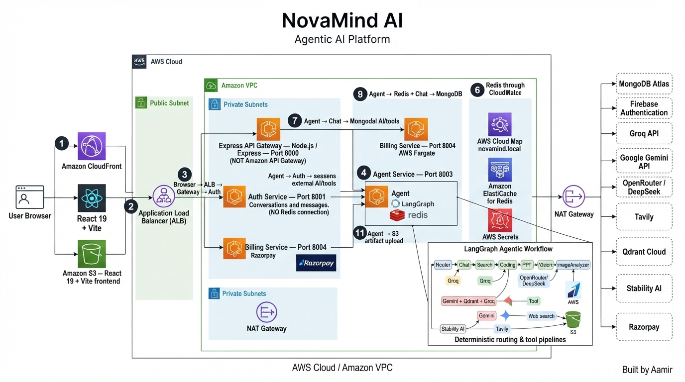
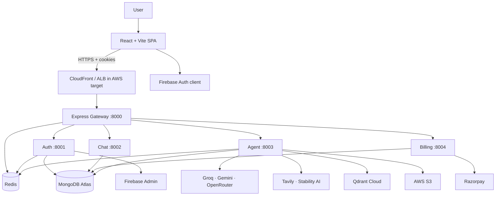
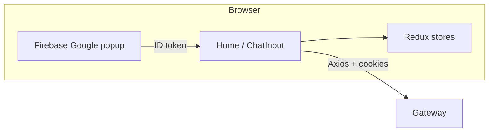
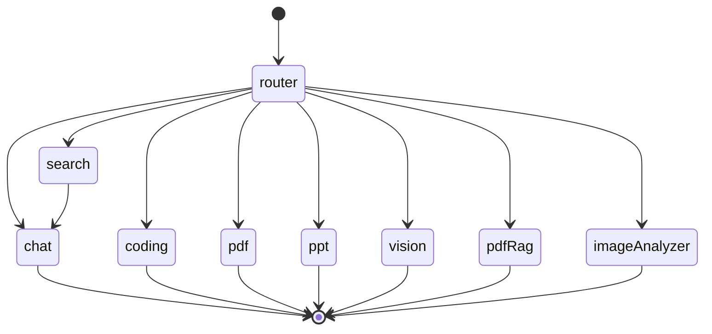
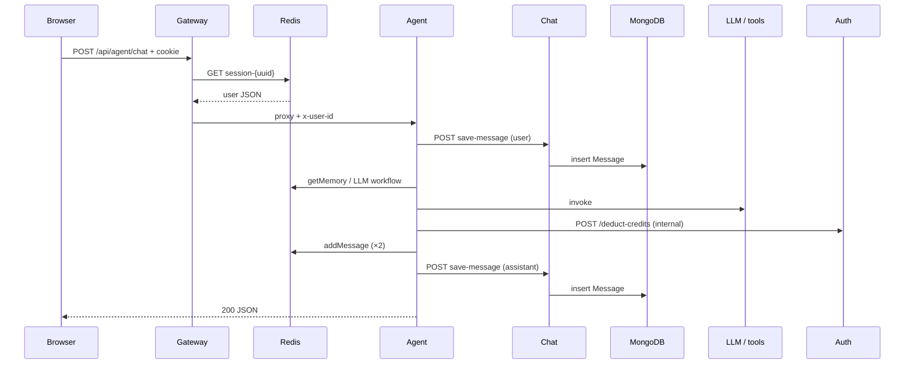
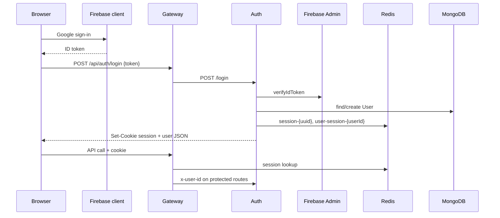
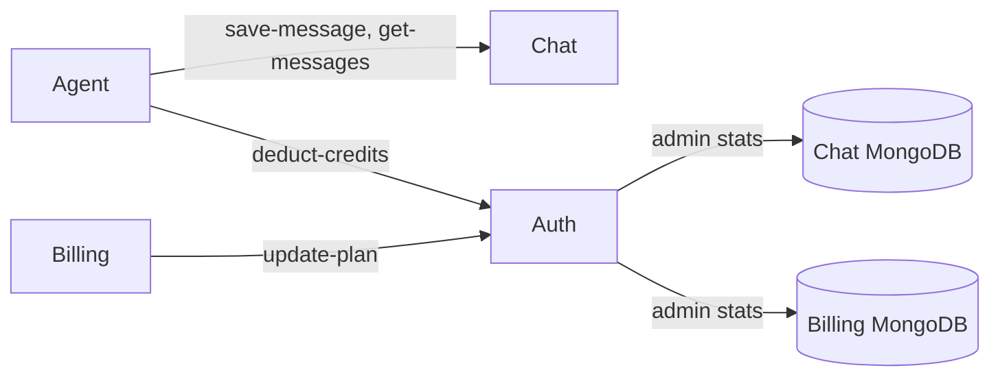
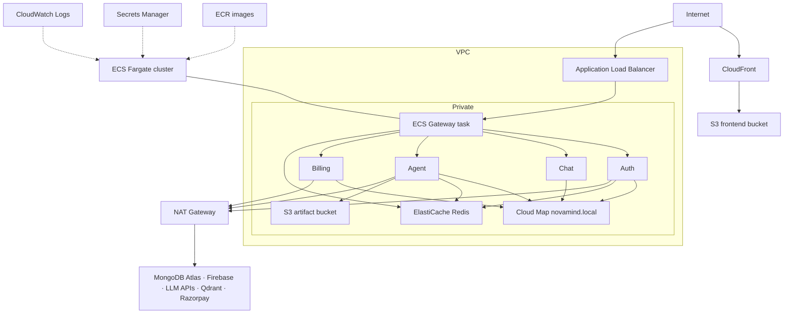
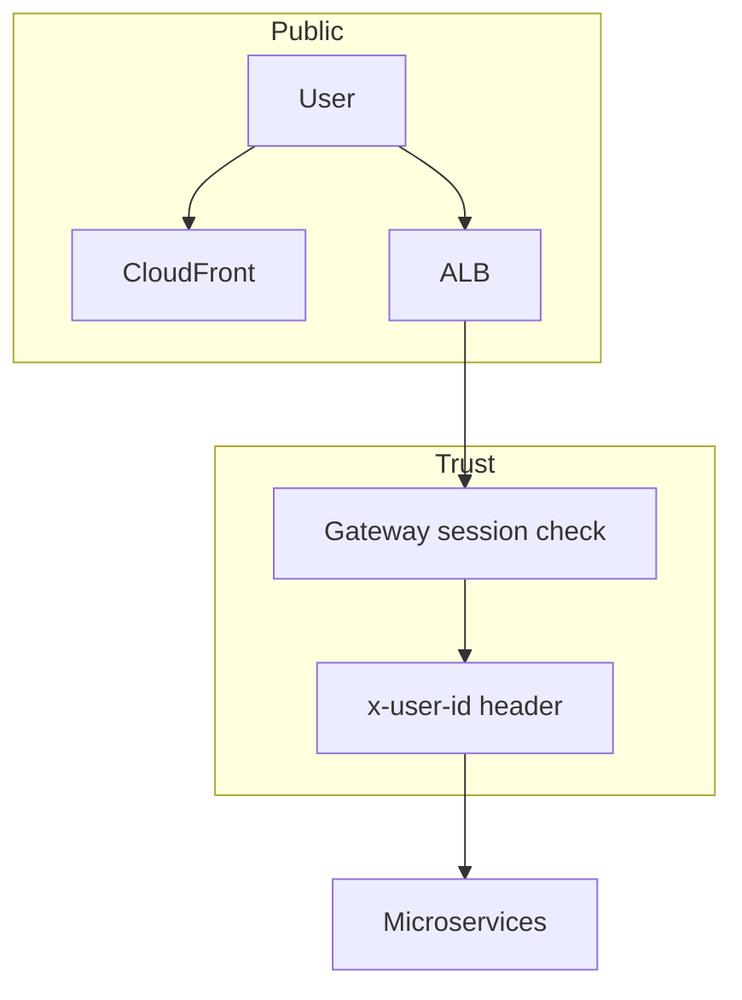

# NovaMind AI — Technical Architecture

## Scope and evidence

This document reflects **only** what appears in the repository: application source, Dockerfiles, `task-defs/`, `.github/workflows/deploy.yml`, `deploy-guide-aws-original.md`, and `new-project-pic/`. **`archive-files/` was excluded.** `deploy-guide-aws.md` is gitignored (local operational copy); use `deploy-guide-aws-original.md` for deployment steps.

When this document says **“not found”**, that capability is not evidenced in checked-in code or manifests.

---

## 1. Overall architecture

### Architecture Diagram



**Diagram breakdown:**

| Layer | Components |
|-------|-----------|
| **Client** | React 19 + Vite SPA · Firebase Auth client SDK · Redux · Tailwind |
| **AWS Edge** | CloudFront (HTTPS CDN) · S3 frontend bucket · ALB (HTTPS termination) |
| **VPC / ECS** | 5 Fargate services in private subnets · Cloud Map DNS · NAT Gateway |
| **AI / Agent** | LangGraph router + 8 nodes · Groq · Gemini · OpenRouter · Stability AI · Tavily · Qdrant |
| **Data** | ElastiCache Redis · S3 artifacts · MongoDB Atlas (external) · Qdrant Cloud (external) |
| **Security** | Secrets Manager · IAM task roles · ECR · CloudWatch Logs |
| **CI/CD** | GitHub Actions → ECR push → ECS redeploy → S3 sync → CloudFront invalidation |

---

NovaMind AI is a **React SPA** talking to a **single API gateway**, which proxies to **four domain microservices** plus itself as the edge. The **agent service** runs a **LangGraph** state machine with eight specialist nodes. **MongoDB Atlas** holds durable records. **Redis** holds sessions and ephemeral agent state. External SaaS provides identity, models, search, vectors, payments, and object storage.



| Component | Why it exists | Primary I/O |
| --- | --- | --- |
| Frontend | UX, auth client, chat, billing, admin UI | User input → gateway API |
| Gateway | One origin for CORS/cookies; central session gate | HTTP + cookie → proxied HTTP + `x-user-id` |
| Auth | Identity, sessions, credits, admin | Firebase token → session cookie; credit mutations |
| Chat | Durable conversations | CRUD messages/conversations in MongoDB |
| Agent | AI orchestration and tools | Prompt/file → model/tool calls → response |
| Billing | Monetisation | Plan → Razorpay order → verified payment |
| Redis | Fast ephemeral state | Key/value TTL and counters |
| MongoDB | System of record | Documents per service schema |

---

## 2. Frontend architecture

**Stack:** React 19, Vite 8, React Router, Redux Toolkit, Axios (`withCredentials: true`), Firebase Auth, Tailwind 4, Monaco Editor (artifacts), React Markdown.

**Routes:**

| Path | Component | Purpose |
| --- | --- | --- |
| `/` | `Home` | Sidebar, chat, artifact panel, login modal |
| `/admin` | `AdminPage` | Client guard on `VITE_ADMIN_EMAIL` (not a security boundary) |

**State:**

- `userSlice` — session user from `GET /api/me`
- `conversationSlice` — selected conversation, list, titles
- `messageSlice` — messages, loading, artifacts for Monaco panel

**Chat send path (`ChatInput`):**

1. Ensure conversation exists (`GET /api/chat/create-conversation` if needed).
2. Build `FormData`: `prompt`, `conversationId`, `agent` (lowercased label: `auto`, `chat`, …), optional `file`.
3. `POST /api/agent/chat` via Axios.
4. Append assistant message; set artifacts if coding agent returned files.

**Agent picker:** Auto, Chat, Coding, PDF, PPT, Vision, Search — no separate UI label for PDF RAG / image analysis; those are triggered by **file MIME type** when Auto or when upload accompanies the message.



---

## 3. Backend architecture

Five Express 5 apps, each with its own Dockerfile (`node:22-alpine`). Shared **`backend/shared/redis/redis.js`** is copied into gateway, auth, and agent images via build context `backend/`.

| Service | Port | Express setup | Database |
| --- | ---: | --- | --- |
| Gateway | 8000 | CORS, cookies, Morgan, proxies | Redis read for session |
| Auth | 8001 | JSON body, auth + admin routers | MongoDB users; optional cross-DB for admin |
| Chat | 8002 | JSON body | MongoDB conversations/messages |
| Agent | 8003 | JSON + Multer, error middleware | Connects Mongoose but **no models used** in agent code |
| Billing | 8004 | JSON body | MongoDB payments |

**Gateway routing** (`backend/gateway/index.js`):

- `/api/auth` → auth service (**no** `protect`)
- `/api/admin`, `/api/chat`, `/api/agent`, `/api/billing` → respective service **with** `protect` + `x-user-id`
- `/api/me` → `protect` + return `req.user` from Redis session JSON

Mounted Express paths strip the mount prefix when proxying, so e.g. `POST /api/auth/login` becomes `POST /login` on the auth container.

---

## 4. Agentic AI architecture

**Pattern:** *Orchestrated specialist workflows* — not a free-form ReAct agent with arbitrary tool loops.

**Graph definition** (`backend/services/agent/graph/graph.js`):

- Nodes: `router`, `chat`, `search`, `coding`, `pdf`, `ppt`, `vision`, `pdfRag`, `imageAnalyzer`
- Edges: `__start__ → router`; conditional edges from router; **`search → chat`**; all other specialists → `__end__`

**State schema** (`state.js`): `prompt`, `aiResponse`, `agent`, `conversationId`, `searchResults`, `images`, `artifacts`, `userId`, `file`.



| Node | Input | Processing | Output |
| --- | --- | --- | --- |
| **router** | prompt, agent, file | Rule + Groq classification | `state.agent` |
| **chat** | prompt, memory, optional searchResults | Groq chat with system rules | `aiResponse` |
| **search** | prompt | Tavily (`maxResults: 5`, images included) | `searchResults`, optional `images` |
| **coding** | prompt | Groq intent → OpenRouter JSON files or markdown | `artifacts` or markdown `aiResponse` |
| **pdf** | prompt | Groq JSON → PDFKit → S3 presign | markdown with download link |
| **ppt** | prompt | Groq JSON → PptxGenJS → S3 presign | markdown with download link |
| **vision** | prompt | Groq prompt rewrite → Stability REST → S3 | markdown + `images[]` |
| **pdfRag** | prompt + PDF file | parse → chunk → Qdrant embed → top-5 → Groq answer | `aiResponse`; temp file deleted |
| **imageAnalyzer** | prompt + image file | Gemini multimodal | `aiResponse`; temp file deleted |

**Controller wrapper** (`agent.controller.js`): persists user message → `graph.invoke` → updates Redis memory → persists assistant message → JSON `{ answer, images, artifacts }`.

---

## 5. LLM and tool workflow

**Model routing** (`config/llmModels.js`):

| Key | Provider | Model |
| --- | --- | --- |
| chat, search, router, pdf, ppt, image (prompt) | Groq | `openai/gpt-oss-120b` |
| coding | OpenRouter | `deepseek/deepseek-chat` |
| imageAnalyzer | Google GenAI | `gemini-2.0-flash` |
| embeddings (RAG) | Google GenAI | `gemini-embedding-001` |

**Tools (external APIs):**

| Tool | Library / API | Used by |
| --- | --- | --- |
| Tavily Search | `@langchain/tavily` | `searchAgent` |
| Stability AI | `fetch` v2beta generate | `visionAgent` |
| Qdrant | `@langchain/qdrant` | `pdfRag` |
| S3 | `@aws-sdk/client-s3` + presigner | pdf, ppt, vision |

**Credit costs** (`auth.controller.js` `deductCredits`): chat 1, search 5, coding/pdf/ppt/vision 10. Agent util swallows deduct failures (returns `null`) — **failed deduct does not block the response path**.

**Rate limits** (`agentLimit.js`, per user per minute): chat 20; coding, pdf, ppt, image, search 5 each. PDF RAG uses the **pdf** bucket; image analysis uses **image** limit but deducts **vision** credits.

---

## 6. Request flow (authenticated chat)



---

## 7. Data flow

**Conversation lifecycle:**

1. `GET /api/chat/create-conversation` → `Conversation` with `userId` from header.
2. Messages stored with `conversationId`, `role`, `content`, optional `images`, `artifacts`.
3. Agent memory: Redis key `messages-{conversationId}` — max 20 messages; initial load from chat service with 24h TTL, but **`addMessage` rewrite drops TTL**.

**Payment lifecycle:**

1. `POST /api/billing/create` → Razorpay order + `Payment` status `created`.
2. Client completes Razorpay checkout.
3. `POST /api/billing/verify` → HMAC check → `paid` → `POST /update-plan` on auth (unauthenticated at gateway level).

**Artifact lifecycle:**

1. Agent generates buffer locally.
2. `uploadToS3` with bucket `AWS_BUCKET_NAME`.
3. Presigned GET returned to client (embedded in markdown).

**RAG data path:** PDF bytes → text → chunks (1000/200) → new Qdrant collection name → similarity search → context string in prompt. **No** reuse of collection across requests; **no** deletion job.

---

## 8. Authentication flow



**Firebase config:** `FIREBASE_SERVICE_ACCOUNT` env JSON (ECS/Secrets Manager) or local `serviceAccountKey.json`.

**Logout gap:** auth `logOut` reads `req.cookies.session` but auth app does **not** use `cookie-parser`; logout may fail unless cookies are forwarded another way. Gateway **does** parse cookies for `protect`.

**Admin:** `adminProtect` loads user by `x-user-id` and compares email to `ADMIN_EMAIL`.

---

## 9. Service-to-service communication

All internal calls are **plain HTTP** over URLs from environment variables—localhost in dev, Cloud Map DNS in ECS.



**Not found:** mTLS, signed internal JWTs, service mesh, or network policies in repo.

**Trust model:** Any caller that can reach auth’s `/deduct-credits` or `/update-plan` can mutate credits/plan unless network isolation restricts it.

---

## 10. AWS deployment architecture (target)

Represents **intent** from task definitions and deployment guide—not verified live topology.



---

## 11. ECS architecture

| Task family | CPU / Memory | Role highlights |
| --- | --- | --- |
| novamind-gateway | 512 / 1024 | Public via ALB; Redis URL; Cloud Map service URLs |
| novamind-auth | 512 / 1024 | Task role; Firebase + Mongo secrets; admin cross-DB env vars |
| novamind-chat | 512 / 1024 | Mongo secret only |
| novamind-agent | 1024 / 2048 | Task role for S3; provider secrets; larger CPU for PDF/PPT/image |
| novamind-billing | 512 / 1024 | Razorpay secret; auth service URL |

**Deployment trigger:** GitHub Actions pushes `:latest` tags and `aws ecs update-service --force-new-deployment` per service.

**Not in repo:** service desired count, health checks, load balancer target group JSON, circuit breakers.

---

## 12. Cloud Map architecture

Task definitions point inter-service URLs to **`*.novamind.local`** hostnames (e.g. `http://novamind-auth.novamind.local:8001`).

| Logical name | Typical consumer |
| --- | --- |
| novamind-auth | Gateway, agent, billing |
| novamind-chat | Gateway, agent |
| novamind-agent | Gateway |
| novamind-billing | Gateway |

Cloud Map replaces localhost service discovery in AWS. Registration is described in the deployment guide; **no** Cloud Map JSON/Terraform is checked in.

---

## 13. CloudFront architecture

**Frontend path:** `npm run build` → `frontend/dist` → `aws s3 sync` → CloudFront distribution → browser.

**API path:** Browser `VITE_SERVER_URL` should target the **gateway** (ALB), not CloudFront—API and static hosting are split.

**CI:** `create-invalidation` on `/*` after each frontend deploy.

---

## 14. Security architecture



| Layer | Mechanism | Gap |
| --- | --- | --- |
| Edge | HTTPS (guide) | ACM/listener not in repo |
| Session | HTTP-only cookie + Redis | No CSRF token for cookie APIs |
| Authorization | Gateway `protect` | `/api/auth` exposes credit/plan mutations |
| Data access | Mongo per service | Chat lacks ownership checks on messages |
| Secrets | Partial Secrets Manager | Plaintext in some task defs |
| Uploads | MIME + 20MB | No AV scanning |
| IAM | Agent task role → S3 | Bucket policy not in repo |

---

## 15. Monitoring and logging

| Signal | Implementation |
| --- | --- |
| HTTP access | Morgan on gateway |
| App logs | `console.log` / `console.error` in services |
| ECS | `awslogs` driver → groups `/ecs/novamind-*` |
| Metrics / alarms / tracing | **Not found** in application or IaC |
| Health endpoints | Root `GET /` JSON hello on each service — not wired as formal health checks in repo |

---

## Guide-to-code cross-check

| Deployment guide claim | Repository finding |
| --- | --- |
| 5 Express services + React | Confirmed |
| 8 LangGraph agents/nodes | Confirmed |
| Redis for all services | **Partial** — gateway, auth, agent only |
| Firebase JSON written at ECS startup | **Mismatch** — code reads `FIREBASE_SERVICE_ACCOUNT` directly |
| ElastiCache shared by all backends | Same as Redis finding |
| HTTPS everywhere in AWS | Described in guide; not defined in IaC |
| Bedrock | Dependency only; **unused** |

---

## Known implementation issues (document only — not auto-fixed)

1. **Secrets in `task-defs/auth.json` (and others):** rotate credentials; remove plaintext from version control.
2. **Chat authorisation:** any authenticated user may read/write by conversation ID.
3. **Auth internal routes** exposed via unauthenticated gateway prefix.
4. **Credit deduct** errors ignored in agent util.
5. **Agent error middleware** references undefined `error` variable (`index.js`).
6. **Presigned URL expiry** vs user-facing “10 minutes” / “24 hours” strings inconsistent in pdf/ppt/vision agents.
7. **Qdrant collection sprawl** from one collection per PDF upload.

---

## Recommended engineering priorities

1. Rotate and externalise all secrets; scrub git history if needed.
2. Protect `/deduct-credits` and `/update-plan` (mTLS, internal API key, or network policy).
3. Enforce `userId` on all chat operations.
4. Atomic credit deduction; optional usage ledger.
5. Razorpay webhooks + idempotency.
6. Async jobs for heavy generation; optional streaming.
7. Qdrant/S3 lifecycle policies; structured logging and correlation IDs.

---

## 16. Complete Technology Inventory

> **NovaMind CortexAI** — Built by Aamir · AWS Generative AI Engineer
>
> Every entry verified from actual source files, `package.json` dependencies, Dockerfiles, ECS task definitions, and the CI/CD pipeline.

---

### 16.1 Programming Languages

| Language | Runtime / Version | Where Used |
|----------|------------------|-----------|
| JavaScript (ESM) | Node.js 22 | All 5 backend services — `"type": "module"` in every `package.json` |
| JavaScript (JSX) | React 19 | Frontend SPA |
| YAML | — | GitHub Actions CI/CD pipeline |
| JSON | — | ECS task definitions (`task-defs/*.json`), package manifests |

---

### 16.2 Frontend Stack (verified from `frontend/package.json`)

| Library / Tool | Exact Version | Purpose |
|---------------|--------------|---------|
| React | 19.2.7 | UI component framework |
| Vite | 8.1.0 | Build tool and dev server |
| `@vitejs/plugin-react` | 6.0.2 | Vite plugin for React JSX transform |
| React Router DOM | 7.18.4 | Client-side routing (`/` home, `/admin`) |
| Redux Toolkit | 2.12.0 | Global state management |
| react-redux | 9.3.0 | React bindings for Redux store |
| Tailwind CSS | 4.3.1 | Utility-first CSS via `@tailwindcss/vite` plugin |
| Axios | 1.18.1 | HTTP client — all API calls use `withCredentials: true` |
| Firebase | 12.15.0 | Google Sign-In client SDK (Firebase Auth) |
| `@monaco-editor/react` | 4.7.0 | VS Code-style editor — renders coding agent file artifacts |
| react-markdown | 10.1.0 | Renders AI responses as Markdown |
| remark-gfm | 4.0.1 | GitHub Flavored Markdown (tables, strikethrough, etc.) |
| react-syntax-highlighter | 16.1.1 | Code block syntax highlighting inside Markdown |
| motion | 12.42.2 | Framer Motion animations |
| lucide-react | 1.22.0 | Icon set |
| react-icons | 5.6.0 | Additional icons |
| ESLint | 10.5.0 | Linting (dev only) |

**Redux slices:** `userSlice` (auth state, credits, plan) · `conversationSlice` (list + active) · `messageSlice` (messages for active conversation)

**Frontend build-time env vars (from `VITE_*` GitHub Secrets, baked in at `npm run build`):**
- `VITE_FIREBASE_API_KEY` · `VITE_RAZORPAY_KEY_ID` · `VITE_SERVER_URL` (ALB DNS) · `VITE_ADMIN_EMAIL`

---

### 16.3 Backend Stack (all 5 services)

| Library / Tool | Exact Version | Used By | Purpose |
|---------------|--------------|---------|---------|
| Express.js | 5.2.1 | All 5 services | HTTP framework |
| Mongoose | 9.7.3–9.7.4 | Auth, Chat, Agent, Billing | MongoDB ODM |
| ioredis | 5.11.1 | Gateway, Auth, Agent (shared `backend/shared/redis/redis.js`) | Redis client |
| cookie-parser | 1.4.7 | Gateway | Parse `session` cookie |
| cors | 2.8.6 | Gateway | Allow only `FRONTEND_URL` with `credentials: true` |
| morgan | 1.11.0 | Gateway | HTTP access logging |
| express-http-proxy | 2.1.2 | Gateway | Reverse proxy to downstream services |
| multer | 2.2.0 | Agent | Multipart file upload — disk storage `./temp/`, 20 MB limit, PDF + image MIME only |
| firebase-admin | 13.10.0 | Auth | Server-side Firebase ID token verification |
| razorpay | 2.9.6 | Billing | Razorpay order creation + HMAC-SHA256 payment verification |
| nodemon | 3.1.14 | All services | Dev auto-reload |
| dotenv | 17.4.2 | All services | Environment variable loading |

**Dockerfiles:** All 5 services use `node:22-alpine` base image. Build context is always `backend/` so that `shared/redis/redis.js` can be copied into every container.

---

### 16.4 AI / GenAI / LLM Layer (verified from `agent/package.json` + `agent/config/llmModels.js`)

| Technology | Package | Version | Model Used | Used By Agent(s) |
|-----------|---------|---------|-----------|-----------------|
| **LangGraph** | `@langchain/langgraph` | 1.4.7 | `StateGraph` | All — orchestration layer |
| **LangChain Core** | `@langchain/core` | 1.2.2 | — | All agents — base message/LLM abstractions |
| **Groq** | `@langchain/groq` | 1.3.1 | `openai/gpt-oss-120b` | chat, search (synthesis), router (classifier), pdf, ppt, vision (prompt refinement), pdfRag (answer) |
| **Google Gemini** | `@langchain/google-genai` + `@google/generative-ai` | 2.2.0 + 0.24.1 | `gemini-2.0-flash` (chat) · `gemini-embedding-001` (embeddings) | imageAnalyzer (multimodal vision), pdfRag (embeddings) |
| **OpenRouter / DeepSeek** | `@langchain/openrouter` | 0.4.3 | `deepseek/deepseek-chat` (temp: 0, maxTokens: 2500) | coding |
| **Stability AI** | Native `fetch` | REST v2beta | `stable-image/generate/core` 1024×1024 PNG | vision (image generation) |
| **Tavily Search** | `@langchain/tavily` | 1.2.0 | — `maxResults: 5`, topic: `general` | search |
| **Text Splitters** | `@langchain/textsplitters` | 1.0.1 | `RecursiveCharacterTextSplitter` | pdfRag (1000 chars, 200 overlap) |
| **AWS Bedrock** | `@aws-sdk/client-bedrock-runtime` | 3.1136.0 | — | **Installed but NOT actively used** in current agent code |

**LangGraph `StateGraph` shape (from `agent/graph/state.js`):**

```
{
  prompt          // user input text
  aiResponse      // final answer string
  agent           // routing key: chat|search|coding|pdf|ppt|vision|pdfRag|imageAnalyzer|auto
  conversationId  // MongoDB ObjectId
  searchResults   // Tavily results array
  images          // image URL array
  artifacts       // code file objects [{id, type, title, files:[{name,content}]}]
  userId          // from x-user-id header (injected by gateway)
  file            // multer file object (path, mimetype, size)
}
```

**Graph edges:**
- `__start__` → `router` → conditional → 8 specialist nodes
- `search` → `chat` (only multi-node chain — Tavily results grounded in chat)
- All other nodes → `__end__`

---

### 16.5 RAG Architecture (PDF Question-Answering)

Full pipeline verified from `agent/agents/pdfRag.agent.js` and `agent/config/vectorDb.js` + `agent/config/embeddings.js`:

```
1. User uploads PDF via multipart form (multer → ./temp/<timestamp>-filename.pdf)
2. pdf-parse v2.4.5 — extract raw text from PDF
3. RecursiveCharacterTextSplitter — chunk: 1000 chars, overlap: 200 chars
4. GoogleGenerativeAIEmbeddings (gemini-embedding-001) — embed each chunk
5. QdrantVectorStore.fromDocuments() — create collection "pdf-{timestamp}" in Qdrant Cloud
6. vectorStore.similaritySearch(prompt, 5) — retrieve top-5 relevant chunks
7. Groq (gpt-oss-120b) — answer user question using only retrieved context
   System prompt: "Answer ONLY from the provided context. If not found, say so."
8. finally block: fs.unlinkSync(file.path) — delete temp file from agent container disk
```

---

### 16.6 Databases — Full Schema

#### MongoDB Atlas (Mongoose ODM)

Three separate databases — one per service group:

| Collection | Service | Schema | Key Fields |
|-----------|---------|--------|-----------|
| `users` | Auth | Mongoose | email, name, photoURL, plan (free/starter/pro), credits (Number), createdAt |
| `payments` | Billing | Mongoose | userId, plan, amount (INR), razorpayOrderId, razorpayPaymentId, status (created/paid), timestamps |
| `conversations` | Chat | Mongoose | title (default "New Chat"), userId (String), timestamps |
| `messages` | Chat | Mongoose | conversationId (ObjectId→Conversation), role (user/assistant), content, images[], artifacts[], timestamps |

#### Redis (AWS ElastiCache — `cache.t3.micro`, Redis OSS 7.1)

| Key Pattern | TTL | Stored By | Read By | Content |
|------------|-----|----------|---------|---------|
| `session-<uuid>` | 7 days | Auth login | Gateway protect middleware | JSON: userId, email, name, photo, plan, credits |
| `user-session-<userId>` | 7 days | Auth login | Auth `/update-plan` | sessionId string (for session refresh) |
| `messages-<conversationId>` | 24 hours | Agent memory | Agent getMemory | JSON array of last 20 messages |
| `rate-<userId>-<agentType>` | 60 seconds | agentLimit.js | agentLimit.js | Integer request count |

#### Qdrant Cloud (Vector Database — `eu-west-1`)

- **Collection naming:** `pdf-{Date.now()}` — one collection per PDF upload
- **Vectors:** Gemini `gemini-embedding-001` embeddings
- **Search:** `similaritySearch(prompt, 5)` — cosine similarity, top-5 results
- **Lifecycle:** No cleanup implemented — collections accumulate per upload

---

### 16.7 AWS Services — Detailed Usage

| AWS Service | Resource Name / ID | Configuration | Purpose |
|------------|-------------------|--------------|---------|
| **ECS Fargate** | `novamind-cluster` | 5 services, `awsvpc` network mode | Serverless container runtime — gateway (0.5vCPU/1GB), auth/chat/billing (0.5vCPU/1GB), agent (1vCPU/2GB) |
| **ECR** | `gateway`, `auth-service`, `chat-service`, `agent-service`, `billing-service` | `:latest` tag | Private Docker registry — CI/CD pushes new images on every `main` push |
| **S3 (frontend)** | `novamind-frontend-prod` | Static website hosting, public read policy | Hosts React Vite build output — served via CloudFront |
| **S3 (artifacts)** | `cretexainovamind` (us-east-1) | Private bucket — agent IAM task role has `s3:PutObject` + `s3:GetObject` | Stores agent-generated PDFs, PPTs, PNG images — accessed via presigned URLs (24hr expiry) |
| **CloudFront** | `EBG0WA07U0GG8` | Custom error responses 403/404 → `index.html` (200) for React Router | HTTPS CDN at `d8au5xi32kvkz.cloudfront.net` — delivers frontend globally |
| **ALB** | `novamind-alb` | Target group `novamind-gateway-tg` :8000, health check `GET /` | Terminates HTTPS, routes to ECS gateway service |
| **ElastiCache** | `novamind-redis` | `cache.t3.micro`, Redis OSS 7.1, private subnets, `novamind-redis-sg` | Managed Redis — endpoint `novamind-redis.7tlv0b.0001.use1.cache.amazonaws.com:6379` |
| **Secrets Manager** | `novamind/*` namespace | 12 secrets — see table below | Secure injection into ECS tasks at startup — no secrets in Docker images |
| **Cloud Map** | `novamind.local` namespace (ID: `ns-ytxseqdkwnliatct`) | 4 service records (auth/chat/agent/billing) | Internal DNS — e.g. `novamind-auth.novamind.local:8001` |
| **IAM** | 3 roles | `novamindECSTaskExecutionRole` · `novamindAgentTaskRole` · `novamindAuthTaskRole` | Least-privilege access — agent gets S3 RW, auth gets Secrets R, all get ECR + CloudWatch |
| **CloudWatch Logs** | `/ecs/novamind-{gateway\|auth\|chat\|agent\|billing}` | `awslogs` driver, region `us-east-1` | Container stdout/stderr log capture |
| **VPC** | `novamind-vpc` (10.0.0.0/16) | 2 public + 2 private subnets, Internet Gateway, NAT Gateway | Network isolation — ECS in private subnets, ALB in public subnets |
| **NAT Gateway** | Public subnet | Static Elastic IP | Outbound internet from private ECS tasks → MongoDB Atlas, Groq, Gemini, etc. |

**AWS Secrets Manager secrets (12 total):**

| Secret Name | Injected Into | Environment Variable |
|------------|--------------|---------------------|
| `novamind/auth/mongodb-uri` | Auth task | `MONGODB_URI` |
| `novamind/auth/firebase-service-account` | Auth task | `FIREBASE_SERVICE_ACCOUNT` |
| `novamind/chat/mongodb-uri` | Chat task | `MONGODB_URI` |
| `novamind/agent/mongodb-uri` | Agent task | `MONGODB_URI` |
| `novamind/agent/groq-api-key` | Agent task | `GROQ_API_KEY` |
| `novamind/agent/google-api-key` | Agent task | `GOOGLE_API_KEY` |
| `novamind/agent/openrouter-api-key` | Agent task | `OPENROUTER_API_KEY` |
| `novamind/agent/tavily-api-key` | Agent task | `TAVILY_API_KEY` |
| `novamind/agent/qdrant-api-key` | Agent task | `QDRANT_API_KEY` |
| `novamind/agent/stability-api-key` | Agent task | `STABILITY_API_KEY` |
| `novamind/billing/mongodb-uri` | Billing task | `MONGODB_URI` |
| `novamind/billing/razorpay-secret` | Billing task | `RAZORPAY_KEY_SECRET` |

---

### 16.8 External Services — Detailed Usage

| Service | Integration Method | Auth | Used By | What Happens |
|---------|------------------|------|---------|-------------|
| **MongoDB Atlas** | Mongoose `mongoose.connect(MONGODB_URI)` | Connection string with credentials | Auth, Chat, Agent, Billing | Persistent storage for users, conversations, messages, payments |
| **Firebase Auth** (client) | `firebase` SDK 12.15.0 — `signInWithPopup(GoogleAuthProvider)` | Firebase project config via `VITE_FIREBASE_API_KEY` | Frontend | User clicks "Sign in with Google" → browser popup → returns ID token |
| **Firebase Admin** (server) | `firebase-admin` 13.10.0 — `getAuth().verifyIdToken(token)` | `FIREBASE_SERVICE_ACCOUNT` JSON (from Secrets Manager) | Auth service | Verifies ID token server-side on every login request |
| **Groq API** | `@langchain/groq` ChatGroq | `GROQ_API_KEY` | Agent service | Inference — chat, routing, PDF/PPT generation, search synthesis, vision prompt engineering |
| **Google Gemini** | `@langchain/google-genai` ChatGoogleGenerativeAI + `@google/generative-ai` Embeddings | `GOOGLE_API_KEY` | Agent service | Multimodal image analysis (`gemini-2.0-flash`) + PDF embeddings (`gemini-embedding-001`) |
| **OpenRouter** | `@langchain/openrouter` ChatOpenRouter → DeepSeek | `OPENROUTER_API_KEY` | Agent service | Coding LLM — `deepseek/deepseek-chat` with temp: 0, maxTokens: 2500 |
| **Stability AI** | Native `fetch` POST to `https://api.stability.ai/v2beta/stable-image/generate/core` | `Bearer STABILITY_API_KEY` header | Agent service | Text-to-image — returns raw PNG binary (`Accept: image/*`), 1024×1024 |
| **Tavily** | `@langchain/tavily` TavilySearch tool | `TAVILY_API_KEY` | Agent service | Web search — `maxResults: 5`, `topic: general`, `includeImages: true` |
| **Qdrant Cloud** | `@langchain/qdrant` QdrantVectorStore | `QDRANT_API_KEY` + `QDRANT_URL` | Agent service | Vector similarity search for PDF RAG — hosted at `eu-west-1` |
| **Razorpay** | `razorpay` SDK 2.9.6 — `razorpay.orders.create()` | `RAZORPAY_KEY_ID` + `RAZORPAY_KEY_SECRET` | Billing service | Create INR payment orders + verify HMAC-SHA256 signatures |

---

### 16.9 Inter-Service Communication (Production)

| From | To | Method | Auth Mechanism |
|------|----|--------|---------------|
| Browser | CloudFront/S3 | HTTPS | None (public) |
| Browser | ALB → Gateway | HTTPS + `session` cookie | HTTP-only session cookie |
| Gateway | Auth, Chat, Agent, Billing | HTTP (Cloud Map DNS) | `x-user-id` header injected by gateway |
| Agent | Chat | HTTP `POST /save-message` | `x-user-id` header |
| Agent | Auth | HTTP `POST /deduct-credits` | `x-user-id` header |
| Billing | Auth | HTTP `POST /update-plan` | Internal HTTP (trusted LAN) |
| All ECS tasks | ElastiCache | TCP :6379 (private subnet) | VPC security group `novamind-redis-sg` |
| All ECS tasks | MongoDB Atlas | TLS :27017 (via NAT Gateway) | Connection string credentials in Secrets Manager |
| Agent ECS task | S3 `cretexainovamind` | AWS SDK | IAM task role `novamindAgentTaskRole` |
| All ECS tasks | Secrets Manager | AWS SDK (ECS task startup) | IAM execution role |

**Local development URLs (`.env` files):**
```
AUTH_SERVICE=http://localhost:8001
CHAT_SERVICE=http://localhost:8002
AGENT_SERVICE=http://localhost:8003
BILLING_SERVICE=http://localhost:8004
REDIS_URL=redis://localhost:6379
```

**Production URLs (ECS task definition environment):**
```
AUTH_SERVICE=http://novamind-auth.novamind.local:8001
CHAT_SERVICE=http://novamind-chat.novamind.local:8002
AGENT_SERVICE=http://novamind-agent.novamind.local:8003
BILLING_SERVICE=http://novamind-billing.novamind.local:8004
REDIS_URL=redis://novamind-redis.7tlv0b.0001.use1.cache.amazonaws.com:6379
```

---

### 16.10 CI/CD Pipeline — Step by Step

**Trigger:** `git push` to `main` branch

**Job 1 — `deploy-backend`** (ubuntu-latest):

| Step | Action |
|------|--------|
| 1 | `actions/checkout@v4` |
| 2 | `aws-actions/configure-aws-credentials@v4` (mlops-user IAM credentials from GitHub Secrets) |
| 3 | `aws-actions/amazon-ecr-login@v2` (authenticates Docker to ECR) |
| 4–8 | For each of 5 services: `docker build -f backend/<svc>/Dockerfile -t <name> backend` → `docker tag :latest` → `docker push` to ECR |
| 9–13 | For each of 5 services: `aws ecs update-service --cluster novamind-cluster --service <svc> --force-new-deployment` |

**Job 2 — `deploy-frontend`** (needs: `deploy-backend`):

| Step | Action |
|------|--------|
| 1 | `actions/checkout@v4` |
| 2 | Inject `VITE_*` env vars from GitHub Secrets, run `cd frontend && npm install && npm run build` |
| 3 | `aws-actions/configure-aws-credentials@v4` |
| 4 | `aws s3 sync frontend/dist s3://novamind-frontend-prod --delete` |
| 5 | `aws cloudfront create-invalidation --distribution-id EBG0WA07U0GG8 --paths "/*"` |

**16 GitHub Secrets used:**
`AWS_REGION` · `AWS_ACCOUNT_ID` · `AWS_ACCESS_KEY` · `AWS_SECRET_ACCESS_KEY` · `ECS_CLUSTER` · `GATEWAY_SERVICE` · `AUTH_SERVICE` · `CHAT_SERVICE` · `AGENT_SERVICE` · `BILLING_SERVICE` · `S3_BUCKET` · `CLOUDFRONT_DISTRIBUTION_ID` · `VITE_FIREBASE_API_KEY` · `VITE_RAZORPAY_KEY_ID` · `VITE_SERVER_URL` · `VITE_ADMIN_EMAIL`
