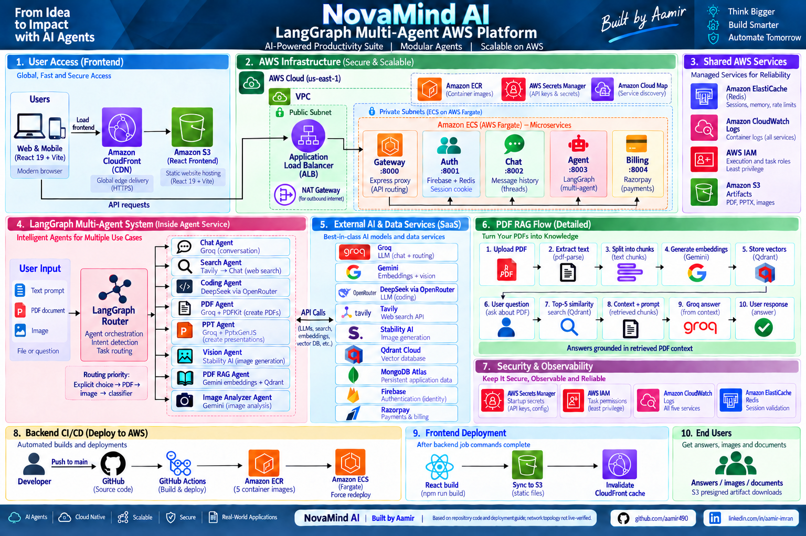
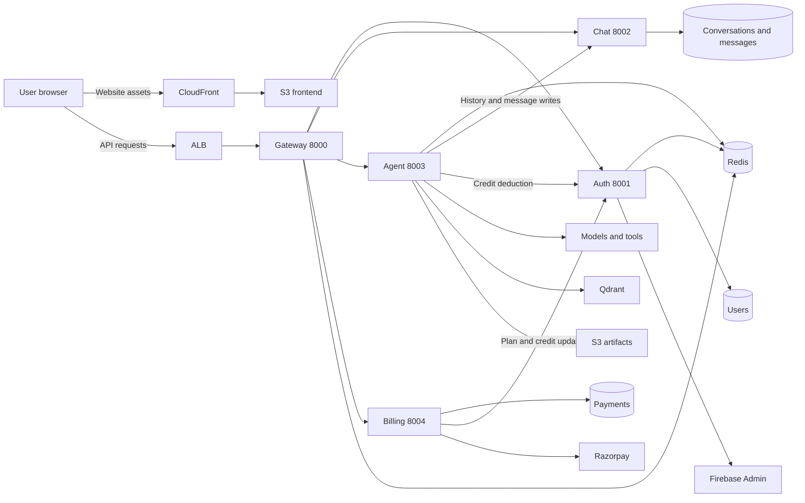
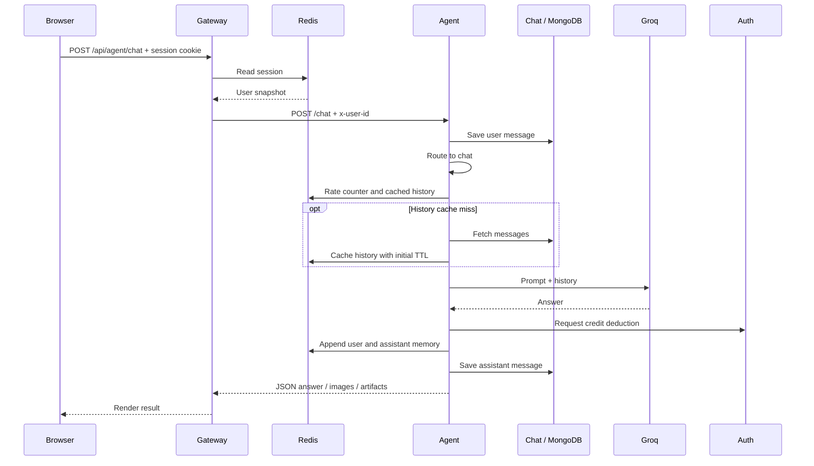
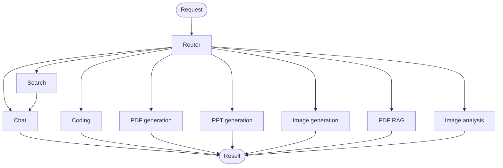

# NovaMind AI — Technical Architecture

NovaMind AI is an authenticated AI workspace with a React frontend, five Express services and eight specialist workflows inside one LangGraph-powered Agent service. This document explains the system's boundaries, request paths, data ownership and deployment configuration.

## Scope and evidence

- **Implemented:** behavior visible in application source or committed configuration.
- **Documented deployment:** infrastructure described in [the deployment guide](deploy-guide-aws-original.md), not a verified live AWS inventory.
- **Proposed:** improvements that are not implemented yet.

Source code takes precedence over older diagrams and prose. A task definition establishes configuration, not a healthy running service. This review does not establish production capacity, uptime, model availability or cost savings. Exact dependency versions belong in package manifests and lockfiles; configured model identifiers are recorded below.

For product screenshots and setup, see [README](README.md). For speaking scripts and practice questions, see [the interview guide](interview.md).

## Contents

- [System overview](#system-overview)
- [Frontend and API boundary](#frontend-and-api-boundary)
- [Identity and authorization](#identity-and-authorization)
- [Request lifecycle](#request-lifecycle)
- [LangGraph and specialist workflows](#langgraph-and-specialist-workflows)
- [PDF retrieval and upload behavior](#pdf-retrieval-and-upload-behavior)
- [Data ownership and lifecycle](#data-ownership-and-lifecycle)
- [Payments and credits](#payments-and-credits)
- [AWS deployment and networking](#aws-deployment-and-networking)
- [Container builds and configuration](#container-builds-and-configuration)
- [Delivery pipeline](#delivery-pipeline)
- [Observability and failure handling](#observability-and-failure-handling)
- [Scaling and recovery](#scaling-and-recovery)
- [Engineering priorities](#engineering-priorities)

## System overview

### Existing architecture diagram

[](new-project-pic/novamind-aws-architecture-poster.png)

This is the same image referenced by README. It summarizes the application and documented AWS design; it is not a live topology report. Subnet boxes do not prove redundant replicas, and IAM labels do not establish least privilege. Supporting regional services such as ECR and Secrets Manager are not containers running inside the application's subnets.

There are two separate browser paths: CloudFront/S3 delivers the website, while the configured API endpoint leads to ALB/Gateway. S3 does not forward prompts to the backend. Auth, Chat, Agent and Billing are independently proxied services, not a serial processing chain.



The diagram emphasizes active business data paths. Agent also opens a MongoDB connection at startup without using an agent-owned model. Auth administration reads Chat and Billing databases directly, so data boundaries are not completely isolated.

### Service responsibilities

| Service | Port | Responsibility | Direct dependencies |
| --- | ---: | --- | --- |
| Gateway | 8000 | Browser API entry, credentialed CORS, session lookup, proxying | Redis, four domain services |
| Auth | 8001 | Firebase verification, sessions, user plans/credits, administration | Firebase, Redis, MongoDB; admin cross-database reads |
| Chat | 8002 | Conversation and message persistence | MongoDB |
| Agent | 8003 | Upload handling, LangGraph, model/tool calls, artifact generation | Chat, Auth, Redis, providers, Qdrant, S3; startup MongoDB connection |
| Billing | 8004 | Razorpay orders, payment verification, payment records | Razorpay, MongoDB, Auth |

All five are Express applications. The project's Gateway is an application service, not Amazon API Gateway. Eight specialists share the Agent process and deployment; they are not eight ECS services.

## Frontend and API boundary

The frontend uses React 19, Vite 8, Router, Redux Toolkit, Tailwind, Axios and Firebase. `/` hosts the workspace; `/admin` hosts administration. Redux manages user, conversation and message/artifact state.

`ChatInput` requires prompt text before sending. It creates a conversation if necessary, updates the initial title, adds an optimistic message and posts multipart `FormData` containing `prompt`, `conversationId`, lowercased `agent` and optional `file`. Selecting a file alone does not upload it.

The picker offers Auto, Chat, Coding, PDF, PPT, Vision and Search. PDF RAG and image analysis normally use Auto's MIME routing. Explicit PDF means document generation; explicit Vision means image generation.

Responses use JSON rather than streamed tokens. Markdown and image links appear in chat; coding artifacts appear in read-only Monaco tabs. HTML/CSS/JavaScript can be previewed in an iframe with `sandbox="allow-scripts"`. There is no server-side code execution, package installation or generated-project test runner. Speech recognition is a browser capability.

Axios uses `VITE_SERVER_URL` and `withCredentials: true`. Vite values are public build-time configuration, even when supplied through GitHub Secrets. Changing them requires rebuilding. Some API helpers return `null` on failure and callers do not consistently handle it.

Sources: [App](frontend/src/App.jsx), [ChatInput](frontend/src/components/ChatInput.jsx), [Axios client](frontend/utils/axios.js).

### Gateway route policy

| Browser prefix | Destination | Current session enforcement |
| --- | --- | --- |
| `/api/auth` | Auth root router | Public |
| `/api/admin` | Auth root router | Protected |
| `/api/chat` | Chat | Protected |
| `/api/agent` | Agent | Protected |
| `/api/billing` | Billing | Protected |
| `/api/me` | Gateway returns session snapshot | Protected |

Mounted prefixes are removed before forwarding. For example, `/api/agent/chat` becomes `/chat` at Agent. Protected proxies overwrite `x-user-id` using the Redis session. The public Auth proxy does not create the same trusted boundary.

Sources: [Gateway](backend/gateway/index.js), [proxy helper](backend/gateway/utils/proxyWithHeader.js).

## Identity and authorization

1. The browser performs Google sign-in with Firebase and obtains an ID token.
2. Auth verifies the token with Firebase Admin, then finds or creates a MongoDB user.
3. Auth creates a UUID session and writes its user snapshot to Redis for seven days. A second key maps the user to one session ID.
4. The browser receives an HTTP-only cookie. Production enables Secure and SameSite=None; development uses different cookie settings.
5. Protected gateway requests read the cookie, retrieve the Redis snapshot and forward its user ID. Missing/expired sessions currently return 400 rather than a consistent 401 contract.

Firebase Admin reads `FIREBASE_SERVICE_ACCOUNT` JSON or a local file. It does not rely on an AWS CLI script downloading a service-account file at startup.

### Current trust-boundary gaps

- The public Auth prefix exposes plan/credit mutation routes without internal authentication. Private task placement does not close a route exposed through the gateway.
- Auth mounts admin routes at its root too. The public Auth proxy supplies an alternate path to handlers that trust `x-user-id`; protecting `/api/admin` alone is insufficient.
- Chat filters conversation lists by user but does not consistently check ownership for message reads/writes and title changes.
- Auth logout reads `req.cookies` without installing cookie-parser. Clearing the browser cookie does not establish Redis-session revocation. Admin changes/deletions also do not reliably invalidate cached session snapshots.
- A frontend admin email check only restricts navigation. CORS is not authorization, and HTTP-only cookies do not replace CSRF protections.

These are source-review findings, not claims of observed attacks. Production work must enforce identity and resource ownership at each sensitive operation.

Sources: [Auth initialization](backend/services/auth/index.js), [Auth routes](backend/services/auth/routes/auth.route.js), [Auth controller](backend/services/auth/controllers/auth.controller.js), [admin middleware](backend/services/auth/middleware/admin.middleware.js), [Chat controller](backend/services/chat/controllers/chat.controller.js).

## Request lifecycle

The following sequence represents successful text chat. Other specialists have different provider, storage and credit timing.



Agent-to-Chat writes and Agent-to-Auth deductions pass data in request bodies; they do not carry an independently verified caller identity. The graph, credit mutation, S3 operations and message writes are not a single transaction. A later failure can leave earlier effects committed.

Source: [Agent controller](backend/services/agent/controllers/agent.controller.js), [credit helper](backend/services/agent/utils/deductCredits.js).

## LangGraph and specialist workflows

The graph has **nine named nodes: a router and eight specialists**. Routing priority is explicit non-Auto choice, PDF MIME, image MIME, then Groq text classification. Unknown labels fall through to Chat; a classifier exception is a separate failure without a general router fallback.



`Annotation.Root` carries `prompt`, `aiResponse`, `agent`, `conversationId`, `searchResults`, `images`, `artifacts`, `userId` and `file`. The controller awaits `graph.invoke`. Compilation supplies no checkpointer; Redis conversation memory is not resumable graph execution. No autonomous planner, reflection loop or parallel specialist execution is configured.

| Specialist | Processing | Result |
| --- | --- | --- |
| `chat` | History and optional search context → Groq | Markdown answer |
| `search` | Tavily, up to five results and images → Chat | Synthesized answer and optional external image URLs |
| `coding` | Groq intent classification → DeepSeek/OpenRouter | Markdown or parsed JSON project files |
| `pdf` | Groq JSON → PDFKit → S3 | Download link |
| `ppt` | Groq JSON → PptxGenJS → S3 | Download link |
| `vision` | Groq prompt refinement → Stability API → S3 | Generated image/link |
| `pdfRag` | PDF text → Gemini embeddings → Qdrant → Groq | Document-grounded answer |
| `imageAnalyzer` | Base64 upload plus prompt → Gemini | Image explanation |

Coding expects exact `CODE_GENERATION` intent for its JSON-file branch. PDF/PPT/coding parsing has no comprehensive output-schema validation. PPT requests six content slides and the renderer adds a cover and closing slide.

### Models and integrations

- **Groq:** configured `openai/gpt-oss-120b`, including routing, text generation, coding intent and RAG answering.
- **OpenRouter:** configured `deepseek/deepseek-chat`, temperature 0, maximum tokens 2500, for coding.
- **Gemini:** configured `gemini-2.0-flash` for image analysis; `gemini-embedding-001` for embeddings. Both active wrappers come from `@langchain/google-genai`.
- **Tools:** Tavily search, Stability's `stable-image/generate/core` REST endpoint, Qdrant vector integration, PDFKit, PptxGenJS and S3 SDK/presigner.

Model identifiers describe source configuration, not verified current availability or quality rankings. Stability requests PNG output and width/height values; the source alone does not verify returned dimensions. Bedrock's SDK is installed but unused by active workflows. Provider clients initialize eagerly, so missing credentials can affect service startup before routing.

Sources: [graph](backend/services/agent/graph/graph.js), [router](backend/services/agent/graph/router.js), [state](backend/services/agent/graph/state.js), [agents](backend/services/agent/agents/), [models](backend/services/agent/config/llmModels.js), [embeddings](backend/services/agent/config/embeddings.js).

## PDF retrieval and upload behavior

Multer accepts PDF/image MIME types with a 20 MiB file cap and writes temporary files in the Agent container. MIME filtering is not content scanning. File size alone does not bound extraction time, page count or model input cost.

For a PDF sent with prompt text and Auto selected:

1. `pdf-parse` extracts text from the temporary file.
2. Recursive character splitting creates chunks with size 1,000 and overlap 200.
3. Gemini embeds chunks; Qdrant stores them in a new `pdf-<timestamp>` collection.
4. Similarity search embeds the question and retrieves five chunks.
5. Groq receives the context and instructions to answer from it or abstain.
6. The node requests PDF credit deduction and attempts temporary-file deletion in `finally`.

The application does not explicitly select a distance metric. The Qdrant integration can obtain its API key from the environment even though application configuration passes only URL and collection name.

**Follow-up limitation:** the collection identifier is not retained in a conversation/document mapping. After React clears the attachment, a text-only follow-up cannot perform fresh retrieval from that PDF. History is not a substitute for retrieval. Reattaching the file in Auto repeats ingestion and creates another collection.

There is no OCR, deduplication, collection cleanup, tenant metadata filtering, reranking, verified citation mechanism or evaluation suite. Context instructions reduce unsupported answering but cannot guarantee correctness. Cleanup can itself throw and mask an earlier result; image analysis performs its rate check before entering its cleanup-protected block.

**Proposed:** separate ingestion from retrieval, persist authorized document IDs, retain page/source metadata, add retention and evaluate retrieval coverage, answer faithfulness and abstention using labeled questions.

Sources: [PDF RAG](backend/services/agent/agents/pdfRag.agent.js), [vector configuration](backend/services/agent/config/vectorDb.js), [image analysis](backend/services/agent/agents/imageAnalyzer.agent.js).

## Data ownership and lifecycle

### MongoDB records

| Model | Owner | Important fields |
| --- | --- | --- |
| User | Auth | Unique firebaseUid, name, email, avatar, plan, credits, totalCredits, planExpiresAt, timestamps |
| Conversation | Chat | userId, title (default New Chat), timestamps |
| Message | Chat | conversationId, role, content, images, artifacts with file contents, timestamps |
| Payment | Billing | userId, orderId, paymentId, amount, currency, credits, plan, status, timestamps |

Separate connection strings do not establish independent clusters or failure domains. Auth administration directly queries Chat/Billing databases. Message history lacks consistent sorting/pagination and ownership enforcement.

Sources: [User](backend/services/auth/models/user.model.js), [Chat models](backend/services/chat/models/), [Payment](backend/services/billing/models/payment.model.js).

### Redis

Gateway, Auth and Agent actively use Redis; Chat and Billing do not.

| Key pattern | Purpose | Current lifecycle |
| --- | --- | --- |
| `session-<uuid>` | User snapshot for gateway access | Seven-day TTL at login and relevant refreshes |
| `user-session-<userId>` | Maps user to one session ID | Seven-day TTL at login; used for session updates |
| `messages-<conversationId>` | JSON history array | Initial 24-hour TTL removed by subsequent plain SET |
| `rate:<userId>:<bucket>` | Request count | First increment separately sets 60-second expiry |

Memory is not a Redis list. Trimming removes only one item when length exceeds 20, so large hydrated histories remain oversized. Concurrent read-modify-write operations can lose updates. Persisting input before history hydration can also duplicate the current prompt in model input.

Rate increment and expiry are separate operations. Chat allows 20 calls per window; Coding, PDF, PPT, Image and Search each allow five. PDF RAG shares PDF; image analysis shares Image. These counters do not reserve credits or coordinate provider quotas.

Sources: [memory](backend/services/agent/config/memory.js), [rate limits](backend/services/agent/config/agentLimit.js), [Redis client](backend/shared/redis/redis.js).

### Artifacts and retention

PDF/PPT/image generation uploads generated content to S3. Code files remain structured Chat artifacts. Search returns external image URLs; image analysis does not automatically store the original upload in S3.

PDF and generated-image presigning request **1,440 seconds (24 minutes)**; PPT requests **86,400 seconds (24 hours)**. Some displayed expiry labels disagree. Actual accessibility also depends on credentials and object/bucket state; expiry does not delete the object.

No application job cleans up accumulated Qdrant collections or S3 artifacts. Frontend and artifact buckets serve separate purposes. Presigning alone does not prove bucket privacy or retention policy.

## Payments and credits

Billing creates a Razorpay order and a `created` Payment. After checkout, verification computes an HMAC, finds the order, saves `paid`, and calls Auth to update the plan/credits. This is payment-backed credit management; a complete recurring subscription lifecycle and consistent expiry enforcement are absent.

Normal requested costs are Chat 1, Search 5 and Coding/PDF/PPT/Vision 10. **Search then runs Chat, for six credits on its successful combined path.** PDF RAG uses PDF pricing; image analysis uses Vision pricing.

Current consistency gaps include missing requester/order ownership and replay protection, payment state saved before Auth succeeds, non-atomic balance updates and swallowed deduction failures. PDF/PPT deduct before rendering/upload finishes, while provider work can precede a failed balance check.

**Proposed:** bind orders to users, process payments once, use atomic balance operations and maintain a durable ledger. Define reservation, settlement and refunds, with reconciliation for partial cross-service failures.

Sources: [Billing controllers](backend/services/billing/controllers/), [Auth controller](backend/services/auth/controllers/auth.controller.js), [credit helper](backend/services/agent/utils/deductCredits.js).

## AWS deployment and networking

| Component | Evidence | Qualification |
| --- | --- | --- |
| ECS/Fargate | Five FARGATE/awsvpc task definitions | Not evidence of live health/count |
| ECR | Image references and CI pushes | Mutable latest tags |
| Cloud Map | Internal novamind.local URLs | Manual registration guide |
| ElastiCache | Redis task endpoints | Failover/replication unverified |
| S3 | Agent SDK and frontend sync | Deployed privacy/retention unverified |
| CloudFront | Frontend configuration and invalidation | Separate from API processing |
| Secrets Manager | Task secret references | Plain credential-bearing entries also exist |
| IAM | Execution/task roles | Policy scope requires inspection |
| CloudWatch | awslogs on five tasks | Tracing/alarms not established |
| VPC, ALB, NAT, security groups | Deployment guide | Manual design, not infrastructure as code |

### Network paths

The guide describes us-east-1, two public and two private subnets, a public ALB targeting Gateway on 8000, private tasks and NAT egress. Chat also needs database egress even though it does not call models. Internal services use Cloud Map HTTP URLs; Redis uses its configured endpoint on 6379. Discovery resolves addresses, not caller identity.

The guide includes an HTTP API variant and optional custom-domain HTTPS. Do not assume a live certificate, a CloudFront API origin or HTTPS end to end. An HTTPS frontend needs a browser-compatible secure API endpoint and correct cookies/CORS. The guide's public-read frontend S3 example is not a private-origin/OAC guarantee.

S3, ECR, Secrets Manager and CloudWatch are supporting AWS services, not containers inside application subnets. Atlas and Qdrant are external. The configured Qdrant endpoint indicates eu-west-1 while tasks use us-east-1; no regional data-residency policy is demonstrated.

### Resources and health

| Task | CPU units | Memory MiB |
| --- | ---: | ---: |
| Gateway | 512 | 1024 |
| Auth | 512 | 1024 |
| Chat | 512 | 1024 |
| Agent | 1024 | 2048 |
| Billing | 512 | 1024 |

Allocations are declared settings, not benchmark-derived sizing. Desired count, subnet placement and load balancer settings belong to service provisioning. The guide uses one task per service and root-path ALB checks; task definitions contain no container healthCheck. Services listen before database connection completion, so root responses do not establish readiness. Replacement cannot resume in-flight graphs or local uploads.

Sources: [task definitions](task-defs/), [deployment guide](deploy-guide-aws-original.md).

## Container builds and configuration

All five Dockerfiles are single-stage `node:22-alpine` builds. They install backend-root and service packages, copy service/shared code and run `npm start`. There is no non-root USER, container HEALTHCHECK or production-only install configuration.

The build context is `backend`, because COPY paths include shared code:

```sh
docker build -f backend/services/agent/Dockerfile -t agent-service backend
```

Nested service `.dockerignore` files do not filter this parent context. No effective context-root or Dockerfile-specific ignore file covers these builds, so local environment files or dependencies could be copied. `.gitignore` does not control Docker inputs. A clean CI checkout reduces exposure but does not prove image contents. See [Docker build-context rules](https://docs.docker.com/build/concepts/context/).

The execution role supports image pulls, configured logs and injected secret retrieval. Task roles supply application permissions, such as Agent's S3 operations. Names alone do not establish least privilege.

Secret references occur in Auth (2), Chat (1), Agent (7) and Billing (2), covering databases, Firebase, providers and Razorpay. Gateway has none. Auth also has credential-bearing database URIs in plain environment entries; values are intentionally omitted here. Externalize and rotate them. Injected secret updates require replacement tasks. Frontend Vite values remain public build output.

## Delivery pipeline

The [workflow](.github/workflows/deploy.yml) runs on pushes to main:

1. Check out code and authenticate using configured static AWS credentials.
2. Build five images with the backend context and push latest tags to ECR.
3. Force new deployments of five existing ECS services.
4. Build the frontend with four Vite values in a dependent job.
5. Sync its output to S3 with deletion of removed files and invalidate CloudFront.

It does not register changed task-definition JSON, wait for service stability, run tests/lint, scan images, filter builds by changed service, configure concurrency control or automate rollback. Backend job completion does not establish backend health.

**Proposed:** OIDC, immutable tags/digests, versioned task revisions, stability/smoke-test gates and known-good revisions for rollback. Editing task-definition JSON in Git alone does not deploy it through this workflow.

## Observability and failure handling

Implemented logging is gateway Morgan requests, console output and awslogs groups `/ecs/novamind-*`. Tracing, custom metrics and alarm coverage are not established. ALB access logs and Container Insights require separate verification. Existing token/session/result logging needs redaction.

Most specialist exceptions become fallback text and can return HTTP 200, including some rate failures. Image analysis checks its rate outside its try block. Generic Agent error middleware references undefined `error` instead of `err`.

There is no coordinated application deadline, cancellation, durable retry or provider-fallback policy. SDK defaults are not end-to-end recovery. Memory/final persistence can fail after provider work and credit changes.

| Symptom | First evidence | Boundary involved |
| --- | --- | --- |
| Protected APIs fail together | Gateway Redis errors | Authentication depends on Redis |
| Task never starts | ECS stopped reason, image/secret references | Startup can fail before app logs exist |
| ALB 502 | Target health, gateway logs, task events | Root health differs from request success |
| Artifact missing | Generation/S3 errors and credit state | Non-transactional side effects |
| PDF follow-up loses context | Attachment and collection lookup | No persistent document retrieval |
| Paid but no credits | Billing and Auth logs | Partial cross-service completion |

**Proposed:** redacted structured logs, request IDs, readiness checks, latency/error metrics by agent/provider, reconciliation alerts and typed responses. Retry transient failures only with bounded deadlines and idempotent side effects.

## Scaling and recovery

Services can scale independently, but share Redis, databases, provider quotas and synchronous calls. More Agent tasks can intensify quota pressure and credit/memory races. Document jobs also consume local disk, CPU and memory.

No autoscaling policy, load-test capacity, disaster recovery or multi-region operation is established. The guide's one-task examples, single NAT AZ and no-replica development Redis example do not establish HA. Multiple subnet boxes do not provide redundant application replicas.

**Proposed sequence:** fix correctness, measure workload, persist job inputs, add durable workers and idempotency, then scale using workload signals and provider quotas. Define recovery-time/data-loss objectives and test restore/failover before promising availability.

Costs include task allocations, ALB/NAT, Redis, storage/transfer, logs, vectors and provider calls. There is no bill or benchmark supporting numeric savings. Index reuse, retention and prompt limits are candidates to measure.

## Engineering priorities

1. Narrow public Auth routes, validate callers, enforce conversation/order ownership and repair revocation.
2. Rotate exposed credentials, fix build exclusions and make payment/credit operations atomic and recoverable.
3. Correct error handling; add output validation, deadlines and readiness.
4. Persist authorized document indexes/job inputs, enforce retention and evaluate RAG.
5. Use immutable images, deployed task revisions, automated checks and stability gates.
6. Add redacted telemetry, measured scaling and tested recovery.

These are future tasks. This document records current behavior and limits; it does not claim those fixes are already deployed.
