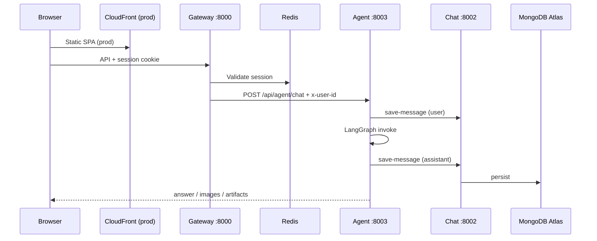
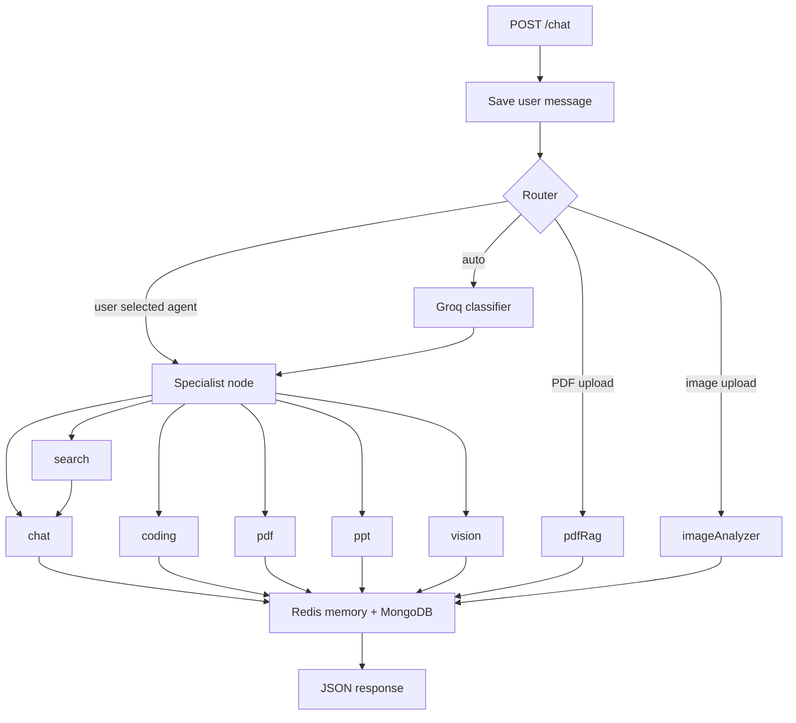
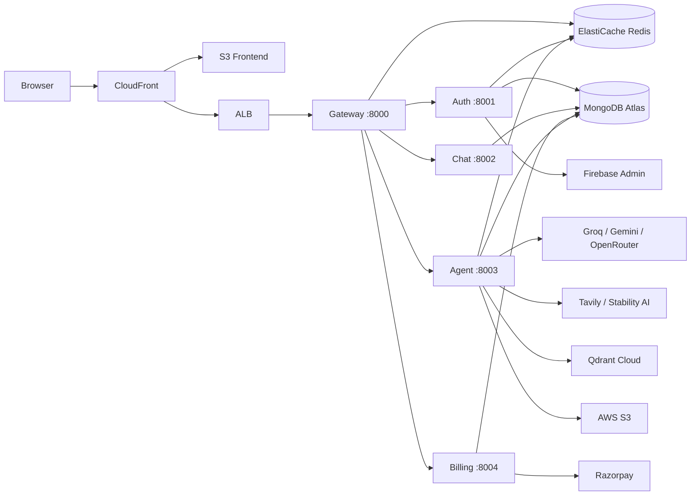

<div align="center">

# 🧠 NovaMind AI

### Full-Stack Multi-Agent AI Platform

**LangGraph · React · Node.js · AWS ECS Fargate · GitHub Actions CI/CD**

[](https://d8au5xi32kvkz.cloudfront.net)
[](https://nodejs.org)
[](https://react.dev)
[](https://aws.amazon.com)
[](https://langchain-ai.github.io/langgraphjs/)
[](https://github.com/aamir490/Use-Case-24-NovaMind-AI-LangGraph-Multi-Agent-AWS-Platform/actions)

</div>

---

> A credit-based multi-agent AI workspace where users can chat, search the web, generate code, create PDFs and PowerPoints, generate images, analyze uploaded images, and ask questions over uploaded PDFs — all behind one Google-authenticated interface with conversation history, billing, and an admin panel.

---

## 🚀 Live Demo

🌐 **[https://d8au5xi32kvkz.cloudfront.net](https://d8au5xi32kvkz.cloudfront.net)**

- Sign in with Google
- Select an agent or let the AI router decide
- All conversations saved with history

---

## ✨ What Makes This Agentic

This is not a single LLM call. Every user message flows through a **LangGraph `StateGraph`** that:

1. **Routes intelligently** — an LLM classifier reads the prompt and decides which specialist to invoke
2. **Executes specialized pipelines** — each agent has its own tools, prompts, and post-processing
3. **Chains nodes** — the `search → chat` chain retrieves Tavily results before generating an answer
4. **Maintains state** — shared graph state carries prompt, file, results, artifacts, and response across nodes
5. **Persists memory** — Redis (last 20 turns) + MongoDB (full history)

| Agent | Trigger | Tools Used |
|-------|---------|-----------|
| 🗨️ **Chat** | General conversation, Q&A | Groq LLM |
| 🔍 **Search** | Current events, latest news | Tavily API → Groq synthesis |
| 💻 **Coding** | Code generation, debugging | DeepSeek via OpenRouter |
| 📄 **PDF** | Generate document | Groq + PDFKit + S3 |
| 📊 **PPT** | Generate presentation | Groq + PptxGenJS + S3 |
| 🎨 **Vision** | Generate image | Groq prompt refinement + Stability AI |
| 📚 **PDF RAG** | Q&A over uploaded PDF | pdf-parse + Gemini embeddings + Qdrant |
| 🖼️ **Image Analyzer** | Analyze uploaded image | Gemini Vision multimodal |

---

## 📸 Screenshots

### 1. Login & Authentication

| Login Page | Google Authentication |
|---|---|
|  |  |

---

### 2. Dashboard & Chat Interface

| Dashboard Overview | Chat — General AI |
|---|---|
|  |  |

| Chat — Coding Agent | Chat — Search Agent |
|---|---|
|  |  |

| Chat — Image Generation | Chat — PDF/PPT Generation |
|---|---|
|  |  |

| Dashboard — Full View | Conversation History |
|---|---|
|  |  |

---

### 3. PDF RAG (Document Q&A)

| Upload PDF & Ask Questions | Follow-up Questions |
|---|---|
|  |  |

---

### 4. Admin Panel

| Admin Dashboard — Stats | Admin — Users Management |
|---|---|
|  |  |

| Admin — Payments | Admin — All Users |
|---|---|
|  |  |

| Admin — Full Overview |
|---|
|  |

---

### 5. CI/CD — GitHub Actions Pipeline

| Pipeline Triggered | Jobs Running | Deployment Complete |
|---|---|---|
|  |  |  |

---

### 6. AWS Infrastructure

| ECR — Container Registry | ECS — Fargate Services |
|---|---|
|  |  |

| ElastiCache Redis | S3 Buckets |
|---|---|
|  |  |

| CloudFront CDN | IAM Roles |
|---|---|
|  |  |

| CloudWatch Logs |
|---|
|  |

---

## 🏗️ Architecture

### AWS Cloud Architecture Diagram


**What this diagram shows:**

- **6 layers** — Client, AWS Infrastructure, Application/API, AI/Agent, Data & RAG, Security & Monitoring
- **Client Layer** — React 19 + Vite SPA served via CloudFront CDN; Firebase Auth SDK for Google sign-in
- **AWS Infrastructure** — VPC with public/private subnets; ALB for HTTPS termination; NAT Gateway for outbound API calls
- **Application Layer** — 5 ECS Fargate microservices (Gateway :8000, Auth :8001, Chat :8002, Agent :8003, Billing :8004) connected via AWS Cloud Map internal DNS (`novamind.local`)
- **AI/Agent Layer** — LangGraph `StateGraph` with a router node and 8 specialist nodes; Groq, Gemini, OpenRouter/DeepSeek, Stability AI, Tavily, Qdrant for inference and tools
- **Data Layer** — ElastiCache Redis (sessions + agent memory), S3 (artifacts), MongoDB Atlas (external), Qdrant Cloud (vectors)
- **Security & Monitoring** — Secrets Manager (API keys injected at ECS startup), IAM task roles, CloudWatch Logs, ECR (5 Docker images)
- **CI/CD** — GitHub Actions on `main` push: build → ECR push → ECS force redeploy → S3 sync → CloudFront invalidation

### Application Flow



### Agent Routing Graph



**Router priority:** (1) explicit agent from UI, (2) PDF MIME → `pdfRag`, (3) image MIME → `imageAnalyzer`, (4) Groq LLM classifier.

### Services & Infrastructure



---

## 🛠️ Technology Stack

| Layer | Technologies |
|-------|-------------|
| **Frontend** | React 19, Vite 8, React Router 7, Redux Toolkit, Tailwind CSS 4, Axios, Monaco Editor, React Markdown |
| **Backend** | Node.js 22 (ES Modules), Express 5, Mongoose 9, ioredis, Multer, Morgan |
| **AI / Agents** | LangGraph, LangChain, Groq, Google Gemini, OpenRouter (DeepSeek), Tavily, Stability AI, Qdrant |
| **Auth** | Firebase Auth (client) + Firebase Admin (server) + Redis sessions |
| **Documents** | pdf-parse, PDFKit, PptxGenJS |
| **Storage** | AWS S3 (artifacts), MongoDB Atlas (data), Qdrant Cloud (vectors), Redis (sessions + memory) |
| **Infrastructure** | AWS ECS Fargate, ECR, ElastiCache, ALB, CloudFront, S3, Secrets Manager, Cloud Map, IAM, CloudWatch |
| **CI/CD** | GitHub Actions — build 5 Docker images → push ECR → redeploy ECS → build frontend → S3 sync → CloudFront invalidation |

---

## ☁️ AWS Architecture

| Service | Role |
|---------|------|
| **ECS Fargate** | Runs all 5 backend services as containers (no EC2 management) |
| **ECR** | Private Docker image registry — stores 5 service images |
| **ALB** | Public HTTPS entry point to the gateway service |
| **CloudFront + S3** | Serves the React SPA globally over HTTPS |
| **ElastiCache Redis** | Managed Redis for sessions, agent memory, rate limits |
| **Cloud Map** | Internal DNS — `novamind-auth.novamind.local:8001` between services |
| **Secrets Manager** | Stores all API keys, MongoDB URIs, Firebase JSON |
| **IAM** | Task execution role (ECR + CloudWatch) + agent task role (S3 access) |
| **CloudWatch Logs** | Container logs from all 5 ECS services |

---

## 🔄 CI/CD Pipeline

Every push to `main` automatically:

```
git push origin main
         │
         ▼
  GitHub Actions triggers
         │
         ▼
  Job 1: deploy-backend
  ├── Login to ECR
  ├── Build 5 Docker images
  ├── Push to ECR
  └── Force redeploy all 5 ECS services
         │
         ▼
  Job 2: deploy-frontend
  ├── npm run build (with VITE_* secrets baked in)
  ├── aws s3 sync → novamind-frontend-prod
  └── CloudFront cache invalidation
```

**16 GitHub Secrets** configured for AWS credentials, ECS service names, S3 bucket, CloudFront ID, and Vite build variables.

---

## 🔑 Key Features

- 🔐 **Google sign-in** via Firebase — 7-day HTTP-only Redis sessions
- 🤖 **8 AI agents** with automatic LLM-based routing
- 🔍 **Web search** — Tavily results grounded in real-time data
- 💻 **Code generation** — DeepSeek via OpenRouter with Monaco editor output
- 📄 **PDF generation** — structured content via PDFKit, uploaded to S3
- 📊 **PPT generation** — full presentations via PptxGenJS, uploaded to S3
- 🎨 **Image generation** — Stability AI `stable-image/generate/core`
- 📚 **PDF RAG** — upload any PDF, ask questions, get context-grounded answers
- 🖼️ **Image analysis** — upload any image, Gemini Vision analyzes it
- 💳 **Razorpay billing** — credit-based plans with HMAC-verified payments
- 👑 **Admin panel** — user management, payment history, platform stats
- 🎙️ **Speech-to-text** — browser Web Speech API for voice input
- 📁 **File attachments** — PDF and image uploads up to 20MB

---

## 📦 Services & Ports

| Service | Port | Responsibility |
|---------|------|---------------|
| API Gateway | 8000 | Single entry point, CORS, session auth, reverse proxy |
| Auth Service | 8001 | Firebase verification, sessions, credits, admin APIs |
| Chat Service | 8002 | Conversation and message persistence |
| Agent Service | 8003 | LangGraph orchestration, all 8 AI agents |
| Billing Service | 8004 | Razorpay payment processing |

---

## 💰 Credit Plans

| Plan | Credits | Price |
|------|---------|-------|
| Free | 100 | ₹0 |
| Starter | 500 | ₹199 |
| Pro | 1000 | ₹499 |

**Credit costs per agent:** Chat 1 · Search 5 · Coding / PDF / PPT / Vision 10

**Rate limits:** Chat 20 req/min · All others 5 req/min per user

---

## 🚀 Local Development

### Prerequisites

- Node.js 22+
- Docker Desktop (for Redis)
- Firebase service account JSON
- API keys: MongoDB Atlas, Groq, Google AI, OpenRouter, Tavily, Qdrant, Stability AI, Razorpay, AWS S3

### Quick Start

```bash
# 1. Start Redis
cd backend && docker compose up -d

# 2. Start all backend services (5 separate terminals)
cd backend/services/auth    && npm install && npm run dev   # :8001
cd backend/services/chat    && npm install && npm run dev   # :8002
cd backend/services/agent   && npm install && npm run dev   # :8003
cd backend/services/billing && npm install && npm run dev   # :8004
cd backend/gateway          && npm install && npm run dev   # :8000

# 3. Start frontend
cd frontend && npm install && npm run dev                   # :5173
```

Open **http://localhost:5173**

### Environment Files

Copy `.env.example` → `.env` in each service folder. Key variables:

| Service | Critical Variables |
|---------|--------------------|
| `gateway` | `FRONTEND_URL`, `REDIS_URL`, `AUTH_SERVICE`, `CHAT_SERVICE`, `AGENT_SERVICE`, `BILLING_SERVICE` |
| `auth` | `MONGODB_URI`, `REDIS_URL`, `ADMIN_EMAIL`, Firebase credentials |
| `agent` | `GROQ_API_KEY`, `GOOGLE_API_KEY`, `OPENROUTER_API_KEY`, `TAVILY_API_KEY`, `STABILITY_API_KEY`, `AWS_*`, `QDRANT_*` |
| `billing` | `RAZORPAY_KEY_ID`, `RAZORPAY_KEY_SECRET` |
| `frontend` | `VITE_SERVER_URL`, `VITE_FIREBASE_API_KEY`, `VITE_RAZORPAY_KEY_ID` |

---

## 🏭 Production Deployment

1. Provision AWS infrastructure per [`deploy-guide-aws-original.md`](deploy-guide-aws-original.md)
2. Register ECS task definitions from `task-defs/*.json`
3. Add all 16 GitHub Secrets to the repository
4. Push to `main` — GitHub Actions handles everything automatically

---

## 📁 Project Structure

```
1.cortexAI/
├── frontend/                    # React 19 + Vite SPA
├── backend/
│   ├── gateway/                 # API gateway — auth, proxy, CORS
│   ├── shared/redis/            # Shared ioredis client
│   ├── docker-compose.yml       # Local Redis only
│   └── services/
│       ├── auth/                # Firebase, sessions, credits, admin
│       ├── chat/                # Conversations & messages (MongoDB)
│       ├── agent/               # LangGraph agents, S3, AI tools
│       │   ├── agents/          # 8 agent files
│       │   ├── graph/           # LangGraph state, router, graph
│       │   └── config/          # LLM models, S3, Qdrant, Redis
│       └── billing/             # Razorpay payments
├── task-defs/                   # ECS Fargate task definitions (5)
├── .github/workflows/           # GitHub Actions CI/CD pipeline
├── new-project-pic/             # Portfolio screenshots
├── architecture.md              # Deep technical architecture
├── interview.md                 # Interview preparation guide
├── deploy-guide-aws-original.md # Complete AWS deployment guide
└── steps_to_do_deploy_localhost.md
```

---

## 📚 Documentation

| Document | Purpose |
|----------|---------|
| [architecture.md](architecture.md) | Components, flows, AWS mapping, known gaps |
| [interview.md](interview.md) | 4–5 min pitch, Q&A, system design, behavioral questions |
| [deploy-guide-aws-original.md](deploy-guide-aws-original.md) | Complete AWS provisioning + CI/CD setup |
| [steps_to_do_deploy_localhost.md](steps_to_do_deploy_localhost.md) | Local development runbook |

---

## 👤 Author

**Aamir Imran**

[](https://github.com/aamir490)

---

<div align="center">

Built with ❤️ using LangGraph, React, Node.js, and AWS

</div>
