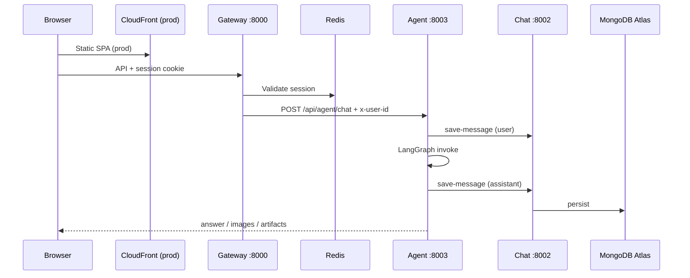
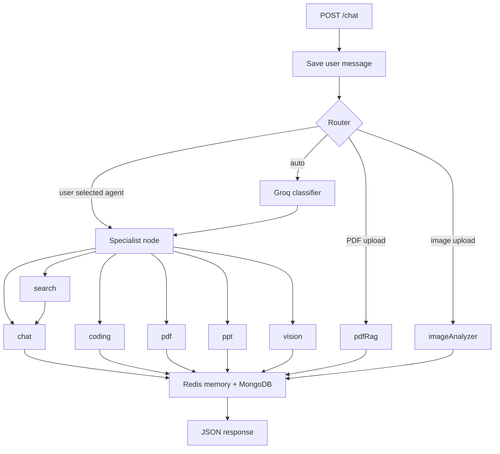
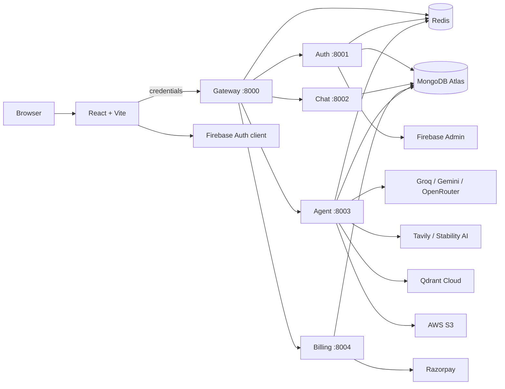

# NovaMind AI

> Full-stack, credit-based multi-agent AI workspace with Google sign-in, conversation history, Razorpay billing, generated artifacts, and AWS-oriented container deployment.

NovaMind AI (backend prompts also use **CortexAI**) gives authenticated users one interface for general chat, web research, coding help, PDF/PPT generation, image generation, PDF question answering (RAG), and image analysis. The stack is a React/Vite SPA and five Node.js/Express microservices behind an API gateway. The **agent service** orchestrates workflows with **LangGraph**—deterministic routing into specialised nodes, not open-ended autonomous planning.

## Product snapshots

| Dashboard | Admin panel | PDF RAG |
| --- | --- | --- |
|  |  |  |

| RAG (follow-up) | CI/CD (GitHub Actions) |
| --- | --- |
|  |  ·  ·  |

## Business problem

Teams and individuals juggle separate tools for chat, live web research, document Q&A, code generation, visuals, and slide decks. Context is lost between apps, usage is hard to meter, and there is no single authenticated history of work.

## Solution

NovaMind AI unifies those workflows behind one Google-authenticated workspace:

- **One chat UI** with explicit agent selection or automatic routing.
- **Durable history** in MongoDB (conversations, messages, artifacts, images).
- **Short-term context** in Redis for the agent (last 20 turns per conversation).
- **Credits and rate limits** so usage stays bounded.
- **Razorpay** checkout to add plan credits.
- **Admin APIs and UI** for users, payments, and platform stats.

## Agentic AI capabilities (what is actually implemented)

| Capability | Implementation |
| --- | --- |
| Workflow routing | LangGraph `StateGraph` with a router node and eight specialist nodes |
| Tool use | Tavily search, Stability AI image API, Qdrant vector search, S3 upload, PDFKit/PptxGenJS |
| LLM providers | Groq (chat, router, search synthesis, prompt refinement), Gemini (embeddings, multimodal image analysis), OpenRouter/DeepSeek (coding) |
| Multi-step flow | `search → chat` (retrieve then synthesise) |
| State | Shared graph state: prompt, agent, file, search results, artifacts, images, response |
| Memory | Redis cache of recent messages; MongoDB via chat service for durability |

**Not implemented** (do not claim in interviews or docs): autonomous planning loops, tool retry/reflection, human-in-the-loop approval, background job workers, SSE/token streaming, multi-agent debate, or AWS Bedrock (SDK is listed in `package.json` but unused in source).

## End-to-end application flow



## Agent workflow



**Router priority:** (1) non-`auto` client selection, (2) PDF MIME → `pdfRag`, (3) image MIME → `imageAnalyzer`, (4) Groq classifier among chat/search/coding/pdf/ppt/vision.

## Architecture overview



Deep dive: [architecture.md](architecture.md) · Interview prep: [interview.md](interview.md)

## Features

- Google sign-in (Firebase client + Admin verification) and **7-day HTTP-only Redis sessions**
- Single gateway: CORS, cookies, session guard, reverse proxy, `x-user-id` injection
- Conversations and messages with optional **images** and **code project artifacts** (Monaco viewer)
- Eight LangGraph nodes: chat, search, coding, pdf, ppt, vision, pdfRag, imageAnalyzer
- Per-agent **Redis rate limits** and **credit deduction** via auth service
- Razorpay order + HMAC verification; plan/credit update on auth service
- Admin dashboard: stats, users, payments (auth service reads auth/chat/billing DBs)
- Speech-to-text input (browser Web Speech API), file attach (PDF/images, 20 MB)
- S3 presigned URLs for generated PDF, PPTX, and PNG outputs

## Technology stack

| Layer | Technologies (from repo) |
| --- | --- |
| Frontend | React 19, Vite 8, React Router 7, Redux Toolkit, Tailwind 4, Axios, Firebase 12, Monaco Editor, React Markdown |
| Backend | Node.js ES modules, Express 5, Mongoose 9, ioredis, Multer, Morgan |
| Agents | LangGraph, LangChain (Groq, Google GenAI, OpenRouter, Tavily, Qdrant) |
| Documents | pdf-parse, PDFKit, PptxGenJS |
| AWS SDK | S3 client + presigner (agent service) |
| Containers | Five `node:22-alpine` Dockerfiles; Compose for local Redis only |
| CI/CD | GitHub Actions: ECR push, ECS force deploy, S3 sync, CloudFront invalidation |

## AWS services (target deployment)

Evidence: `task-defs/*.json`, `.github/workflows/deploy.yml`, and `deploy-guide-aws-original.md`. **`deploy-guide-aws.md` is gitignored** (local/operational copy); the checked-in guide is `deploy-guide-aws-original.md`. Live AWS health is **not** proven by the repository alone.

| Service | Role in this project |
| --- | --- |
| **ECS Fargate** | Runs gateway, auth, chat, agent, billing tasks (`awsvpc`) |
| **ECR** | Stores five service images |
| **Cloud Map** | Internal DNS e.g. `http://novamind-auth.novamind.local:8001` |
| **ElastiCache Redis** | Sessions (gateway/auth), agent memory, rate limits |
| **ALB** | Public HTTPS entry to gateway (described in guide; not in IaC) |
| **CloudFront + S3** | Static Vite build; API origin separate via ALB |
| **Secrets Manager** | MongoDB URIs, API keys, Firebase JSON (partial adoption) |
| **IAM** | ECS execution role; task roles for agent (S3) and auth |
| **CloudWatch Logs** | Per-service `awslogs` groups in task definitions |

**Not in repo:** Terraform/CDK/CloudFormation, VPC/subnet/ALB/ACM definitions, autoscaling policies, X-Ray, alarms/dashboards.

## API surface (via gateway)

| Service | Port | Gateway prefix | Notes |
| --- | ---: | --- | --- |
| Gateway | 8000 | `/api/*`, `/api/me` | Session `protect` on admin, chat, agent, billing, me |
| Auth | 8001 | `/api/auth/*`, `/api/admin/*` | `/api/auth` is **not** gateway-protected (includes internal mutation routes—see security) |
| Chat | 8002 | `/api/chat/*` | CRUD-style conversation/message APIs |
| Agent | 8003 | `/api/agent/chat` | Multipart: prompt, conversationId, agent, optional file |
| Billing | 8004 | `/api/billing/create`, `/api/billing/verify` | Razorpay |

## Security

| Control | Status |
| --- | --- |
| Session cookie | `httpOnly`; `secure` + `SameSite=None` in production |
| Gateway auth | Redis lookup before protected routes |
| Admin | Server-side `ADMIN_EMAIL` match on auth service |
| Internal user identity | `x-user-id` header from gateway (trust boundary at gateway) |
| Secrets in git | **Risk:** plaintext credentials appear in some task definitions; rotate and use Secrets Manager only |
| Chat authorisation | **Gap:** message/conversation endpoints do not verify `userId` ownership |
| Auth mutations | **Gap:** `/deduct-credits` and `/update-plan` reachable on unauthenticated `/api/auth` proxy path |

## Data and storage

- **MongoDB Atlas:** separate URIs per service (auth users; chat conversations/messages; billing payments). Admin uses `CHAT_MONGODB_URI` and `BILLING_MONGODB_URI` for reporting.
- **Redis:** gateway + auth (sessions); agent (memory + rate limits). Chat and billing do **not** use Redis in code.
- **Qdrant Cloud:** ephemeral collection per PDF upload (`pdf-{timestamp}`); no cleanup in code.
- **S3:** agent uploads generated artifacts; returns presigned GET URLs (default helper 600s; PDF/PPT agents pass longer values—user-facing copy sometimes says “10 minutes” incorrectly).
- **Uploads:** PDF/image land in agent container `./temp` and are deleted after processing; not stored in S3.

## Local development

### Prerequisites

- Node.js 18+ (Dockerfiles use Node 22)
- Docker Desktop for Redis
- Firebase service account JSON for auth (or `FIREBASE_SERVICE_ACCOUNT` JSON string)
- External accounts: MongoDB Atlas, Groq, Google AI, OpenRouter, Tavily, Qdrant, Razorpay, AWS S3, Stability AI—as needed for features you test

### Environment files

Copy each service’s `.env.example` to `.env` (examples exist under `frontend/`, `backend/gateway/`, and each service in `backend/services/*/`).

| Location | Key variables |
| --- | --- |
| `backend/gateway/.env` | `PORT`, `FRONTEND_URL`, `REDIS_URL`, `AUTH_SERVICE`, `CHAT_SERVICE`, `AGENT_SERVICE`, `BILLING_SERVICE` |
| `backend/services/auth/.env` | `PORT`, `MONGODB_URI`, `REDIS_URL`, `ADMIN_EMAIL`, `BILLING_MONGODB_URI`, `CHAT_MONGODB_URI`, Firebase |
| `backend/services/chat/.env` | `PORT`, `MONGODB_URI` |
| `backend/services/agent/.env` | `PORT`, `MONGODB_URI`, `REDIS_URL`, `AUTH_SERVICE`, `CHAT_SERVICE`, provider keys, `QDRANT_*`, `AWS_*`, `STABILITY_API_KEY` |
| `backend/services/billing/.env` | `PORT`, `MONGODB_URI`, `AUTH_SERVICE`, Razorpay keys |
| `frontend/.env` | `VITE_FIREBASE_API_KEY`, `VITE_SERVER_URL`, `VITE_RAZORPAY_KEY_ID`, `VITE_ADMIN_EMAIL` |

Never commit real secrets. Rotate anything ever checked into task definitions or notes.

### Start the stack

```bash
# Terminal 1 — Redis
cd backend && docker compose up -d

# Terminals 2–6 — services
cd backend/services/auth && npm install && npm run dev
cd backend/services/chat && npm install && npm run dev
cd backend/services/agent && npm install && npm run dev
cd backend/services/billing && npm install && npm run dev
cd backend/gateway && npm install && npm run dev

# Terminal 7 — frontend
cd frontend && npm install && npm run dev
```

Open `http://localhost:5173`. Detailed steps: [steps_to_do_deploy_localhost.md](steps_to_do_deploy_localhost.md).

## Production deployment

1. Provision AWS resources per `deploy-guide-aws-original.md` (VPC, ElastiCache, ECR, ECS cluster/services, Cloud Map namespace `novamind.local`, ALB, S3 buckets, CloudFront, Secrets Manager, IAM).
2. Register/update ECS task definitions from `task-defs/*.json` (replace any plaintext secrets with Secrets Manager references only).
3. Configure GitHub repository secrets for AWS and `VITE_*` build args (see workflow).
4. Push to `main` → workflow **cortex ai deployment** builds five images, pushes to ECR, forces ECS redeployments, builds frontend, syncs to S3, invalidates CloudFront.

**Build-time note:** Vite embeds `VITE_SERVER_URL` at compile time—it must point to the public gateway URL (typically ALB DNS or custom domain), not CloudFront.

## Testing and monitoring

- **Tests:** `backend/package.json` script is a placeholder; no automated test suite in the repo.
- **Logging:** Morgan (`dev`) on gateway; `console.log` elsewhere; ECS tasks configured for CloudWatch Logs.
- **Monitoring:** No application metrics, tracing, or alarms in code—operational visibility is primarily container logs.

## Project structure

```text
1.cortexAI/
├── frontend/                 # React SPA (Vite)
├── backend/
│   ├── gateway/              # API gateway
│   ├── shared/redis/         # Shared ioredis client
│   ├── docker-compose.yml    # Local Redis only
│   └── services/
│       ├── auth/             # Firebase, sessions, credits, admin
│       ├── chat/             # Conversations & messages
│       ├── agent/            # LangGraph, tools, S3 artifacts
│       └── billing/          # Razorpay
├── task-defs/                # ECS Fargate task definitions
├── .github/workflows/        # deploy.yml
├── new-project-pic/          # README / portfolio screenshots
├── architecture.md           # Technical architecture
├── interview.md              # Interview preparation
├── deploy-guide-aws-original.md
└── steps_to_do_deploy_localhost.md
```

`archive-files/` is excluded from project documentation and analysis.

## Documentation map

| Document | Purpose |
| --- | --- |
| [architecture.md](architecture.md) | Components, flows, AWS mapping, gaps |
| [interview.md](interview.md) | Story, 4–5 min pitch, Q&A |
| [deploy-guide-aws-original.md](deploy-guide-aws-original.md) | Manual AWS provisioning and CI/CD |
| [steps_to_do_deploy_localhost.md](steps_to_do_deploy_localhost.md) | Local runbook |

## License and attribution

Built by Aamir Imran — see login screen and [GitHub](https://github.com/aamir490).
