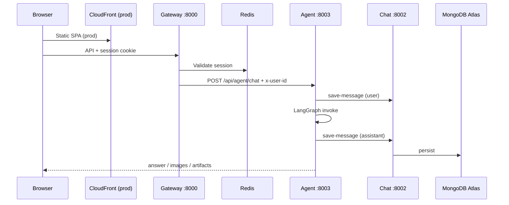
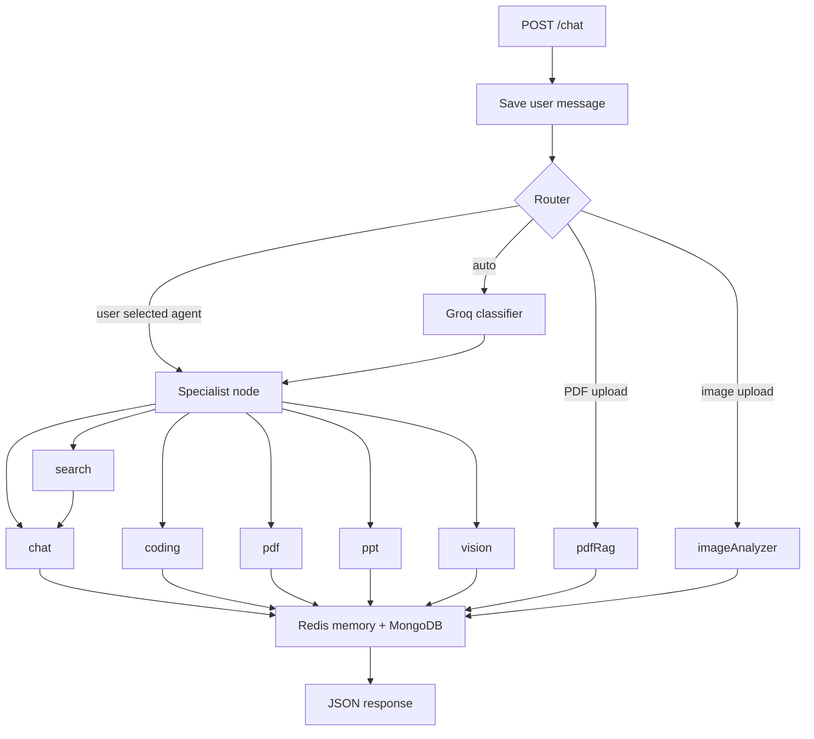
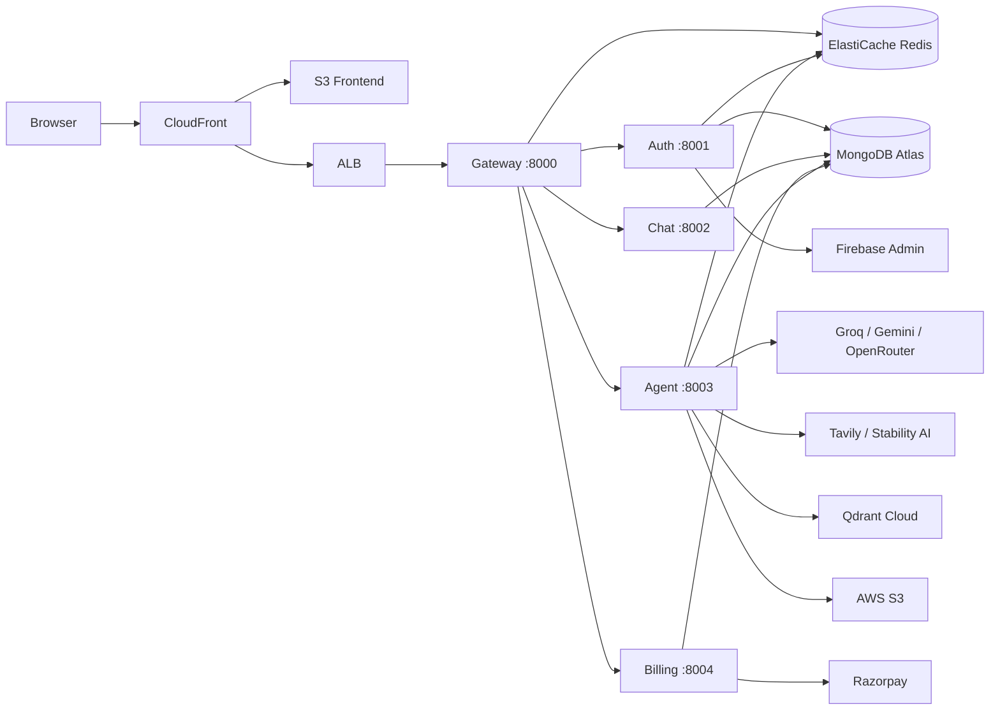

<div align="center">

# 🧠 NovaMind AI

### Full-Stack Multi-Agent AI Platform

**LangGraph · React · Node.js · AWS ECS Fargate · GitHub Actions CI/CD**

[](https://d8au5xi32kvkz.cloudfront.net)
[](https://nodejs.org)
[](https://react.dev)
[](https://aws.amazon.com)
[](https://langchain-ai.github.io/langgraphjs/)
[](https://github.com/aamir490/Use-Case-24-NovaMind-AI-LangGraph-Multi-Agent-AWS-Platform/actions)

</div>

---

> A credit-based multi-agent AI workspace where users can chat, search the web, generate code, create PDFs and PowerPoints, generate images, analyze uploaded images, and ask questions over uploaded PDFs — all behind one Google-authenticated interface with conversation history, billing, and an admin panel.

---

## 🚀 Live Demo

🌐 **[https://d8au5xi32kvkz.cloudfront.net](https://d8au5xi32kvkz.cloudfront.net)**

- Sign in with Google
- Select an agent or let the AI router decide
- All conversations saved with history

---

## 🏗️ Architecture

### AWS Cloud Architecture Diagram


**What this diagram shows:**

- **6 layers** — Client, AWS Infrastructure, Application/API, AI/Agent, Data & RAG, Security & Monitoring
- **Client Layer** — React 19 + Vite SPA served via CloudFront CDN; Firebase Auth SDK for Google sign-in
- **AWS Infrastructure** — VPC with public/private subnets; ALB for HTTPS termination; NAT Gateway for outbound API calls
- **Application Layer** — 5 ECS Fargate microservices (Gateway :8000, Auth :8001, Chat :8002, Agent :8003, Billing :8004) connected via AWS Cloud Map internal DNS (`novamind.local`)
- **AI/Agent Layer** — LangGraph `StateGraph` with a router node and 8 specialist nodes; Groq, Gemini, OpenRouter/DeepSeek, Stability AI, Tavily, Qdrant for inference and tools
- **Data Layer** — ElastiCache Redis (sessions + agent memory), S3 (artifacts), MongoDB Atlas (external), Qdrant Cloud (vectors)
- **Security & Monitoring** — Secrets Manager (API keys injected at ECS startup), IAM task roles, CloudWatch Logs, ECR (5 Docker images)
- **CI/CD** — GitHub Actions on `main` push: build → ECR push → ECS force redeploy → S3 sync → CloudFront invalidation

---

## ✨ What Makes This Agentic

This is not a single LLM call. Every user message flows through a **LangGraph `StateGraph`** that:

1. **Routes intelligently** — an LLM classifier reads the prompt and decides which specialist to invoke
2. **Executes specialized pipelines** — each agent has its own tools, prompts, and post-processing
3. **Chains nodes** — the `search → chat` chain retrieves Tavily results before generating an answer
4. **Maintains state** — shared graph state carries prompt, file, results, artifacts, and response across nodes
5. **Persists memory** — Redis (last 20 turns) + MongoDB (full history)

| Agent | Trigger | Tools Used |
|-------|---------|-----------|
| 🗨️ **Chat** | General conversation, Q&A | Groq LLM |
| 🔍 **Search** | Current events, latest news | Tavily API → Groq synthesis |
| 💻 **Coding** | Code generation, debugging | DeepSeek via OpenRouter |
| 📄 **PDF** | Generate document | Groq + PDFKit + S3 |
| 📊 **PPT** | Generate presentation | Groq + PptxGenJS + S3 |
| 🎨 **Vision** | Generate image | Groq prompt refinement + Stability AI |
| 📚 **PDF RAG** | Q&A over uploaded PDF | pdf-parse + Gemini embeddings + Qdrant |
| 🖼️ **Image Analyzer** | Analyze uploaded image | Gemini Vision multimodal |

---

## 📸 Screenshots

### 1. Login & Authentication

| Login Page | Google Authentication |
|---|---|
|  |  |

---

### 2. Dashboard & Chat Interface

| Dashboard Overview | Chat — General AI |
|---|---|
|  |  |

| Chat — Coding Agent | Chat — Search Agent |
|---|---|
|  |  |

| Chat — Image Generation | Chat — PDF/PPT Generation |
|---|---|
|  |  |

| Dashboard — Full View | Conversation History |
|---|---|
|  |  |

---

### 3. PDF RAG (Document Q&A)

| Upload PDF & Ask Questions | Follow-up Questions |
|---|---|
|  |  |

---

### 4. Admin Panel

| Admin Dashboard — Stats | Admin — Users Management |
|---|---|
|  |  |

| Admin — Payments | Admin — All Users |
|---|---|
|  |  |

| Admin — Full Overview |
|---|
|  |

---

### 5. CI/CD — GitHub Actions Pipeline

| Pipeline Triggered | Jobs Running | Deployment Complete |
|---|---|---|
|  |  |  |

---

### 6. AWS Infrastructure

| ECR — Container Registry | ECS — Fargate Services |
|---|---|
|  |  |

| ElastiCache Redis | S3 Buckets |
|---|---|
|  |  |

| CloudFront CDN | IAM Roles |
|---|---|
|  |  |

| CloudWatch Logs |
|---|
|  |

---

## 🏗️ Architecture Details

### Application Flow



### Agent Routing Graph



**Router priority:** (1) explicit agent from UI, (2) PDF MIME → `pdfRag`, (3) image MIME → `imageAnalyzer`, (4) Groq LLM classifier.

### Services & Infrastructure



---

## 🛠️ Technology Stack

| Layer | Technologies |
|-------|-------------|
| **Frontend** | React 19, Vite 8, React Router 7, Redux Toolkit, Tailwind CSS 4, Axios, Monaco Editor, React Markdown |
| **Backend** | Node.js 22 (ES Modules), Express 5, Mongoose 9, ioredis, Multer, Morgan |
| **AI / Agents** | LangGraph, LangChain, Groq, Google Gemini, OpenRouter (DeepSeek), Tavily, Stability AI, Qdrant |
| **Auth** | Firebase Auth (client) + Firebase Admin (server) + Redis sessions |
| **Documents** | pdf-parse, PDFKit, PptxGenJS |
| **Storage** | AWS S3 (artifacts), MongoDB Atlas (data), Qdrant Cloud (vectors), Redis (sessions + memory) |
| **Infrastructure** | AWS ECS Fargate, ECR, ElastiCache, ALB, CloudFront, S3, Secrets Manager, Cloud Map, IAM, CloudWatch |
| **CI/CD** | GitHub Actions — build 5 Docker images → push ECR → redeploy ECS → build frontend → S3 sync → CloudFront invalidation |

---

## ☁️ AWS Architecture

| Service | Role |
|---------|------|
| **ECS Fargate** | Runs all 5 backend services as containers (no EC2 management) |
| **ECR** | Private Docker image registry — stores 5 service images |
| **ALB** | Public HTTPS entry point to the gateway service |
| **CloudFront + S3** | Serves the React SPA globally over HTTPS |
| **ElastiCache Redis** | Managed Redis for sessions, agent memory, rate limits |
| **Cloud Map** | Internal DNS — `novamind-auth.novamind.local:8001` between services |
| **Secrets Manager** | Stores all API keys, MongoDB URIs, Firebase JSON |
| **IAM** | Task execution role (ECR + CloudWatch) + agent task role (S3 access) |
| **CloudWatch Logs** | Container logs from all 5 ECS services |

---

## 🔄 CI/CD Pipeline

Every push to `main` automatically:

```
git push origin main
         │
         ▼
  GitHub Actions triggers
         │
         ▼
  Job 1: deploy-backend
  ├── Login to ECR
  ├── Build 5 Docker images
  ├── Push to ECR
  └── Force redeploy all 5 ECS services
         │
         ▼
  Job 2: deploy-frontend
  ├── npm run build (with VITE_* secrets baked in)
  ├── aws s3 sync → novamind-frontend-prod
  └── CloudFront cache invalidation
```

**16 GitHub Secrets** configured for AWS credentials, ECS service names, S3 bucket, CloudFront ID, and Vite build variables.

---

## 🔑 Key Features

- 🔐 **Google sign-in** via Firebase — 7-day HTTP-only Redis sessions
- 🤖 **8 AI agents** with automatic LLM-based routing
- 🔍 **Web search** — Tavily results grounded in real-time data
- 💻 **Code generation** — DeepSeek via OpenRouter with Monaco editor output
- 📄 **PDF generation** — structured content via PDFKit, uploaded to S3
- 📊 **PPT generation** — full presentations via PptxGenJS, uploaded to S3
- 🎨 **Image generation** — Stability AI `stable-image/generate/core`
- 📚 **PDF RAG** — upload any PDF, ask questions, get context-grounded answers
- 🖼️ **Image analysis** — upload any image, Gemini Vision analyzes it
- 💳 **Razorpay billing** — credit-based plans with HMAC-verified payments
- 👑 **Admin panel** — user management, payment history, platform stats
- 🎙️ **Speech-to-text** — browser Web Speech API for voice input
- 📁 **File attachments** — PDF and image uploads up to 20MB

---

## 📦 Services & Ports

| Service | Port | Responsibility |
|---------|------|---------------|
| API Gateway | 8000 | Single entry point, CORS, session auth, reverse proxy |
| Auth Service | 8001 | Firebase verification, sessions, credits, admin APIs |
| Chat Service | 8002 | Conversation and message persistence |
| Agent Service | 8003 | LangGraph orchestration, all 8 AI agents |
| Billing Service | 8004 | Razorpay payment processing |

---

## 💰 Credit Plans

| Plan | Credits | Price |
|------|---------|-------|
| Free | 100 | ₹0 |
| Starter | 500 | ₹199 |
| Pro | 1000 | ₹499 |

**Credit costs per agent:** Chat 1 · Search 5 · Coding / PDF / PPT / Vision 10

**Rate limits:** Chat 20 req/min · All others 5 req/min per user

---

## 🚀 Local Development

### Prerequisites

- Node.js 22+
- Docker Desktop (for Redis)
- Firebase service account JSON
- API keys: MongoDB Atlas, Groq, Google AI, OpenRouter, Tavily, Qdrant, Stability AI, Razorpay, AWS S3

### Quick Start

```bash
# 1. Start Redis
cd backend && docker compose up -d

# 2. Start all backend services (5 separate terminals)
cd backend/services/auth    && npm install && npm run dev   # :8001
cd backend/services/chat    && npm install && npm run dev   # :8002
cd backend/services/agent   && npm install && npm run dev   # :8003
cd backend/services/billing && npm install && npm run dev   # :8004
cd backend/gateway          && npm install && npm run dev   # :8000

# 3. Start frontend
cd frontend && npm install && npm run dev                   # :5173
```

Open **http://localhost:5173**

### Environment Files

Copy `.env.example` → `.env` in each service folder. Key variables:

| Service | Critical Variables |
|---------|--------------------|
| `gateway` | `FRONTEND_URL`, `REDIS_URL`, `AUTH_SERVICE`, `CHAT_SERVICE`, `AGENT_SERVICE`, `BILLING_SERVICE` |
| `auth` | `MONGODB_URI`, `REDIS_URL`, `ADMIN_EMAIL`, Firebase credentials |
| `agent` | `GROQ_API_KEY`, `GOOGLE_API_KEY`, `OPENROUTER_API_KEY`, `TAVILY_API_KEY`, `STABILITY_API_KEY`, `AWS_*`, `QDRANT_*` |
| `billing` | `RAZORPAY_KEY_ID`, `RAZORPAY_KEY_SECRET` |
| `frontend` | `VITE_SERVER_URL`, `VITE_FIREBASE_API_KEY`, `VITE_RAZORPAY_KEY_ID` |

---

## 🏭 Production Deployment

1. Provision AWS infrastructure per [`deploy-guide-aws-original.md`](deploy-guide-aws-original.md)
2. Register ECS task definitions from `task-defs/*.json`
3. Add all 16 GitHub Secrets to the repository
4. Push to `main` — GitHub Actions handles everything automatically

---

## 📁 Project Structure

```
1.cortexAI/
├── frontend/                    # React 19 + Vite SPA
├── backend/
│   ├── gateway/                 # API gateway — auth, proxy, CORS
│   ├── shared/redis/            # Shared ioredis client
│   ├── docker-compose.yml       # Local Redis only
│   └── services/
│       ├── auth/                # Firebase, sessions, credits, admin
│       ├── chat/                # Conversations & messages (MongoDB)
│       ├── agent/               # LangGraph agents, S3, AI tools
│       │   ├── agents/          # 8 agent files
│       │   ├── graph/           # LangGraph state, router, graph
│       │   └── config/          # LLM models, S3, Qdrant, Redis
│       └── billing/             # Razorpay payments
├── task-defs/                   # ECS Fargate task definitions (5)
├── .github/workflows/           # GitHub Actions CI/CD pipeline
├── new-project-pic/             # Portfolio screenshots
├── architecture.md              # Deep technical architecture
├── interview.md                 # Interview preparation guide
├── deploy-guide-aws-original.md # Complete AWS deployment guide
└── steps_to_do_deploy_localhost.md
```

---

## 📚 Documentation

| Document | Purpose |
|----------|---------|
| [architecture.md](architecture.md) | Components, flows, AWS mapping, known gaps |
| [interview.md](interview.md) | 4–5 min pitch, Q&A, system design, behavioral questions |
| [deploy-guide-aws-original.md](deploy-guide-aws-original.md) | Complete AWS provisioning + CI/CD setup |
| [steps_to_do_deploy_localhost.md](steps_to_do_deploy_localhost.md) | Local development runbook |

---

---

## 🛠️ Complete Technology Reference

> **NovaMind CortexAI** — Built by Aamir · AWS Generative AI Engineer
>
> Every entry below is verified from the actual source files, `package.json` dependencies, Dockerfiles, ECS task definitions, and CI/CD pipeline. Nothing is assumed.

---

### Programming Languages

| Language | Where Used |
|----------|-----------|
| **JavaScript (Node.js 22, ESM)** | All 5 backend services — gateway, auth, chat, agent, billing |
| **JavaScript (JSX / React)** | Frontend SPA |
| **YAML** | GitHub Actions CI/CD pipeline (`.github/workflows/deploy.yml`) |
| **JSON** | ECS task definitions (`task-defs/*.json`), package manifests |

---

### Frontend Technologies

| Technology | Version | Purpose |
|-----------|---------|---------|
| **React** | 19.2.7 | UI component framework |
| **Vite** | 8.1.0 | Build tool and dev server |
| **React Router DOM** | 7.18.4 | Client-side routing (`/`, `/admin`) |
| **Redux Toolkit** | 2.12.0 | Global state management |
| **react-redux** | 9.3.0 | React bindings for Redux |
| **Tailwind CSS** | 4.3.1 | Utility-first styling (via `@tailwindcss/vite` plugin) |
| **Axios** | 1.18.1 | HTTP client (`withCredentials: true` for cookies) |
| **Firebase** | 12.15.0 | Google Sign-In client SDK (Firebase Auth) |
| **@monaco-editor/react** | 4.7.0 | VS Code-style code editor for coding agent artifacts |
| **react-markdown** | 10.1.0 | Markdown rendering for AI responses |
| **remark-gfm** | 4.0.1 | GitHub Flavored Markdown support |
| **react-syntax-highlighter** | 16.1.1 | Code block syntax highlighting |
| **motion** | 12.42.2 | Animations (Framer Motion) |
| **lucide-react** | 1.22.0 | Icon set |
| **react-icons** | 5.6.0 | Additional icon set |
| **ESLint** | 10.5.0 | Frontend linting (dev) |

**Redux Store Shape:**
- `userSlice` — authenticated user profile, credits, plan
- `conversationSlice` — conversation list and active conversation
- `messageSlice` — messages for active conversation

---

### Backend Technologies

| Technology | Version | Purpose |
|-----------|---------|---------|
| **Node.js** | 22 (alpine) | Runtime for all 5 services |
| **Express.js** | 5.2.1 | HTTP framework for all services |
| **Mongoose** | 9.7.3–9.7.4 | MongoDB ODM (auth, chat, agent, billing) |
| **ioredis** | 5.11.1 | Redis client (shared across gateway, auth, agent) |
| **cookie-parser** | 1.4.7 | Cookie parsing on gateway |
| **cors** | 2.8.6 | CORS middleware — allows only `FRONTEND_URL` origin |
| **morgan** | 1.11.0 | HTTP request logging (gateway only) |
| **express-http-proxy** | 2.1.2 | Gateway reverse proxy to downstream services |
| **multer** | 2.2.0 | Multipart file upload — PDF/images, 20 MB limit, disk storage |
| **nodemon** | 3.1.14 | Dev auto-reload for all services |
| **dotenv** | 17.4.2 | Environment variable loading |

**Service ports:** Gateway :8000 · Auth :8001 · Chat :8002 · Agent :8003 · Billing :8004

---

### AI / GenAI Technologies

| Technology | Version / Model | Used By | Purpose |
|-----------|----------------|---------|---------|
| **LangGraph** | `@langchain/langgraph` 1.4.7 | Agent service | Stateful `StateGraph` orchestration — router + 8 specialist nodes |
| **LangChain Core** | `@langchain/core` 1.2.2 | Agent service | Base abstractions for LLM calls, messages, tools |
| **Groq** (`@langchain/groq`) | 1.3.1 · model: `openai/gpt-oss-120b` | Agent service | Chat, LLM routing, search synthesis, PDF/PPT JSON generation, vision prompt refinement |
| **Google Gemini** (`@langchain/google-genai`) | 2.2.0 · model: `gemini-2.0-flash` | Agent service | Multimodal image analysis (imageAnalyzer agent) |
| **Google Generative AI** (`@google/generative-ai`) | 0.24.1 | Agent service | Gemini embeddings (`gemini-embedding-001`) for PDF RAG |
| **OpenRouter / DeepSeek** (`@langchain/openrouter`) | 0.4.3 · model: `deepseek/deepseek-chat` | Agent service | Coding agent — code generation, debugging, review |
| **Stability AI** (REST API) | `v2beta/stable-image/generate/core` | Agent service | Text-to-image generation (vision agent), 1024×1024 PNG |
| **Tavily** (`@langchain/tavily`) | 1.2.0 | Agent service | Real-time web search (search agent, max 5 results + images) |
| **LangChain Text Splitters** (`@langchain/textsplitters`) | 1.0.1 | Agent service | Recursive character splitting for PDF RAG (1000 chars, 200 overlap) |

**LangGraph Agent Routing (priority order):**
1. Explicit agent selection from UI (if not `auto`)
2. PDF file upload → `pdfRag` node
3. Image file upload → `imageAnalyzer` node
4. Groq LLM classifier → `chat` · `search` · `coding` · `pdf` · `ppt` · `vision`

**Special graph edge:** `search` → `chat` (Tavily results injected into chat system prompt for grounded answers)

---

### RAG / Knowledge Retrieval

| Technology | Version | Purpose |
|-----------|---------|---------|
| **pdf-parse** | 2.4.5 | Extract raw text from uploaded PDF files |
| **@langchain/textsplitters** | 1.0.1 | Split PDF text into 1000-char chunks (200-char overlap) |
| **Google Gemini Embeddings** | `gemini-embedding-001` | Convert text chunks into vectors |
| **Qdrant Vector Store** (`@langchain/qdrant`) | 1.0.3 | Store and search vectors — one collection per PDF upload (`pdf-{timestamp}`) |
| **Groq LLM** | `gpt-oss-120b` | Answer questions using top-5 retrieved chunks as context |

**PDF RAG flow:** Upload PDF → `pdf-parse` → `RecursiveCharacterTextSplitter` → Gemini embeddings → Qdrant `similaritySearch(prompt, 5)` → Groq answers with context-only prompt → temp file deleted

---

### Databases

| Database | Technology | Version | Used By | Data Stored |
|----------|-----------|---------|---------|-------------|
| **MongoDB Atlas** | Mongoose | 9.7.3 | Auth, Chat, Agent, Billing | Users, conversations, messages, payments, credits |
| **Redis** (AWS ElastiCache) | ioredis | 5.11.1 | Gateway, Auth, Agent | Sessions (7-day TTL), conversation memory (last 20 msgs), rate limit counters |
| **Qdrant Cloud** | `@langchain/qdrant` | 1.0.3 | Agent (pdfRag) | PDF chunk embeddings — ephemeral per upload |

**MongoDB Models:**
- `User` (auth) — userId, email, name, photo, plan, credits, createdAt
- `Payment` (billing) — userId, plan, amount, orderId, status, timestamps
- `Conversation` (chat) — title, userId, timestamps
- `Message` (chat) — conversationId, role, content, images[], artifacts[], timestamps

**Redis Key Patterns:**
- `session-<uuid>` → JSON user profile (7-day TTL) — gateway session validation
- `user-session-<userId>` → sessionId (for session refresh after credit updates)
- `messages-<conversationId>` → list of last 20 messages (24-hr cache)
- `rate-<userId>-<agentType>` → request count (60-second TTL)

---

### Authentication

| Technology | Version | Purpose |
|-----------|---------|---------|
| **Firebase Auth** (client) | 12.15.0 | Google Sign-In in browser — returns Firebase ID token |
| **Firebase Admin SDK** | 13.10.0 | Server-side ID token verification (`verifyIdToken`) |
| **ioredis sessions** | 5.11.1 | HTTP-only cookie session (7-day TTL, `SameSite=None` in production) |
| **AWS Secrets Manager** | — | Stores `FIREBASE_SERVICE_ACCOUNT` JSON — injected into auth ECS task at startup |

**Auth flow:** Firebase client → Google popup → ID token → `POST /api/auth/login` → gateway (no protect) → auth service → `firebase-admin.verifyIdToken` → MongoDB upsert → Redis session → `httpOnly` cookie returned

---

### Document Generation

| Library | Version | Purpose |
|---------|---------|---------|
| **PDFKit** | 0.19.1 | Programmatic PDF generation — AI-structured JSON → formatted PDF report |
| **PptxGenJS** | 4.0.1 | Programmatic PPTX generation — AI-structured JSON → 6-slide presentation |
| **@aws-sdk/s3-request-presigner** | 3.1083.0 | Generate presigned S3 GET URLs for file downloads (24-hr expiry) |

---

### AWS Services Used

| AWS Service | Official Name | Purpose in NovaMind CortexAI |
|-------------|--------------|------------------------------|
| **ECS Fargate** | Amazon Elastic Container Service | Runs all 5 backend microservices as serverless containers — no EC2 management. Gateway: 0.5 vCPU/1 GB; Agent: 1 vCPU/2 GB |
| **ECR** | Amazon Elastic Container Registry | Private Docker image registry — one repo per service (gateway, auth-service, chat-service, agent-service, billing-service) |
| **S3** | Amazon Simple Storage Service | Two buckets: `novamind-frontend-prod` (React build static assets) + `cretexainovamind` (agent-generated PDFs, PPTs, images) |
| **CloudFront** | Amazon CloudFront | HTTPS CDN serving the React SPA globally. Distribution ID: `EBG0WA07U0GG8`. Custom error pages 403/404 → `index.html` for React Router |
| **ALB** | Elastic Load Balancing (Application) | Public HTTPS entry point — terminates TLS, routes to `novamind-gateway-tg` target group on port 8000 |
| **ElastiCache** | Amazon ElastiCache for Redis | Managed Redis OSS (`cache.t3.micro`) — used by Gateway (sessions), Auth (sessions), Agent (memory + rate limits) |
| **Secrets Manager** | AWS Secrets Manager | Stores 12+ secrets: MongoDB URIs, Groq/Google/OpenRouter/Tavily/Qdrant/Stability API keys, Firebase service account JSON, Razorpay secret. Injected into ECS tasks at startup |
| **Cloud Map** | AWS Cloud Map | Private DNS namespace `novamind.local` — gives each ECS service a stable internal hostname (e.g. `novamind-auth.novamind.local:8001`) |
| **IAM** | AWS Identity and Access Management | Three roles: `novamindECSTaskExecutionRole` (ECR pull + CloudWatch + Secrets), `novamindAgentTaskRole` (S3 read/write), `novamindAuthTaskRole` (Secrets read) |
| **CloudWatch Logs** | Amazon CloudWatch Logs | Container log groups `/ecs/novamind-gateway`, `/ecs/novamind-auth`, `/ecs/novamind-chat`, `/ecs/novamind-agent`, `/ecs/novamind-billing` via `awslogs` driver |
| **VPC** | Amazon VPC | `novamind-vpc` (10.0.0.0/16) — public subnets for ALB, private subnets for ECS + ElastiCache |
| **NAT Gateway** | NAT Gateway | Allows private ECS tasks to make outbound HTTPS calls to MongoDB Atlas, Groq, Gemini, OpenRouter, Tavily, Qdrant, Stability AI, Razorpay |

> **NOT USED:** Amazon Bedrock (SDK installed but no active calls), DynamoDB, AWS Lambda, Amazon API Gateway (managed), RDS, EC2 instances

---

### External Services / Third-Party APIs

| External Service | Used By Service | Purpose |
|-----------------|----------------|---------|
| **MongoDB Atlas** | Auth, Chat, Agent, Billing | Managed cloud MongoDB — users, conversations, messages, payments |
| **Firebase Authentication** | Auth service (Admin SDK) | Google ID token verification server-side |
| **Firebase Auth** (client SDK) | Frontend | Google Sign-In popup — returns ID token |
| **Groq API** | Agent service | Primary LLM — `openai/gpt-oss-120b` for chat, routing, search synthesis, PDF/PPT JSON, vision prompt engineering |
| **Google Gemini API** | Agent service | `gemini-2.0-flash` multimodal image analysis; `gemini-embedding-001` for PDF RAG embeddings |
| **OpenRouter API** | Agent service | Routes to `deepseek/deepseek-chat` — specialised coding LLM (temp: 0, maxTokens: 2500) |
| **Stability AI API** | Agent service | `POST /v2beta/stable-image/generate/core` — text-to-image, 1024×1024 PNG, `Accept: image/*` |
| **Tavily Search API** | Agent service | Real-time web search for search agent, max 5 results + images, topic: general |
| **Qdrant Cloud** | Agent service | Managed vector database (`eu-west-1`) — one collection per PDF upload for RAG |
| **Razorpay** | Billing service | INR payment gateway — order creation + HMAC-SHA256 signature verification |

---

### DevOps & Infrastructure

| Tool | Version / Type | Purpose |
|------|---------------|---------|
| **Docker** | `node:22-alpine` base | Containerisation — all 5 backend services use identical multi-stage pattern with shared `backend/` build context |
| **GitHub Actions** | `ubuntu-latest` | CI/CD pipeline — triggered on push to `main`. Builds 5 images, pushes to ECR, force-redeploys ECS, builds frontend, syncs to S3, invalidates CloudFront |
| **aws-actions/configure-aws-credentials** | v4 | AWS credential injection in GitHub Actions |
| **aws-actions/amazon-ecr-login** | v2 | ECR authentication in GitHub Actions |
| **Docker Compose** | v2 | Local development only — runs Redis container |
| **AWS CLI** | (in CI runner) | `ecs update-service --force-new-deployment`, `s3 sync`, `cloudfront create-invalidation` |

**GitHub Secrets (16 total):** `AWS_REGION`, `AWS_ACCOUNT_ID`, `AWS_ACCESS_KEY`, `AWS_SECRET_ACCESS_KEY`, `ECS_CLUSTER`, `GATEWAY_SERVICE`, `AUTH_SERVICE`, `CHAT_SERVICE`, `AGENT_SERVICE`, `BILLING_SERVICE`, `S3_BUCKET`, `CLOUDFRONT_DISTRIBUTION_ID`, `VITE_FIREBASE_API_KEY`, `VITE_RAZORPAY_KEY_ID`, `VITE_SERVER_URL`, `VITE_ADMIN_EMAIL`

---

### Architecture & Data Flow Summary

#### Frontend → Backend Communication
- React SPA served from **CloudFront → S3** (static assets, HTTPS)
- All API calls go to **ALB DNS** (`VITE_SERVER_URL`) with `axios` (`withCredentials: true`)
- Session maintained via **HTTP-only cookie** (`SameSite=None`, `Secure` in production)
- Gateway is the **single entry point** — handles CORS, session validation, and proxying

#### Request Flow (Authenticated Chat)
```
Browser → ALB → Gateway :8000
  → Redis (session validate)
  → Agent :8003 (proxy + x-user-id header)
    → Chat :8002 (save user message → MongoDB)
    → LangGraph router → specialist agent node
    → External LLM/tool (Groq/Gemini/Tavily/Stability/Qdrant)
    → Auth :8001 (/deduct-credits → MongoDB + Redis session refresh)
    → Chat :8002 (save assistant message → MongoDB)
    → [if artifact] S3 PutObject → presigned URL
  → JSON response → Browser
```

#### AI/GenAI Flow
```
User prompt → LangGraph router (Groq LLM classifies intent)
  → chat: Groq + Redis memory (last 20 msgs)
  → search: Tavily (5 results) → chat (synthesis)
  → coding: Groq intent → DeepSeek (JSON file tree or markdown)
  → pdf: Groq (JSON structure) → PDFKit → S3 → presigned URL
  → ppt: Groq (JSON slides) → PptxGenJS → S3 → presigned URL
  → vision: Groq (prompt engineer) → Stability AI → S3 → presigned URL
  → pdfRag: pdf-parse → chunk → Gemini embed → Qdrant → Groq answer
  → imageAnalyzer: base64 image → Gemini multimodal → text response
```

#### RAG Flow
```
Upload PDF → multer (disk: ./temp/) → pdfRag agent
  → pdf-parse (extract text)
  → RecursiveCharacterTextSplitter (1000 chars, 200 overlap)
  → GoogleGenerativeAIEmbeddings (gemini-embedding-001)
  → QdrantVectorStore.fromDocuments (collection: pdf-{timestamp})
  → similaritySearch(prompt, 5) → top 5 chunks
  → Groq (context-only system prompt + user question)
  → response → temp file deleted (finally block)
```

#### Security
- All secrets stored in **AWS Secrets Manager** — injected into ECS tasks at startup, never in Docker images
- **IAM task roles** — agent gets S3 access; auth gets Secrets access; execution role gets ECR + CloudWatch
- **HTTP-only cookies** — session token never accessible to JavaScript
- **x-user-id header** injected by gateway — downstream services trust it without re-validating auth
- CORS restricted to `FRONTEND_URL` only
- Multer: MIME type filtering (PDF + images only), 20 MB hard limit

#### Monitoring & Logging
- **CloudWatch Logs** — `awslogs` driver on all 5 ECS tasks → log groups `/ecs/novamind-*`
- **Morgan** — HTTP access logging on gateway only
- **console.log/error** — app-level logging in all services
- No custom metrics, tracing, or alarms in current codebase

---

### Credit & Rate Limit System

| Agent | Credits per call | Rate limit (per user/min) |
|-------|-----------------|--------------------------|
| chat | 1 | 20 |
| search | 5 | 5 |
| coding | 10 | 5 |
| pdf | 10 | 5 |
| ppt | 10 | 5 |
| vision (image gen) | 10 | 5 |
| pdfRag | 10 | 5 |
| imageAnalyzer | 10 | 5 |

| Plan | Price | Credits | Validity |
|------|-------|---------|---------|
| Free | ₹0 | 100 | 30 days |
| Starter | ₹199 | 500 | 30 days |
| Pro | ₹499 | 1000 | 30 days |

---

## 👤 Author

**Aamir Imran**

[](https://github.com/aamir490)

---

<div align="center">

Built with ❤️ using LangGraph, React, Node.js, and AWS

</div>
