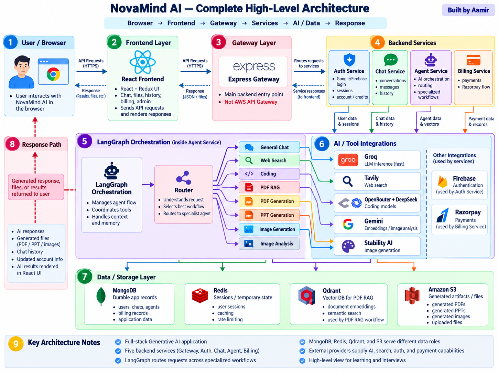

# Module 02 — Architecture and End-to-End Request Flow

> **Project:** NovaMind-AI-LangGraph-Multi-Agent-AWS-Platform  
> **Purpose:** Learn the architecture deeply enough to explain it, trace it, troubleshoot it, draw it, and defend it in an interview.  
> **Accuracy rule:** Separate verified project implementation from documented/intended AWS design and from Production V2 recommendations.

---

## Architecture Image



> Image location in the project: `learning/images/02-novamind-high-level-architecture.png`

---

# Module 02 Learning Strategy

Do not memorize the architecture as a list of technologies.

For every component, ask:

```text
What is it?
Why is it needed?
Where does it sit?
What data enters it?
What does it call next?
What does it read or write?
What can fail?
What is the current limitation?
What would Production V2 improve?
```

The goal of this module is to build one strong mental picture of NovaMind.

---

# Concept 1 — What Does “Architecture” Mean?

## 1. Simple definition

Architecture is the high-level structure of a system.

It explains:

- what the major components are,
- what each component is responsible for,
- how those components communicate,
- how data moves through the system,
- where state is stored,
- and where failures can happen.

A technology list is not architecture.

For example:

```text
React
Node.js
Redis
MongoDB
LangGraph
Qdrant
AWS
```

This only tells us what technologies exist.

A real architecture explanation is:

```text
The user interacts with React.
React calls the Express Gateway.
The Gateway routes requests to backend services.
The Agent service contains LangGraph.
LangGraph routes AI requests to specialist workflows.
MongoDB stores durable application data.
Redis stores sessions and fast runtime state.
Qdrant stores vectors for PDF retrieval.
S3 stores generated artifacts.
```

## 2. Why architecture matters in interviews

An interviewer is not only checking whether you know technology names.

They want to know whether you understand the system as a whole.

If they ask:

> “Explain your architecture.”

and you answer:

> “React, Node.js, Redis, LangGraph, Qdrant, ECS…”

that sounds like a stack list.

A better answer explains the request path and responsibilities.

## 3. Architecture vs request flow

Architecture is the static view:

```text
React
Gateway
Auth
Chat
Agent
Billing
MongoDB
Redis
Qdrant
S3
```

Request flow is the dynamic view:

```text
User sends request
 ↓
Gateway
 ↓
Agent
 ↓
LangGraph
 ↓
Specialist
 ↓
Provider
 ↓
Response
```

You need both.

## 4. NovaMind has multiple flows

NovaMind is not one straight request path.

Important flows include:

- login
- normal chat
- search
- PDF RAG
- coding
- PDF generation
- PPT generation
- image generation
- image analysis
- payment/credits
- conversation persistence
- generated artifact delivery
- AWS runtime
- deployment

This module studies all of them.

## 5. Mental model

```text
Architecture
=
Components
+
Responsibilities
+
Communication
+
Data flow
+
State
+
Failure boundaries
```

---

# Concept 2 — Complete High-Level Architecture

## 1. Application-level architecture

The frontend is built with React and Redux.

The backend has five Express services:

```text
Gateway :8000
Auth    :8001
Chat    :8002
Agent   :8003
Billing :8004
```

Conceptually:

```text
Browser
  ↓
React Frontend
  ↓
Express Gateway
  ├── Auth
  ├── Chat
  ├── Agent
  └── Billing
```

## 2. What each backend service does

### Gateway

- main backend entry point
- resolves protected Redis-backed sessions
- derives user identity
- proxies requests to backend services

### Auth

- verifies Firebase login token
- manages user/account state
- creates Redis-backed application sessions
- handles credits/plan-related user state in the current design

### Chat

- stores conversations
- stores user/assistant messages
- reads conversation history from MongoDB

### Agent

- contains LangGraph
- contains the router
- contains the eight AI specialist workflows
- integrates with AI providers/tools
- coordinates RAG and artifact generation

### Billing

- creates Razorpay orders
- stores payment records
- verifies payment signatures
- triggers credit/plan updates

## 3. Agent internals

Inside Agent:

```text
Agent Service
   ↓
LangGraph
   ↓
Router
   ↓
8 Specialist Workflows
```

The eight workflows are:

1. Chat
2. Search
3. Coding
4. PDF RAG
5. PDF Generation
6. PPT Generation
7. Image Generation
8. Image Analysis

Important:

> The eight specialists are not eight separate ECS services.

They are workflows/functions inside the Agent service.

## 4. Data/storage layer

```text
MongoDB
  → users, conversations, messages, payments

Redis
  → sessions, conversation context, rate counters

Qdrant
  → PDF vector retrieval

S3
  → frontend files and generated artifacts
```

## 5. External providers

```text
Groq
  → language generation

Tavily
  → web search

OpenRouter + DeepSeek
  → coding

Gemini
  → PDF embeddings and image analysis

Stability AI
  → image generation

Razorpay
  → payments
```

## 6. Important distinctions

```text
Express Gateway ≠ AWS API Gateway
Eight specialists ≠ eight microservices
LangGraph ≠ LLM
Qdrant ≠ RAG
```

---

# Concept 3 — Normal AI Send Flow

## 1. User action

Suppose the user types:

> “Explain Docker in simple English.”

The frontend prepares the request.

The request can include:

- prompt
- conversation ID
- selected workflow
- optional file

## 2. Request reaches Gateway

```text
React
 ↓
POST /api/agent/chat
 ↓
Express Gateway
```

The Gateway is the backend entry point.

## 3. Session resolution

The browser sends the NovaMind application cookie.

```text
Cookie
 ↓
Gateway
 ↓
Redis session lookup
 ↓
Authenticated user identity
```

The session is server-side and Redis-backed.

## 4. Request reaches Agent

```text
Gateway
 ↓
Agent Service
```

Agent now coordinates the AI workflow.

## 5. User message persistence

The Agent communicates with Chat:

```text
Agent
 ↓
Chat Service
 ↓
MongoDB
```

The user's message is saved.

## 6. LangGraph execution

Agent prepares workflow state and starts LangGraph.

```text
Agent
 ↓
LangGraph
 ↓
Router
```

The Router chooses the correct specialist.

For a normal chat request:

```text
Router
 ↓
Chat Workflow
```

## 7. LLM call

The Chat workflow uses the configured Groq-backed LLM path.

```text
Prompt + context
 ↓
Groq-backed model
 ↓
Answer
```

## 8. Credit and context handling

The request also interacts with:

- application credits
- Redis conversation context

Then the assistant response is saved through Chat.

## 9. Final return

```text
Assistant response
 ↓
Agent
 ↓
Gateway
 ↓
React
 ↓
User
```

## 10. Current behavior

The verified request path is synchronous.

It is not a mature token-streaming architecture.

## 11. Failure example

```text
LLM succeeds ✅
 ↓
Assistant save fails ❌
```

That creates partial success.

---

# Concept 4 — Authentication and Login Flow

## 1. Two different identity systems are involved

NovaMind uses Firebase/Google for identity verification and Redis for the application session.

These are not the same thing.

## 2. Login flow

```text
User
 ↓
Google Sign-In
 ↓
Firebase
 ↓
Firebase ID Token
 ↓
Auth Service
 ↓
Verify token
 ↓
Find/Create user in MongoDB
 ↓
Create UUID session
 ↓
Store session in Redis
 ↓
HTTP-only cookie
 ↓
Browser
```

## 3. Firebase ID Token

The Firebase token proves:

> “This user successfully authenticated through Google/Firebase.”

It is used during login verification.

## 4. NovaMind session

After verification, NovaMind creates its own application session.

That session is:

- opaque
- UUID-based
- stored in Redis
- represented to the browser through a cookie
- configured with a TTL

So:

```text
Firebase ID Token
≠
NovaMind Session
```

## 5. Later requests

Later protected requests do not need to repeat Google login.

```text
Browser cookie
 ↓
Gateway
 ↓
Redis
 ↓
Authenticated user
```

## 6. Authentication vs authorization

Authentication:

> Who are you?

Authorization:

> Are you allowed to access this resource?

A user being authenticated does not automatically mean they are allowed to read every conversation.

## 7. Current limitations

The session system exists, but:

- session revocation is not fully mature
- admin/security changes may not invalidate every older session
- authorization/ownership checks are incomplete in some paths

---

# Concept 5 — LangGraph Routing Flow

## 1. Why routing is needed

NovaMind supports many AI capabilities.

The system must decide:

> Which workflow should handle this request?

That is the router's job.

## 2. Routing priority

A useful mental model:

```text
Explicit workflow selected?
   ↓
YES → use it

NO
 ↓
PDF uploaded?
 ↓
PDF RAG

Image uploaded?
 ↓
Image Analysis

Otherwise
 ↓
Model-based classification
```

## 3. Why explicit selection wins

If the user selects a workflow directly, the system already knows the intention.

There is no need to spend another model call on classification.

Benefits:

- lower latency
- lower cost
- more predictable routing

## 4. File-aware routing

If Auto mode is used:

- uploaded PDF can route to PDF RAG
- uploaded image can route to Image Analysis

## 5. Classification fallback

If there is no explicit route and no file-based route, the system can classify the prompt.

Unknown labels can fall back to Chat.

Classifier exceptions do not have a fully mature universal fallback.

## 6. Important distinctions

```text
PDF RAG
≠
PDF Generation

Image Analysis
≠
Image Generation
```

An uploaded PDF in Auto mode means question answering over the document.

An explicit PDF generation choice means create a new PDF.

## 7. What LangGraph is doing here

LangGraph provides:

- state
- routing
- conditional edges
- workflow execution

It does not provide:

- autonomous planning loop
- reflection loop
- repeated self-directed tool choice
- durable graph checkpointing

So the correct term is:

> bounded LangGraph orchestration

---

# Concept 6 — Web Search End-to-End Flow

## 1. Why Search is different from Chat

Normal Chat:

```text
Question
 ↓
LLM
 ↓
Answer
```

Search:

```text
Question
 ↓
Web Retrieval
 ↓
Retrieved Results
 ↓
LLM Synthesis
 ↓
Answer
```

## 2. Tavily's role

Tavily retrieves current web information.

The configured behavior can retrieve up to about five results and images.

## 3. LLM role

The LLM does not search the web itself.

The flow is:

```text
Tavily
 ↓
Search results
 ↓
Groq-backed generation
 ↓
Synthesized answer
```

## 4. Why not call this exactly the same as PDF RAG

Search has retrieval + generation behavior, but for interview clarity:

> “web search + LLM synthesis”

is a better project-specific description.

PDF RAG has a more explicit vector retrieval pipeline using embeddings and Qdrant.

## 5. Cost/latency

Search is more expensive than plain chat because it can involve:

- retrieval call
- generation call
- extra application credit logic

The verified project flow can involve multiple credit operations in Search-to-Chat behavior.

## 6. Current limitations

Do not claim:

- citation correctness is guaranteed
- retrieved sources are fact-checked
- every answer is verified

The current project does not have mature citation alignment or factual verification.

## 7. Security consideration

Web content is untrusted.

Retrieved pages can contain misleading or prompt-injection-like instructions.

---

# Concept 7 — PDF RAG End-to-End Flow

## 1. What problem RAG solves

The LLM does not automatically know the uploaded document.

So the application must retrieve relevant document content and give it to the model.

## 2. Full pipeline

```text
PDF Upload
 ↓
Temporary File
 ↓
Text Extraction
 ↓
Chunking
 ↓
Embeddings
 ↓
Qdrant
 ↓
Question Embedding
 ↓
Similarity Search
 ↓
Relevant Chunks
 ↓
Prompt Augmentation
 ↓
LLM
 ↓
Answer
```

## 3. Text extraction

The project uses PDF parsing to extract text.

This works best for text-based PDFs.

There is no verified OCR pipeline for scanned/image-only PDFs.

## 4. Chunking

Verified values:

- chunk size: about 1000 characters
- overlap: about 200 characters

Why chunking?

A large document is too noisy and inefficient as one block.

Chunking creates smaller retrieval units.

## 5. Embeddings

The project uses:

`gemini-embedding-001`

The chunk text is converted to a vector.

Conceptually:

```text
"Payment is due within 30 days"
 ↓
[0.18, -0.42, 0.71, ...]
```

## 6. Qdrant

Qdrant stores vectors and performs similarity search.

The user's question is also embedded.

```text
Question vector
 ↓
Qdrant
 ↓
Top 5 relevant chunks
```

## 7. Augmentation

The retrieved chunks are added to the prompt context.

```text
Instructions
+
Relevant PDF chunks
+
User question
 ↓
LLM
```

## 8. Generation

The Groq-backed LLM generates the final answer.

## 9. Why this is RAG

RAG means:

```text
Retrieval
 ↓
Augmentation
 ↓
Generation
```

NovaMind performs all three stages.

## 10. Current limitations

- no OCR for scanned PDFs
- character-based chunking
- no page-level citation system
- no reranker
- no mature thresholding
- no mature retrieval evaluation
- new/request-oriented collection behavior
- no strong user-document-index mapping for long-term reuse
- no mature cleanup policy for vector collections
- no guarantee of hallucination elimination

## 11. Important principle

Poor retrieval can produce poor answers.

```text
Wrong chunks
 ↓
Wrong context
 ↓
Potentially wrong answer
```

---

# Concept 8 — Coding End-to-End Flow

## 1. Goal of the coding workflow

The coding workflow is not designed only to return one large code block.

It tries to return structured project files.

Example:

```text
index.html
style.css
script.js
```

## 2. Full flow

```text
Coding Prompt
 ↓
Coding Intent Classification
 ↓
OpenRouter
 ↓
DeepSeek
 ↓
Structured JSON / files[]
 ↓
Parse Output
 ↓
Code Artifact
 ↓
Monaco Editor
 ↓
Browser Preview
```

## 3. Main router vs coding-intent classifier

These are different jobs.

Main router:

> Is this a coding request?

Coding-intent classifier:

> What kind of coding task is this?

For example:

- generate
- explain
- review

## 4. OpenRouter vs DeepSeek

OpenRouter is the access/provider layer.

DeepSeek is the model.

Configured model:

`deepseek/deepseek-chat`

## 5. Structured output

The workflow expects something like:

```json
{
  "files": [
    {
      "name": "index.html",
      "content": "..."
    },
    {
      "name": "style.css",
      "content": "..."
    }
  ]
}
```

Why?

Because the frontend needs:

- file names
- file contents
- file list
- selected file
- preview behavior

## 6. Parsing

The backend parses model output.

If the LLM returns malformed JSON, parsing can fail.

Example problems:

- Markdown fences
- commentary before JSON
- missing fields
- broken escaping

## 7. Code artifact

Parsed files become a code artifact for the frontend.

## 8. Monaco Editor

Monaco displays generated code in an editor-like interface.

## 9. Browser preview

Compatible HTML/CSS/JavaScript can be previewed in the browser.

## 10. What the workflow does not do

It does not currently provide:

- secure arbitrary backend execution
- package installation
- server-side compilation
- full test runner
- automatic error repair loop
- autonomous software-engineer behavior

## 11. Production V2 improvements

A stronger version could add:

```text
Schema validation
 ↓
Safe sandbox
 ↓
Dependency controls
 ↓
Compile/test
 ↓
Capture errors
 ↓
Optional repair loop
```

But these are not current features.

---

# Concept 9 — PDF/PPT Generation Flow

## 1. PDF Generation is not PDF RAG

PDF RAG:

> answer questions about an uploaded document

PDF Generation:

> create a new document

## 2. PDF generation flow

```text
User Prompt
 ↓
LLM
 ↓
Structured Content
 ↓
PDFKit
 ↓
PDF File
 ↓
S3
 ↓
Presigned URL
 ↓
User
```

## 3. Why the LLM does not directly “make a PDF”

The LLM generates content.

PDFKit creates the binary `.pdf` file.

So:

```text
LLM = content generator
PDFKit = file renderer
```

## 4. PPT generation flow

```text
User Prompt
 ↓
LLM
 ↓
Structured Slide Content
 ↓
PptxGenJS
 ↓
PPTX File
 ↓
S3
 ↓
Presigned URL
```

The verified prompt pattern is roughly:

- cover slide
- six content slides
- closing slide

## 5. Structured output risk

If the LLM returns malformed JSON, the renderer may fail.

Production V2 should add:

- schema validation
- retry/repair behavior
- explicit failure handling

## 6. Artifact delivery

Generated files go to S3.

The user receives a presigned URL.

---

# Concept 10 — Image Generation and Image Analysis

## 1. These are opposite workflows

Image Generation:

```text
Text
 ↓
Image
```

Image Analysis:

```text
Image
 ↓
Text
```

## 2. Image Generation flow

```text
Text Prompt
 ↓
Prompt Preparation
 ↓
Stability AI
 ↓
Generated Image Bytes
 ↓
S3
 ↓
Presigned URL
 ↓
Frontend
```

Stability AI is the image-generation provider.

## 3. Image Analysis flow

```text
Uploaded Image
+
Question
 ↓
Prepare Image
 ↓
Gemini Multimodal
 ↓
Text Response
 ↓
Save / Return
```

Configured model:

`gemini-2.0-flash`

## 4. Temporary image cleanup

Uploaded images may be temporarily stored during processing.

The project attempts cleanup afterward.

Cleanup/error handling is not fully mature.

## 5. Current limitations

Image analysis can still:

- miss small details
- hallucinate
- misread diagrams
- return uncertain interpretations

Image generation depends on:

- prompt quality
- provider limits
- provider latency
- provider safety behavior

---

# Concept 11 — Payment and Credit Flow

## 1. High-level flow

```text
Choose Plan
 ↓
Billing
 ↓
Create Razorpay Order
 ↓
Create Payment(status=created)
 ↓
Razorpay Checkout
 ↓
Return payment details
 ↓
Verify HMAC Signature
 ↓
Payment(status=paid)
 ↓
Billing calls Auth
 ↓
Credits / Plan updated
```

## 2. Why verify the signature

The browser should not be trusted to simply say:

> “The payment succeeded.”

The backend verifies the Razorpay signature.

## 3. Distributed consistency problem

The dangerous gap is:

```text
Payment marked paid ✅
 ↓
Credit update fails ❌
```

These are separate operations.

They are not one atomic cross-service transaction.

## 4. Duplicate/replay problem

If the same payment callback is processed twice, credits should not be added twice.

That requires idempotency.

## 5. What idempotency means

```text
Process payment once
 → +100 credits

Process same payment again
 → still only +100 total effect
```

## 6. Current limitation

The current design does not have fully mature exactly-once guarantees.

## 7. Stronger Production V2

A stronger design could use:

```text
Verified payment
 ↓
Durable payment event
 ↓
Idempotency check
 ↓
Credit ledger
 ↓
Retry / reconciliation
```

## 8. Credit consumption

AI workflows also deduct credits.

A mature system should decide whether to:

- pre-check
- reserve
- deduct after success
- release reservation on failure

The current handling is not fully robust.

---

# Concept 12 — Conversation Persistence and Memory

## 1. Three different types of state

```text
MongoDB
 → durable history

Redis
 → fast shared runtime state

LangGraph State
 → current workflow data
```

## 2. MongoDB

MongoDB stores:

- conversations
- messages
- users
- payments

This is durable application persistence.

## 3. Redis

Redis stores:

- application sessions
- conversation-related context/cache
- rate counters

Redis is fast but becomes a critical runtime dependency.

## 4. LangGraph State

LangGraph carries values used in the current workflow.

Examples:

- prompt
- user ID
- conversation ID
- selected workflow
- file
- search results
- images
- artifacts
- response

## 5. Stored history is not automatic model memory

If MongoDB stores 100 messages, the LLM does not automatically know them.

The application must:

```text
Load history
 ↓
Select relevant context
 ↓
Build prompt
 ↓
Send to LLM
```

## 6. Current memory weaknesses

The review found:

- potentially unbounded history hydration
- duplicate current message behavior
- read-modify-write race conditions
- weak size enforcement
- TTL loss risk
- no token-aware summarization
- not all specialists use memory equally

## 7. Redis is not LangGraph checkpointing

The project does not currently have durable LangGraph execution checkpoints.

That means an in-flight graph does not automatically resume after service restart.

## 8. Production V2

A stronger design could use:

```text
Recent messages
+
summary of older history
+
token-aware trimming
+
atomic updates
+
stable TTL handling
+
optional LangGraph checkpointing
```

---

# Concept 13 — Generated Artifact Lifecycle

## 1. What is an artifact?

Examples:

- PDF
- PPTX
- generated image
- code file collection

## 2. File artifact flow

```text
Generate
 ↓
S3
 ↓
Presigned URL
 ↓
Frontend
 ↓
User
```

## 3. Why S3

S3 is better than container-local storage for durable generated files.

Benefits:

- object storage
- scalable
- separate from application container lifecycle
- supports presigned URLs

## 4. S3 object vs presigned URL

```text
S3 object
 = actual stored file

Presigned URL
 = temporary access mechanism
```

The URL can expire while the object still exists.

## 5. Current lifecycle weakness

If the conversation stores only the presigned URL:

```text
Today: URL works
 ↓
Later: URL expires
 ↓
Old conversation link breaks
```

## 6. Better artifact design

Persist:

```text
artifactId
ownerId
conversationId
objectKey
type
status
createdAt
retentionUntil
```

Then:

```text
User asks for artifact
 ↓
Authorize
 ↓
Generate fresh presigned URL
```

## 7. Security

A presigned URL should only be created after authorization.

Otherwise another user could potentially access an artifact if they obtain the URL.

---

# Concept 14 — Failure Propagation Across Services

## 1. What is failure propagation?

A failure in one component can affect the whole request.

Example:

```text
Groq fails
 ↓
Chat workflow cannot generate answer
 ↓
Agent request fails
 ↓
User sees failure
```

## 2. Why microservices increase failure surfaces

A request may cross:

```text
Gateway
 ↓
Redis
 ↓
Agent
 ↓
Chat
 ↓
MongoDB
 ↓
External Provider
```

Each boundary can fail.

## 3. Redis failure

Redis failure can affect:

- authentication/session resolution
- conversation context
- rate counters

## 4. MongoDB failure

MongoDB failure can affect:

- conversation loading
- message save
- user/account data
- payment records

## 5. Provider failure

Different workflows depend on different providers.

```text
Chat → Groq
Search → Tavily + Groq
Coding → OpenRouter/DeepSeek
Image Generation → Stability AI
Image Analysis → Gemini
PDF RAG → Gemini + Qdrant + Groq
```

## 6. Partial success

Examples:

```text
User message saved ✅
LLM succeeds ✅
Assistant save fails ❌
```

```text
PDF generated ✅
S3 upload fails ❌
```

```text
Payment paid ✅
Credit update fails ❌
```

## 7. Retry danger

Blind retries can duplicate:

- provider cost
- credits
- artifacts
- messages
- payment effects

So safe retries require idempotency.

## 8. Current error-semantic weakness

Some specialist exceptions can be converted into normal assistant text.

That can make monitoring think the request succeeded.

## 9. Production V2

Add:

- explicit timeout/deadline policies
- structured errors
- request/correlation IDs
- safe retries
- idempotency
- metrics
- traces
- circuit breakers where justified
- reconciliation for financial state

---

# Concept 15 — AWS Request Path

## 1. Frontend delivery

```text
Browser
 ↓
CloudFront
 ↓
S3 Frontend
 ↓
React
```

CloudFront is the frontend CDN/distribution layer.

## 2. Backend entry

Documented architecture:

```text
React
 ↓
Application Load Balancer
 ↓
Gateway ECS/Fargate Task
```

Important:

> ALB and Express Gateway are different things.

ALB is AWS infrastructure.

Express Gateway is application logic.

## 3. ECS and Fargate

ECS:

> container orchestration

Fargate:

> compute used to run ECS tasks without managing EC2 hosts

## 4. ECR

```text
Docker Image
 ↓
ECR
 ↓
ECS/Fargate
```

ECR stores images.

It does not run them.

## 5. Internal service discovery

The documented design includes Cloud Map.

Cloud Map helps services discover each other without hard-coded IP addresses.

But:

```text
Cloud Map ≠ Service Authentication
```

## 6. Private tasks and NAT

If Agent runs in private subnets, it still needs outbound access to:

- Groq
- Gemini
- Tavily
- OpenRouter
- Stability AI

A NAT path is commonly used for this.

This is documented/intended design and should not be confused with verified live state.

## 7. Secrets Manager

ECS task definitions reference Secrets Manager.

This is used to provide sensitive runtime configuration.

## 8. CloudWatch

Container logs are sent to CloudWatch.

This gives centralized logs.

It does not mean mature distributed observability is complete.

## 9. Resource allocations

Task definitions include CPU/memory allocations.

These values are configuration, not proof of optimal performance.

---

# Concept 16 — Deployment Request Flow

## 1. Trigger

A code push to the deployment branch triggers GitHub Actions.

## 2. Backend flow

```text
Git Push
 ↓
GitHub Actions
 ↓
Checkout
 ↓
Authenticate to AWS
 ↓
ECR Login
 ↓
Build 5 Docker Images
 ↓
Push to ECR
 ↓
Force ECS Redeploy
```

## 3. Frontend flow

```text
React Build
 ↓
S3 Sync
 ↓
CloudFront Invalidation
```

## 4. Why CloudFront invalidation

S3 may contain the new build while CloudFront still serves cached files.

Invalidation forces refresh of those cached paths.

## 5. Mutable `latest`

The current deployment uses mutable tags such as:

```text
agent:latest
```

This weakens traceability.

A stronger model is:

```text
agent:<git-sha>
```

## 6. Task definition change problem

Changing local ECS task-definition JSON does not automatically mean ECS uses it.

For configuration changes like:

- CPU
- memory
- secrets
- ports
- IAM role

a new task-definition revision must be registered and the service updated.

## 7. CI vs CD

Current pipeline has working automated deployment.

But mature CI/CD would also require stronger:

- tests
- lint/validation
- security scanning
- smoke tests
- health gates
- rollback
- immutable releases
- deployment concurrency controls

## 8. Important principle

```text
GitHub Actions succeeded
≠
Application is healthy
```

Runtime health still needs to be verified.

---

# Concept 17 — Complete End-to-End Architecture Story

## 1. Normal chat story

```text
User
 ↓
CloudFront/S3 frontend
 ↓
React
 ↓
ALB
 ↓
Express Gateway
 ↓
Redis session lookup
 ↓
Agent
 ↓
Chat saves user message
 ↓
LangGraph
 ↓
Router
 ↓
Chat workflow
 ↓
Groq-backed LLM
 ↓
Credit/context handling
 ↓
Chat saves assistant response
 ↓
Gateway
 ↓
React
 ↓
User
```

## 2. PDF RAG story

```text
PDF Upload + Question
 ↓
Gateway
 ↓
Agent
 ↓
LangGraph
 ↓
PDF RAG
 ↓
Extract
 ↓
Chunk
 ↓
Embed
 ↓
Qdrant
 ↓
Retrieve
 ↓
LLM
 ↓
Answer
 ↓
Persist
 ↓
Return
```

## 3. Search story

```text
Question
 ↓
Agent
 ↓
Search Workflow
 ↓
Tavily
 ↓
Results
 ↓
Groq-backed synthesis
 ↓
Answer
```

## 4. Document generation story

```text
Prompt
 ↓
LLM structured content
 ↓
Renderer
 ↓
S3
 ↓
Presigned URL
 ↓
User
```

## 5. Architecture storytelling lesson

Do not say:

> “We used React, Node, Redis, Qdrant, LangGraph…”

Say:

> “The user interacts with React, the Gateway authenticates and routes the request, Agent uses LangGraph to select a specialist workflow, the workflow calls the required provider/data store, the response is persisted, and then the result returns to the frontend.”

That is system understanding.

---

# Concept 18 — Architecture Boundaries, Coupling, Bottlenecks & Trade-offs

## 1. Service boundaries

The intended boundaries are:

```text
Gateway
 → entry/routing

Auth
 → identity/account

Chat
 → conversation persistence

Agent
 → AI orchestration

Billing
 → payment
```

## 2. What is coupling?

Coupling means how strongly one component depends on another.

Examples:

```text
Agent → Chat
Billing → Auth
```

These are synchronous dependencies.

## 3. Cross-service data access

Some admin functionality in Auth directly accesses data associated with other services.

That weakens clean service ownership.

A stronger design would prefer clear APIs instead of reaching directly into another service's data model.

## 4. Potential bottlenecks

### Agent

Many AI workflows are concentrated in Agent.

### Redis

Redis supports several critical concerns.

### MongoDB

Persistent application traffic can concentrate there.

### Providers

External provider quotas and latency can become the true bottleneck.

### Long synchronous workflows

PDF, image, and document-generation operations can hold HTTP requests open.

### RAG indexing

Repeated document parsing and embedding can create unnecessary latency/cost.

### Conversation growth

Large histories increase token cost and latency.

## 5. Why more ECS tasks do not solve everything

Horizontal scaling can help request concurrency.

But it does not automatically solve:

- provider quotas
- race conditions
- payment consistency
- duplicate work
- long external-call latency

## 6. Could this be a modular monolith?

Yes.

A modular monolith could have:

```text
One backend
 ├── auth module
 ├── chat module
 ├── agent module
 └── billing module
```

Benefits:

- fewer network calls
- simpler deployment
- easier transactions

Trade-offs:

- larger deployment unit
- less independent scaling

## 7. Design-decision framework

When asked “Why X?”, answer:

```text
Requirement
 ↓
Why X fits
 ↓
Benefit
 ↓
Trade-off
 ↓
Alternative
 ↓
When I would change it
```

---

# Concept 19 — Architecture Security Boundaries

## 1. Four key concepts

```text
Authentication
 → Who are you?

Authorization
 → What can you do?

Identity Propagation
 → How does trusted identity move?

Tenant Isolation
 → Can one user access another user's data?
```

## 2. Browser is untrusted

The browser can modify:

- body
- headers
- IDs
- API calls

So server logic must not trust client-supplied user identity.

## 3. Gateway as trust boundary

The Gateway resolves the Redis-backed session.

```text
Cookie
 ↓
Gateway
 ↓
Redis
 ↓
Authenticated user ID
```

The backend should derive identity from that trusted session.

## 4. Internal headers

If downstream services trust `x-user-id`, they must trust that it came from the Gateway and was not forged by a public client.

Private networking helps reduce exposure, but does not replace authorization.

## 5. Object ownership

Secure query pattern:

```text
conversationId = requested ID
AND
ownerId = authenticated user
```

Not just:

```text
conversationId = requested ID
```

This protects against object-level authorization failures.

## 6. Sensitive account mutation

Operations such as:

- add credits
- deduct credits
- update plan

must be server-controlled.

The browser must not be treated as the authority.

## 7. Admin controls

Admin routes should use explicit server-side authorization.

The current project has admin checks but also route/boundary weaknesses.

## 8. Artifact security

Before creating a presigned URL:

```text
Authenticate
 ↓
Load artifact metadata
 ↓
Check ownership
 ↓
Generate URL
```

## 9. CORS is not authorization

CORS is a browser policy.

It does not prove that the caller is authorized.

## 10. Prompt injection boundary

Retrieved PDF text and web content are untrusted.

They should be treated as data, not system instructions.

## 11. Current security weaknesses

- incomplete object-level authorization
- sensitive account mutation routes
- admin route concerns
- internal service trust assumptions
- credential exposure concerns
- incomplete session revocation
- prompt injection exposure
- limited upload validation

## 12. Production priorities

First fix:

- authorization
- account mutation
- credential hygiene
- session lifecycle
- regression tests

before adding more features.

---

# Concept 20 — Final Architecture Revision & Interview Synthesis

## 1. Explain in layers

Use this order:

```text
Layer 1 → User / Frontend
Layer 2 → Gateway / Backend Services
Layer 3 → Agent / LangGraph
Layer 4 → AI Providers / Tools
Layer 5 → Data / State
Layer 6 → AWS Runtime / Deployment
```

## 2. 30-second explanation

> NovaMind has a React frontend and five Node.js/Express backend services: Gateway, Auth, Chat, Agent and Billing. The Agent service contains LangGraph and routes AI requests to eight predefined specialist workflows. MongoDB stores durable application data, Redis handles sessions and temporary context, Qdrant supports vector retrieval for PDF RAG, and S3 stores generated artifacts. The backend is containerized for ECS/Fargate, ECR stores images, Secrets Manager provides sensitive runtime configuration and CloudWatch collects logs.

## 3. 60–90 second explanation

> NovaMind is a full-stack Generative AI platform. The frontend is built with React and Redux and is delivered through S3 and CloudFront. Backend requests enter through an Express Gateway and are routed to Auth, Chat, Agent or Billing. Auth handles identity and application sessions, Chat handles durable conversation persistence, Agent handles AI orchestration and Billing handles Razorpay payments.
>
> Inside Agent, LangGraph maintains workflow state and routes requests to eight predefined specialists. General chat uses a Groq-backed model path, Search uses Tavily followed by LLM synthesis, Coding uses DeepSeek through OpenRouter, PDF RAG uses PDF extraction, Gemini embeddings, Qdrant retrieval and Groq generation, Image Generation uses Stability AI, and Image Analysis uses Gemini.
>
> MongoDB stores durable application data, Redis supports sessions and runtime context, Qdrant stores document vectors and S3 stores generated artifacts. The repository also contains ECS/Fargate deployment configuration, ECR, Secrets Manager references and CloudWatch logging.

## 4. What not to overclaim

Do not claim:

- AWS API Gateway is used
- Bedrock inference is active
- eight specialists are eight ECS services
- autonomous planning/reflection is implemented
- RAG guarantees correctness
- generated code is fully executed/tested/repaired
- document indexes are durable long-term knowledge bases
- tenant isolation is fully hardened
- payment/credits are exactly-once
- HA and zero-downtime are proven
- current AWS health is verified

## 5. Better wording

Use:

> production-oriented

> bounded LangGraph orchestration

> real PDF RAG with lifecycle limitations

> automated deployment with CI/CD maturity gaps

## 6. Final mental map

```text
                         USER
                           │
                           ▼
                  CloudFront / S3
                           │
                           ▼
                    React Frontend
                           │
                           ▼
                          ALB
                           │
                           ▼
                    Express Gateway
                           │
              ┌────────────┼────────────┐
              ▼            ▼            ▼
            Auth          Chat        Billing
              │            │            │
           Redis        MongoDB      Razorpay
              │
              └──────────────┐
                             ▼
                           Agent
                             │
                         LangGraph
                             │
                           Router
                             │
      ┌────────┬────────┬────┼────┬────────┬────────┐
      ▼        ▼        ▼         ▼        ▼        ▼
     Chat    Search   Coding     RAG      Docs     Images
      │        │        │         │        │        │
    Groq     Tavily   DeepSeek  Gemini   PDFKit/ Stability/
              │      OpenRouter Qdrant  PptxGenJS Gemini
              ▼                   │        │
            Groq                  ▼        ▼
                                Groq      S3
```

---

# Final Module 02 Understanding Checklist

You should now be able to explain, without notes:

- what architecture means
- all five backend services
- all eight specialist workflows
- normal AI request flow
- login/session flow
- routing logic
- Search flow
- PDF RAG flow
- Coding flow
- PDF/PPT generation
- image generation vs analysis
- payment/credit consistency
- MongoDB vs Redis vs Qdrant vs S3
- generated artifact lifecycle
- failure propagation
- AWS runtime path
- deployment flow
- coupling and bottlenecks
- authentication vs authorization
- security weaknesses
- what is implemented vs documented vs recommended
- why the project is production-oriented rather than production-ready

**Module 02 learning content complete.**
