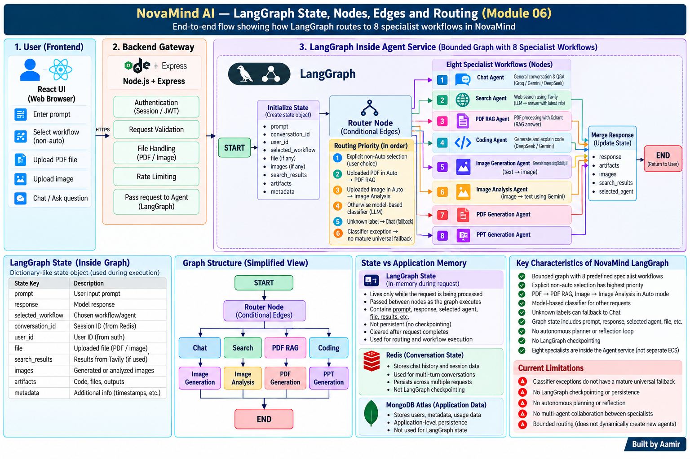

# Module 06 — LangGraph State, Nodes, Edges and Routing

> **Project:** NovaMind-AI-LangGraph-Multi-Agent-AWS-Platform  
> **Purpose:** Learn LangGraph from zero and connect every core idea to NovaMind’s verified implementation: state, nodes, edges, conditional routing, START/END, router behavior, specialist workflows, fallback logic, memory boundaries, checkpointing, failure handling, debugging, testing, observability, scaling, trade-offs, and Production V2 improvements.  
> **Accuracy rule:** NovaMind genuinely uses LangGraph inside the Agent service, but the graph is bounded. It does not implement a general autonomous planner, reflection loop, unrestricted repeated tool-selection loop, or LangGraph checkpointing.

---

## Module 06 Visual Mental Model



> Place the image at: `learning/images/06-langgraph-state-nodes-edges-routing.png`

---

# Module 06 Mental Model

Remember this first:

```text
START
  ↓
Router Node
  ↓
Conditional Edge
  ↓
One Specialist Workflow
  ↓
END
```

In NovaMind, LangGraph mainly helps with:

```text
State
+
Routing
+
Conditional workflow selection
+
Structured multi-step execution
```

It does **not** automatically mean:

```text
Autonomous planning
Reflection
Unlimited tool use
Persistent graph execution
```

---

# Concept 1 — What Is LangGraph?

LangGraph is a framework for building stateful workflows as graphs.

A graph contains:

- nodes
- edges
- state
- entry point
- exit point
- optional conditional logic

Think:

```text
START
 ↓
Node A
 ↓
Node B
 ↓
END
```

LangGraph becomes useful when workflow execution depends on shared state and conditional paths.

---

# Concept 2 — Why Use a Graph?

A graph makes workflow structure explicit.

Without a graph, application logic may become scattered across many:

- if/else blocks
- service functions
- nested callbacks
- provider calls

With a graph:

```text
START
 ↓
Router
 ├── Chat
 ├── Search
 ├── PDF RAG
 └── Coding
 ↓
END
```

The architecture becomes easier to visualize and extend.

---

# Concept 3 — What Is a Node?

A node is a unit of work in the graph.

A node can:

- read state
- call a function
- call a provider
- transform data
- update state
- choose output values

Example:

```text
Router Node
```

Its job:

> Decide which specialist should handle the request.

Another example:

```text
PDF RAG Node
```

Its job:

> Run the PDF RAG workflow and update the response.

---

# Concept 4 — What Is an Edge?

An edge connects one node to another.

Simple edge:

```text
Node A
 ↓
Node B
```

It means:

> After Node A finishes, run Node B.

In a simple workflow, edges may be deterministic.

---

# Concept 5 — What Is a Conditional Edge?

A conditional edge decides the next node based on state or routing logic.

Example:

```text
Router
 ├── chat → Chat Node
 ├── search → Search Node
 ├── pdfRag → PDF RAG Node
 └── coding → Coding Node
```

This is central to NovaMind.

The Router does not perform every AI task itself.

It decides which specialist node should run.

---

# Concept 6 — START and END

LangGraph workflows have conceptual boundaries.

```text
START
```

means:

> Graph execution begins here.

```text
END
```

means:

> The graph has finished.

In NovaMind:

```text
START
 ↓
Router
 ↓
Specialist
 ↓
END
```

This is a simplified but accurate mental model.

---

# Concept 7 — What Is Graph State?

State is the data shared across graph execution.

Think of it like a structured object that moves through the graph.

Example:

```text
{
  prompt,
  userId,
  conversationId,
  selectedAgent,
  file,
  searchResults,
  response
}
```

Each node can read or update fields.

---

# Concept 8 — Verified NovaMind State Fields

The verified project analysis identifies graph state fields including:

```text
prompt
response
selected workflow / agent
conversationId
userId
searchResults
images
artifacts
file
```

The exact internal names can vary, but these are the important verified concepts.

---

# Concept 9 — Why State Matters

Without shared state, every node would need to manually pass every value to the next function.

State creates a common execution context.

Example:

```text
Router reads:
prompt
selectedAgent
file

Search updates:
searchResults

Specialist updates:
response
images
artifacts
```

This keeps multi-step execution organized.

---

# Concept 10 — State Update

A node can return or modify values that become part of the next state.

Conceptually:

```text
Before Search Node:

{
  prompt: "...",
  searchResults: null
}

After Search Node:

{
  prompt: "...",
  searchResults: [...]
}
```

Later nodes can use those values.

---

# Concept 11 — State Is Not Permanent Memory

Very important:

```text
LangGraph State
≠
Long-term memory
```

State primarily represents the current workflow execution.

It should not automatically be described as persistent conversation memory.

---

# Concept 12 — LangGraph State vs Redis

Redis in NovaMind stores application runtime state such as:

- sessions
- fast conversation context
- rate counters

LangGraph state stores current graph execution data.

So:

```text
Redis
≠
LangGraph state

Redis
≠
LangGraph checkpointing
```

---

# Concept 13 — LangGraph State vs MongoDB

MongoDB stores durable application records:

- users
- conversations
- messages
- payments

LangGraph state is different.

```text
MongoDB
= durable application persistence

LangGraph State
= current workflow execution data
```

---

# Concept 14 — What Is Checkpointing?

Checkpointing means saving graph execution state so the workflow can resume later.

Example:

```text
Node A
 ↓
Checkpoint saved
 ↓
Process crashes
 ↓
Restart
 ↓
Resume from saved graph state
```

NovaMind does **not** have verified LangGraph checkpointing.

---

# Concept 15 — Why Redis Is Not Checkpointing

Redis can store application data.

That does not mean LangGraph is configured with a checkpointer.

A LangGraph checkpointer is specifically integrated into graph execution state persistence.

NovaMind’s Redis usage is application-level session/context storage.

So never say:

> “Redis is the LangGraph checkpointer.”

---

# Concept 16 — The Router Node

The Router Node decides:

> Which specialist workflow should handle this request?

The routing logic is one of the most important parts of the graph.

It reads state such as:

- selected workflow
- uploaded file
- user prompt

Then returns a route label.

---

# Concept 17 — Routing Priority

NovaMind routing is bounded and ordered.

The verified priority is:

```text
1. Explicit non-Auto selection
2. Uploaded PDF in Auto → PDF RAG
3. Uploaded image in Auto → Image Analysis
4. Otherwise model-based classification
5. Unknown classifier label → Chat fallback
```

This order matters.

---

# Concept 18 — Explicit Selection Wins

If the user explicitly selects a workflow, NovaMind does not need to guess.

Example:

```text
Selected workflow = Coding
```

Then:

```text
Router
 ↓
Coding
```

Benefits:

- lower latency
- lower cost
- predictable behavior
- respects user intent

---

# Concept 19 — PDF File-Based Routing

If the user is in Auto mode and uploads a PDF:

```text
Auto
+
PDF
 ↓
PDF RAG
```

This deterministic rule avoids calling the classifier unnecessarily.

Important:

```text
PDF RAG
≠
PDF Generation
```

PDF upload in Auto means document question answering.

---

# Concept 20 — Image File-Based Routing

If Auto mode is used and an image is uploaded:

```text
Auto
+
Image
 ↓
Image Analysis
```

This is different from:

```text
Image Generation
```

Image Analysis:

```text
image → text
```

Image Generation:

```text
text → image
```

---

# Concept 21 — Model-Based Classification

If there is:

- no explicit workflow
- no PDF routing signal
- no image routing signal

NovaMind uses a model-based classifier.

Conceptually:

```text
Prompt
 ↓
Classifier
 ↓
Route Label
```

Example labels could represent:

- chat
- search
- coding
- document generation
- image generation

---

# Concept 22 — Why Use Classification Only When Needed?

Classifier calls add:

- latency
- model cost
- another failure point

So if the answer is already obvious from user selection or file type, deterministic routing is better.

This is a strong design decision.

---

# Concept 23 — Unknown Label Fallback

If the classifier returns an unexpected/unknown route label, the current graph can fall back to Chat.

Conceptually:

```text
Classifier
 ↓
Unknown label
 ↓
Chat
```

This prevents some route failures from breaking the entire request.

---

# Concept 24 — Classifier Exception Limitation

Different case:

```text
Classifier throws exception
```

The current implementation does not have a mature universal fallback for every classifier failure.

Important distinction:

```text
Unknown returned label
→ Chat fallback exists

Classifier exception
→ no mature universal fallback
```

This is a useful interview detail.

---

# Concept 25 — Eight Specialist Nodes

The eight predefined specialist workflows are:

1. Chat
2. Search
3. Coding
4. PDF RAG
5. PDF Generation
6. PPT Generation
7. Image Generation
8. Image Analysis

All eight live inside the Agent service.

They are not eight ECS services.

---

# Concept 26 — Chat Node

Simplified flow:

```text
Router
 ↓
Chat
 ↓
Load relevant context
 ↓
Groq-backed LLM
 ↓
response
```

The Chat node is the general text-generation path.

---

# Concept 27 — Search Node

```text
Router
 ↓
Search
 ↓
Tavily
 ↓
searchResults
 ↓
Groq-backed synthesis
 ↓
response
```

This node demonstrates state enrichment.

Search results can be added to graph state before generation.

---

# Concept 28 — Coding Node

```text
Router
 ↓
Coding
 ↓
Coding intent
 ↓
OpenRouter
 ↓
DeepSeek
 ↓
Structured files[]
 ↓
artifacts
```

The node produces structured code artifacts.

It does not run a full autonomous execution/test loop.

---

# Concept 29 — PDF RAG Node

```text
Router
 ↓
PDF RAG
 ↓
Extract
 ↓
Chunk
 ↓
Gemini embeddings
 ↓
Qdrant
 ↓
Top-5 retrieval
 ↓
Groq-backed generation
 ↓
response
```

This is a multi-step specialist node/workflow.

---

# Concept 30 — PDF Generation Node

```text
Router
 ↓
PDF Generation
 ↓
LLM structured content
 ↓
PDFKit
 ↓
S3 artifact
 ↓
response / artifact
```

This is document creation, not RAG.

---

# Concept 31 — PPT Generation Node

```text
Router
 ↓
PPT Generation
 ↓
LLM slide content
 ↓
PptxGenJS
 ↓
S3 artifact
 ↓
response / artifact
```

Again, this is generation, not document retrieval.

---

# Concept 32 — Image Generation Node

```text
Router
 ↓
Image Generation
 ↓
Stability AI
 ↓
image bytes
 ↓
S3
 ↓
images / artifact
```

---

# Concept 33 — Image Analysis Node

```text
Router
 ↓
Image Analysis
 ↓
Gemini
 ↓
Text analysis
 ↓
response
```

---

# Concept 34 — Specialist Nodes Are Not Microservices

Important:

```text
Agent Service
 ├── Chat
 ├── Search
 ├── Coding
 ├── PDF RAG
 ├── PDF Generation
 ├── PPT Generation
 ├── Image Generation
 └── Image Analysis
```

This is one service containing multiple graph workflow branches.

Do not describe each specialist as a separately deployed ECS service.

---

# Concept 35 — LangGraph vs Normal JavaScript Control Flow

Could this routing be written in normal JavaScript?

Yes.

Example:

```text
if selected == coding:
   runCoding()
else if pdf:
   runPdfRag()
...
```

LangGraph is not strictly required for simple routing.

---

# Concept 36 — Why Use LangGraph Instead of Only if/else?

LangGraph becomes useful because it makes:

- state explicit
- node boundaries explicit
- routing explicit
- future graph growth easier
- conditional paths easier to visualize
- future loops/human checkpoints possible

Trade-off:

- framework complexity
- graph debugging overhead
- extra abstraction

---

# Concept 37 — LangGraph ≠ Agent

LangGraph is a framework.

An agent is a behavioral system built using logic, models, tools, and state.

You can use LangGraph for:

- simple workflow
- router
- agent loop
- supervisor
- human-in-the-loop process

Using LangGraph does not automatically mean:

> “fully autonomous agent”

---

# Concept 38 — LangGraph ≠ LLM

LangGraph does not generate the answer itself.

Example:

```text
LangGraph
 ↓
Search Node
 ↓
Groq
 ↓
Answer
```

LangGraph coordinates execution.

The model/provider performs inference.

---

# Concept 39 — What Is a Tool Node?

In LangGraph generally, a tool node is a node that executes one or more tools.

Example concept:

```text
Agent Node
 ↓
Tool Node
 ↓
Search API
```

NovaMind uses tool integrations inside specialist workflows, but the verified project is not described as a generic open-ended tool-node loop.

---

# Concept 40 — What Is a Loop in LangGraph?

A graph can have cycles.

Example:

```text
Generate
 ↓
Validate
 ↓
Need revision?
 ├── Yes → Generate again
 └── No → END
```

This is a loop.

NovaMind does not have a verified general reflection/revision loop.

---

# Concept 41 — Cycles vs Straight-Line Flow

Straight-line flow:

```text
START → Router → Specialist → END
```

Cycle:

```text
Node A → Node B → Node A
```

Cycles are powerful but introduce:

- risk of infinite loops
- cost growth
- harder testing
- need for stopping conditions

NovaMind's bounded graph avoids a general open-ended loop.

---

# Concept 42 — What Is a Stopping Condition?

In agent loops, a stopping condition determines when execution ends.

Examples:

- task complete
- max steps
- max tool calls
- max tokens
- max time
- max cost

NovaMind does not currently need a general open-ended loop limiter because it does not implement unrestricted agent loops.

---

# Concept 43 — Graph Error Path

A node may fail.

Example:

```text
Search Node
 ↓
Tavily error
```

Possible design choices:

- propagate error
- retry
- fallback
- return structured failure
- route elsewhere

The current NovaMind error behavior is not fully standardized across all specialists.

---

# Concept 44 — Why Error Semantics Matter

If a specialist catches an exception and returns:

```text
"Error generating response"
```

as normal assistant text, the graph may still look successful.

That creates:

```text
Technical failure ❌
HTTP / graph completion looks successful ✅
```

This weakens monitoring and recovery.

---

# Concept 45 — Failure Propagation

A graph node can depend on external systems.

Example:

```text
PDF RAG Node
 ├── Gemini
 ├── Qdrant
 └── Groq
```

If any dependency fails, the specialist can fail.

Graph-level reliability must account for dependency-level reliability.

---

# Concept 46 — Partial Success

Example:

```text
Tavily succeeds
 ↓
Groq fails
```

Search retrieval succeeded, but answer generation failed.

Another:

```text
PDF generated
 ↓
S3 upload fails
```

Content generation succeeded, artifact delivery failed.

Graph orchestration does not automatically solve these consistency problems.

---

# Concept 47 — Safe Retry

Before retrying a node ask:

```text
Did the previous attempt create a side effect?
```

Examples:

- credits deducted?
- S3 object created?
- payment updated?
- message saved?
- provider charged?

Blind retries can duplicate side effects.

---

# Concept 48 — Idempotency and Graph Workflows

Idempotency means repeating the same logical operation does not duplicate its effect.

Important for:

- payments
- credits
- artifact creation
- retries
- long-running jobs

NovaMind's graph orchestration does not automatically provide idempotency.

Application logic must implement it.

---

# Concept 49 — Debugging a Graph

A good debugging process:

```text
1. What state entered the graph?
2. What route did Router choose?
3. Which specialist ran?
4. What dependency did it call?
5. What state fields changed?
6. Where did the error appear?
7. What response returned?
```

This is much better than checking random services.

---

# Concept 50 — Debugging Wrong Routing

If a request goes to the wrong specialist:

Check:

- explicit selected workflow
- Auto vs non-Auto
- file type
- classifier input
- classifier output
- route label mapping
- fallback behavior

---

# Concept 51 — Observability for LangGraph

Useful graph-level telemetry includes:

- selected route
- route reason
- node start/end
- node latency
- provider called
- provider latency
- error stage
- state-safe metadata
- final workflow status

NovaMind has CloudWatch logs but not mature graph tracing/evaluation.

---

# Concept 52 — Why Not Log Full State?

Graph state may contain:

- user content
- file data
- search results
- generated artifacts
- identifiers

Logging everything can create privacy/security risks.

Prefer:

- safe metadata
- route names
- stage timing
- sanitized error data
- correlation IDs

---

# Concept 53 — Correlation IDs

A correlation ID follows one request across components.

Example:

```text
Gateway log
Agent log
Chat log
Provider timing
```

all include:

```text
requestId = abc123
```

This makes distributed troubleshooting much easier.

Mature correlation/tracing is not verified in the current project.

---

# Concept 54 — Testing Nodes

Node-level tests can check:

- correct state input
- correct state output
- error behavior
- dependency handling

Example:

```text
Given PDF file in state
PDF RAG node should produce response or structured error
```

---

# Concept 55 — Testing Routing

Create labeled cases:

```text
Prompt: "Create a React app"
Expected route: Coding
```

```text
PDF attached in Auto
Expected route: PDF RAG
```

```text
Image attached in Auto
Expected route: Image Analysis
```

Then measure routing accuracy.

NovaMind does not currently have a mature routing evaluation suite.

---

# Concept 56 — Testing Conditional Edges

Conditional edge tests should verify route labels map to the correct nodes.

Example:

```text
route = "search"
→ Search Node
```

```text
route = "coding"
→ Coding Node
```

This prevents accidental route mapping errors.

---

# Concept 57 — Testing Fallback Logic

Test:

```text
unknown label
→ Chat
```

Also test:

```text
classifier exception
```

The second case is especially important because current universal fallback behavior is limited.

---

# Concept 58 — Testing Specialist Failure

Inject failures:

```text
Tavily timeout
Qdrant unavailable
Groq rate limit
S3 upload failure
```

Then verify:

- correct error returned
- no duplicated side effects
- cleanup occurs
- logs identify the failing node

---

# Concept 59 — Graph Scaling

LangGraph itself does not automatically solve scaling.

Agent service scaling depends on:

- ECS task count
- provider quotas
- Redis
- MongoDB
- Qdrant
- request latency
- external API limits

More Agent tasks can increase application concurrency but cannot remove provider limits.

---

# Concept 60 — State and Horizontal Scaling

Because the graph state lives within request execution, another task cannot automatically resume that same graph execution after a crash.

Without durable checkpointing:

```text
Task crashes
 ↓
In-flight execution is lost
```

External durable stores may still retain messages or artifacts already written.

---

# Concept 61 — Checkpointing as a Future Improvement

A future design could use LangGraph checkpointing for:

- long workflows
- pause/resume
- human approval
- crash recovery
- multi-step research

But checkpoint persistence introduces:

- security
- cleanup
- schema versioning
- storage lifecycle
- replay concerns

---

# Concept 62 — Human-in-the-Loop with LangGraph

LangGraph can support workflows that pause for human approval.

Concept:

```text
Generate plan
 ↓
Human review
 ↓
Approved?
 ├── yes → continue
 └── no → revise
```

NovaMind does not currently have a verified human-approval graph pattern.

---

# Concept 63 — Reflection Loop as a Future Pattern

Future example:

```text
Generate Answer
 ↓
Critic Node
 ↓
Good enough?
 ├── No → Revise
 └── Yes → END
```

Potential uses:

- code validation
- RAG groundedness
- document quality

Trade-off:

- more latency
- more cost
- critic can also be wrong

---

# Concept 64 — Planner Pattern as a Future Design

Future:

```text
User Goal
 ↓
Planner Node
 ↓
Task List
 ↓
Execute Specialists
 ↓
Re-plan
 ↓
END
```

This would be more autonomous than current NovaMind.

It is not implemented now.

---

# Concept 65 — Supervisor Pattern as a Future Design

Future:

```text
Supervisor
 ├── Search Specialist
 ├── RAG Specialist
 ├── Coding Specialist
 └── Document Specialist
```

The supervisor could combine outputs from several specialists.

Current NovaMind typically routes one request to one predefined specialist path.

---

# Concept 66 — Why Not Add Autonomy Everywhere?

Because autonomy creates:

- more possible behaviors
- more cost
- harder debugging
- harder evaluation
- more security risk
- more unpredictable failure modes

A bounded graph is often the better production choice when task paths are already known.

---

# Concept 67 — Design Trade-Off: LangGraph vs Plain Code

Use LangGraph when:

- many branches
- shared state
- conditional paths
- future loops
- human approval
- checkpointing
- orchestration clarity

Use plain code when:

- workflow is very simple
- few branches
- no complex state
- minimal orchestration

Framework choice should match complexity.

---

# Concept 68 — Design Trade-Off: One Graph vs Many Graphs

One graph:

Benefits:

- centralized routing
- one state model
- easy global view

Problems:

- can become large and complex

Multiple graphs:

Benefits:

- isolated domains
- easier specialist testing

Problems:

- more composition and coordination

NovaMind currently has bounded routing to specialist workflows inside one Agent service.

---

# Concept 69 — Design Trade-Off: Shared State Size

Large state can contain too much:

- file data
- search results
- artifacts
- conversation context

Problems:

- memory usage
- serialization overhead
- logging risk
- harder debugging

A stronger design keeps only necessary execution metadata in graph state.

---

# Concept 70 — Security and State

Never trust sensitive identity fields simply because they are inside graph state.

Authorization must be enforced by application services.

Example:

```text
state.userId
```

should come from trusted authenticated context, not arbitrary browser input.

LangGraph does not replace authorization.

---

# Concept 71 — Prompt Injection and Graph Routing

A malicious prompt or retrieved document can influence model-based decisions.

Possible risk:

```text
Untrusted content
 ↓
Classifier / LLM
 ↓
Unexpected behavior
```

Bounded routing and deterministic server rules reduce the scope of what the model can control.

---

# Concept 72 — Tool Permissions and Graph Nodes

A production graph should expose only the tools needed by each specialist.

Example:

```text
Search
→ Tavily

PDF RAG
→ Gemini embeddings + Qdrant + Groq

Image Generation
→ Stability AI
```

This follows least privilege.

---

# Concept 73 — Cost of Routing

Model-based routing itself costs:

- one model call
- latency
- tokens

That is why NovaMind wisely prioritizes deterministic signals first.

---

# Concept 74 — Cost of Multi-Step Nodes

Example PDF RAG cost:

```text
Embedding many chunks
+
Embedding question
+
Qdrant operation
+
Groq answer generation
```

Graph design affects cost because it determines how many stages execute.

---

# Concept 75 — Latency of Sequential Nodes

Sequential calls add latency.

Example:

```text
Classifier
 ↓
Tavily
 ↓
Groq
 ↓
Chat persistence
```

Total latency is the critical-path sum.

Reducing unnecessary stages can improve performance.

---

# Concept 76 — Parallelism

Graphs can sometimes run independent work in parallel.

Example general concept:

```text
Task A ─┐
        ├→ Merge
Task B ─┘
```

But parallelism should only be used where:

- tasks are independent
- ordering is not required
- side effects are safe

The current NovaMind verified flow is mainly described as bounded sequential routing, not a sophisticated parallel graph.

---

# Concept 77 — Merge Nodes

A merge node combines results from multiple branches.

This is common in more advanced graphs.

NovaMind does not currently have a verified general multi-specialist parallel merge pattern.

---

# Concept 78 — Graph Versioning

Production graphs change over time.

Changing:

- state schema
- node names
- routing labels
- prompt structure

can affect compatibility.

With durable checkpointing, graph versioning becomes even more important.

This is a future production concern.

---

# Concept 79 — Graph Schema Validation

State fields should ideally have clear types and validation.

Example:

```text
selectedAgent
must be one of allowed route labels
```

This reduces accidental invalid states.

Structured validation is a strong Production V2 improvement.

---

# Concept 80 — Final NovaMind LangGraph Story

A strong explanation:

> NovaMind uses LangGraph inside the Agent service as a bounded stateful router. When a request arrives, the graph receives state containing the prompt, user/conversation identifiers, selected workflow, optional file and output fields. The router first respects an explicit non-Auto selection. In Auto mode, an uploaded PDF routes to PDF RAG and an uploaded image routes to Image Analysis. If neither applies, a model-based classifier selects a route. Unknown classifier labels can fall back to Chat, while classifier exceptions do not currently have a mature universal fallback. The selected specialist workflow then performs its task and updates response, image, search-result or artifact fields before execution ends. The project does not use LangGraph checkpointing, autonomous planning, reflection or unrestricted repeated tool loops, so I describe it as bounded LangGraph orchestration rather than a fully autonomous agent graph.

---

# Quick Revision — Module 06

```text
LangGraph
→ stateful graph/workflow framework

Node
→ unit of work

Edge
→ transition between nodes

Conditional Edge
→ state-based route

START
→ graph entry

END
→ graph completion

State
→ current execution data

Router
→ selects specialist

Specialist
→ executes task-specific workflow

Checkpointing
→ durable graph-state persistence
```

## NovaMind route priority

```text
1. Explicit non-Auto selection
2. PDF in Auto → PDF RAG
3. Image in Auto → Image Analysis
4. Otherwise model classifier
5. Unknown label → Chat
6. Classifier exception → no mature universal fallback
```

## Eight specialists

```text
Chat
Search
Coding
PDF RAG
PDF Generation
PPT Generation
Image Generation
Image Analysis
```

## Important distinctions

```text
LangGraph State ≠ Redis
Redis ≠ LangGraph Checkpointing
LangGraph ≠ LLM
LangGraph ≠ Fully Autonomous Agent
Specialist Node ≠ ECS Microservice
Routing ≠ Planning
Unknown label fallback ≠ classifier exception fallback
```

## Current limitations

```text
No LangGraph checkpointing
No autonomous planner
No reflection loop
No unrestricted repeated tool-selection loop
No mature graph tracing
No mature routing evaluation suite
Error semantics not fully standardized
```

## Best interview sentence

> **NovaMind uses LangGraph inside the Agent service to carry request state and conditionally route each request to one of eight predefined specialist workflows. The graph is intentionally bounded: deterministic routing is used first, model classification is used only when needed, and the project does not implement autonomous planning, reflection, unrestricted tool loops, or LangGraph checkpointing.**

**Module 06 learning file complete.**
