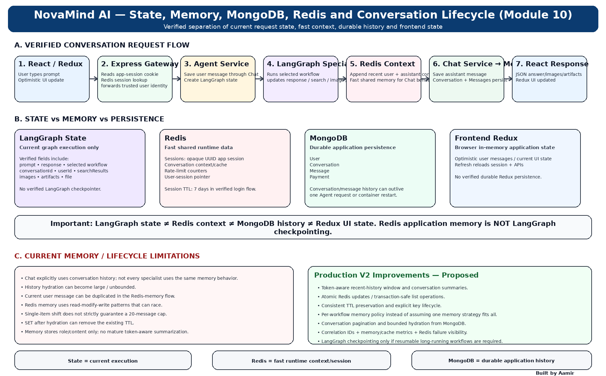

# Module 10 — State, Memory, MongoDB, Redis and Conversation Lifecycle

> **Project:** NovaMind-AI-LangGraph-Multi-Agent-AWS-Platform  
> **Purpose:** Build a deep understanding of how NovaMind manages current workflow state, fast conversation context, user sessions, durable conversations/messages, frontend state, restart behavior, memory limitations, consistency risks, and Production V2 improvements.  
> **Accuracy rule:** Keep LangGraph state, Redis application memory, MongoDB persistence, and frontend Redux state separate. NovaMind does **not** use verified LangGraph checkpointing.

---

## Module 10 Visual Architecture



> Place the image at: `learning/images/10-state-memory-mongodb-redis-conversation-lifecycle.png`

---

# Module 10 Mental Model

Remember this first:

```text
LangGraph State
= current AI workflow execution

Redis
= fast shared runtime state
  sessions + conversation context/cache + rate counters

MongoDB
= durable application data
  users + conversations + messages + payments

Redux
= current browser UI state
```

And the most important distinction:

```text
Redis conversation context
≠
LangGraph checkpointing
```

---

# Concept 1 — What Is State?

State is data describing what is happening **right now**.

In NovaMind's graph, state can include:

```text
prompt
response
selected workflow
conversationId
userId
searchResults
images
artifacts
file
```

This state helps nodes communicate during one graph execution.

---

# Concept 2 — What Is Memory?

Memory means information from earlier interactions is reused later.

Examples:

- recent chat messages
- conversation history
- summaries
- stored user context

Memory is broader than current graph state.

---

# Concept 3 — What Is Persistence?

Persistence means data is stored so it can survive beyond the current in-memory request.

Example:

```text
Message saved in MongoDB
```

can survive after the Agent request finishes.

---

# Concept 4 — State vs Memory vs Persistence

```text
State
→ current execution

Memory
→ previous information reused

Persistence
→ durable storage across requests/restarts
```

One system can use all three.

---

# Concept 5 — Four Important NovaMind State Layers

NovaMind effectively has four different state layers:

1. LangGraph state
2. Redis runtime state
3. MongoDB durable state
4. Frontend Redux state

Confusing these is one of the easiest ways to give a weak interview answer.

---

# Concept 6 — LangGraph State

LangGraph state belongs to the current graph execution.

It helps route and coordinate the active AI workflow.

It is not the durable conversation database.

---

# Concept 7 — Redis Runtime State

Redis is used for fast shared runtime data such as:

- application sessions
- conversation context/cache
- rate counters
- user-session pointer behavior

Redis supports multiple backend instances because it is external shared state.

---

# Concept 8 — MongoDB Durable State

MongoDB stores persistent application entities.

Verified models include:

```text
User
Conversation
Message
Payment
```

This is where long-lived conversation/message history belongs.

---

# Concept 9 — Redux Frontend State

Redux is browser-side application state.

It can hold:

- current user data
- visible conversation state
- optimistic messages
- UI selections

The verified project does not use mature durable Redux persistence.

After refresh, the frontend reloads data from backend/session APIs.

---

# Concept 10 — Why Redis Is Useful in a Multi-Service App

If session data lived only inside one Node.js process:

```text
Request 1 → Task A
Request 2 → Task B
```

Task B might not know the user's session.

Redis provides shared state accessible across service instances.

---

# Concept 11 — NovaMind Session Model

NovaMind uses an application session based on an opaque UUID stored in Redis.

This is separate from the Firebase ID token used during login.

Important:

```text
Firebase ID token
≠
NovaMind app session
```

---

# Concept 12 — Login Session Flow

Simplified:

```text
Google Sign-In
 ↓
Firebase ID Token
 ↓
Auth verifies token
 ↓
Find/Create User in MongoDB
 ↓
Generate opaque UUID session
 ↓
Store session snapshot in Redis
 ↓
Set HTTP-only cookie
```

---

# Concept 13 — Session TTL

The verified login flow uses a Redis session TTL of about:

```text
7 days
```

TTL means the session key expires automatically after the configured period.

---

# Concept 14 — What Does the Browser Send Later?

The browser sends the application session cookie.

The Gateway reads it and checks Redis.

If valid:

```text
Session
→ user identity
```

Then trusted identity is forwarded to downstream services.

---

# Concept 15 — Session ≠ Conversation Memory

A session answers:

> “Who is this user?”

Conversation memory answers:

> “What has been discussed?”

They are different concerns even though Redis participates in both.

---

# Concept 16 — Conversation Record

A Conversation record is durable metadata for a chat thread.

It can represent things like:

- owner/user
- title
- timestamps

The exact model fields should be stated only if verified from source.

---

# Concept 17 — Message Record

Message records persist chat turns.

Typical conceptual fields include:

- conversation ID
- role
- content
- metadata

In NovaMind, user and assistant messages are saved through the Chat service.

---

# Concept 18 — User Record

The User model stores application user/account information.

It is separate from conversation/message records.

---

# Concept 19 — Payment Record

Payment data lives in MongoDB too, but it belongs to Billing/accounting concerns rather than conversation memory.

It matters because MongoDB is used for multiple durable business entities.

---

# Concept 20 — Conversation Creation

When the user sends the first message:

```text
If conversation does not exist
→ create conversation
```

Then the message can be associated with that conversation ID.

---

# Concept 21 — Optimistic UI Update

The frontend can show the user's message immediately before the backend completes.

This is called an optimistic UI update.

Benefit:

- faster perceived response

Risk:

- backend may fail after UI already displayed the message

---

# Concept 22 — User Message Persistence

The Agent service calls the Chat service to save the user's message.

Conceptually:

```text
Agent
 ↓
Chat
 ↓
MongoDB
```

This preserves the conversation persistence boundary.

---

# Concept 23 — Why Agent Does Not Own Message Persistence Directly

Separating Chat persistence provides:

- clearer responsibility
- centralized conversation logic

Trade-off:

- synchronous network dependency
- partial-failure risk

---

# Concept 24 — Current AI Request State Initialization

When Agent receives the request, it builds state from values such as:

```text
prompt
conversationId
userId
selected workflow
file
```

Then LangGraph routing begins.

---

# Concept 25 — State Changes During the Workflow

A specialist can update state.

Examples:

```text
Search
→ searchResults + response

Coding
→ artifacts

Image Generation
→ images

Chat
→ response
```

---

# Concept 26 — Assistant Message Persistence

After the specialist produces a response, the assistant message is saved through Chat.

So generation and durable persistence are separate stages.

---

# Concept 27 — Why Generation and Persistence Separation Matters

Possible case:

```text
LLM succeeds
 ↓
Assistant answer exists
 ↓
Chat persistence fails
```

This is partial success.

---

# Concept 28 — Redis Conversation Context

Redis stores fast conversation context for ongoing chat behavior.

This helps avoid reading all conversation history from MongoDB on every step.

---

# Concept 29 — MongoDB Conversation History

MongoDB is the durable history source.

If Redis conversation context is missing, the application can hydrate recent context from MongoDB.

That is different from graph checkpointing.

---

# Concept 30 — Hydration

Hydration means loading durable history into fast runtime memory.

Conceptually:

```text
Redis context missing
 ↓
Read conversation history from MongoDB
 ↓
Build Redis context
```

---

# Concept 31 — Why Hydration Exists

Benefits:

- Redis stays fast
- durable history remains in MongoDB
- cache can be rebuilt after expiry/miss

Trade-off:

- large history can create expensive hydration

---

# Concept 32 — Current Unbounded Hydration Concern

The verified review found history hydration can become effectively unbounded.

That can cause:

- large Redis values
- high token usage later
- memory growth
- latency

A production design should bound the amount loaded.

---

# Concept 33 — Current User Message Duplication Issue

The verified memory flow can duplicate the current user message.

Conceptually:

```text
Current message already exists in loaded history
+
Current message appended again
```

This can cause repeated context sent to the model.

---

# Concept 34 — Why Message Duplication Matters

Effects:

- repeated prompt content
- unnecessary tokens
- model confusion
- distorted conversation flow

---

# Concept 35 — Read-Modify-Write Race

A common Redis pattern can be:

```text
GET current history
 ↓
Modify in application
 ↓
SET new history
```

If two requests happen simultaneously, both may read the same old state and overwrite each other.

This is a race condition.

---

# Concept 36 — Example Race

```text
Request A reads [M1, M2]
Request B reads [M1, M2]

A writes [M1, M2, A]
B writes [M1, M2, B]
```

One update can disappear.

---

# Concept 37 — Atomic Redis Operations

A stronger design uses atomic Redis primitives.

Examples conceptually:

- lists
- transactions
- Lua
- optimistic locking
- streams

The exact choice depends on requirements.

---

# Concept 38 — Current Message-Limit Weakness

The review found a single `shift` behavior rather than strict trimming.

That means the intended message cap is not rigorously guaranteed if the list grows beyond the expected size.

---

# Concept 39 — Stronger History Limit

A better approach:

```text
append message
 ↓
trim list to bounded window
```

or use token-aware selection.

---

# Concept 40 — Message Count vs Token Count

Twenty short messages and twenty very long messages are very different.

Therefore:

```text
message count
≠
token budget
```

For LLM context, token-aware memory is stronger.

---

# Concept 41 — Token-Aware Memory

Token-aware memory selects history based on model input budget.

Example:

```text
System Prompt
+
Recent Messages
+
Summary
+
Retrieved Context
≤ Context Budget
```

---

# Concept 42 — Conversation Summary

A summary compresses older history.

Example:

```text
Older 40 messages
 ↓
Summary
```

Then keep:

```text
Summary + recent 8 messages
```

This can reduce token growth.

---

# Concept 43 — Summary Trade-Off

Summaries can lose details.

So a production design may keep:

- durable full history in MongoDB
- compact summary for model context
- recent raw messages

---

# Concept 44 — Redis TTL

TTL automatically expires keys.

Useful for:

- sessions
- temporary conversation context
- rate counters

But TTL must be preserved correctly after writes.

---

# Concept 45 — Current TTL-Loss Concern

The verified review found that after hydration, a normal `SET` can remove the previous TTL.

That means a key intended to expire can accidentally become persistent.

---

# Concept 46 — Why TTL Loss Matters

Consequences:

- stale context can remain indefinitely
- Redis memory grows
- privacy/retention behavior changes
- old data may be reused unexpectedly

---

# Concept 47 — Preserving TTL

Production approaches include:

- write with TTL every time
- preserve existing TTL
- atomic commands/scripts

The exact implementation should be explicit.

---

# Concept 48 — Redis Key Types Have Different Lifetimes

A session might need days.

A rate-limit key might need minutes.

Conversation context may need a shorter bounded period.

One TTL policy should not automatically apply to everything.

---

# Concept 49 — Shared Redis Client, Different Responsibilities

NovaMind uses Redis for several distinct responsibilities.

This creates operational coupling.

A Redis outage can affect:

- login/session validation
- conversation context
- rate limiting

---

# Concept 50 — Redis as a Critical Dependency

Even if MongoDB is healthy, Redis failure can disrupt authenticated requests because sessions depend on Redis.

This is why Redis reliability matters.

---

# Concept 51 — Redis Persistence vs Application Persistence

Redis itself may be configured with persistence/failover depending on infrastructure.

But application architecture should not assume every Redis key is durable business data.

MongoDB remains the durable conversation/message store.

---

# Concept 52 — What Happens if Redis Context Expires?

The application may:

```text
miss Redis context
 ↓
load durable conversation history from MongoDB
 ↓
rebuild context
```

This is cache hydration.

---

# Concept 53 — What Happens if Redis Session Expires?

The app session is no longer valid.

The user must establish a new valid application session.

Conversation records in MongoDB can still remain.

---

# Concept 54 — Session Expiry ≠ Conversation Deletion

Important:

```text
Redis session expires
≠
MongoDB conversation deleted
```

Authentication lifecycle and conversation retention are separate.

---

# Concept 55 — What Happens if MongoDB Is Down?

Potential impacts:

- conversations cannot be created/read reliably
- messages cannot persist
- users/account data may fail
- payment records can fail

Even if Redis has some cached context, durable history is compromised.

---

# Concept 56 — What Happens if Redis Is Down?

Potential impacts:

- session validation
- fast conversation context
- rate counters

can fail.

This can block or degrade requests even if MongoDB is available.

---

# Concept 57 — What Happens if Agent Crashes Mid-Request?

Without LangGraph checkpointing:

```text
in-flight graph execution
→ lost
```

Durable writes already completed in MongoDB/S3 may remain.

---

# Concept 58 — Partial State After Crash

Example:

```text
User message saved
 ↓
Agent crashes before assistant response
```

MongoDB may contain the user message without a matching assistant response.

That is a real lifecycle scenario.

---

# Concept 59 — Another Partial State Example

```text
Assistant generated
 ↓
Agent crashes before assistant persistence
```

The model output existed transiently but may not be present in durable conversation history.

---

# Concept 60 — LangGraph Checkpointing Would Solve a Different Problem

Checkpointing would persist workflow execution progress.

It is useful for:

- resumable workflows
- human approval
- long-running jobs

It is not the same as conversation history.

---

# Concept 61 — Why NovaMind Does Not Currently Need to Claim Checkpointing

The current workflows are synchronous and bounded.

You should accurately say:

> “Conversation history is stored in MongoDB and fast context in Redis, but graph execution itself is not durably checkpointed.”

---

# Concept 62 — Chat Memory Is Not Universal Across Specialists

Chat explicitly uses conversation history.

Search reaches the Chat path for synthesis.

Other specialists generally operate more on the current request.

Do not say every specialist has identical full-chat memory.

---

# Concept 63 — Why Different Specialists May Need Different Memory

Examples:

```text
Chat
→ recent conversation context useful

PDF RAG
→ uploaded PDF + current question more important

Image Generation
→ current text prompt may be enough

Coding
→ prior project context might help, but current implementation is not a mature long-term coding memory system
```

---

# Concept 64 — Per-Workflow Memory Policy

Production V2 can define memory rules by workflow.

Example:

```text
Chat
→ summary + recent messages

Search
→ recent query context

PDF RAG
→ document context + minimal conversation history

Image Generation
→ mostly current prompt
```

---

# Concept 65 — Why More Memory Is Not Always Better

More history means:

- more tokens
- more latency
- more cost
- more irrelevant content
- greater privacy exposure

Memory should be selective.

---

# Concept 66 — Conversation Context Window

The LLM receives only what the application chooses to include.

The model does not automatically have access to MongoDB or Redis.

Application code must load and insert context.

---

# Concept 67 — Stored History ≠ Model Memory

A message can exist in MongoDB but not affect the model unless the application sends it in the prompt/context.

This distinction is crucial.

---

# Concept 68 — Model Context ≠ Database History

```text
Database
→ potentially full durable record

Model context
→ selected subset used for one inference
```

---

# Concept 69 — Why This Matters for Debugging

If an old fact is stored in MongoDB but the model ignores it:

The problem may be:

- context selection
- hydration
- truncation
- prompt construction

not MongoDB persistence.

---

# Concept 70 — Conversation Title

The project can create/update conversation title metadata.

That is separate from message content and memory.

---

# Concept 71 — Conversation Ownership

A conversation should belong to a specific user.

Authorization must verify that user before retrieval/update.

The verified project has partial authorization/tenant-isolation gaps, so this area needs hardening.

---

# Concept 72 — Missing Ownership Checks Are Serious

If message retrieval or title/message operations do not verify ownership, one user's identifier could potentially be used against another user's resource.

This is not a memory problem only; it is an authorization problem.

---

# Concept 73 — State Identity Must Be Trusted

Fields such as:

```text
userId
conversationId
```

must originate from trusted server-side session/authorization logic.

Do not trust arbitrary browser values.

---

# Concept 74 — Gateway Identity Propagation

Gateway resolves the Redis-backed session and forwards identity to downstream services.

That identity should overwrite or ignore untrusted client-supplied identity headers.

---

# Concept 75 — Chat Service Database Responsibility

Chat owns conversation/message behavior conceptually.

This is a useful boundary.

However, the broader project has some service-boundary coupling, including Auth admin directly reading Chat/Billing databases.

---

# Concept 76 — Why Cross-Service DB Reads Weaken Boundaries

If Auth directly queries another service's database:

- schema ownership becomes shared
- services become more coupled
- independent change becomes harder

This is a broader architecture concern.

---

# Concept 77 — Conversation Pagination

Loading every message in a large conversation is expensive.

Production APIs should support pagination or bounded windows.

This applies to:

- UI history
- memory hydration
- admin views

---

# Concept 78 — Recent Window

A simple memory strategy:

```text
Keep last N messages
```

This is easy but ignores token size.

Better than unlimited history, but not ideal.

---

# Concept 79 — Summary + Recent Window

Stronger pattern:

```text
Durable full history in MongoDB

Model Context:
summary of old history
+
recent messages
```

This balances memory and cost.

---

# Concept 80 — Conversation Metadata vs Message Content

Conversation:

```text
thread-level metadata
```

Message:

```text
individual turn
```

Keeping them separate improves data modeling.

---

# Concept 81 — Why Separate Conversation and Message Collections?

Benefits:

- many messages per conversation
- simpler thread listing
- pagination
- independent message queries

---

# Concept 82 — Frontend Redux and Optimistic State

Frontend can temporarily show state that backend has not yet committed.

Therefore:

```text
Redux UI state
≠
durable truth
```

Backend persistence remains authoritative.

---

# Concept 83 — Refresh Behavior

Because Redux is not verified as durable persistence:

```text
browser refresh
 ↓
frontend reloads session/user/conversation data
```

This is normal.

---

# Concept 84 — Redis and Horizontal Scaling

Shared Redis allows multiple service tasks to validate the same session and access shared context.

This is important in a horizontally scaled ECS architecture.

---

# Concept 85 — MongoDB and Horizontal Scaling

Multiple service instances can use MongoDB as shared durable persistence.

But scaling application tasks does not automatically solve:

- DB bottlenecks
- race conditions
- query inefficiency

---

# Concept 86 — Read-Modify-Write Under Horizontal Scaling

Race conditions become more likely when multiple requests/tasks update the same Redis conversation key concurrently.

This is why atomic operations matter.

---

# Concept 87 — Conversation Ordering

Concurrent user requests can complete out of order.

Production systems may need:

- timestamps
- sequence IDs
- atomic append behavior

to preserve logical ordering.

---

# Concept 88 — Duplicate Requests

Retries or double-clicks can create duplicate messages.

Production V2 could use request/message IDs for idempotency.

---

# Concept 89 — Message Idempotency

Example:

```text
clientMessageId
```

If the same request arrives twice:

```text
same clientMessageId
→ do not save duplicate message
```

This is a proposed reliability improvement.

---

# Concept 90 — Session Revocation

A server-side session system can theoretically support revocation more directly than stateless tokens.

But NovaMind's current revocation behavior is partial.

Logout/session invalidation needs careful handling.

---

# Concept 91 — Stale Sessions

If account changes occur but old session snapshots remain valid, downstream behavior can use stale user/account information.

Production systems should decide when to refresh or invalidate sessions.

---

# Concept 92 — Admin Changes and Sessions

If an admin changes a user's account state, existing sessions may need invalidation depending on the change.

The current project does not have fully mature session invalidation behavior.

---

# Concept 93 — Memory Privacy

Conversation history can contain sensitive user information.

Controls include:

- authorization
- retention
- deletion
- logging discipline
- encryption where appropriate

---

# Concept 94 — Avoid Logging Full Memory

Logs should prefer:

- request ID
- route
- message count
- latency
- error type

rather than full private prompts/history.

---

# Concept 95 — Conversation Deletion

A mature delete operation should consider:

- Conversation record
- Message records
- Redis cached context
- related artifacts
- related document indexes if linked

Current lifecycle is not fully mature across all these resources.

---

# Concept 96 — Memory Observability

Useful metrics:

- Redis hit/miss rate
- context size
- message count
- hydration count
- hydration latency
- MongoDB query latency
- Redis errors
- session expirations
- context TTL
- duplicate/update conflict rate

---

# Concept 97 — Conversation Performance

Long conversations increase:

- DB read size
- Redis memory
- prompt tokens
- model latency
- model cost

Memory design directly affects AI performance.

---

# Concept 98 — Production V2 Priority 1: Bound Memory

First improve:

- bounded hydration
- recent window
- token budget

This prevents unlimited growth.

---

# Concept 99 — Production V2 Priority 2: Atomic Redis Updates

Replace fragile application read-modify-write patterns with atomic structures/operations.

This reduces lost updates.

---

# Concept 100 — Production V2 Priority 3: Preserve TTL

Every memory update should intentionally preserve or reset expiry.

TTL policy should be explicit per key type.

---

# Concept 101 — Production V2 Priority 4: Summarization

Summarize older history when conversations become large.

Keep the full original history in MongoDB.

---

# Concept 102 — Production V2 Priority 5: Idempotent Message Writes

Use request/message identifiers so retries do not duplicate conversation turns.

---

# Concept 103 — Production V2 Priority 6: Strong Ownership

Every conversation/message operation should verify user ownership.

This is more important than sophisticated memory algorithms.

---

# Concept 104 — Production V2 Priority 7: Memory Policy by Workflow

Do not load the same large context for every specialist.

Load only what the selected workflow needs.

---

# Concept 105 — Production V2 Priority 8: Observability

Track:

- context size
- context tokens
- Redis latency
- MongoDB latency
- hydration rate
- session failures

so memory behavior is measurable.

---

# Concept 106 — When to Add LangGraph Checkpointing

Only add it if workflows require:

- pause/resume
- human approval
- long-running execution
- crash recovery

Do not add checkpointing merely because LangGraph supports it.

---

# Concept 107 — Conversation Memory vs RAG Document Memory

Conversation memory:

```text
What did user and assistant say?
```

RAG document memory:

```text
Which document/index should be searched?
```

Module 09 showed the second is not maturely persistent.

These are separate systems.

---

# Concept 108 — Conversation Memory vs User Profile

Conversation memory is dialogue context.

User profile is account data.

Do not combine them conceptually.

---

# Concept 109 — Conversation Memory vs Session

Conversation memory can exist after the login session expires.

Session = authentication state.

Conversation = application content.

---

# Concept 110 — Strong Interview Explanation

> NovaMind separates current workflow state, fast runtime context, durable conversation history, and frontend state. LangGraph state exists for one AI execution. Redis is used for the opaque application session, recent conversation context/cache and rate counters. MongoDB stores durable users, conversations, messages and payments. The React/Redux frontend keeps current UI state and reloads backend data on refresh. The project does not use LangGraph checkpointing, and current Redis conversation memory still needs improvements such as bounded/token-aware history, atomic updates and consistent TTL handling.

---

# Quick Revision — Module 10

## Core distinction

```text
LangGraph State
→ current AI execution

Redis Session
→ who is the authenticated app user

Redis Conversation Context
→ fast recent memory/cache

MongoDB Conversation + Message
→ durable history

Redux
→ current browser UI state
```

## Current conversation flow

```text
User sends message
→ optimistic Redux update
→ Gateway validates Redis session
→ Agent calls Chat to save user message
→ LangGraph specialist runs
→ Redis recent context updated
→ Chat saves assistant message to MongoDB
→ response returns to frontend
```

## Current memory weaknesses

```text
Potentially unbounded hydration
Current user message duplication
Read-modify-write races
Weak strict message-cap enforcement
TTL can be lost after hydration SET
No mature token-aware summarization
Not all specialists use the same memory behavior
No LangGraph checkpointing
```

## Production V2

```text
Bounded / token-aware context
Summary + recent window
Atomic Redis updates
TTL-safe writes
Pagination
Idempotent message IDs
Strong ownership checks
Per-workflow memory policy
Memory observability
Optional LangGraph checkpointing only when needed
```

## Best interview sentence

> **NovaMind uses LangGraph state for the current AI workflow, Redis for fast shared runtime state such as sessions and recent conversation context, MongoDB for durable conversation/message history, and Redux for browser UI state; these layers solve different problems and should not be confused.**

**Module 10 learning file complete.**
