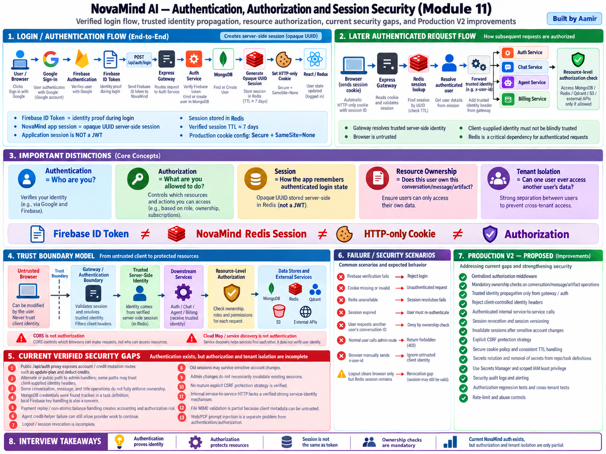

# Module 11 — Authentication, Authorization and Session Security

> **Project:** NovaMind-AI-LangGraph-Multi-Agent-AWS-Platform  
> **Purpose:** Learn authentication, authorization, identity, Redis-backed sessions, cookies, trusted identity propagation, resource ownership, tenant isolation, admin security, service-to-service trust, secrets, CSRF/XSS, file-upload security, failure handling, and Production V2 hardening from zero, then connect every concept to NovaMind.  
> **Accuracy rule:** This file separates **PROJECT FACT**, **GENERAL CONCEPT**, and **PRODUCTION V2 RECOMMENDATION**. Do not describe a recommendation as a current feature.

---

## Module 11 Visual Architecture



> Use the already-generated image at: `learning/images/11-authentication-authorization-session-security.png`

---

# 1. Core Mental Model

```text
Authentication
= Who are you?

Authorization
= What are you allowed to do?

Session
= How the application remembers that you already authenticated

Resource Ownership
= Can this authenticated user access THIS specific resource?

Tenant Isolation
= Can User A ever access User B's data?
```

NovaMind's verified login/session flow:

```text
User
 ↓
Google Sign-In
 ↓
Firebase
 ↓
Firebase ID Token
 ↓
POST /api/auth/login
 ↓
Express Gateway
 ↓
Auth Service
 ↓
Verify Firebase Token
 ↓
Find/Create User in MongoDB
 ↓
Generate Opaque UUID Session
 ↓
Store Session in Redis
 ↓
Set HTTP-only Cookie
 ↓
React / Redux User State
```

Later requests:

```text
Browser Cookie
 ↓
Express Gateway
 ↓
Redis Session Lookup
 ↓
Resolve Trusted User Identity
 ↓
Forward Trusted Identity
 ↓
Auth / Chat / Agent / Billing
 ↓
Resource-Level Authorization
```

Critical distinction:

```text
Firebase ID Token
≠
NovaMind Redis Session
≠
HTTP-only Cookie
≠
Authorization
```

---

# 2. Authentication from Zero

## Concept 1 — What Is Authentication?

**GENERAL CONCEPT**

Authentication answers:

> “Who are you?”

Examples include password login, passkeys, Google login, SSO and certificates.

In NovaMind, Google/Firebase identity is used during login.

---

## Concept 2 — What Is Identity?

**GENERAL CONCEPT**

Identity is the application's representation of a user.

Examples:

```text
userId
email
name
provider identity
```

Identity is not permission.

---

## Concept 3 — What Is Authorization?

**GENERAL CONCEPT**

Authorization answers:

> “What are you allowed to do?”

Examples:

```text
Can this user read this conversation?
Can this user delete this message?
Can this user call an admin endpoint?
Can this user mutate credits?
```

---

## Concept 4 — Authentication vs Authorization

```text
Authentication
→ establish identity

Authorization
→ check permission
```

Example:

```text
User A logs in successfully
→ authenticated

User A asks for User B's conversation
→ authorization must reject
```

---

## Concept 5 — Why This Difference Matters in NovaMind

**PROJECT FACT**

NovaMind has real authentication controls, but some resource-authorization and tenant-isolation checks are incomplete.

Therefore:

```text
valid login
≠
permission to every resource
```

---

# 3. Google Sign-In and Firebase

## Concept 6 — Google Sign-In

**PROJECT FACT**

The frontend uses Google sign-in through Firebase.

After successful sign-in, the browser obtains a Firebase ID token.

---

## Concept 7 — Firebase's Role

**PROJECT FACT**

Firebase handles identity verification during login.

It does not replace NovaMind's own application session.

---

## Concept 8 — Firebase ID Token

**PROJECT FACT**

The frontend sends the Firebase ID token to the backend login flow.

The backend verifies it before establishing an application session.

---

## Concept 9 — Verification Failure

If Firebase verification fails:

```text
No trusted identity
 ↓
No NovaMind session should be created
```

This is an authentication failure.

---

## Concept 10 — Find or Create User

**PROJECT FACT**

After token verification:

```text
verified Firebase identity
 ↓
MongoDB User lookup
 ↓
find existing user
or
create application user
```

The durable application user record is in MongoDB.

---

# 4. NovaMind Application Session

## Concept 11 — Opaque UUID Session

**PROJECT FACT**

NovaMind creates its own opaque UUID-style application session after Firebase verification.

Opaque means the browser does not need to decode user claims from it.

---

## Concept 12 — App Session Is Not a JWT

**PROJECT FACT**

Do not say:

> “NovaMind uses JWT application sessions.”

The verified app session is server-side and Redis-backed.

---

## Concept 13 — Redis Session Store

**PROJECT FACT**

NovaMind stores the application session state in Redis.

This is a server-side session architecture.

---

## Concept 14 — Session Snapshot

**PROJECT FACT**

The login flow stores a Redis session snapshot representing the logged-in application user/session state.

---

## Concept 15 — User-Session Pointer

**PROJECT FACT**

A user-session pointer is also used in the verified login design.

Do not overstate this as a complete multi-device session registry unless verified.

---

## Concept 16 — Session TTL

**PROJECT FACT**

The verified application-session TTL is approximately:

```text
7 days
```

TTL = Time To Live.

---

## Concept 17 — HTTP-only Cookie

**PROJECT FACT**

The browser receives the application session credential in an HTTP-only cookie.

HTTP-only reduces direct JavaScript access to that cookie.

---

## Concept 18 — Secure Flag

**PROJECT FACT**

Production cookie configuration uses the `Secure` flag.

That means the browser should send it only over HTTPS.

---

## Concept 19 — SameSite=None

**PROJECT FACT**

Production cookie configuration includes:

```text
SameSite=None
```

This can be necessary for cross-site frontend/backend deployments, but it increases the importance of an explicit CSRF strategy.

---

# 5. Firebase Token vs NovaMind Session

## Concept 20 — Two Separate Credentials / Roles

```text
Firebase ID Token
→ proves Google/Firebase identity during login

NovaMind Session ID
→ maintains application login state after login
```

They solve different problems.

---

## Concept 21 — Why Create a Second Session?

**GENERAL DESIGN REASONING**

Benefits:

- application-controlled session lifecycle
- central server-side state
- possible server-side revocation
- shared login state across backend instances

Trade-off:

- Redis becomes a critical authentication dependency

---

## Concept 22 — Cookie vs Redis State

Mental model:

```text
Browser Cookie
→ carries/references session credential

Redis
→ contains server-side session state
```

The cookie is not the whole session database.

---

# 6. Later Authenticated Request

## Concept 23 — Browser Sends Cookie

**PROJECT FACT**

On later requests, the browser sends the app-session cookie when browser cookie rules permit.

---

## Concept 24 — Gateway Session Lookup

**PROJECT FACT**

The Express Gateway reads the cookie and looks up the session in Redis.

---

## Concept 25 — Resolve Trusted User

**PROJECT FACT**

If the session is valid:

```text
session ID
 ↓
Redis
 ↓
trusted user identity
```

---

## Concept 26 — Missing Cookie

Missing session cookie on a protected endpoint means the server has no application authentication credential.

Expected behavior:

```text
401-style authentication failure
```

---

## Concept 27 — Expired Session

If Redis no longer contains the session because it expired:

```text
old cookie
≠
valid authenticated session
```

The user needs a new login/session.

---

## Concept 28 — Invalid Session ID

A random/tampered session credential should not resolve to a valid Redis session.

The protected request should be rejected.

---

## Concept 29 — Redis Is Critical for Authenticated Requests

**PROJECT FACT**

Because Gateway session validation depends on Redis, Redis failure can block/degrade authenticated API requests.

---

# 7. Trusted Identity Propagation

## Concept 30 — Gateway as Trust Boundary

The Gateway sits between:

```text
Untrusted client request
and
trusted server-side identity
```

---

## Concept 31 — `x-user-id`

**PROJECT FACT**

NovaMind uses internal identity conventions such as:

```text
x-user-id
```

after the Gateway resolves the authenticated user.

---

## Concept 32 — Client-Supplied Identity Is Untrusted

A browser can manually send:

```http
x-user-id: victim-user
```

Therefore the backend must not treat a client-provided identity header as authentication proof.

---

## Concept 33 — Identity Overwrite

**PROJECT FACT**

Protected Gateway behavior can overwrite identity with the session-resolved server value.

That is the correct trust direction.

---

## Concept 34 — Downstream Services

Trusted identity can be forwarded to services such as:

- Auth
- Chat
- Agent
- Billing

But authorization must still happen for the requested action/resource.

---

# 8. Resource Authorization

## Concept 35 — Resource Ownership

A logged-in user still needs authorization for specific resources.

Examples:

```text
conversation
message
artifact
document
payment/account object
```

---

## Concept 36 — Conversation Ownership

Secure pattern:

```text
Authenticated user ID
+
conversation ID
 ↓
lookup resource
 ↓
verify owner matches
```

---

## Concept 37 — Resource ID Is Not Permission

A client can change:

```text
conversationId
messageId
artifactId
```

Knowing an ID does not prove permission.

---

## Concept 38 — Verified Ownership Gaps

**PROJECT FACT**

The review identified incomplete ownership checks around operations including:

- message retrieval
- title operations
- message creation

This is a tenant-isolation weakness.

---

## Concept 39 — Authentication Alone Cannot Fix Ownership

Even a perfectly valid Redis session only proves:

```text
who the user is
```

It does not prove:

```text
the resource belongs to that user
```

---

## Concept 40 — Tenant Isolation

Tenant isolation means:

```text
User A
must never read/change
User B's data
```

Relevant stores include:

- MongoDB
- Qdrant
- S3
- Redis context
- billing/account state

---

# 9. Public Account Mutation Risk

## Concept 41 — Public `/api/auth` Proxy

**PROJECT FACT**

The review found that a public `/api/auth` proxy exposes sensitive account/credit mutation routes such as:

```text
/update-plan
/deduct-credits
```

with identity potentially coming from request data.

---

## Concept 42 — Why This Is High Risk

Credit/plan mutations affect:

- account value
- provider-cost control
- user entitlement

A client must not be able to choose another user's identity for these operations.

---

## Concept 43 — Correct Pattern

**PRODUCTION V2 RECOMMENDATION**

Use:

```text
server-resolved authenticated user
+
explicit permission
```

not:

```text
client body userId
→ trusted directly
```

---

# 10. Admin Authorization

## Concept 44 — Admin Access

Admin APIs require both:

```text
authentication
+
admin authorization
```

---

## Concept 45 — Current Admin Email Compare

**PROJECT FACT**

The project contains admin behavior based on an email comparison.

This is simple authorization logic, not mature RBAC.

---

## Concept 46 — Alternate/Public Admin Path

**PROJECT FACT**

The review found an alternate/public path to admin handlers.

This can undermine the intended protected route.

---

## Concept 47 — Why Route Mounting Matters

A handler may be secure under one router but insecure through another mount.

Security testing must cover every route path.

---

## Concept 48 — RBAC

**GENERAL CONCEPT**

RBAC = Role-Based Access Control.

Example:

```text
user
admin
support
```

Permissions are assigned to roles.

Mature RBAC is not verified in NovaMind.

---

## Concept 49 — RBAC vs Ownership

```text
RBAC
→ global permission categories

Ownership
→ permission to a specific user's object
```

You often need both.

---

# 11. Internal Service-to-Service Trust

## Concept 50 — Internal Calls

**PROJECT FACT**

Examples include:

```text
Agent → Chat
Agent → Auth
Billing → Auth
```

---

## Concept 51 — Private Network Is Not Authentication

A private VPC/subnet can reduce reachability.

It does not cryptographically identify the calling service.

---

## Concept 52 — Cloud Map Is Not Authentication

**PROJECT FACT**

Cloud Map/service discovery helps a service locate another service.

It does not prove who the caller is.

---

## Concept 53 — No Verified Strong Service Identity

**PROJECT FACT**

No mature verified mechanism such as mTLS or signed service identity is established in the current project.

Do not claim zero-trust internal auth.

---

## Concept 54 — Production V2 Service Authentication

Possible future designs:

- service tokens
- mTLS
- signed requests
- IAM-integrated private APIs

The exact solution should be chosen based on the architecture.

---

# 12. Logout and Revocation

## Concept 55 — What Logout Should Mean

A secure logout should invalidate the application session server-side and clear the browser credential.

---

## Concept 56 — Browser Clear ≠ Server Revocation

```text
clear browser cookie
```

does not automatically mean:

```text
Redis session deleted
```

---

## Concept 57 — Current Revocation Is Partial

**PROJECT FACT**

The review found incomplete logout/session-revocation behavior.

---

## Concept 58 — Why Revocation Matters

If a session credential is stolen, clearing only the legitimate user's browser does not invalidate the stolen copy.

---

## Concept 59 — Stale Session Snapshot

**PROJECT FACT**

Older sessions can contain stale account/user state.

---

## Concept 60 — Sensitive Account Changes

Production systems should decide whether events such as account disable, privilege changes, or security changes invalidate existing sessions.

---

## Concept 61 — Admin Change and Old Sessions

**PROJECT FACT**

The current project does not verify a mature universal “invalidate all affected sessions” mechanism after important admin/account changes.

---

# 13. 401 vs 403

## Concept 62 — 401 Unauthorized

In HTTP practice, 401 usually means:

> Authentication is missing or invalid.

Examples:

- missing cookie
- invalid session
- expired session

---

## Concept 63 — 403 Forbidden

403 means:

> Identity is known, but the user is not allowed to perform this action.

Example:

```text
User A authenticated
tries User B's conversation
→ 403
```

---

## Concept 64 — Why Correct Status Matters

Correct failure semantics improve:

- frontend behavior
- monitoring
- security analytics
- troubleshooting

---

# 14. CSRF

## Concept 65 — What Is CSRF?

CSRF = Cross-Site Request Forgery.

A malicious site attempts to trigger state-changing requests using the victim's automatically sent cookies.

---

## Concept 66 — Why Cookie Sessions Need CSRF Design

Browsers may automatically attach cookies.

The attacker does not need to read the cookie to attempt a cross-site request.

---

## Concept 67 — CORS ≠ CSRF Protection

CORS controls browser response access.

It is not a substitute for authorization or a complete CSRF strategy.

---

## Concept 68 — Current CSRF Status

**PROJECT FACT**

No mature explicit CSRF strategy is verified in the project.

---

## Concept 69 — Production V2 CSRF

Possible controls:

- CSRF token
- origin/referer validation
- appropriate SameSite policy
- endpoint-specific protection

---

# 15. XSS

## Concept 70 — What Is XSS?

XSS = Cross-Site Scripting.

Malicious JavaScript executes in a trusted application origin.

---

## Concept 71 — HTTP-only Helps but Does Not Solve XSS

HTTP-only reduces direct cookie reading.

But malicious JavaScript may still:

- read visible data
- manipulate the UI
- issue authenticated requests

---

## Concept 72 — Code Preview

**PROJECT FACT**

The coding workflow uses a sandboxed iframe for compatible browser preview.

This should not be described as a complete secure arbitrary-code execution environment.

---

# 16. CORS

## Concept 73 — What Is CORS?

CORS is a browser cross-origin response-sharing policy.

---

## Concept 74 — What CORS Is Not

CORS is not:

- authentication
- authorization
- tenant isolation
- internal service identity

---

## Concept 75 — Non-Browser Clients

A server-side attacker or direct API client is not stopped by browser CORS rules.

Backend auth checks are still mandatory.

---

# 17. Session Hijacking and Fixation

## Concept 76 — Session Hijacking

A valid session credential is stolen and reused.

Defenses include:

- HTTPS
- Secure
- HTTP-only
- appropriate TTL
- revocation
- monitoring

---

## Concept 77 — Session Fixation

An attacker attempts to make a victim use a session ID known to the attacker.

A secure design creates a fresh unpredictable session after authentication.

NovaMind creates a fresh opaque session after login.

---

## Concept 78 — Session Entropy

Session IDs should be unpredictable.

UUID-style random application sessions are used in the verified project.

---

# 18. Secrets and Credentials

## Concept 79 — What Is a Secret?

Examples:

- MongoDB password
- provider API key
- payment secret
- Firebase private key

Secrets must not be exposed to browsers or committed in source.

---

## Concept 80 — Secrets Manager References

**PROJECT FACT**

AWS task definitions use Secrets Manager references for runtime secrets.

This is a positive design direction.

---

## Concept 81 — Tracked MongoDB Credentials

**PROJECT FACT**

The review found MongoDB credentials tracked in task-definition/source context.

This is a serious credential-management issue.

---

## Concept 82 — Local Firebase Key

**PROJECT FACT**

A local Firebase key exists but is ignored from source control.

It still needs secure local handling.

---

## Concept 83 — What to Do After Exposure

**GENERAL SECURITY PRACTICE**

1. rotate/revoke
2. remove from current source
3. use managed secret delivery
4. review history exposure
5. audit use

Do not claim rotation has already occurred unless verified.

---

# 19. IAM

## Concept 84 — ECS Execution Role

General AWS role used by ECS for startup operations such as image pull, logs and startup-secret retrieval.

---

## Concept 85 — Task Role

General AWS role assumed by application code in the running task.

---

## Concept 86 — Least Privilege

Grant only permissions required for that service.

Role existence alone does not prove least privilege.

---

## Concept 87 — IAM Verification Boundary

**PROJECT FACT**

The verified report did not live-inspect every effective IAM policy.

Do not claim fully verified least privilege.

---

# 20. File Upload Security

## Concept 88 — Upload Attack Surface

Files can be:

- oversized
- malformed
- spoofed MIME
- malicious content
- prompt-injection carriers

---

## Concept 89 — Current Upload Controls

**PROJECT FACT**

Multer includes MIME checks and approximately a 20 MiB size limit.

---

## Concept 90 — MIME Is Partial Validation

Client-supplied MIME metadata can be wrong or spoofed.

Stronger validation may inspect the actual file signature/content.

---

## Concept 91 — Cleanup

Temporary uploads should be deleted after processing.

Cleanup failures can leave sensitive data on local disk.

---

# 21. Prompt Injection vs Auth

## Concept 92 — Prompt Injection

Untrusted content attempts to manipulate the model's intended instructions.

Sources include:

- user prompt
- PDF
- web results
- image text

---

## Concept 93 — Logged-In User Content Is Still Untrusted

Authentication proves identity.

It does not make user content safe.

---

## Concept 94 — Prompt Injection Cannot Grant Authorization

The model must never become the authority for resource access.

Authorization belongs to deterministic backend code.

---

## Concept 95 — Retrieved Content as Data

Treat external/retrieved content as untrusted data, not privileged instructions.

---

# 22. Credits and Account Security

## Concept 96 — Credits Are Security-Sensitive State

Credits control account entitlement and provider-cost behavior.

Mutation endpoints need strict authorization.

---

## Concept 97 — Credit Helper Failure

**PROJECT FACT**

The verified review found cases where the Agent credit helper can fail while provider work continues.

This is a cost/control weakness.

---

## Concept 98 — Payment Replay / Atomicity

**PROJECT FACT**

Payment replay and non-atomic credit granting are current consistency risks.

Module 12 covers these deeply.

---

# 23. Security Logging

## Concept 99 — Authentication Events

Useful events:

- login success/failure
- invalid token
- session creation
- session expiration
- logout/revocation

Do not log raw session credentials.

---

## Concept 100 — Authorization Events

Useful events:

- 403 denials
- ownership mismatch
- admin access
- suspicious repeated attempts

---

## Concept 101 — Audit Logs

Audit logs record sensitive state-changing actions.

Examples:

- admin changes
- credit changes
- session revocation
- payment state changes

Mature audit logging is not verified today.

---

# 24. Troubleshooting Authentication

## Concept 102 — Firebase Login Failure

Check:

1. Google/Firebase sign-in
2. ID token creation
3. backend verification
4. Auth configuration
5. Firebase credentials
6. Auth logs

---

## Concept 103 — Login Works, Later Request 401

Check:

- cookie was set
- browser sends cookie
- cookie domain/path
- Secure/SameSite
- Redis session exists
- session TTL
- Gateway session lookup

---

## Concept 104 — Works Local, Fails Production

Common areas:

- HTTPS
- Secure cookie
- SameSite
- frontend/backend origin configuration
- credentialed CORS behavior
- Redis connectivity

---

## Concept 105 — Redis Outage

Secure behavior:

```text
cannot validate session
→ fail closed
```

Do not trust a client user ID as fallback.

---

# 25. Troubleshooting Authorization

## Concept 106 — Cross-User Data Exposure

If User A can read User B's data, treat it as a severe security issue.

Inspect:

- ownership query
- identity source
- alternate routes
- admin bypass
- client-supplied IDs

---

## Concept 107 — Fake `x-user-id`

Secure behavior:

```text
ignore/overwrite client value
```

with session-resolved identity.

---

## Concept 108 — Normal User Hits Admin

Inspect every route mount and authorization middleware order.

Do not rely on frontend hiding.

---

# 26. Security Testing

## Concept 109 — Authentication Tests

Test:

- valid Firebase token
- invalid token
- missing token
- session creation
- missing cookie
- expired session
- invalid Redis session
- Redis unavailable

---

## Concept 110 — Ownership Tests

Example:

```text
User A → User A conversation → allow
User A → User B conversation → deny
```

Repeat across resources.

---

## Concept 111 — Header Spoofing Tests

Send fake identity headers and verify they cannot replace the session-resolved user.

---

## Concept 112 — Admin Route Tests

Test every admin route as:

- unauthenticated
- normal user
- authorized admin

---

## Concept 113 — Revocation Tests

After logout/revocation:

```text
old cookie
→ must fail
```

---

## Concept 114 — CSRF Tests

Attempt cross-site state-changing requests without the selected CSRF proof.

---

## Concept 115 — File Tests

Test:

- oversized upload
- spoofed MIME
- malformed file
- cleanup failure

---

## Concept 116 — Prompt Injection Tests

Use malicious instructions in:

- PDF
- search result
- user prompt

Verify they cannot cross authorization boundaries.

---

# 27. Production V2 Priorities

## Concept 117 — Central Authorization Middleware

**PRODUCTION V2 RECOMMENDATION**

Centralize ownership/permission checks instead of duplicating them inconsistently.

---

## Concept 118 — Mandatory Ownership Filter

Every resource query should include the authenticated owner/tenant scope where appropriate.

---

## Concept 119 — Reject Client Identity

Client-provided user identity should never override the server session identity.

---

## Concept 120 — Protect Account Mutation

Credit/plan/account mutation must use trusted authenticated identity and explicit permission.

---

## Concept 121 — Strong Logout

Delete the server Redis session and clear the cookie.

---

## Concept 122 — Session Versioning

A future session-security version can invalidate old sessions after sensitive account changes.

---

## Concept 123 — Explicit CSRF Strategy

Document and test a CSRF control consistent with cross-site cookie needs.

---

## Concept 124 — Internal Service Authentication

Authenticate service-to-service calls rather than relying only on private networking.

---

## Concept 125 — Credential Rotation

Rotate any exposed credentials and use managed secret delivery.

---

## Concept 126 — Cross-Tenant Regression Suite

Automate “User A must not access User B” tests across every sensitive resource API.

---

## Concept 127 — Security Observability

Monitor:

- 401
- 403
- failed Redis session lookups
- ownership denials
- admin activity
- abnormal mutation attempts

---

## Concept 128 — Production Readiness Principle

Fix deterministic identity and authorization boundaries before adding more sophisticated AI-agent security.

---

# 28. Final Interview Story

> NovaMind uses Google sign-in through Firebase for initial identity verification. The Firebase ID token is sent to the backend and verified by the Auth service. After successful verification, the backend finds or creates the user in MongoDB and creates its own opaque UUID application session in Redis with an approximately seven-day TTL. That session credential is returned in an HTTP-only cookie, with Secure and SameSite=None in production. On later requests, the Express Gateway resolves the session in Redis, obtains the trusted server-side user identity, and forwards that identity to downstream services.
>
> The important security distinction is that authentication is only the first layer. Every conversation, message, artifact, admin operation, or account mutation still needs authorization and ownership checks. The verified project has meaningful authentication controls, but the authorization model is only partially hardened. The review found public account/credit mutation routes, an alternate admin path, incomplete conversation ownership checks, incomplete session revocation, stale sessions, no mature explicit CSRF strategy, and no verified strong internal service identity. These are areas I would fix before calling the system production-ready.

---

# Quick Revision — Module 11

## Login

```text
Google
→ Firebase ID Token
→ Auth verifies
→ MongoDB User
→ Opaque UUID
→ Redis Session
→ HTTP-only Cookie
```

## Later Request

```text
Cookie
→ Gateway
→ Redis lookup
→ Trusted user
→ downstream service
→ resource authorization
```

## Important Distinctions

```text
Authentication ≠ Authorization
Firebase Token ≠ Redis Session
Cookie ≠ Authorization
CORS ≠ Authorization
Cloud Map ≠ Authentication
Private Network ≠ Service Identity
```

## Current Gaps

```text
public account/credit mutation exposure
alternate/public admin path
incomplete ownership checks
tracked MongoDB credentials
partial session revocation
stale sessions
no mature explicit CSRF strategy
no strong verified service identity
partial MIME/file validation
prompt injection risk
credit helper failure
payment replay / non-atomic account state
```

## Production V2

```text
central authorization middleware
mandatory ownership checks
trusted identity propagation only
reject client identity
strong session revocation
session versioning
explicit CSRF strategy
service authentication
credential rotation
scoped IAM
audit/security logs
cross-tenant regression tests
```

## Best Interview Sentence

> **NovaMind has real Firebase authentication plus Redis-backed server-side sessions, but authentication is not authorization; the main security priority is to harden ownership, account-mutation, admin, session-revocation and internal-service trust boundaries.**

**Module 11 Learning file complete.**
