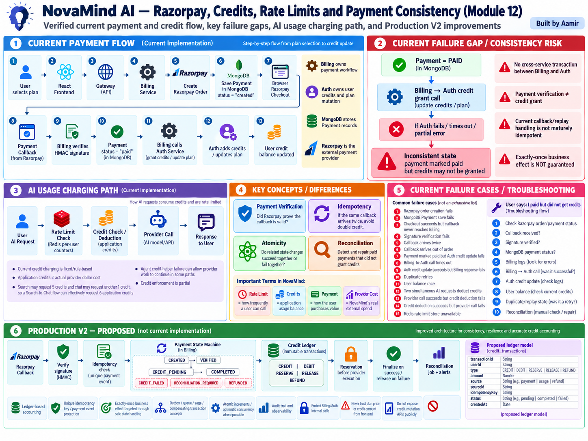

# Module 12 — Razorpay, Credits, Rate Limits and Payment Consistency

> **Project:** NovaMind-AI-LangGraph-Multi-Agent-AWS-Platform  
> **Purpose:** Understand NovaMind's verified Razorpay payment flow, application-credit model, Redis-backed rate limiting, payment verification, replay/idempotency, distributed consistency, partial failure, troubleshooting, and a stronger Production V2 design.  
> **Accuracy rule:** This guide clearly separates **PROJECT FACT**, **GENERAL CONCEPT**, and **PRODUCTION V2 RECOMMENDATION**. Do not describe proposed ledger, reservation, queue, reconciliation, saga, outbox, or exactly-once behavior as current implementation.

---

## Module 12 Visual Architecture



> Use the already-generated image at: `learning/images/12-razorpay-credits-rate-limits-payment-consistency.png`

---

# 1. Core Mental Model

NovaMind has four different concerns that must not be confused:

```text
Payment
= How a user purchases value

Credits
= NovaMind's internal usage balance

Rate Limit
= How frequently a user may call an operation

Provider Cost
= What NovaMind actually spends on Groq / Gemini / Tavily / Stability / etc.
```

These are related, but they are not the same thing.

The verified payment flow is:

```text
User selects plan
        ↓
React Frontend
        ↓
Gateway
        ↓
Billing Service
        ↓
Create Razorpay Order
        ↓
Save Payment in MongoDB
status = created
        ↓
Browser Razorpay Checkout
        ↓
Payment Callback
        ↓
Billing verifies HMAC signature
        ↓
Payment status = paid
        ↓
Billing calls Auth
        ↓
Auth adds credits / updates plan
```

The most important current consistency gap is:

```text
Payment marked PAID
        ↓
Credit grant happens afterward
        ↓
Auth / credit update fails
        ↓
Payment = paid
BUT
credits may not be granted
```

That is a distributed consistency problem.

---

# 2. Payment Gateway Fundamentals

## Concept 1 — What Is a Payment Gateway?

**GENERAL CONCEPT**

A payment gateway helps an application accept payments without directly handling the full card/payment network stack itself.

In NovaMind, the verified provider is:

```text
Razorpay
```

Do not mention Stripe for this project.

---

## Concept 2 — What Is a Payment Order?

A payment order is a provider-side object representing the amount and transaction intent before final payment.

Conceptually:

```text
User chooses plan
 ↓
Backend asks Razorpay to create order
 ↓
Razorpay returns order ID
```

---

## Concept 3 — Why the Backend Creates the Order

The backend should control:

- plan
- amount
- currency
- expected credits/value

The frontend should not be trusted to define authoritative payment value.

---

## Concept 4 — Billing Service Responsibility

**PROJECT FACT**

NovaMind's Billing service owns the external payment workflow.

Its responsibilities include:

- creating Razorpay orders
- storing Payment records
- verifying payment signatures
- marking payment status
- calling Auth for credit/plan updates

---

## Concept 5 — Razorpay Responsibility

**PROJECT FACT**

Razorpay handles the external checkout/payment processing.

Razorpay is not NovaMind's credit database.

---

# 3. Current Payment Lifecycle

## Concept 6 — User Chooses Plan

The user selects a plan in the frontend.

That choice becomes a backend request to initiate payment.

---

## Concept 7 — Do Not Trust Frontend Price

**SECURITY PRINCIPLE**

The frontend may send a plan identifier, but the authoritative amount/credits mapping should be determined server-side.

Do not trust:

```text
amount = 1
credits = 100000
```

just because the browser sent it.

---

## Concept 8 — Create Razorpay Order

**PROJECT FACT**

Billing creates a Razorpay order.

This order is used by the browser checkout flow.

---

## Concept 9 — Payment Record in MongoDB

**PROJECT FACT**

NovaMind creates a Payment record in MongoDB.

Initial status:

```text
created
```

This record connects the application payment flow with the external Razorpay order.

---

## Concept 10 — `created` Means Not Yet Paid

A Payment record with:

```text
status = created
```

means the payment workflow has started.

It does not mean the user successfully paid.

---

## Concept 11 — Browser Razorpay Checkout

**PROJECT FACT**

Razorpay checkout runs in the browser.

The user interacts with the Razorpay payment UI.

---

## Concept 12 — Checkout Success Is Not Enough by Itself

The frontend should not be trusted to say:

> “Payment succeeded, please add credits.”

The server must independently verify the payment proof/signature.

---

# 4. HMAC Signature Verification

## Concept 13 — What Is HMAC?

**GENERAL CONCEPT**

HMAC is a keyed cryptographic message-authentication mechanism.

It can prove that payment data was signed using a shared secret.

---

## Concept 14 — Why Signature Verification Matters

Without signature verification, a malicious client could fabricate payment-success data.

Secure logic:

```text
callback/payment data
+
Razorpay secret
 ↓
calculate expected HMAC
 ↓
compare securely
```

---

## Concept 15 — NovaMind Signature Verification

**PROJECT FACT**

Billing verifies the Razorpay payment signature using HMAC.

This is an important implemented payment-security control.

---

## Concept 16 — Verification ≠ Credit Grant

This distinction is critical:

```text
Signature verified
```

means:

> The payment proof is valid according to the verification logic.

It does not automatically mean:

```text
credits updated successfully
```

---

# 5. Payment Status

## Concept 17 — Payment Marked `paid`

**PROJECT FACT**

After successful verification, the Payment record can be marked:

```text
paid
```

---

## Concept 18 — Why Status Is Important

Payment status tracks application payment state.

Possible conceptual states include:

- created
- paid
- failed

But do not claim an advanced state machine as current unless verified.

---

## Concept 19 — Current Ordering Problem

**PROJECT FACT**

The current flow marks Payment paid before the downstream Auth credit grant is guaranteed to succeed.

This produces a consistency gap.

---

# 6. Billing → Auth Credit Grant

## Concept 20 — Why Billing Calls Auth

**PROJECT FACT**

Auth owns user/account-related state, including credit/plan mutation.

Therefore:

```text
Billing
 ↓
Auth
 ↓
Update credits / plan
```

---

## Concept 21 — Two-Service Business Transaction

The logical business action is:

```text
User paid
AND
User received purchased credits
```

But the implementation crosses:

- Billing service
- Auth service
- MongoDB/payment state
- MongoDB/user state

---

## Concept 22 — No Cross-Service Transaction

**PROJECT FACT**

There is no atomic transaction spanning Billing and Auth.

So one service can succeed while the other fails.

---

## Concept 23 — Partial Success Example

```text
Razorpay payment valid
 ↓
Payment marked paid
 ↓
Billing calls Auth
 ↓
Auth unavailable
```

Result:

```text
Payment = paid
Credits = not granted
```

---

## Concept 24 — Why This Is Distributed Consistency

The business state exists in multiple components.

They cannot commit as one simple local database transaction.

Therefore recovery logic is required.

---

# 7. Atomicity

## Concept 25 — What Is Atomicity?

Atomicity means:

> Related changes should either all take effect or none should.

For example:

```text
mark payment completed
+
grant credits
```

would ideally behave as one logical unit.

---

## Concept 26 — Why True Cross-Service Atomicity Is Hard

Billing and Auth are separate services.

Traditional one-database ACID transaction boundaries do not naturally span independent services.

---

## Concept 27 — Distributed Transaction

A distributed transaction coordinates state across multiple systems.

It can be complex and is not currently implemented in NovaMind.

---

## Concept 28 — Prefer Business-Level Consistency

Many microservice systems use:

- idempotency
- durable events
- retries
- state machines
- reconciliation
- compensating actions

rather than one global database transaction.

These are Production V2 ideas.

---

# 8. Idempotency

## Concept 29 — What Is Idempotency?

Idempotency means:

> Repeating the same logical operation does not create duplicate business effects.

Example:

```text
same payment callback twice
→ credits granted once
```

---

## Concept 30 — Why Payment Callbacks Can Repeat

Real payment systems may deliver or trigger the same result more than once due to:

- browser retry
- network retry
- duplicate callback
- provider retry
- user refresh

Therefore duplicate processing must be expected.

---

## Concept 31 — Current Idempotency Gap

**PROJECT FACT**

NovaMind's payment callback/replay handling is not maturely idempotent.

That means duplicate processing can create risk.

---

## Concept 32 — Replay Scenario

```text
Callback 1
→ verify
→ mark paid
→ add 100 credits

Callback 2
→ verify again
→ add another 100 credits
```

Without a guard:

```text
double credit
```

---

## Concept 33 — Verification Does Not Prevent Replay

A duplicated valid callback can still have a valid signature.

Therefore:

```text
valid signature
≠
not previously processed
```

This is one of the most important interview distinctions.

---

# 9. Anti-Replay and Idempotency Key

## Concept 34 — Idempotency Key

A future design can use a unique key based on a stable external payment identity.

Example:

```text
razorpay_payment_id
or
provider event ID
```

---

## Concept 35 — Unique Constraint

A database uniqueness constraint can help ensure the same payment/event is applied once.

Example conceptually:

```text
unique(sourceId)
```

---

## Concept 36 — Exactly-Once Business Effect

Distributed systems often cannot guarantee literal exactly-once message delivery.

But they can design:

```text
at-least-once delivery
+
idempotent consumer
=
exactly-once business effect
```

This is a Production V2 concept.

---

# 10. Reconciliation

## Concept 37 — What Is Reconciliation?

Reconciliation asks:

> Does our internal state match what actually happened externally?

Example:

```text
Razorpay = paid
Payment record = paid
User credits = missing
```

A reconciliation process detects and repairs that mismatch.

---

## Concept 38 — Verification vs Reconciliation

```text
Verification
= Is this payment proof valid now?

Reconciliation
= Are all systems eventually consistent afterward?
```

---

## Concept 39 — Why Reconciliation Is Needed

Retries alone may fail repeatedly.

A durable system needs a way to detect:

- paid without credits
- credits without matching payment
- stuck processing
- duplicate grant

---

## Concept 40 — Current Reconciliation Status

**PROJECT FACT**

A mature automatic payment/credit reconciliation system is not verified.

---

# 11. Credit System Fundamentals

## Concept 41 — What Are NovaMind Credits?

Credits are NovaMind's internal usage units.

They are not a bank balance and not equal to provider dollars.

---

## Concept 42 — Credits vs Provider Cost

```text
Application Credits
= product/business usage units

Provider Cost
= external bill from model/search/image provider
```

There is no verified 1:1 mapping.

---

## Concept 43 — Current Credit Charging

**PROJECT FACT**

Current AI workflows use fixed/rule-based application credit charges.

They are not based on a mature actual token/image/search cost ledger.

---

## Concept 44 — Why Fixed Credits Are Simple

Advantages:

- easy pricing
- easy UI
- predictable product rules

Disadvantages:

- may not match actual provider cost
- complex workflows may cost more internally
- profitability cannot be inferred from credits alone

---

# 12. Search Credit Behavior

## Concept 45 — Search Credit Charge

**PROJECT FACT**

The Search specialist requests a 5-credit deduction.

---

## Concept 46 — Search-to-Chat Chain

Search then reaches a Chat-style generation step.

The Chat path can request another 1-credit deduction.

---

## Concept 47 — Effective 6 Credits

**PROJECT FACT**

A successful Search → Chat flow can therefore effectively request:

```text
5 + 1 = 6 application credits
```

---

## Concept 48 — Why This Matters

A user may think Search costs 5, while the chained workflow requests 6.

That should be deliberate and documented.

---

# 13. Credit Enforcement Weakness

## Concept 49 — Credit Helper

Agent uses helper logic to request/deduct credits.

---

## Concept 50 — Verified Failure Behavior

**PROJECT FACT**

The review found paths where the credit helper can fail or return null but provider work continues.

---

## Concept 51 — Why This Is a Cost-Control Risk

Example:

```text
credit check/deduction fails
 ↓
provider API still called
 ↓
NovaMind pays external cost
```

---

## Concept 52 — Insufficient Credits Must Be Authoritative

A stronger design should decide **before expensive provider work** whether the user has enough balance.

---

# 14. Reserve → Execute → Finalize

## Concept 53 — Credit Reservation

**PRODUCTION V2 RECOMMENDATION**

Before provider execution:

```text
check balance
 ↓
reserve required credits
```

This prevents concurrent requests from overspending the same balance.

---

## Concept 54 — Provider Success

If provider succeeds:

```text
reservation
→ finalized debit
```

---

## Concept 55 — Provider Failure

If provider fails before successful service delivery:

```text
reservation
→ released
```

or compensated according to product policy.

---

## Concept 56 — Why Reservation Is Better Than Simple Deduction

It separates:

```text
authorization to spend
```

from:

```text
final charge
```

This is especially useful for long-running external calls.

---

# 15. Credit Ledger

## Concept 57 — Balance-Only Model

A simple model stores:

```text
credits = 425
```

It is easy but weak for audit/reconciliation.

---

## Concept 58 — Ledger Model

**PRODUCTION V2 RECOMMENDATION**

Store each balance movement:

```text
credit_transactions
```

Possible fields:

```text
transactionId
userId
type
amount
source
sourceId
idempotencyKey
status
createdAt
```

---

## Concept 59 — Ledger Entry Types

Potential types:

```text
CREDIT
DEBIT
RESERVE
RELEASE
REFUND
```

These are proposed, not current.

---

## Concept 60 — Why Immutable Ledger Helps

Benefits:

- audit trail
- replay protection
- reconciliation
- explain balance
- investigate double charge

---

## Concept 61 — Derived Balance

A system can derive or maintain balance from ledger entries.

The exact design needs performance/consistency trade-offs.

---

# 16. Race Conditions in Credits

## Concept 62 — Concurrent AI Requests

Example:

```text
Balance = 5

Request A checks 5 available
Request B checks 5 available

A deducts 5
B deducts 5
```

Without atomic control, user may overspend.

---

## Concept 63 — Read-Modify-Write Balance Race

Weak pattern:

```text
read balance
calculate new balance
write balance
```

Concurrent requests can overwrite each other.

---

## Concept 64 — Atomic Increment / Conditional Update

A stronger database operation can update balance atomically only if enough credits remain.

Conceptually:

```text
UPDATE credits = credits - cost
WHERE credits >= cost
```

Exact implementation depends on the database.

---

## Concept 65 — Optimistic Concurrency

Use a version field and reject if another request updated the record first.

Then retry safely.

---

# 17. Rate Limiting

## Concept 66 — What Is Rate Limiting?

Rate limiting controls how frequently a user/client may call an operation.

Example:

```text
N requests per minute
```

---

## Concept 67 — Why Rate Limiting Exists

Purposes:

- abuse prevention
- provider quota protection
- denial-of-service mitigation
- fair usage
- cost protection

---

## Concept 68 — Rate Limit ≠ Credits

A user can have 1000 credits but still be rate limited.

A user can be under the rate limit but have zero credits.

---

## Concept 69 — Rate Limit ≠ Authorization

Rate limiting answers:

> “How often?”

Authorization answers:

> “Are you allowed?”

Different concerns.

---

# 18. Redis-Backed Counters

## Concept 70 — Current Rate Limiting

**PROJECT FACT**

NovaMind uses basic per-user rate counters backed by Redis.

---

## Concept 71 — Why Redis Fits

Redis supports:

- fast increments
- TTL
- shared state across multiple backend tasks

---

## Concept 72 — Fixed Window

**GENERAL CONCEPT**

Example:

```text
10 requests per minute
```

Counter resets each minute.

Simple, but can allow bursts around the boundary.

---

## Concept 73 — Sliding Window

Tracks requests across a moving time window.

Smoother but more complex.

---

## Concept 74 — Token Bucket

Tokens refill over time.

Requests consume tokens.

Allows controlled bursts while limiting average rate.

---

## Concept 75 — Current Algorithm Boundary

Do not claim NovaMind uses a sophisticated sliding-window/token-bucket design unless verified.

The safe project claim is:

```text
basic per-user Redis-backed counters
```

---

# 19. Atomic Rate-Limit Updates

## Concept 76 — Increment + Expiry Race

Weak implementation concept:

```text
INCR
then
EXPIRE
```

If the process crashes between commands, the counter may persist incorrectly.

---

## Concept 77 — Atomicity in Redis

A stronger implementation can use:

- atomic scripts
- transactions
- well-designed single-command patterns

to ensure counter and expiry semantics remain correct.

---

# 20. Rate-Limit Store Failure

## Concept 78 — Redis Unavailable

Possible policies:

```text
fail closed
or
degraded/fail open
```

The choice depends on operation risk.

For expensive AI providers, failing open can create cost/abuse exposure.

---

## Concept 79 — Why One Policy May Not Fit All

Login, image generation and read-only endpoints may need different failure policies.

---

# 21. Payment Failure Cases

## Concept 80 — Razorpay Order Creation Fails

No valid order exists.

Do not create a successful payment state.

---

## Concept 81 — Payment Record Save Fails

If Razorpay order exists but application Payment record fails to save, the systems are already inconsistent.

This should be detected/recovered.

---

## Concept 82 — Checkout Succeeds but Callback Missing

Possible outcome:

```text
Razorpay knows payment succeeded
NovaMind still sees created/pending
```

This is exactly why reconciliation/provider verification can matter.

---

## Concept 83 — Signature Verification Fails

Do not grant credits.

Treat as invalid/untrusted payment proof.

---

## Concept 84 — Callback Arrives Twice

Need idempotency.

Valid signature on both callbacks does not justify two credit grants.

---

## Concept 85 — Callback Out of Order

State transitions should be validated.

Do not let an older event incorrectly overwrite a newer terminal state.

---

# 22. Billing → Auth Failure Cases

## Concept 86 — Payment Paid, Auth Down

Current dangerous state:

```text
payment = paid
credits = unchanged
```

---

## Concept 87 — Billing → Auth Timeout

Timeout is ambiguous:

```text
Did Auth fail?
or
Did Auth update but response was lost?
```

Blind retry can double-grant without idempotency.

---

## Concept 88 — Auth Succeeds, Billing Response Fails

Client may retry the same operation.

Again, idempotency is required to avoid duplicate effects.

---

# 23. Provider vs Credit Failure Cases

## Concept 89 — Deduction Succeeds, Provider Fails

Question:

> Should the user still pay credits?

That is a product policy decision.

A reservation model enables cleaner compensation.

---

## Concept 90 — Provider Succeeds, Deduction Fails

Current risk:

```text
NovaMind incurs provider cost
user balance unchanged
```

---

## Concept 91 — Both Fail

Need clear error state.

Do not create ambiguous balance mutations.

---

# 24. Payment State Machine

## Concept 92 — Why State Machine?

A payment flow has multiple stages.

Explicit states make recovery clearer.

---

## Concept 93 — Production V2 Proposed States

Example:

```text
CREATED
  ↓
VERIFIED
  ↓
CREDIT_PENDING
  ↓
COMPLETED
```

Failure/recovery:

```text
CREDIT_FAILED
RECONCILIATION_REQUIRED
REFUNDED
```

These are **not current verified states**.

---

## Concept 94 — Transition Validation

Only allowed state transitions should occur.

Example:

```text
COMPLETED
→ CREATED
```

should normally be invalid.

---

# 25. Event-Driven Credit Grant

## Concept 95 — Why Event-Driven?

**PRODUCTION V2 RECOMMENDATION**

Instead of synchronous:

```text
Billing → Auth HTTP
```

Billing can record a durable event/job.

Then a worker grants credits with retry/idempotency.

---

## Concept 96 — At-Least-Once Delivery

Queues commonly deliver at least once.

Therefore consumers must be idempotent.

---

## Concept 97 — No Current Queue Claim

Do not claim current:

- SQS payment pipeline
- Kafka billing
- event bus
- async worker

unless actually implemented.

---

# 26. Outbox Pattern

## Concept 98 — What Is Outbox?

**GENERAL CONCEPT**

Write business state and an event record in one local database transaction.

A publisher later sends the event.

This reduces:

```text
DB commit succeeded
but event publish lost
```

---

## Concept 99 — Why Outbox Helps

Example:

```text
Payment verified
+
CreditGrantRequested outbox row
```

commit together.

Then event delivery can retry.

---

# 27. Saga / Compensation

## Concept 100 — What Is a Saga?

A saga coordinates a multi-step distributed business transaction using local transactions and compensating actions.

---

## Concept 101 — Example Compensation

If credits are reserved but provider fails:

```text
RELEASE reservation
```

If a payment must be reversed under policy:

```text
refund/compensation workflow
```

Automatic refund behavior is not current verified NovaMind functionality.

---

# 28. Payment Reconciliation Job

## Concept 102 — Periodic Reconciliation

A future job could find:

```text
payment = paid
credits not granted
```

and retry/repair safely.

---

## Concept 103 — Reconciliation Inputs

Could compare:

- Razorpay payment/order state
- NovaMind Payment record
- credit ledger
- user balance

---

## Concept 104 — Reconciliation Must Be Idempotent

Running reconciliation twice must not grant credits twice.

---

# 29. Security

## Concept 105 — Trust Server-Side Plan Mapping

The backend should decide:

```text
planId
→ expected amount
→ expected credits
```

Do not trust frontend-provided price/credits.

---

## Concept 106 — Verify Payment Amount

A stronger payment flow verifies that external payment amount/order corresponds to the intended plan.

---

## Concept 107 — Protect Razorpay Secret

The signing secret belongs only on the server.

Never expose it in frontend code.

---

## Concept 108 — Protect Credit Mutation APIs

Module 11 identified sensitive credit/account mutation routes.

Only trusted server-side identities/services should mutate credits.

---

## Concept 109 — Internal Service Authentication

Billing → Auth should ideally have authenticated service identity in Production V2.

Private networking alone is not enough.

---

## Concept 110 — Avoid Sensitive Logging

Do not log:

- payment secrets
- full signatures unnecessarily
- private credentials
- sensitive payment data

Log IDs/statuses safely.

---

# 30. Observability

## Concept 111 — Payment Metrics

Track:

- order creation success/failure
- signature verification failure
- paid count
- credit-grant success/failure
- duplicate event count

---

## Concept 112 — Credit Metrics

Track:

- credit grants
- debits
- reservations/releases
- negative/invalid balance attempts
- double-processing detection

Ledger/reservation metrics are V2 ideas.

---

## Concept 113 — Rate-Limit Metrics

Track:

- allowed requests
- blocked requests
- Redis errors
- per-workflow limit hits

---

## Concept 114 — Critical Alert

Production V2 should alert on:

```text
Payment = paid
AND
credits not granted after expected recovery period
```

---

# 31. Troubleshooting: Paid but No Credits

## Concept 115 — Step 1: Razorpay

Verify external:

- order/payment ID
- provider payment status

---

## Concept 116 — Step 2: Callback

Was the callback/payment verification request received?

Check logs/correlation ID.

---

## Concept 117 — Step 3: Signature

Did HMAC verification succeed?

---

## Concept 118 — Step 4: Payment Record

Inspect MongoDB Payment status.

Is it:

```text
created
or
paid
```

---

## Concept 119 — Step 5: Billing → Auth

Was the internal credit-grant request attempted?

Did it time out?

---

## Concept 120 — Step 6: User Balance

Check whether Auth actually updated the user's credits/plan.

---

## Concept 121 — Step 7: Duplicate/Reconciliation

Determine whether this payment has already been processed or needs recovery.

Do not manually grant without recording the reason/idempotency state.

---

# 32. Troubleshooting: Credits Deducted Twice

## Concept 122 — Duplicate User Request

Did frontend retry or double-submit the AI request?

---

## Concept 123 — Backend Retry

Did the backend repeat the deduction after a timeout?

---

## Concept 124 — Concurrent Requests

Did two AI operations modify the same balance simultaneously?

---

## Concept 125 — Duplicate Payment Event

Was the same payment/callback applied more than once?

---

## Concept 126 — Missing Idempotency

Check whether the logical operation had a stable request/payment ID.

---

# 33. Production V2 Priority Order

## Concept 127 — Priority 1: Protect Mutation Endpoints

Fix authorization around credit/account mutation.

---

## Concept 128 — Priority 2: Idempotent Payment Processing

One external payment should produce one credit grant.

---

## Concept 129 — Priority 3: Durable Credit Ledger

Make every credit movement auditable.

---

## Concept 130 — Priority 4: Atomic Reservation/Deduction

Prevent concurrent overspending.

---

## Concept 131 — Priority 5: Reconciliation

Detect and repair paid-but-uncredited transactions.

---

## Concept 132 — Priority 6: Payment State Machine

Make intermediate/failure states explicit.

---

## Concept 133 — Priority 7: Observability

Alert on stuck/inconsistent states.

---

## Concept 134 — Priority 8: Event-Driven Reliability if Needed

Add queue/outbox only when the reliability/scale requirement justifies the operational complexity.

---

# 34. Trade-Offs

## Concept 135 — Synchronous Billing → Auth

Advantages:

- simple
- immediate

Trade-offs:

- timeout ambiguity
- coupling
- failure propagation

---

## Concept 136 — Async Credit Grant

Advantages:

- retryability
- resilience

Trade-offs:

- eventual consistency
- queue/worker complexity
- status tracking

---

## Concept 137 — Balance Field Only

Advantages:

- simple reads

Trade-offs:

- poor audit/history
- harder reconciliation

---

## Concept 138 — Ledger + Cached Balance

Advantages:

- auditability + fast reads

Trade-offs:

- consistency design becomes more sophisticated

---

# 35. Strong Interview Explanation

> NovaMind uses Razorpay for payments. Billing creates a Razorpay order and stores a MongoDB Payment record with status `created`. The browser completes Razorpay checkout, and Billing verifies the payment signature using HMAC. After verification, the Payment can be marked `paid`, then Billing calls Auth to update the user's plan and credits. The main current weakness is that those two internal state changes are not atomic across services. Payment may be marked paid before credit granting succeeds, so a paid-but-uncredited user is possible. Duplicate callbacks also need stronger idempotency, and the credit system is balance/rule based rather than an immutable ledger. For Production V2, I would add idempotent payment processing, an explicit payment state machine, a credit ledger, atomic credit reservation/debit behavior, and reconciliation for inconsistent transactions.

---

# Quick Revision — Module 12

## Current Payment Flow

```text
Plan
→ Billing
→ Razorpay Order
→ Payment(created)
→ Checkout
→ Callback
→ HMAC verify
→ Payment(paid)
→ Billing → Auth
→ Add credits / update plan
```

## Current Consistency Gap

```text
Payment = paid
BUT
Auth credit grant can fail
```

## Credits

```text
Credits
≠ provider dollars
```

Search can request:

```text
5 Search credits
+
1 Chat credit
=
6 application credits
```

## Rate Limit

```text
Redis per-user counters
```

But:

```text
Rate Limit ≠ Billing
Rate Limit ≠ Authorization
```

## Current Weaknesses

```text
no cross-service transaction
duplicate/replay handling not mature
no immutable credit ledger
credit helper can fail while provider work continues
fixed credits ≠ actual provider cost
concurrent balance races possible
no mature reconciliation
```

## Production V2

```text
verify payment
→ idempotency check
→ payment state machine
→ credit ledger
→ reserve / finalize / release
→ durable retry/event
→ reconciliation
→ audit + alerts
```

## Best Interview Sentence

> **NovaMind verifies Razorpay payments correctly with HMAC, but payment verification is not the same as idempotent credit granting; the main production gap is distributed consistency between Billing's payment state and Auth's credit balance.**

**Module 12 Learning file complete.**
