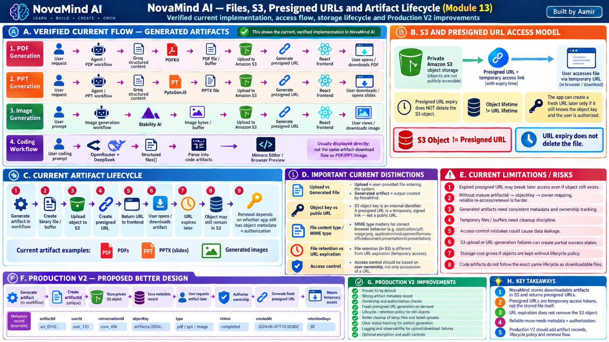

# Module 13 — Files, S3, Presigned URLs and Artifact Lifecycle

> **Project:** NovaMind-AI-LangGraph-Multi-Agent-AWS-Platform  
> **Purpose:** Understand exactly how NovaMind handles uploaded files, generated PDFs, PPTs, images, code artifacts, S3 objects, presigned URLs, temporary files, access control, retention, cleanup, failure handling, and a stronger Production V2 artifact lifecycle.  
> **Accuracy Rule:** This file separates **PROJECT FACT**, **GENERAL CONCEPT**, and **PRODUCTION V2 RECOMMENDATION**. Do not describe proposed artifact IDs, durable artifact metadata, link renewal, lifecycle rules, versioning, or ownership enforcement as current features unless explicitly marked.

---

## Module 13 Visual Architecture



> Use the already-generated image at: `learning/images/13-files-s3-presigned-urls-artifact-lifecycle.png`

---

# 1. The Core Mental Model

NovaMind works with several different kinds of files and artifacts.

```text
Uploaded Input File
→ user sends PDF/image to NovaMind

Generated File
→ NovaMind creates PDF/PPT/image output

Code Artifact
→ structured generated files shown in the coding UI

S3 Object
→ the actual object stored in S3

Presigned URL
→ temporary authorized URL for accessing an S3 object
```

The most important distinction in this module is:

```text
S3 Object
≠
Presigned URL
```

and:

```text
Object lifetime
≠
URL lifetime
```

Therefore:

```text
Presigned URL expires
≠
S3 object is deleted
```

---

# 2. What Is an Artifact?

## Concept 1 — Artifact

**GENERAL CONCEPT**

An artifact is an output created by an application that can be stored, displayed, downloaded, or reused later.

Examples in NovaMind include:

- generated PDF
- generated PPTX
- generated image
- structured code files

---

## Concept 2 — Artifact vs Response Text

A normal answer may be only text:

```text
"Here is the explanation..."
```

An artifact is a separate output object:

```text
report.pdf
presentation.pptx
image.png
files[]
```

---

## Concept 3 — Artifact vs Uploaded File

Uploaded file:

```text
user → application
```

Generated artifact:

```text
application → user
```

They have different lifecycle requirements.

---

# 3. Current NovaMind Artifact Types

## Concept 4 — PDF Generation

**PROJECT FACT**

The PDF-generation workflow uses:

```text
Groq-backed content generation
→ structured content
→ PDFKit
→ PDF binary/file
→ S3
→ presigned URL
```

---

## Concept 5 — PPT Generation

**PROJECT FACT**

The PPT workflow uses:

```text
Groq-backed structured content
→ PptxGenJS
→ PPTX
→ S3
→ presigned URL
```

The verified presentation pattern is:

```text
cover
+
6 content slides
+
closing
=
8 slides total
```

---

## Concept 6 — Image Generation

**PROJECT FACT**

The image-generation workflow uses:

```text
prompt
→ Groq-backed prompt preparation/expansion
→ Stability AI
→ image bytes/buffer
→ S3
→ presigned URL
```

---

## Concept 7 — Code Artifact

**PROJECT FACT**

The coding workflow is different.

```text
coding prompt
→ OpenRouter + DeepSeek
→ structured files[]
→ parse into code artifact
→ Monaco Editor
→ browser preview where compatible
```

This is not the same as generating a PDF/PPT/image object in S3.

---

## Concept 8 — Image Analysis Is Not Image Generation

**PROJECT FACT**

Image analysis:

```text
uploaded image
→ Gemini multimodal
→ text answer
```

Image generation:

```text
text prompt
→ Stability AI
→ generated image artifact
```

Do not mix them.

---

# 4. Uploaded File Lifecycle

## Concept 9 — Uploaded Files

NovaMind can receive uploaded files such as:

- PDF
- image

Multer handles the multipart upload path.

---

## Concept 10 — Temporary Local File

**PROJECT FACT**

Uploaded PDF/image processing can use temporary local files.

This local file is for current processing, not a mature durable document repository.

---

## Concept 11 — Temporary Storage Means Temporary

A file on container/server disk should not be treated as permanent application storage.

Container-local storage can disappear during replacement/restart.

---

## Concept 12 — Cleanup

Temporary files should be removed after processing.

The current code includes cleanup attempts in relevant workflows.

---

## Concept 13 — Cleanup Failure

If cleanup fails:

```text
request may succeed
BUT
temporary sensitive file remains
```

This is an operational and privacy problem.

---

# 5. Generated PDF Flow

## Concept 14 — Step 1: User Request

The user asks NovaMind to generate a PDF.

Example:

```text
"Create a PDF report about cloud security."
```

---

## Concept 15 — Step 2: Structured Content

**PROJECT FACT**

The model produces structured content that backend code can parse.

The model is not directly writing an S3 object.

---

## Concept 16 — Step 3: PDFKit

**PROJECT FACT**

PDFKit renders the actual PDF binary/file.

Important:

```text
LLM
→ content

PDFKit
→ actual PDF file
```

---

## Concept 17 — Step 4: S3 Upload

**PROJECT FACT**

The generated file is uploaded to S3 using application AWS logic such as `PutObject`.

---

## Concept 18 — Step 5: Presigned URL

**PROJECT FACT**

After storing the file, NovaMind generates a presigned URL so the user can access the object temporarily.

---

# 6. Generated PPT Flow

## Concept 19 — Model Produces Presentation Content

The LLM generates structured presentation content.

---

## Concept 20 — PptxGenJS

**PROJECT FACT**

PptxGenJS creates the actual `.pptx` binary.

---

## Concept 21 — Eight-Slide Pattern

**PROJECT FACT**

Current prompt/rendering behavior uses:

```text
cover
+ 6 content slides
+ closing
```

for an eight-slide presentation structure.

---

## Concept 22 — PPT Upload

The rendered PPTX is uploaded to S3.

---

## Concept 23 — PPT Presigned Link

NovaMind returns a presigned link for temporary access.

---

# 7. Generated Image Flow

## Concept 24 — Prompt Preparation

**PROJECT FACT**

NovaMind can use a Groq-backed step to expand/prepare the image prompt.

---

## Concept 25 — Stability AI

**PROJECT FACT**

Stability AI generates the image.

Current configured endpoint/model family includes:

```text
stable-image/generate/core
```

---

## Concept 26 — Image Buffer

The generated image can exist as bytes/buffer in application memory before upload.

---

## Concept 27 — Buffer ≠ Durable Artifact

An in-memory buffer disappears when the process/request ends.

To persist the generated image, it must be stored somewhere durable such as S3.

---

## Concept 28 — S3 Upload + Presigned URL

Current generated-image delivery uses:

```text
image buffer
→ S3
→ presigned URL
```

---

# 8. Code Artifact Lifecycle

## Concept 29 — Code Is Different

Code generation returns structured files rather than a rendered binary file like PDF/PPT.

---

## Concept 30 — `files[]`

**PROJECT FACT**

The coding model is asked to produce structured files in JSON-like output.

---

## Concept 31 — Backend Parsing

The backend parses the structured output into an artifact representation.

---

## Concept 32 — Monaco Editor

The frontend displays the generated code in Monaco Editor.

---

## Concept 33 — Browser Preview

For simple compatible HTML/CSS/JS output, the browser can provide a preview.

---

## Concept 34 — No Full Server-Side Build Sandbox

**PROJECT FACT**

Current NovaMind does not provide:

- package installation
- full compile pipeline
- arbitrary server execution
- full test runner
- repair loop

So code artifact does not mean deployed working application.

---

# 9. S3 Fundamentals

## Concept 35 — What Is S3?

**GENERAL CONCEPT**

Amazon S3 is object storage.

It stores objects inside buckets.

---

## Concept 36 — Object

An S3 object conceptually contains:

```text
key
+
bytes
+
metadata
```

---

## Concept 37 — Object Key

The key is the object's path-like identifier.

Example:

```text
artifacts/user123/report.pdf
```

The exact current NovaMind key naming convention should only be claimed if verified from code.

---

## Concept 38 — Bucket vs Object

```text
Bucket
= container

Object
= stored file/data
```

---

## Concept 39 — S3 Is Not a Filesystem

S3 uses object keys rather than normal filesystem directories.

The `/` characters are naming conventions.

---

# 10. S3 Upload

## Concept 40 — PutObject

**PROJECT FACT**

NovaMind uses AWS SDK S3 object upload behavior such as `PutObject`.

This stores generated bytes in S3.

---

## Concept 41 — Upload Permission

The application needs IAM permission to write the relevant object.

If `PutObject` is denied, artifact delivery fails.

---

## Concept 42 — Correct Region

The S3 client/bucket region must be compatible with the request configuration.

Region/configuration problems can cause upload failures.

---

# 11. Presigned URL Fundamentals

## Concept 43 — What Is a Presigned URL?

**GENERAL CONCEPT**

A presigned URL is a temporary URL signed with AWS credentials/permissions.

It allows a client to perform a specific S3 action for a limited time.

---

## Concept 44 — Why Presigned URL?

It allows the bucket/object to remain private while granting temporary access.

---

## Concept 45 — Presigned GetObject

**PROJECT FACT**

NovaMind uses presigned retrieval links for generated artifacts.

Conceptually:

```text
private object
+
temporary signed GetObject URL
```

---

## Concept 46 — URL Expiration

The URL stops being valid after its expiration time.

---

## Concept 47 — Expiration Does Not Delete Object

Critical:

```text
URL expired
≠
object deleted
```

---

## Concept 48 — Deleting Object Does Not Extend URL

If the object is deleted before URL expiry:

```text
URL may still exist as text
BUT
object cannot be retrieved
```

---

# 12. URL Lifetime vs Object Lifetime

## Concept 49 — Two Independent Lifecycles

```text
Artifact Object Lifecycle
→ how long S3 object exists

Access URL Lifecycle
→ how long signed URL works
```

They must be designed separately.

---

## Concept 50 — Why Storing Only URL Is Weak

**PROJECT FACT**

The current design can store/return presigned URLs in answers.

If the URL expires later:

```text
conversation still contains old URL
BUT
link no longer works
```

---

## Concept 51 — Missing Re-Sign Path

**PROJECT FACT**

A mature flow for:

```text
artifact identity
→ authorize user
→ find S3 object key
→ generate fresh presigned URL
```

is not verified.

---

# 13. Artifact Metadata

## Concept 52 — What Is Artifact Metadata?

Metadata is application information about the artifact.

Example:

```text
artifactId
userId
conversationId
objectKey
type
status
createdAt
retention
```

---

## Concept 53 — Current Metadata Limitation

**PROJECT FACT**

NovaMind does not have a mature dedicated artifact metadata lifecycle with all of the fields above.

---

## Concept 54 — Why `artifactId` Helps

A stable ID lets the application reference the artifact without storing the temporary URL as the main identity.

---

## Concept 55 — `objectKey` Helps Re-Sign

If the application stores the real S3 key:

```text
artifactId
→ objectKey
```

it can later generate a new authorized URL.

---

# 14. Artifact Ownership

## Concept 56 — Why Ownership Matters

A generated file may contain private user content.

The backend should answer:

```text
Does this artifact belong to this authenticated user?
```

before providing access.

---

## Concept 57 — Presigned URL Is a Bearer Capability

Anyone who obtains a valid presigned URL may be able to use it until it expires.

Therefore:

- keep expiry appropriate
- avoid exposing URLs unnecessarily
- authorize before generating them

---

## Concept 58 — Current Ownership Maturity

**PROJECT FACT**

A mature artifact ownership + renewal model is not verified.

Do not claim full tenant-isolated artifact access.

---

# 15. Private vs Public S3

## Concept 59 — Private Bucket/Object

Private objects require authorized AWS access or temporary signed access.

This is the safer default for user-generated private artifacts.

---

## Concept 60 — Public Object

A public object can be fetched by anyone who knows the URL.

For private user artifacts, public access is usually inappropriate.

---

## Concept 61 — Current Bucket Policy Boundary

**PROJECT FACT**

The application code shows S3 upload/presigned access behavior, but mature bucket privacy, lifecycle and versioning policies are not fully established from the verified review.

Do not overclaim exact bucket-policy hardening.

---

# 16. Retention

## Concept 62 — What Is Retention?

Retention answers:

> How long should the object remain stored?

---

## Concept 63 — Why Retention Matters

It affects:

- privacy
- compliance
- storage cost
- user expectations

---

## Concept 64 — Current Retention Policy

**PROJECT FACT**

No mature artifact-specific retention policy is verified in the current implementation.

---

# 17. S3 Lifecycle Rules

## Concept 65 — Lifecycle Rule

**GENERAL CONCEPT**

S3 lifecycle rules can automatically:

- expire objects
- transition storage classes
- clean old versions

---

## Concept 66 — Production V2 Use

A future artifact design can set lifecycle rules by artifact type or retention class.

Example:

```text
temporary images → 30 days
user-saved reports → longer
```

Exact policy should follow product requirements.

---

# 18. Deletion

## Concept 67 — User Deletes Conversation

A mature design should decide what happens to linked artifacts.

Possible choices:

- delete immediately
- retain according to policy
- soft-delete then purge

---

## Concept 68 — Current Cross-Store Deletion

**PROJECT FACT**

A mature coordinated delete across:

```text
MongoDB conversation
+
Redis context
+
S3 artifact
+
Qdrant index
```

is not fully verified.

---

## Concept 69 — Orphaned Artifact

An S3 object can remain after application metadata is gone.

This is an orphaned artifact.

---

## Concept 70 — Why Orphans Matter

They cause:

- storage cost
- privacy risk
- cleanup complexity

---

# 19. Versioning

## Concept 71 — S3 Versioning

**GENERAL CONCEPT**

S3 versioning can retain multiple versions of the same key.

---

## Concept 72 — Is Versioning Current?

A mature artifact-versioning strategy is not verified.

Do not claim it is enabled unless live configuration confirms it.

---

## Concept 73 — Why Versioning Can Help

Benefits:

- recovery from accidental overwrite/delete
- history

Trade-off:

- storage cost
- cleanup complexity

---

# 20. Encryption

## Concept 74 — Encryption at Rest

S3 supports server-side encryption options.

The exact current bucket encryption configuration should not be claimed unless verified.

---

## Concept 75 — Encryption in Transit

HTTPS protects data during transport.

Presigned S3 access should use HTTPS.

---

# 21. IAM for S3

## Concept 76 — Task Role

Application code running in ECS uses an IAM task role for AWS API access where configured.

---

## Concept 77 — Least Privilege

The Agent service should only have the S3 permissions it needs.

Example:

```text
PutObject
GetObject/signing-related access
```

on appropriate bucket/prefix.

---

## Concept 78 — Do Not Give `s3:*`

Broad S3 permissions increase blast radius.

Least privilege is better.

---

## Concept 79 — Current IAM Verification Boundary

**PROJECT FACT**

The presence of a role name does not prove least privilege.

Effective permissions were not fully live-inspected.

---

# 22. S3 Partial Failure Scenarios

## Concept 80 — Generation Succeeds, Upload Fails

Example:

```text
PDF rendered successfully
 ↓
S3 PutObject fails
```

Result:

```text
artifact exists transiently
but user cannot retrieve it
```

---

## Concept 81 — Upload Succeeds, Presign Fails

Result:

```text
S3 object exists
but user does not receive access URL
```

This can create an orphaned-but-valid object.

---

## Concept 82 — Presign Succeeds, Response Fails

The URL exists but may never reach the browser.

A retry can generate a new URL if the object identity is known.

Current renewal lifecycle is not mature.

---

## Concept 83 — URL Returned, Persistence Fails

The user may receive a usable URL while conversation/history fails to record it.

This is another partial-success case.

---

## Concept 84 — URL Expires Later

The object may still exist.

Current conversation may contain a stale link.

---

# 23. Retry Semantics

## Concept 85 — Retrying Generation

If the model call succeeded once, regenerating can produce different content and extra provider cost.

Retry should target the failed stage where possible.

---

## Concept 86 — Retry Upload Only

If the binary already exists safely in memory/durable temp state, an upload retry may be enough.

But process crash can remove that transient state.

---

## Concept 87 — Idempotent Object Keys

A stable artifact ID/key can prevent duplicate objects during retries.

This is a Production V2 recommendation.

---

# 24. Content-Type / MIME

## Concept 88 — Content-Type

S3 object metadata can indicate MIME type.

Examples:

```text
application/pdf
application/vnd.openxmlformats-officedocument.presentationml.presentation
image/png
```

---

## Concept 89 — Why Content-Type Matters

It influences how browsers/clients handle the downloaded object.

---

## Concept 90 — User Upload MIME vs Generated MIME

Uploaded MIME is untrusted client metadata.

Generated MIME is under more application control.

---

# 25. File Size

## Concept 91 — Why Size Matters

Large files affect:

- memory
- upload time
- S3 cost
- network time
- browser experience

---

## Concept 92 — Buffer Risk

Holding a large generated artifact fully in memory can increase container memory pressure.

---

## Concept 93 — Streaming

A production design may stream large output to storage instead of buffering everything.

This is a general recommendation, not verified current behavior.

---

# 26. Artifact Status

## Concept 94 — Current Workflow Is Mostly Synchronous

PDF/PPT/image generation is currently part of the synchronous request path.

---

## Concept 95 — Production V2 Status

A future durable artifact record could use:

```text
REQUESTED
GENERATING
UPLOADING
READY
FAILED
DELETED
```

This is proposed.

---

## Concept 96 — Why Status Helps

It supports:

- asynchronous generation
- retries
- progress UI
- reconciliation
- troubleshooting

---

# 27. Production V2 Artifact Model

## Concept 97 — Create `artifactId`

Generate a stable application identifier before or during artifact creation.

---

## Concept 98 — Store Metadata

Example:

```text
artifactId
userId
conversationId
objectKey
artifactType
contentType
status
createdAt
retentionUntil
```

---

## Concept 99 — Store Private S3 Object

Object remains private.

Do not make the S3 key itself public identity.

---

## Concept 100 — Fresh Access Flow

```text
User asks to open artifact
 ↓
authenticate
 ↓
authorize ownership
 ↓
lookup objectKey
 ↓
generate fresh presigned URL
 ↓
return temporary URL
```

---

# 28. URL Renewal

## Concept 101 — Why Renewal Matters

A conversation may be viewed days later.

The original presigned URL may be expired.

---

## Concept 102 — Renewal Requires Stable Identity

If you only saved the expired URL, renewal is difficult.

If you saved:

```text
artifactId → objectKey
```

you can re-sign.

---

## Concept 103 — Authorization Before Renewal

A fresh URL should only be generated after ownership/permission is verified again.

---

# 29. Artifact Lifecycle Management

## Concept 104 — Creation

Generate content/binary.

---

## Concept 105 — Storage

Upload to private S3.

---

## Concept 106 — Metadata Persistence

Store owner/object/status relationship.

---

## Concept 107 — Access

Generate temporary signed URL after authorization.

---

## Concept 108 — Renewal

Generate another signed URL later if artifact still exists and access is allowed.

---

## Concept 109 — Retention

Apply retention policy.

---

## Concept 110 — Deletion

Delete object and metadata consistently.

---

## Concept 111 — Reconciliation

Detect:

- metadata without object
- object without metadata
- READY record with failed upload
- expired/deleted artifact still referenced

---

# 30. Artifact Security

## Concept 112 — Do Not Trust User Object Keys

A client should not be able to request:

```text
objectKey = another-user/private.pdf
```

and automatically get a signed URL.

---

## Concept 113 — Authorize by Artifact ID

Better:

```text
artifactId
 ↓
server loads metadata
 ↓
checks owner
 ↓
server chooses objectKey
```

---

## Concept 114 — Path Traversal vs S3

S3 object keys are not local filesystem paths, but untrusted object keys can still create access-control problems.

Validate server-side mapping.

---

## Concept 115 — Sensitive Content

Generated files can contain:

- user prompts
- document data
- AI-generated private content

Treat them as private user data.

---

# 31. Artifact Observability

## Concept 116 — Useful Metrics

Track:

- generation duration
- artifact size
- S3 upload duration
- presign failures
- download/access failures
- stale-link renewal
- deletion failures
- orphan count

---

## Concept 117 — Correlation ID

One request ID should help trace:

```text
Agent
→ renderer/provider
→ S3
→ Chat persistence
```

Current mature distributed tracing is not verified.

---

# 32. Troubleshooting PDF/PPT Artifact

## Concept 118 — User Says “File Was Not Generated”

Trace:

```text
model content generation
→ JSON parsing
→ renderer
→ local/buffer output
→ S3 PutObject
→ presigned URL
→ response
```

---

## Concept 119 — User Gets AccessDenied

Check:

- bucket/key
- IAM task role
- S3 region/client
- signed URL
- expiration
- object existence

Do not make bucket public as a quick fix.

---

## Concept 120 — Link Expired

Expected:

```text
old presigned URL fails
```

A mature system should re-authorize and re-sign the object.

Current renewal path is not mature.

---

## Concept 121 — 404 / NoSuchKey

Check whether:

- upload actually succeeded
- object key is correct
- artifact was deleted/expired by policy

---

## Concept 122 — Slow Download

Investigate:

- artifact size
- user network
- S3 region
- transfer path
- browser behavior

---

# 33. Troubleshooting Image Artifact

## Concept 123 — Stability Succeeds, S3 Fails

Image provider cost/work occurred, but user delivery failed.

This is a partial-success case.

---

## Concept 124 — S3 Succeeds, UI Missing Image

Check:

- presigned URL generation
- response serialization
- frontend rendering
- URL expiry
- conversation persistence

---

# 34. Artifact Cost

## Concept 125 — Storage Cost

More/longer-lived objects increase S3 storage cost.

---

## Concept 126 — Request Cost

S3 PUT/GET operations and data transfer can add cost.

---

## Concept 127 — Retention Is Cost Control

Deleting truly temporary artifacts can reduce cost.

---

## Concept 128 — Do Not Delete Too Early

If users expect to reopen generated reports later, very short retention creates poor product behavior.

Retention should match product requirements.

---

# 35. Current Strengths

## Concept 129 — Real Artifact Creation

NovaMind genuinely renders/generates:

- PDF
- PPTX
- images
- code artifacts

---

## Concept 130 — Private Temporary Delivery Pattern

Presigned URLs are a strong pattern for temporary private S3 access when used correctly.

---

## Concept 131 — Separation of Content and Rendering

LLM generates content.

Renderer/provider produces the actual file/image.

This separation is technically sound.

---

# 36. Current Limitations

## Concept 132 — No Mature Artifact Identity

No verified dedicated:

```text
artifactId → owner → objectKey
```

lifecycle.

---

## Concept 133 — No Mature Re-Signing Flow

Old conversation URLs can expire without a supported renewal mechanism.

---

## Concept 134 — No Mature Retention Policy

Object lifetime is not managed by a verified artifact-retention model.

---

## Concept 135 — No Mature Coordinated Deletion

Conversation deletion does not automatically prove artifact cleanup across S3.

---

## Concept 136 — Bucket Hardening Not Fully Verified

Do not claim:

- exact lifecycle rules
- versioning enabled
- exact encryption configuration
- full ownership enforcement

unless live config proves it.

---

# 37. Production V2 Priority Order

## Concept 137 — Priority 1: Artifact Identity

Create stable `artifactId`.

---

## Concept 138 — Priority 2: Owner Mapping

Persist:

```text
artifactId
→ userId
```

---

## Concept 139 — Priority 3: Object Mapping

Persist:

```text
artifactId
→ S3 objectKey
```

---

## Concept 140 — Priority 4: Re-Sign API

Authorize user and generate fresh presigned URL on demand.

---

## Concept 141 — Priority 5: Retention

Define artifact-specific retention and S3 lifecycle rules.

---

## Concept 142 — Priority 6: Deletion/Reconciliation

Coordinate metadata and S3 object deletion and detect orphans.

---

## Concept 143 — Priority 7: Async for Long Jobs

For large/slow generation, use job status/worker only if requirements justify it.

---

## Concept 144 — Priority 8: Observability

Measure generation, upload, access, expiry, cleanup and cost.

---

# 38. Strong Interview Explanation

> NovaMind has several artifact flows. PDF generation uses a Groq-backed structured-content step followed by PDFKit, PPT generation uses PptxGenJS, and image generation uses Stability AI. Generated PDF, PPT and image outputs are uploaded to S3 and the user receives a presigned URL. Code artifacts are different: DeepSeek returns structured `files[]`, which are parsed and shown in Monaco Editor with a basic browser preview where compatible.
>
> The key lifecycle distinction is that an S3 object and a presigned URL are not the same thing. A presigned URL is temporary access to an object. When the URL expires, the S3 object may still exist. The current project does not have a mature dedicated artifact identity and renewal flow such as `artifactId → owner → objectKey`, so an old conversation can contain an expired URL even if the object still exists.
>
> For Production V2, I would store private S3 objects plus durable artifact metadata, authorize every access by artifact ownership, generate fresh presigned URLs on demand, define retention/deletion rules, and reconcile orphaned metadata or objects.

---

# Quick Revision — Module 13

## Generated PDF

```text
Groq content
→ PDFKit
→ PDF
→ S3
→ presigned URL
```

## Generated PPT

```text
Groq content
→ PptxGenJS
→ PPTX
→ S3
→ presigned URL
```

## Generated Image

```text
Prompt
→ Groq prompt prep
→ Stability AI
→ image bytes
→ S3
→ presigned URL
```

## Code

```text
DeepSeek
→ structured files[]
→ parse
→ code artifact
→ Monaco
→ basic browser preview
```

## Critical Distinctions

```text
S3 object ≠ presigned URL
URL expiry ≠ object deletion
Temporary file ≠ durable artifact
Code artifact ≠ S3-generated binary artifact
```

## Current Limitations

```text
no mature artifactId
no mature artifact owner/objectKey mapping
no mature fresh-URL renewal flow
no mature artifact retention policy
no mature coordinated deletion
bucket lifecycle/versioning/encryption not fully verified
```

## Production V2

```text
artifactId
→ owner
→ conversation
→ objectKey
→ status
→ retention
→ authorize
→ generate fresh presigned URL
→ lifecycle/delete/reconcile
```

## Best Interview Sentence

> **NovaMind uses S3 as durable object storage for generated PDF, PPT and image artifacts and presigned URLs as temporary access mechanisms; the main production gap is the lack of a mature artifact identity, ownership, retention and URL-renewal lifecycle.**

**Module 13 Learning file complete.**
