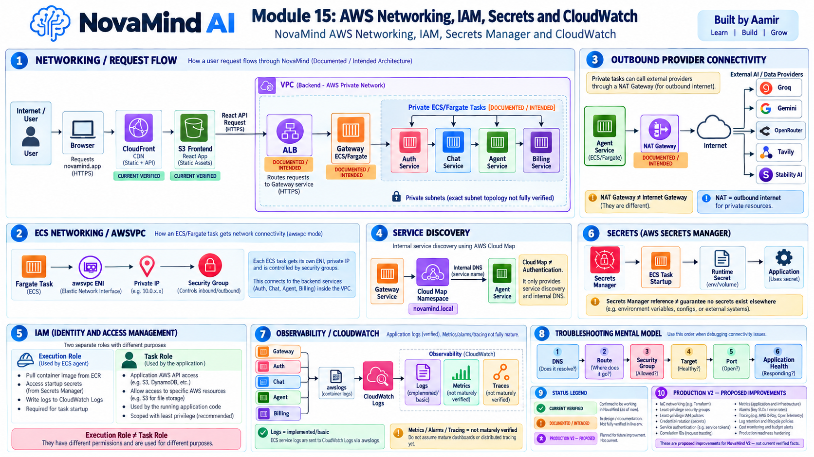

# Module 15 — AWS Networking, IAM, Secrets Manager and CloudWatch

> **Project:** NovaMind-AI-LangGraph-Multi-Agent-AWS-Platform  
> **Purpose:** Build a deep, interview-ready understanding of NovaMind's AWS networking, VPC, subnetting, routing, ALB, security groups, ECS `awsvpc`, Cloud Map, IAM roles, Secrets Manager, CloudWatch logging, observability, troubleshooting, security, cost, and Production V2 improvements.  
> **Accuracy rule:** This guide separates **CURRENT VERIFIED**, **DOCUMENTED / INTENDED**, **GENERAL CONCEPT**, and **PRODUCTION V2 — PROPOSED**. Do not present documented topology or proposed hardening as current live-proven infrastructure.

---

## Module 15 Visual Architecture



> Use the already-generated image at: `learning/images/15-aws-networking-iam-secrets-cloudwatch.png`

---

# 1. The Core Mental Model

NovaMind's frontend delivery is verified as:

```text
Browser
  ↓
CloudFront
  ↓
S3 Frontend
```

The backend network architecture is **documented / intended** as:

```text
Browser / React
  ↓
ALB
  ↓
Gateway ECS/Fargate
  ↓
Auth / Chat / Agent / Billing
```

The intended network boundary is:

```text
Internet
  ↓
Public-facing entry
  ↓
ALB
  ↓
Private ECS/Fargate tasks
  ↓
Internal services
```

Important accuracy rule:

```text
Repository architecture
≠
Live AWS proof
```

The repo and screenshots support a strong intended design, but the exact current live subnet placement, route tables, security-group rules, NAT health, target health, and multi-AZ state were not fully live-verified.

---

# 2. Status Vocabulary

Use these labels throughout interviews.

## CURRENT VERIFIED

Supported directly by source/configuration.

Examples:

- ECS task definitions use `awsvpc`.
- all five backend services have `awslogs` configuration.
- Secrets Manager references exist.
- Cloud Map namespace `novamind.local` is part of the documented service-discovery design.
- CloudFront/S3 frontend deployment is present.
- effective IAM least privilege was not fully live-inspected.

## DOCUMENTED / INTENDED

Architecture/configuration describes the design, but live state was not fully verified.

Examples:

- public ALB
- private ECS tasks
- public/private subnet topology
- NAT-based outbound provider access
- some security-group relationships

## PRODUCTION V2 — PROPOSED

Recommended improvements, not current facts.

Examples:

- comprehensive IaC
- service-to-service authentication
- correlation IDs
- mature metrics/alarms/traces
- secret rotation workflow
- least-privilege SG/IAM audit
- VPC endpoint optimization

---

# 3. What Is a VPC?

## Concept 1 — VPC

**GENERAL CONCEPT**

A VPC is a logically isolated virtual network in AWS.

It defines the network boundary in which resources such as:

- ECS tasks
- ALBs
- NAT Gateways
- subnets
- ENIs

can run.

Mental model:

```text
AWS Account
  ↓
VPC
  ├── Public Subnets
  ├── Private Subnets
  ├── Route Tables
  ├── Security Groups
  └── Networked Resources
```

---

## Concept 2 — Why Use a VPC?

A VPC gives control over:

- IP ranges
- routing
- internet access
- service exposure
- network segmentation
- security groups

---

# 4. CIDR

## Concept 3 — What Is CIDR?

CIDR defines an IP address range.

Example:

```text
10.0.0.0/16
```

This can be divided into smaller subnet ranges.

---

## Concept 4 — Why CIDR Planning Matters

Poor CIDR planning can cause:

- address exhaustion
- overlap with connected networks
- difficult future expansion

For NovaMind, exact VPC CIDR values should only be claimed if verified from source/live configuration.

---

# 5. Subnets

## Concept 5 — What Is a Subnet?

A subnet is a smaller IP range inside a VPC.

---

## Concept 6 — Public Subnet

A public subnet generally has a route to an Internet Gateway.

Important:

```text
Public Subnet
≠
Every resource is automatically public
```

A resource may also need:

- public IP where applicable
- route
- security-group permission
- public listener/service configuration

---

## Concept 7 — Private Subnet

A private subnet does not directly route public traffic to an Internet Gateway.

Private resources can still make outbound internet calls through NAT.

---

## Concept 8 — NovaMind Intended Placement

**DOCUMENTED / INTENDED**

The intended pattern is:

```text
Public-facing ALB
  ↓
Private ECS/Fargate tasks
```

Exact live subnet placement is not fully verified.

---

# 6. Route Tables

## Concept 9 — What Is a Route Table?

A route table decides where network traffic goes.

Examples:

```text
local VPC traffic
→ local route

0.0.0.0/0
→ Internet Gateway

private subnet 0.0.0.0/0
→ NAT Gateway
```

---

## Concept 10 — Route Table Is Not a Firewall

A route tells AWS **where** to send traffic.

A security group controls **whether** traffic is allowed at the resource interface.

---

# 7. Internet Gateway

## Concept 11 — What Is an Internet Gateway?

An Internet Gateway connects a VPC to the public internet.

It is attached to the VPC.

---

## Concept 12 — IGW Role

A public subnet route can look like:

```text
0.0.0.0/0
→ Internet Gateway
```

This allows public-route capability.

---

# 8. NAT Gateway

## Concept 13 — What Is a NAT Gateway?

A NAT Gateway lets private resources initiate outbound internet connections without exposing them directly for inbound internet connections.

---

## Concept 14 — NAT vs Internet Gateway

```text
Internet Gateway
= VPC connection to public internet

NAT Gateway
= outbound internet path for private resources
```

They are not the same.

---

## Concept 15 — NovaMind Provider Connectivity

**DOCUMENTED / INTENDED**

Agent calls public external providers:

- Groq
- Google Gemini
- OpenRouter
- Tavily
- Stability AI

Therefore a private Agent task needs an outbound internet path.

Typical intended path:

```text
Agent in private subnet
  ↓
Private route table
  ↓
NAT Gateway
  ↓
Internet Gateway
  ↓
External AI provider
```

---

## Concept 16 — NAT Is Not Inbound Exposure

NAT allows initiated outbound traffic and return traffic.

It does not make the private task directly reachable from the internet.

---

# 9. North-South vs East-West Traffic

## Concept 17 — North-South Traffic

Traffic entering or leaving the application boundary.

NovaMind example:

```text
Browser
→ ALB
```

or:

```text
Agent
→ Groq
```

---

## Concept 18 — East-West Traffic

Service-to-service traffic inside the platform.

Examples:

```text
Gateway → Agent
Agent → Chat
Billing → Auth
```

---

## Concept 19 — Why East-West Security Matters

Internal traffic still needs:

- authenticated identity where required
- authorization
- network controls
- least privilege

Private networking alone is not authentication.

---

# 10. Security Groups

## Concept 20 — What Is a Security Group?

A security group is a stateful virtual firewall attached to AWS network interfaces/resources.

It controls inbound and outbound traffic.

---

## Concept 21 — Stateful Behavior

If an allowed inbound connection is established, return traffic is automatically allowed.

You do not usually need a separate reverse rule for the response.

---

## Concept 22 — Security Group ≠ Authorization

Critical distinction:

```text
Security Group
= network access control

Application Authorization
= whether authenticated user/service is allowed to perform an action
```

Both are required.

---

## Concept 23 — Intended ALB to Gateway Pattern

**DOCUMENTED / INTENDED**

```text
Internet
  ↓
ALB SG
  ↓
Gateway SG
```

Gateway should ideally accept application traffic only from the ALB security group.

Exact live rules are not fully verified.

---

## Concept 24 — Internal Service Rules

A stronger internal pattern would allow:

- Gateway → Auth/Chat/Agent/Billing
- Agent → Chat/Auth as required
- Billing → Auth as required

and deny unnecessary sources.

---

# 11. ECS `awsvpc`

## Concept 25 — Verified Network Mode

**CURRENT VERIFIED**

NovaMind ECS/Fargate task definitions use:

```text
awsvpc
```

---

## Concept 26 — What `awsvpc` Means

Each Fargate task receives an ENI.

Mental model:

```text
Fargate Task
  ↓
ENI
  ↓
Private IP
  ↓
Security Group
```

---

## Concept 27 — Why ENI Matters

The task becomes a first-class VPC network endpoint.

This enables:

- VPC IP routing
- security-group rules
- target-group registration
- service discovery

---

# 12. ENI

## Concept 28 — Elastic Network Interface

An ENI is a virtual network interface in AWS.

It can have:

- private IP
- security groups
- network attachment

For Fargate `awsvpc`, each task receives its own ENI.

---

# 13. ALB

## Concept 29 — What Is ALB?

Application Load Balancer is an AWS Layer 7 HTTP/HTTPS load balancer.

It can route traffic to target groups.

---

## Concept 30 — NovaMind ALB Status

**DOCUMENTED / INTENDED**

The architecture describes:

```text
React API Request
  ↓
ALB
  ↓
Gateway ECS/Fargate
```

Do not claim the current live ALB health/topology is fully verified.

---

## Concept 31 — ALB vs Express Gateway

```text
ALB
= AWS load balancer

Express Gateway
= Node.js application service
```

Also:

```text
Express Gateway
≠
AWS API Gateway
```

---

# 14. Target Groups

## Concept 32 — What Is a Target Group?

A target group contains the backend targets that receive ALB traffic.

For Fargate `awsvpc`, IP targets are commonly used.

---

## Concept 33 — Health Checks

ALB health checks determine whether a target should receive traffic.

---

## Concept 34 — Health Check ≠ Full Application Health

A simple 200 response may not prove:

- MongoDB works
- Redis works
- external providers work

Health endpoints should be designed carefully.

---

# 15. ALB 502 vs 503

## Concept 35 — ALB 503

Common meaning:

```text
no healthy targets
or
service unavailable
```

Check:

- target group
- task running
- health checks
- port
- security groups

---

## Concept 36 — ALB 502

Common causes:

- backend connection error
- wrong port
- invalid backend response
- app crash/reset
- protocol mismatch

---

# 16. DNS

## Concept 37 — What Is DNS?

DNS maps names to addresses.

Instead of:

```text
10.0.4.27
```

services can use names.

---

## Concept 38 — DNS Failure Symptoms

If DNS fails:

- service name cannot resolve
- external provider name cannot resolve
- connection fails before authorization/application logic

---

# 17. Cloud Map

## Concept 39 — What Is Cloud Map?

AWS Cloud Map provides service discovery.

---

## Concept 40 — NovaMind Namespace

**CURRENT VERIFIED / DOCUMENTED**

The namespace is:

```text
novamind.local
```

---

## Concept 41 — Cloud Map Purpose

Example:

```text
Gateway
  ↓
internal DNS / Cloud Map
  ↓
Agent
```

or:

```text
Agent
  ↓
Chat
```

---

## Concept 42 — Cloud Map ≠ Authentication

Critical:

```text
Cloud Map
= where is the service?

Authentication
= who is the caller?

Authorization
= what may the caller do?
```

---

## Concept 43 — Cloud Map ≠ Load Balancer

Cloud Map provides discovery.

ALB distributes HTTP traffic.

Different responsibilities.

---

# 18. IAM Fundamentals

## Concept 44 — What Is IAM?

AWS Identity and Access Management controls permissions to AWS resources.

---

## Concept 45 — IAM User vs IAM Role

IAM user:

- long-lived identity
- can have long-term credentials

IAM role:

- assumed identity
- temporary credentials
- preferred for AWS workloads

---

## Concept 46 — Why Workloads Use Roles

ECS tasks should use roles rather than embedding long-lived AWS keys in the container.

---

# 19. IAM Policy Structure

## Concept 47 — Effect

Usually:

```text
Allow
Deny
```

---

## Concept 48 — Action

What API operation is allowed.

Example:

```text
s3:PutObject
```

---

## Concept 49 — Resource

Which AWS resource is affected.

Example:

```text
arn:aws:s3:::example-bucket/artifacts/*
```

---

## Concept 50 — Condition

Optional restrictions such as:

- source
- encryption
- tags
- request context

---

# 20. Least Privilege

## Concept 51 — What Is Least Privilege?

Grant only the permissions actually required.

---

## Concept 52 — Broad Policy Example

Risky pattern:

```json
{
  "Effect": "Allow",
  "Action": "*",
  "Resource": "*"
}
```

---

## Concept 53 — NovaMind Example

Agent may need:

- S3 Put/Get-related artifact permissions

Chat does not automatically need:

- broad S3 admin
- IAM admin
- unrelated billing permissions

---

## Concept 54 — Verification Boundary

**CURRENT VERIFIED**

Effective IAM permissions were not fully live-inspected.

Therefore:

```text
role exists
≠
least privilege proven
```

---

# 21. ECS Execution Role vs Task Role

## Concept 55 — Execution Role

Used by ECS/Fargate startup/control-plane operations.

Typical responsibilities:

```text
pull image from ECR
send container logs
retrieve startup secrets
```

---

## Concept 56 — Task Role

Used by application code running inside the container.

Example:

```text
Agent
→ S3 API
```

---

## Concept 57 — Critical Distinction

```text
Execution Role
≠
Task Role
```

---

## Concept 58 — Common Interview Mistake

Incorrect:

> “My task role pulls the image from ECR.”

Safer explanation:

> The execution role supports ECS startup operations, while the task role provides runtime AWS API permissions to the application.

---

# 22. S3 IAM Path

## Concept 59 — Application S3 Access

Mental model:

```text
Agent Task
  ↓
Task Role
  ↓
IAM Policy
  ↓
S3 Bucket/Object
```

---

## Concept 60 — S3 AccessDenied

Check:

1. application is using expected task role
2. IAM action exists
3. resource ARN/prefix matches
4. bucket policy
5. region/config
6. object key

---

# 23. Secrets Manager

## Concept 61 — What Is Secrets Manager?

AWS Secrets Manager stores sensitive values centrally.

Examples:

- provider API keys
- database credentials
- Firebase configuration/private secrets

---

## Concept 62 — NovaMind Secret References

**CURRENT VERIFIED**

ECS configuration contains Secrets Manager references.

---

## Concept 63 — Secret Injection

Typical pattern:

```text
ECS Task Startup
  ↓
Execution Role
  ↓
Secrets Manager
  ↓
runtime environment secret
  ↓
application reads value
```

Exact secret-resolution behavior depends on task-definition configuration.

---

## Concept 64 — Secrets Manager Reference ≠ Full Secret Hygiene

Important:

```text
Secrets Manager used
≠
no secret exists elsewhere
```

The review found a tracked MongoDB credential in task-definition/source context.

---

## Concept 65 — Local Firebase Key

**CURRENT VERIFIED**

A local Firebase key existed but was ignored from source control.

This is better than committing it, but local credential handling still matters.

---

# 24. Secret Exposure

## Concept 66 — Why Committed Secrets Are Dangerous

Repository access or Git history can expose credentials.

Even after removing from the latest file, old Git history may still contain them.

---

## Concept 67 — Response to Exposure

General incident response:

```text
revoke / rotate
  ↓
remove hard-coded secret
  ↓
replace with managed secret
  ↓
audit usage
```

Actual rotation in NovaMind is unverified.

---

## Concept 68 — Never Log Secrets

Do not print:

- API keys
- DB credentials
- private keys
- payment secrets
- session credentials

---

## Concept 69 — Never Send Backend Secrets to Frontend

Anything shipped to browser JavaScript should be treated as potentially visible to the user.

---

# 25. Secret Rotation

## Concept 70 — What Is Rotation?

Replace an old secret with a new secret and update consuming systems safely.

---

## Concept 71 — Mature Rotation Needs

- controlled versioning
- rollout
- validation
- old-secret retirement
- monitoring

Mature automatic rotation is not verified.

---

# 26. CloudWatch Logs

## Concept 72 — Verified Logging

**CURRENT VERIFIED**

All five backend ECS services use CloudWatch `awslogs`.

---

## Concept 73 — Log Flow

```text
Gateway/Auth/Chat/Agent/Billing
  ↓
stdout / stderr
  ↓
awslogs driver
  ↓
CloudWatch Logs
```

---

## Concept 74 — Log Group

A log group organizes related logs.

---

## Concept 75 — Log Stream

A log stream contains a sequence of events from a source such as a particular container/task.

---

# 27. Logs Are Not Full Observability

## Concept 76 — Current Strength

NovaMind has basic centralized container logging.

---

## Concept 77 — Current Limitation

Mature verified:

- distributed tracing
- cross-service correlation IDs
- comprehensive custom metrics
- alarms
- SLOs
- dashboards

are not established.

---

# 28. Observability Pillars

## Concept 78 — Logs

Events and detailed text.

Example:

```text
provider call failed: timeout
```

---

## Concept 79 — Metrics

Numbers over time.

Examples:

```text
request count
latency
CPU
memory
5xx rate
provider error rate
```

---

## Concept 80 — Traces

End-to-end request journey across services.

---

## Concept 81 — Span

One operation inside a trace.

Example:

```text
Gateway span
Agent span
Groq-call span
Chat-save span
```

---

# 29. Correlation IDs

## Concept 82 — Why Correlation IDs Matter

One NovaMind user request can cross:

```text
Gateway
→ Agent
→ Chat
→ provider
```

Without a common request ID, logs are hard to connect.

---

## Concept 83 — Production V2 Correlation

Add:

```text
requestId / correlationId
```

at Gateway and propagate it through every internal call.

---

# 30. CloudWatch Metrics

## Concept 84 — Useful Infrastructure Metrics

Examples:

- ECS CPU
- ECS memory
- running task count
- ALB request count
- ALB 5xx
- target health

---

## Concept 85 — Useful Application Metrics

Proposed examples:

- Agent workflow latency
- provider timeout count
- Redis errors
- MongoDB errors
- payment-credit inconsistency
- artifact upload failures

---

# 31. CloudWatch Alarms

## Concept 86 — What Is an Alarm?

An alarm evaluates a metric against a threshold or condition.

Example:

```text
Agent 5xx rate too high
  ↓
Alarm
  ↓
Notify operator
```

---

## Concept 87 — Current Alarm Status

Mature comprehensive alarms are not verified.

Do not claim them as current.

---

# 32. Dashboards

## Concept 88 — What Is a Dashboard?

A dashboard visualizes metrics.

It helps humans understand system health.

It does not automatically remediate failures.

---

# 33. Tracing

## Concept 89 — Why Tracing Helps

NovaMind is distributed across multiple services and providers.

Tracing helps answer:

> Where did the request spend time or fail?

---

## Concept 90 — X-Ray Status

Do not claim AWS X-Ray unless implementation is verified.

---

# 34. Common Network Troubleshooting Model

## Concept 91 — Layered Debugging

Use this order:

```text
Source
  ↓
DNS
  ↓
Route
  ↓
Security Group
  ↓
Target
  ↓
Port
  ↓
Application Health
```

This prevents random debugging.

---

# 35. Agent Healthy but Provider Calls Fail

## Concept 92 — Scenario

```text
Agent ECS task = Running
BUT
Groq/Gemini/Tavily fails
```

---

## Concept 93 — Step 1: DNS

Can the provider hostname resolve?

---

## Concept 94 — Step 2: Route

Does the private subnet route outbound traffic to NAT?

---

## Concept 95 — Step 3: SG Egress

Does task security group allow outbound traffic?

---

## Concept 96 — Step 4: NAT

Is NAT Gateway/route functional?

---

## Concept 97 — Step 5: Provider Secret

Is the API key valid?

---

## Concept 98 — Step 6: Provider Quota/Status

The provider itself may reject requests or be unavailable.

---

# 36. NAT Troubleshooting

## Concept 99 — Symptoms

- private tasks cannot reach public APIs
- DNS may work but TCP/TLS connection fails
- all public providers fail similarly

---

## Concept 100 — Check

- private subnet route table
- NAT route
- NAT subnet
- Internet Gateway
- SG egress
- DNS
- NACL if relevant

Exact current NACL design is not a key verified NovaMind fact.

---

# 37. Cloud Map DNS Failure

## Concept 101 — Symptom

Internal service name such as:

```text
agent.novamind.local
```

cannot resolve or connect.

---

## Concept 102 — Check

- namespace
- service registration
- task registration
- VPC DNS settings
- correct service name
- destination port/SG

---

# 38. MongoDB Failure

## Concept 103 — Check

- URI secret
- DNS
- external network access/allowlist
- TLS/config
- credentials
- app logs

---

# 39. Redis Failure

## Concept 104 — Impact

Redis affects:

- application sessions
- fast conversation context
- rate limiting

So failure can have broad impact.

---

## Concept 105 — Check

- Redis endpoint
- DNS
- SG
- TLS/config
- credentials
- node health

---

# 40. Qdrant Failure

## Concept 106 — Impact

PDF RAG retrieval fails.

It should not silently pretend grounded retrieval succeeded.

---

## Concept 107 — Check

- endpoint
- DNS
- API key
- region/latency
- collection existence
- provider status

---

# 41. S3 AccessDenied

## Concept 108 — Mental Model

```text
Agent
  ↓
Task Role
  ↓
IAM Policy
  ↓
S3 Resource
  ↓
Bucket Policy
```

---

## Concept 109 — Check

- correct task role
- required action
- correct bucket ARN/prefix
- bucket policy
- region
- object key

---

# 42. Secrets Manager AccessDenied

## Concept 110 — Mental Model

```text
Task Startup
  ↓
Execution Role
  ↓
Secret ARN
  ↓
Secrets Manager
```

---

## Concept 111 — Check

- secret ARN
- region
- execution-role policy
- resource policy
- KMS permission if custom KMS encryption is involved

---

# 43. CloudWatch Logs Missing

## Concept 112 — Check

- `awslogs` config
- log group
- region
- execution role
- task started?
- application writes stdout/stderr?

---

# 44. Public vs Private ECS Tasks

## Concept 113 — Public Task Simplicity

Public task can reduce NAT dependency.

But it increases exposure and requires careful security.

---

## Concept 114 — Private Task + NAT

Benefits:

- reduced direct inbound exposure

Trade-offs:

- NAT cost
- routing complexity
- more dependencies

Neither is universally correct.

---

# 45. VPC Endpoints

## Concept 115 — What Is a VPC Endpoint?

It allows private access to supported AWS services without using public internet/NAT for that service.

---

## Concept 116 — NovaMind Status

Active VPC endpoint usage is not a core verified current fact for this project.

Treat endpoint usage as Production V2/evaluation unless separately verified.

---

# 46. NAT Cost

## Concept 117 — Cost Components

NAT Gateway can charge for:

- hourly runtime
- processed data

---

## Concept 118 — NovaMind Relevance

Agent makes repeated outbound provider calls.

Heavy egress through NAT can create meaningful cost.

---

# 47. CloudWatch Cost

## Concept 119 — Cost Components

CloudWatch Logs cost can include:

- ingestion
- storage/retention
- queries

---

## Concept 120 — Verbose Logging Trade-Off

More logs help debugging but increase:

- cost
- noise
- sensitive-data risk

---

# 48. Security Trade-Offs

## Concept 121 — Private Networking Does Not Solve Authorization

Even a private service must enforce:

- service identity
- user identity
- resource authorization

---

## Concept 122 — SG Rules Do Not Replace IAM

SG controls network reachability.

IAM controls AWS API permissions.

---

## Concept 123 — IAM Does Not Replace App Authorization

IAM may allow Agent to call S3.

It does not determine whether User A may access User B's artifact.

---

# 49. Production V2 — Networking

## Concept 124 — Infrastructure as Code

**PRODUCTION V2 — PROPOSED**

Codify:

- VPC
- subnets
- route tables
- NAT
- security groups
- ALB
- target groups
- Cloud Map

with Terraform/CDK/CloudFormation where appropriate.

---

## Concept 125 — Least-Privilege SGs

Allow only required service flows.

---

## Concept 126 — Verify Private ECS Placement

Use IaC plus runtime validation rather than documentation-only assumptions.

---

## Concept 127 — Evaluate VPC Endpoints

For AWS services such as S3/ECR/Secrets Manager/CloudWatch, endpoints can reduce NAT dependence where cost/security justify them.

Do not claim this is current.

---

# 50. Production V2 — Service Identity

## Concept 128 — Authenticate East-West Calls

**PRODUCTION V2 — PROPOSED**

Possible approaches:

- service tokens
- signed requests
- mTLS
- private authenticated API layer

Choose based on threat model.

---

# 51. Production V2 — IAM

## Concept 129 — Separate Task Roles

Each service should receive only the AWS permissions it needs.

---

## Concept 130 — IAM Review

Regularly audit:

- unused permissions
- broad wildcards
- cross-service access
- secret access

---

# 52. Production V2 — Secrets

## Concept 131 — Rotate Exposed Credentials

Rotate any credential known to have been exposed.

Actual rotation is not currently verified.

---

## Concept 132 — Eliminate Plaintext Secrets

No secrets in:

- Git
- Dockerfiles
- committed task JSON
- logs
- browser code

---

# 53. Production V2 — CloudWatch

## Concept 133 — Structured Logs

Use JSON-style structured logs with:

- service
- request ID
- route
- latency
- status
- error type

---

## Concept 134 — Correlation ID

Propagate from Gateway through internal services.

---

## Concept 135 — Metrics

Add:

- latency
- error rates
- provider failures
- business failures
- task health

---

## Concept 136 — Alarms

Alert on:

- repeated task stops
- ALB 5xx
- no healthy targets
- provider error spikes
- Redis/MongoDB failures

---

## Concept 137 — Tracing

Add distributed tracing only when it provides enough debugging/latency value to justify complexity/cost.

---

# 54. Production V2 — Log Retention

## Concept 138 — Retention Policy

Set different retention for:

- debug logs
- audit logs
- security logs

based on operational/compliance needs.

---

# 55. Production V2 — HA

## Concept 139 — Multi-AZ Networking

Where availability requirements justify it:

- subnets across AZs
- ALB across AZs
- multiple tasks
- redundant NAT strategy if required
- resilient Redis/database architecture

Current live multi-AZ HA is not verified.

---

# 56. Strong Interview Explanation

> NovaMind's verified frontend deployment uses CloudFront with S3. The backend architecture is documented as an ALB fronting the Gateway ECS/Fargate service, with Auth, Chat, Agent and Billing operating behind it. The task definitions use `awsvpc`, so each Fargate task receives an ENI, private IP and security-group-controlled network identity.
>
> The documented architecture places backend tasks privately and uses outbound NAT so Agent can reach public providers such as Groq, Gemini, OpenRouter, Tavily and Stability AI. I describe that as documented/intended rather than live-verified because the exact current subnet, route-table, NAT and security-group state was not fully inspected.
>
> For IAM, I separate the ECS execution role from the task role. The execution role supports startup operations such as pulling from ECR, writing logs and retrieving startup secrets, while the task role is used by application code for AWS APIs such as S3. Secrets Manager references exist in the task configuration, but a tracked MongoDB credential was also found, so I would not claim perfect secret hygiene.
>
> All five backend services use CloudWatch `awslogs`, which gives centralized container logs, but logs alone are not full observability. Mature metrics, alarms, correlation IDs and distributed tracing are not fully verified. Production V2 would codify networking with IaC, tighten SG/IAM permissions, rotate exposed credentials, authenticate east-west service calls, add structured logs/metrics/alarms, and evaluate NAT/VPC endpoint cost trade-offs.

---

# Quick Revision — Module 15

## Networking

```text
VPC
→ Subnets
→ Route Tables
→ IGW/NAT
→ Security Groups
→ ENIs
→ ECS Tasks
```

## Current / Intended Flow

```text
Browser
→ CloudFront
→ S3 Frontend

React API
→ ALB [documented/intended]
→ Gateway ECS
→ Auth / Chat / Agent / Billing
```

## Outbound

```text
Agent private task
→ NAT [documented/intended]
→ Groq / Gemini / OpenRouter / Tavily / Stability
```

## Important Distinctions

```text
NAT Gateway ≠ Internet Gateway
Security Group ≠ Application Authorization
Cloud Map ≠ Authentication
Execution Role ≠ Task Role
CloudWatch Logs ≠ Full Observability
Public Subnet ≠ Automatically Public Resource
```

## IAM

```text
Execution Role
→ ECR pull / logs / startup secrets

Task Role
→ application AWS API calls
```

## Secrets

```text
Secrets Manager refs = implemented
tracked MongoDB credential = security gap
mature rotation = not verified
```

## Observability

```text
Logs = implemented/basic
Metrics/Alarms/Tracing = not maturely verified
```

## Troubleshooting

```text
Source
→ DNS
→ Route
→ Security Group
→ Target
→ Port
→ Application Health
```

## Production V2

```text
IaC networking
least-privilege SGs
least-privilege IAM
service authentication
secret rotation
structured logs
correlation IDs
metrics
alarms
tracing where justified
log retention
cost monitoring
multi-AZ where justified
```

## Best Interview Sentence

> **NovaMind has real ECS `awsvpc` networking, Secrets Manager references and CloudWatch container logging, while the ALB/private-subnet/NAT topology is documented rather than fully live-verified; the main production improvements are reproducible networking, tighter IAM/SG boundaries, better secret lifecycle, and full observability beyond logs.**

**Module 15 Learning file complete.**
