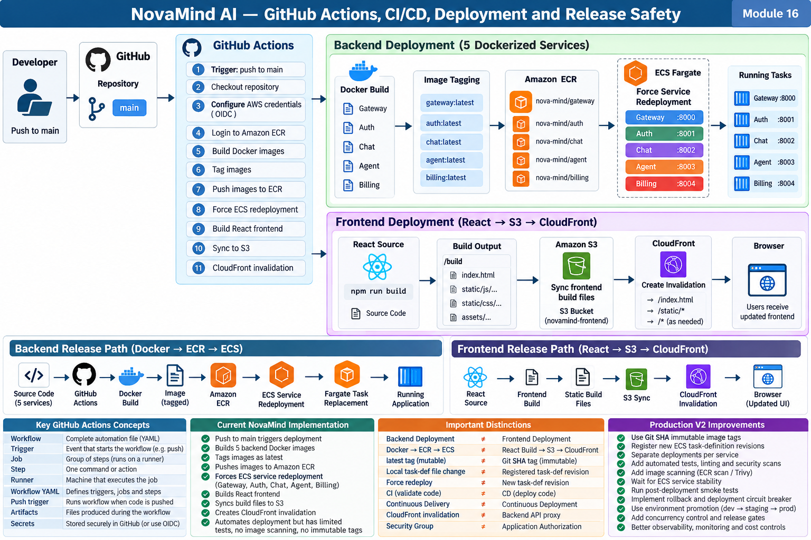

# Module 16 — GitHub Actions, CI/CD, Deployment and Release Safety

> **Project:** NovaMind-AI-LangGraph-Multi-Agent-AWS-Platform  
> **Purpose:** Understand NovaMind's verified GitHub Actions deployment workflow from source push to Docker/ECR/ECS and React/S3/CloudFront, then learn how CI, CD, immutable releases, deployment gates, task-definition revisioning, rollback, environment promotion, security, observability, and release safety should work in a stronger production design.  
> **Accuracy rule:** This file separates **CURRENT VERIFIED**, **GENERAL CONCEPT**, and **PRODUCTION V2 — PROPOSED**. Do not describe GitHub OIDC, immutable releases, tests/evals, task-definition registration, health gates, smoke tests, automated rollback, deployment concurrency control, blue/green, canary, or mature environment promotion as current unless explicitly marked.

---

## Module 16 Visual Architecture



---

# 1. Module Mental Model

NovaMind currently has meaningful **deployment automation**.

The verified high-level workflow is:

```text
Developer
  ↓
Push to main
  ↓
GitHub Actions
  ↓
Checkout Repository
  ↓
Configure AWS Credentials
  ↓
Login to Amazon ECR
  ↓
Build 5 Backend Docker Images
  ↓
Tag Images
  ↓
Push Images to ECR
  ↓
Force ECS Redeployment
  ├── Gateway
  ├── Auth
  ├── Chat
  ├── Agent
  └── Billing
  ↓
Build React Frontend
  ↓
Sync Frontend Build to S3
  ↓
CloudFront Invalidation
```

This is real automation.

However:

```text
Automated deployment
≠
Mature CI/CD
```

because the current workflow lacks several release-safety gates.

---

# 2. The Five Backend Deployments

## Concept 1 — NovaMind Backend Services

**CURRENT VERIFIED**

The workflow deploys five containerized backend services:

```text
Gateway
Auth
Chat
Agent
Billing
```

The eight AI specialists remain inside the Agent service.

Therefore:

```text
5 backend deployment units
≠
8 specialist ECS services
```

---

# 3. What Is CI?

## Concept 2 — Continuous Integration

**GENERAL CONCEPT**

Continuous Integration means developers frequently integrate code into a shared repository and automated checks validate the change.

Typical CI checks include:

```text
checkout
→ install
→ lint
→ unit tests
→ integration tests
→ build
→ security checks
```

---

## Concept 3 — What CI Is Trying to Prevent

CI tries to catch problems **before release**, such as:

- syntax errors
- broken unit tests
- dependency issues
- incompatible integrations
- build failures
- security findings

---

## Concept 4 — GitHub Actions Does Not Automatically Mean CI

GitHub Actions is an automation platform.

A workflow that only deploys code is not automatically a strong CI pipeline.

---

## Concept 5 — NovaMind Current CI Maturity

**CURRENT VERIFIED**

The repository has some development checks such as frontend lint/build capability, but the verified deployment workflow does not have a substantive automated backend test/evaluation gate before deployment.

Therefore the strongest wording is:

> NovaMind has automated deployment through GitHub Actions, but its CI quality gates are still limited.

---

# 4. What Is CD?

## Concept 6 — CD Has Two Common Meanings

CD can mean:

```text
Continuous Delivery
or
Continuous Deployment
```

They are related but different.

---

## Concept 7 — Continuous Delivery

Every validated change is kept in a deployable state.

Production release may still require:

- approval
- manual promotion
- release decision

---

## Concept 8 — Continuous Deployment

Every change that passes the pipeline is automatically deployed to production.

---

## Concept 9 — NovaMind Wording

Because the verified workflow triggers on `push` to `main` and performs deployment actions, it automates deployment from that branch.

Do not automatically call the whole system a mature Continuous Deployment platform because release safety gates are limited.

---

# 5. CI vs CD

## Concept 10 — CI

```text
"Is this change safe enough to integrate?"
```

---

## Concept 11 — CD

```text
"How do I safely deliver/deploy this validated change?"
```

---

## Concept 12 — Strong Pipeline

A mature path often looks like:

```text
Code
↓
CI Validation
↓
Build Immutable Artifact
↓
Security/Evaluation Gates
↓
Deploy
↓
Stability Check
↓
Smoke Test
↓
Release Confirmation
```

NovaMind currently automates much of the **build/deploy** path, but several validation and release-verification stages are not maturely implemented.

---

# 6. GitHub Actions Fundamentals

## Concept 13 — Workflow

A workflow is the complete GitHub Actions automation definition, normally stored as YAML under:

```text
.github/workflows/
```

---

## Concept 14 — Trigger

A trigger is the event that starts a workflow.

NovaMind's verified deployment trigger includes:

```text
push to main
```

---

## Concept 15 — Job

A job is a group of steps executed on a runner.

---

## Concept 16 — Step

A step is one action or command.

Examples:

```text
checkout code
configure AWS credentials
login to ECR
docker build
aws s3 sync
```

---

## Concept 17 — Runner

A runner is the machine/environment executing the workflow job.

---

## Concept 18 — Action

A reusable GitHub Actions component can perform a standard operation such as repository checkout or AWS credential configuration.

---

# 7. Workflow YAML

## Concept 19 — What YAML Defines

The workflow YAML can define:

- name
- triggers
- jobs
- permissions
- environment
- steps
- variables/secrets

---

## Concept 20 — Order Matters

Deployment steps have dependencies.

For example:

```text
cannot push image
before
ECR login

cannot deploy frontend
before
frontend build
```

---

# 8. `push` to `main`

## Concept 21 — Current Trigger

**CURRENT VERIFIED**

A push to `main` starts the deployment workflow.

---

## Concept 22 — Benefit

Simple:

```text
merge/push main
→ automated release process
```

---

## Concept 23 — Risk

If `main` can trigger production-like deployment without strong gates, a bad change can propagate quickly.

Therefore branch protections and CI checks matter.

---

# 9. Checkout Step

## Concept 24 — Checkout

The workflow first obtains repository content on the runner.

Without source checkout, the runner cannot build the project.

---

# 10. AWS Authentication in GitHub Actions

## Concept 25 — AWS Credentials

The workflow configures AWS credentials so the runner can call AWS APIs.

---

## Concept 26 — What Those Permissions Enable

Depending on policy, the workflow may need to:

- authenticate to ECR
- push images
- force ECS deployments
- sync frontend to S3
- invalidate CloudFront

---

## Concept 27 — Current OIDC Boundary

**CURRENT VERIFIED**

GitHub OIDC is a **proposed improvement**, not a current verified implementation.

Therefore do not say:

> “NovaMind currently authenticates GitHub Actions to AWS with OIDC.”

---

## Concept 28 — Why OIDC Is Attractive

**PRODUCTION V2 — PROPOSED**

GitHub OIDC can allow short-lived AWS role credentials without storing long-lived AWS access keys in GitHub.

---

# 11. ECR Login

## Concept 29 — Why Login Is Required

The workflow must authenticate to Amazon ECR before pushing images.

---

## Concept 30 — ECR Role

```text
ECR
= image registry
```

It stores the backend images.

It does not run them.

---

# 12. Docker Build

## Concept 31 — Build Step

For each backend service:

```text
source
→ Dockerfile
→ docker build
→ image
```

---

## Concept 32 — Five Images

**CURRENT VERIFIED**

The workflow builds images for:

- Gateway
- Auth
- Chat
- Agent
- Billing

---

# 13. Image Tagging

## Concept 33 — What Is an Image Tag?

A tag is a human-readable image reference.

Example:

```text
agent:latest
```

---

## Concept 34 — Current Tag Strategy

**CURRENT VERIFIED**

NovaMind currently uses mutable:

```text
latest
```

tags.

---

# 14. Why `latest` Is Weak

## Concept 35 — Same Name, Different Content

```text
agent:latest
```

today can point to different bytes than:

```text
agent:latest
```

tomorrow.

---

## Concept 36 — Traceability Problem

If production fails, it is harder to answer:

> Exactly which source commit produced the running image?

---

## Concept 37 — Rollback Problem

If old and new releases both used `latest`, rollback identity becomes weaker.

---

## Concept 38 — Debugging Problem

Logs may tell you the service name but not uniquely identify the deployed image bytes.

---

# 15. Immutable Release Identity

## Concept 39 — Git SHA Tag

**PRODUCTION V2 — PROPOSED**

Example:

```text
agent:7d91f2a
gateway:7d91f2a
```

The tag maps the release to a source commit.

---

## Concept 40 — Image Digest

An image digest identifies exact image content:

```text
sha256:...
```

---

## Concept 41 — Best Mental Model

```text
Git SHA
= source identity

Image Digest
= built artifact identity
```

---

# 16. Push to ECR

## Concept 42 — Current Backend Artifact Flow

```text
Docker Build
↓
Tag
↓
ECR Push
```

The pushed image is the backend release artifact.

---

# 17. ECS Deployment

## Concept 43 — Current Behavior

**CURRENT VERIFIED**

The workflow forces a redeployment of all five ECS services.

---

## Concept 44 — Force New Deployment

A forced deployment tells ECS to replace service tasks using the service's currently registered task definition.

---

## Concept 45 — With `latest`

If the task definition still references:

```text
repository:latest
```

new replacement tasks may pull the newer image behind that tag.

---

# 18. The Most Important Module 16 Distinction

## Concept 46 — Image Change vs Task-Definition Change

Current image-only behavior:

```text
Build new image
↓
Push as latest
↓
Force ECS redeployment
↓
Replacement task may pull new latest
```

But task configuration is different.

---

## Concept 47 — Local Task Definition File

Changing a local JSON file does not change AWS ECS by itself.

Example local edits:

- CPU
- memory
- environment variable
- secret reference
- task role
- execution role
- container configuration

---

## Concept 48 — Registered Task Definition

ECS runs a **registered task-definition revision**.

Therefore:

```text
edit local JSON
≠
register new AWS ECS revision
```

---

## Concept 49 — Critical Failure Scenario

Suppose you change:

```text
Agent memory
2048 → 4096
```

in repository JSON.

Then workflow only:

```text
force redeploy
```

If no new task-definition revision is registered:

```text
ECS may continue using old 2048 config
```

---

## Concept 50 — Correct Production V2 Flow

```text
Task config changes
↓
Render/validate task definition
↓
Register new revision
↓
Update ECS service to revision
↓
Wait for stability
↓
Smoke test
```

This is one of the most important interview topics in Module 16.

---

# 19. ECS Service Redeployment

## Concept 51 — What Happens

ECS starts replacement tasks and stops older tasks according to its deployment configuration.

---

## Concept 52 — Running Task ≠ Healthy Release

A new task can be in a running state while the application is:

- unable to reach Redis
- unable to reach MongoDB
- failing provider calls
- serving broken routes

Release verification is still required.

---

# 20. Backend Deployment Independence

## Concept 53 — Current Workflow

**CURRENT VERIFIED**

All five backend images/services are rebuilt/redeployed together.

---

## Concept 54 — Why This Weakens Independence

A one-line change in Chat may trigger deployment of:

```text
Gateway
Auth
Chat
Agent
Billing
```

even if only Chat changed.

---

## Concept 55 — Microservice Trade-Off

Separate runtime services exist, but deployment independence is incomplete.

---

## Concept 56 — Production V2

Detect changed services and deploy only required units when safe.

This is proposed.

---

# 21. Frontend Deployment

## Concept 57 — React Build

The workflow builds the React frontend into static assets.

---

## Concept 58 — S3 Sync

**CURRENT VERIFIED**

The generated frontend files are synchronized to the S3 frontend bucket.

---

## Concept 59 — S3 Is Hosting Storage

S3 stores the static frontend assets.

---

# 22. CloudFront Invalidation

## Concept 60 — Why Invalidate

CloudFront may have cached old frontend files.

After S3 sync:

```text
new files in S3
BUT
edge cache may still serve old files
```

Invalidation asks CloudFront to refresh affected cached objects.

---

## Concept 61 — Invalidation ≠ Backend Deployment

CloudFront invalidation affects cached frontend delivery.

It does not update ECS.

---

## Concept 62 — CloudFront ≠ Backend API Proxy

**CURRENT VERIFIED**

For this project, CloudFront is used for frontend delivery, not the backend API path.

---

# 23. Backend vs Frontend Release

## Concept 63 — Backend

```text
Node/Express
→ Docker
→ ECR
→ ECS/Fargate
```

---

## Concept 64 — Frontend

```text
React
→ Build
→ S3
→ CloudFront
```

---

## Concept 65 — Independent Failure

Backend release can succeed while frontend release fails.

Or frontend can update while backend deployment is unhealthy.

This creates version-skew risk.

---

# 24. Frontend / Backend Version Skew

## Concept 66 — Example

Frontend expects:

```text
new API response schema
```

but backend is still old because ECS failed.

The UI may break.

---

## Concept 67 — Production V2

Use:

- compatible APIs
- versioned contracts
- staged release order
- deployment verification

---

# 25. What Is a Deployment Gate?

## Concept 68 — Gate

A gate must pass before the pipeline continues.

Examples:

```text
lint
unit tests
integration tests
security scan
AI eval
health check
```

---

## Concept 69 — Current NovaMind Gate Weakness

**CURRENT VERIFIED**

The deployment workflow lacks substantive automated test/evaluation gates.

---

# 26. Linting

## Concept 70 — What Is Linting?

Linting checks source against rules for code issues/style.

Frontend lint capability exists, but a strong deployment-blocking lint gate is not verified in the current release workflow.

---

# 27. Unit Testing

## Concept 71 — Unit Test

Tests one function/module in isolation.

---

## Concept 72 — NovaMind Current Status

A substantive backend unit-test suite is not present.

The backend test script was effectively a placeholder.

---

# 28. Integration Testing

## Concept 73 — Integration Test

Tests multiple components together.

Examples:

```text
Gateway → Auth
Agent → Chat
Billing → Auth
```

A mature automated integration suite is not verified.

---

# 29. End-to-End Testing

## Concept 74 — E2E Test

Tests user-level behavior through multiple layers.

Example:

```text
login
→ ask chat
→ response
→ history persists
```

A substantive E2E suite is not verified.

---

# 30. AI Evaluation Gate

## Concept 75 — Why AI Needs More Than Unit Tests

AI output can be syntactically valid but semantically poor.

You need evaluations for:

- router accuracy
- RAG quality
- structured output
- safety/grounding
- regression

---

## Concept 76 — Current Status

**CURRENT VERIFIED**

A mature automated AI evaluation suite is not present.

---

# 31. Security Scanning

## Concept 77 — Dependency Scan

Checks known vulnerable dependencies.

---

## Concept 78 — Container Image Scan

Checks base image and installed packages.

---

## Concept 79 — Current Status

A mature image/security scanning gate is not verified in the current deployment pipeline.

---

# 32. Build Artifact

## Concept 80 — Backend Artifact

The Docker image is the backend deployable artifact.

---

## Concept 81 — Frontend Artifact

The compiled React static files are the frontend deployable artifact.

---

## Concept 82 — Build Once, Promote

A mature release approach prefers:

```text
build once
→ promote same artifact
```

rather than rebuilding different binaries/images per environment.

---

# 33. Wait for Service Stability

## Concept 83 — Why Wait?

After an ECS update, GitHub Actions should verify the service reaches a stable desired state.

---

## Concept 84 — Current Status

A mature `wait-for-service-stability` release gate is not verified.

---

## Concept 85 — What Stability Does Not Prove

Even stable ECS task count does not prove business functionality.

Therefore smoke tests still matter.

---

# 34. Smoke Testing

## Concept 86 — What Is a Smoke Test?

A small set of post-deployment checks verifies core application functionality.

Examples:

```text
health endpoint
login/session
basic chat
critical API response
```

---

## Concept 87 — Current Status

A mature automated post-deployment smoke-test gate is not verified.

---

# 35. Health vs Smoke Test

## Concept 88 — Health Check

Usually asks:

```text
Is this process/service ready/alive?
```

---

## Concept 89 — Smoke Test

Asks:

```text
Does a critical user/business flow work after release?
```

Both can be useful.

---

# 36. Deployment Verification

## Concept 90 — Verification Questions

After deploying:

- Are correct task-definition revisions running?
- Are correct image versions running?
- Are targets healthy?
- Are 5xx rates normal?
- Can critical flows work?

---

# 37. Rollback

## Concept 91 — What Is Rollback?

Return to a previously known-good release when the new release fails.

---

## Concept 92 — Why Immutable Versions Help

If releases are tagged uniquely:

```text
agent:abc123
agent:def456
```

you know exactly which artifact to restore.

---

## Concept 93 — Current Rollback Maturity

**CURRENT VERIFIED**

A mature automated rollback mechanism is not verified.

---

# 38. ECS Deployment Circuit Breaker

## Concept 94 — Concept

ECS can support deployment-failure detection/rollback strategies.

---

## Concept 95 — Current Boundary

Do not claim NovaMind currently has a mature deployment circuit-breaker workflow unless verified.

Treat it as Production V2.

---

# 39. Concurrency Control

## Concept 96 — Problem

Two commits can trigger two deployments close together.

Example:

```text
Commit A workflow starts
Commit B workflow starts
```

They can race.

---

## Concept 97 — Risks

Possible:

- newer deployment overwritten by older workflow stage
- mixed frontend/backend version
- confusing logs
- unnecessary repeated builds

---

## Concept 98 — Current Status

A mature deployment concurrency policy is not verified.

---

## Concept 99 — Production V2

Use GitHub Actions concurrency groups to:

- serialize production deployment
- cancel superseded deployment where appropriate

---

# 40. Environment Promotion

## Concept 100 — Common Environments

```text
dev
staging
production
```

---

## Concept 101 — Promotion

A mature process can:

```text
build immutable artifact
↓
deploy dev
↓
test
↓
promote same artifact to staging
↓
approve/test
↓
promote same artifact to production
```

---

## Concept 102 — Current Status

A mature multi-environment promotion model is not verified.

---

# 41. GitHub Environments

## Concept 103 — General Feature

GitHub environments can support:

- deployment secrets
- approval rules
- protection
- environment-specific variables

Do not claim NovaMind uses them unless verified.

---

# 42. AWS Credentials Security

## Concept 104 — Long-Lived Credential Risk

Long-lived AWS keys stored in CI secrets increase credential-lifecycle risk.

---

## Concept 105 — GitHub OIDC

**PRODUCTION V2 — PROPOSED**

GitHub obtains an OIDC identity token.

AWS role trust validates it.

GitHub assumes a role with short-lived credentials.

---

## Concept 106 — Why OIDC Helps

Benefits:

- no long-lived AWS access keys stored in GitHub
- short-lived credentials
- repository/branch trust conditions

---

# 43. CI Least Privilege

## Concept 107 — Deployment Role

The workflow should have only permissions required for:

- ECR
- ECS
- S3
- CloudFront

and required supporting APIs.

---

## Concept 108 — Avoid AdministratorAccess

The CI runner should not have broad account-wide admin access just because deployment needs several services.

---

# 44. Secrets in CI

## Concept 109 — Do Not Print Secrets

Shell debug/log output must not expose:

- AWS credentials
- provider keys
- DB credentials

---

## Concept 110 — Separate Build-Time and Runtime Secrets

Frontend build-time variables may become public browser code.

Backend runtime secrets should remain server-side.

---

# 45. Frontend Secret Risk

## Concept 111 — Vite/React Variables

Any value compiled into frontend JavaScript should be assumed visible to users.

Never put backend private secrets in frontend environment variables.

---

# 46. Failure: Checkout

## Concept 112 — Checkout Failure

Pipeline cannot access source.

No build/deploy should continue.

---

# 47. Failure: AWS Authentication

## Concept 113 — Symptoms

AWS CLI/actions fail with authentication/authorization errors.

Check:

- configured credential mechanism
- permissions
- region/account
- role trust if using OIDC in future

---

# 48. Failure: ECR Login

## Concept 114 — Symptoms

Docker cannot authenticate to registry.

Check:

- AWS auth
- ECR region
- repository/account
- permissions

---

# 49. Failure: Docker Build

## Concept 115 — Common Causes

- dependency install failure
- missing file in build context
- syntax error
- native dependency issue
- wrong path

---

# 50. Failure: ECR Push

## Concept 116 — Check

- repository exists
- login valid
- image tag
- permissions
- region/account

---

# 51. Failure: ECS Redeploy

## Concept 117 — Check

- service name
- cluster
- AWS region
- permissions
- service events
- task start failures

---

# 52. Failure: New Task Stops

## Concept 118 — Debug Path

```text
ECS service event
↓
task stopped reason
↓
container exit code
↓
CloudWatch logs
↓
env/secrets/network
```

---

# 53. Failure: Frontend Build

## Concept 119 — Check

- npm install/dependencies
- compile errors
- env/config
- frontend tests/lint if configured

---

# 54. Failure: S3 Sync

## Concept 120 — Check

- AWS auth
- bucket
- permissions
- region
- build output directory

---

# 55. Failure: CloudFront Invalidation

## Concept 121 — Check

- distribution ID
- IAM permission
- invalidation path
- region/global service assumptions as applicable

A frontend upload may succeed even if invalidation fails.

---

# 56. Partial Deployment

## Concept 122 — Example

```text
3 backend images deployed
4th fails
```

Now versions can be mixed.

---

## Concept 123 — Why This Matters

The five services have synchronous dependencies.

Mixed versions can break contracts.

---

## Concept 124 — Current Risk

The workflow does not provide a mature transactional all-or-nothing deployment.

---

# 57. Partial Frontend/Backend Release

## Concept 125 — Example

```text
backend deployment fails
BUT
frontend deploy succeeds
```

Frontend may call APIs it expects but backend does not support.

---

# 58. Deployment Ordering

## Concept 126 — Backward Compatibility

Safer releases often make backend changes backward-compatible before frontend switches to them.

---

# 59. Roll-Forward vs Rollback

## Concept 127 — Rollback

Restore previous version.

---

## Concept 128 — Roll-Forward

Deploy a fix as a new release.

---

## Concept 129 — Which Is Better?

Depends on:

- failure type
- data migration
- recovery speed
- compatibility

No universal answer.

---

# 60. Database Migration Concern

## Concept 130 — General Concept

Database schema changes can make rollback unsafe.

Example:

```text
new code changes stored data format
→ old code may no longer understand it
```

No mature NovaMind migration framework is verified.

---

# 61. Release Safety Principle

## Concept 131 — Deployment Success Is Not Release Success

```text
workflow green
≠
users can successfully use application
```

Need post-deployment validation.

---

# 62. Observability During Deployment

## Concept 132 — Watch

- ECS task stability
- ALB/HTTP errors
- CloudWatch logs
- provider errors
- latency
- critical business failures

---

## Concept 133 — Current Boundary

CloudWatch container logging exists, but mature release metrics/alerts are not verified.

---

# 63. Release Metadata

## Concept 134 — Useful Metadata

Every deployed task/application should expose or log:

- Git SHA
- build ID
- image digest
- deployment timestamp/version

This is a Production V2 recommendation.

---

# 64. Production V2 — Recommended Pipeline

## Concept 135 — Pull Request Stage

```text
Pull Request
↓
Install
↓
Lint
↓
Unit Tests
↓
Integration Tests
↓
AI Eval
↓
Security Scan
```

---

## Concept 136 — Build Stage

```text
Merge Main
↓
Build 5 Images
↓
Tag with Git SHA
↓
Scan
↓
Push ECR
```

---

## Concept 137 — Task Definition Stage

```text
Render task definition
↓
Pin immutable image
↓
Register new revision
```

---

## Concept 138 — Deploy Stage

```text
Update ECS service
↓
Wait for stability
↓
Health checks
↓
Smoke tests
```

---

## Concept 139 — Frontend Stage

```text
Build once
↓
Sync versioned assets to S3
↓
CloudFront invalidation
↓
Smoke test UI/API compatibility
```

---

## Concept 140 — Release Outcome

```text
healthy
→ mark successful

unhealthy
→ rollback / stop promotion
```

---

# 65. Production V2 — Service-Specific Deployment

## Concept 141 — Changed-Path Detection

If only Chat changes:

```text
deploy Chat
```

rather than rebuilding all five backends.

---

## Concept 142 — Trade-Off

Service-specific workflows improve speed/independence but add pipeline logic.

---

# 66. Production V2 — Deployment Concurrency

## Concept 143 — Serialize Production

Ensure only one production deployment actively mutates production at a time.

---

# 67. Production V2 — OIDC

## Concept 144 — Replace Long-Lived CI Credentials

Use GitHub OIDC to assume a tightly scoped AWS deployment role.

Again: proposed, not current verified.

---

# 68. Production V2 — Supply Chain Security

## Concept 145 — Pin Actions

Pin trusted GitHub Actions versions/commits where appropriate.

---

## Concept 146 — Scan Dependencies and Images

Block critical issues according to policy.

---

## Concept 147 — SBOM

A Software Bill of Materials records software components/dependencies.

This is an optional future improvement, not current.

---

# 69. Production V2 — Rollback Design

## Concept 148 — Immutable Prior Release

Rollback should point ECS back to a known previous immutable task/image revision.

---

## Concept 149 — Frontend Rollback

Keep versioned frontend artifacts/releases so a known build can be restored.

---

# 70. Cost

## Concept 150 — GitHub Actions Cost

Runner minutes may incur cost depending on plan/runner type.

---

## Concept 151 — Rebuilding All Five Services

Rebuilding/redeploying all five on every change consumes more CI time and compute.

---

## Concept 152 — ECR Storage

Keeping many immutable images increases registry storage, though lifecycle policies can manage old images.

---

## Concept 153 — CloudFront Invalidations

Invalidations can have service limits/cost considerations at scale.

---

# 71. Strong Interview Explanation

> NovaMind uses GitHub Actions to automate deployment from a push to `main`. The workflow checks out the repository, configures AWS credentials, logs into ECR, builds and pushes Docker images for the five backend services, forces ECS service redeployments, then builds the React frontend, syncs it to S3 and creates a CloudFront invalidation.
>
> I would describe this as automated deployment, but not yet mature CI/CD. The major gaps are the lack of substantive automated backend tests and AI evaluation gates, mutable `latest` image tags, no verified image-scanning gate, no explicit task-definition registration step, no mature wait-for-service-stability or smoke-test gate, no automated rollback and no mature deployment concurrency control.
>
> A particularly important detail is that an image update and a task-definition update are different. A forced ECS redeployment can replace tasks and pick up a newer `latest` image, but changing CPU, memory, environment variables, secrets or IAM in a local task-definition JSON does not update AWS unless a new ECS task-definition revision is registered and deployed.
>
> For Production V2, I would build immutable Git-SHA-tagged images, add tests/evals/scanning before deployment, register task-definition revisions explicitly, wait for ECS stability, run smoke tests, use a rollback strategy, serialize production deployments, and use GitHub OIDC with a least-privilege AWS role.

---

# Quick Revision — Module 16

## Current Backend Deployment

```text
Push main
→ GitHub Actions
→ Docker build
→ tag latest
→ ECR push
→ force ECS redeploy
→ new Fargate tasks
```

## Current Frontend Deployment

```text
React build
→ S3 sync
→ CloudFront invalidation
```

## Five Backends

```text
Gateway
Auth
Chat
Agent
Billing
```

Eight AI specialists remain inside Agent.

## Critical Distinctions

```text
CI ≠ CD
Continuous Delivery ≠ Continuous Deployment
Backend Deployment ≠ Frontend Deployment
ECR ≠ ECS
Local task JSON ≠ registered ECS revision
latest ≠ immutable release
ECS stable ≠ application works
Health check ≠ smoke test
CloudFront invalidation ≠ backend deployment
```

## Current Gaps

```text
no substantive backend test gate
no mature AI eval gate
no strong lint/test/build release gate
mutable latest tags
no immutable release identity
no verified image scan gate
no task-def registration step
no mature stability wait
no smoke test
no mature rollback
no concurrency control
all 5 services redeployed together
```

## Production V2

```text
PR validation
→ lint/tests/evals/security
→ build once
→ Git SHA tags
→ image scan
→ ECR
→ register task revision
→ ECS deploy
→ wait stable
→ smoke test
→ release success / rollback
→ environment promotion
→ OIDC + least privilege
→ observability
```

## Best Interview Sentence

> **NovaMind already automates backend and frontend deployment through GitHub Actions, ECR, ECS, S3 and CloudFront, but the next maturity step is to turn that deployment automation into release-safe CI/CD with immutable artifacts, quality gates, explicit task-definition revisioning, stability checks, smoke tests, rollback and secure short-lived AWS authentication.**

**Module 16 Learning file complete.**
