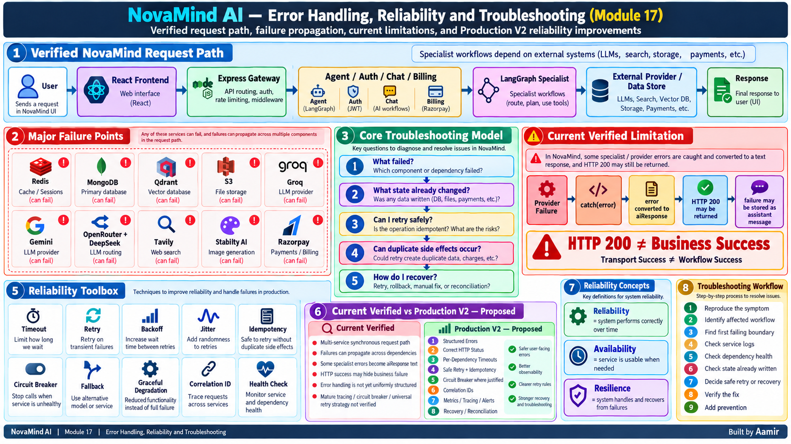

# Module 17 — Error Handling, Reliability and Troubleshooting

> **Project:** NovaMind-AI-LangGraph-Multi-Agent-AWS-Platform  
> **Purpose:** Build a deep, interview-ready understanding of how failures happen in NovaMind, how they propagate across services and providers, how retries/timeouts/idempotency should be reasoned about, how to troubleshoot methodically, and how a stronger Production V2 reliability model should work.  
> **Accuracy rule:** This guide separates **CURRENT VERIFIED**, **CURRENT LIMITATION**, **GENERAL RELIABILITY CONCEPT**, and **PRODUCTION V2 — PROPOSED**. Do not describe proposed timeouts, retries, circuit breakers, tracing, async jobs, DLQs, standardized error models, or SLOs as current features.

---

## Module 17 Visual Architecture



> Use the already-generated image at: `learning/images/17-error-handling-reliability-troubleshooting.png`

---

# 1. The Core Reliability Mental Model

NovaMind is a distributed application. A single user request may cross several internal services, data stores, and external providers.

```text
User
  ↓
React Frontend
  ↓
Express Gateway
  ↓
Relevant Backend Service
  ├── Auth
  ├── Chat
  ├── Billing
  └── Agent
       ↓
    LangGraph
       ↓
    Specialist Workflow
       ↓
External Provider / Data Store
       ↓
Response
```

Because the request crosses multiple boundaries, failure handling cannot be reduced to:

```text
try
catch
```

A strong troubleshooting process asks:

```text
1. What failed?
2. At which boundary?
3. What state already changed?
4. Was an external side effect created?
5. Can I retry safely?
6. Can retry create duplicates?
7. What should the user see?
8. How do I recover or reconcile?
9. How do I prevent the same failure later?
```

This framework is the center of Module 17.

---

# 2. Error vs Exception vs Failure vs Fault vs Bug

## 2.1 Error

**GENERAL RELIABILITY CONCEPT**

An error is a condition indicating something went wrong.

Examples:

```text
invalid request
database unavailable
provider timeout
malformed JSON
```

---

## 2.2 Exception

An exception is a programming/runtime mechanism used to signal an abnormal condition.

Example:

```javascript
throw new Error("Provider timeout");
```

An exception can represent an error, but the words are not exactly the same thing.

---

## 2.3 Failure

A failure means the system did not deliver the expected behavior.

Example:

```text
User asks a question
→ NovaMind returns no usable answer
```

A failure may be caused by:

- dependency outage
- bug
- timeout
- bad input
- invalid state

---

## 2.4 Fault

A fault is the underlying condition that can lead to failure.

Example:

```text
bad environment variable
```

is a fault.

If that causes:

```text
MongoDB connection cannot start
```

the resulting behavior is a failure.

---

## 2.5 Bug

A bug is a defect in code or logic.

NovaMind has several verified examples:

- generic `error` vs `err` handler variable defect
- `${Date.now}` vs `Date.now()` defect
- PDF rejection/error-handling issue
- frontend null/artifact-handling weakness

These are programming defects, not provider outages.

---

# 3. Transient vs Permanent Failures

## 3.1 Transient Failure

A transient failure may disappear if you try again later.

Examples:

```text
temporary provider 503
temporary network interruption
brief rate-limit condition
short-lived DNS issue
```

---

## 3.2 Permanent Failure

A permanent failure will usually not be fixed by retrying the same request.

Examples:

```text
invalid API key
unsupported file
missing required field
forbidden resource
broken code path
```

---

## 3.3 Why Classification Matters

If you retry a permanent failure:

```text
same failure
+ extra latency
+ extra cost
```

If you do not retry a transient failure:

```text
avoidable user-visible failure
```

Therefore:

```text
Failure Classification
→ Retry Decision
```

---

# 4. Synchronous vs Asynchronous Failure

## 4.1 Synchronous Failure

The request waits for the operation to finish.

NovaMind currently uses many synchronous flows.

Example:

```text
User
→ Agent
→ Groq
→ answer
→ response
```

If Groq is slow, the user's HTTP request remains waiting.

---

## 4.2 Asynchronous Failure

Work continues outside the original request using a job/queue/worker pattern.

NovaMind does **not** currently have a mature general async job architecture for these AI workflows.

Async jobs are a **Production V2 proposal** for suitable long-running operations.

---

# 5. Partial Failure

A partial failure means:

```text
some steps succeeded
BUT
the whole business operation did not complete correctly
```

This is extremely important in NovaMind.

Examples:

```text
User message saved
→ provider fails
```

```text
Provider succeeds
→ assistant message save fails
```

```text
PDF rendered
→ S3 upload fails
```

```text
Payment marked paid
→ credit grant fails
```

```text
Credit deduction succeeds
→ provider fails
```

A partial failure is often more dangerous than a clean failure because the system state is already changed.

---

# 6. Cascading Failure

A cascading failure occurs when one dependency problem causes failures in other components.

Example:

```text
Redis fails
↓
session lookup fails
↓
Gateway cannot resolve authenticated user
↓
multiple protected APIs fail
```

Another example:

```text
Agent overloaded
↓
requests slow
↓
connections remain occupied
↓
more requests accumulate
↓
latency increases further
```

---

# 7. Failure Propagation

Failure propagation means a problem in one component affects downstream behavior.

NovaMind has many dependency chains.

Example:

```text
Gateway
→ Redis
```

If Redis session lookup fails, the request may never reach Agent.

Example:

```text
Agent
→ Qdrant
→ Groq
```

If Qdrant retrieval fails, the PDF RAG workflow cannot truthfully claim grounded answer generation succeeded.

---

# 8. Error Boundary

An error boundary is the place where a component converts a lower-level failure into a controlled response.

Example:

```text
Provider throws error
↓
Agent catches error
↓
Agent classifies/logs error
↓
API returns structured failure
```

The boundary should preserve enough information internally while keeping user-facing messages safe.

---

# 9. The Most Important Current NovaMind Error-Handling Weakness

## CURRENT VERIFIED / CURRENT LIMITATION

Several specialist workflows catch provider/tool failures and convert them into an `aiResponse` error sentence.

Conceptually:

```text
Provider / Tool Failure
↓
catch(error)
↓
error text becomes aiResponse
↓
HTTP 200 may still be returned
↓
failure may be saved as assistant message
```

This creates a major semantic problem.

---

# 10. HTTP 200 ≠ Business Success

A server may successfully send an HTTP response while the requested workflow actually failed.

Therefore:

```text
Transport Success
≠
Business Success
```

and:

```text
HTTP 200
≠
AI Workflow Successful
```

If the body says:

```text
"Sorry, an error occurred while generating your answer."
```

but status is:

```text
200 OK
```

monitoring, frontend logic, retries, and analytics may incorrectly treat the operation as successful.

---

# 11. Why Returning Failure Text as Success Is Dangerous

It can cause:

- frontend success UI for failed operation
- failure message saved as assistant history
- HTTP-status dashboards undercount failures
- automatic clients cannot distinguish error from answer
- retries become unclear
- troubleshooting becomes harder
- business metrics become misleading

A better system should represent failure as failure.

---

# 12. Verified NovaMind Error Defects / Weaknesses

## CURRENT VERIFIED

The repository review identified the following concrete issues:

1. Some specialist failures are converted into `aiResponse` text.
2. Failure text may be persisted as assistant output.
3. Partial side effects can happen before the error is returned.
4. Generic handler has an `error` vs `err` variable defect.
5. PDF rejection/error-handling path has a defect.
6. A `${Date.now}` vs `Date.now()` bug exists in one path.
7. A PDF `finally` cleanup path can interfere with the original failure.
8. Image workflow rate/cleanup ordering can create cleanup reliability issues.
9. Some incompatible route/file combinations can leave uploaded temp files.
10. Frontend logic can assume artifact fields exist and fail when data is null/unexpected.
11. Conversation failure handling can produce weak or inconsistent user experience.
12. MongoDB startup failure may be logged while the process continues listening.
13. Error handling is not consistently structured across all services.
14. Mature request correlation is not verified.
15. Mature timeout/deadline policy is not verified.
16. Mature circuit breakers are not implemented.
17. Mature, consistent retry policies are not implemented.

Do not invent additional bugs beyond these verified findings.

---

# 13. Error Classification

A production-grade system should classify failures.

---

## 13.1 Validation Error

Examples:

```text
missing prompt
unsupported file type
invalid payload
```

These are usually client-side request problems.

Typical category:

```text
4xx
```

---

## 13.2 Authentication Error

Examples:

```text
missing session
invalid session
expired session
```

Typical status:

```text
401
```

---

## 13.3 Authorization Error

The user is authenticated but not allowed to access the resource.

Typical status:

```text
403
```

---

## 13.4 Not Found

Requested resource does not exist.

Typical status:

```text
404
```

---

## 13.5 Conflict

Examples:

```text
duplicate payment processing
state already changed
concurrent update conflict
```

Typical status may be:

```text
409
```

depending on API design.

---

## 13.6 Rate Limit

Typical status:

```text
429
```

---

## 13.7 Dependency Failure

Examples:

```text
Groq unavailable
Gemini unavailable
Qdrant unavailable
S3 unavailable
MongoDB unavailable
Redis unavailable
```

This may map to:

```text
502 / 503 / 504
```

depending on the exact situation.

---

## 13.8 Internal Programming Error

Examples:

```text
undefined variable
unexpected null
incorrect method call
JSON parsing bug
```

Typical server category:

```text
500
```

---

## 13.9 Business Error

Examples:

```text
insufficient credits
paid-but-credit-not-granted
invalid plan state
```

Business errors need explicit codes even if the HTTP status is chosen differently.

---

# 14. HTTP Status Codes

## 2xx

```text
200 OK
201 Created
```

Use only when the requested operation truly succeeded according to API semantics.

---

## 4xx

```text
400 Bad Request
401 Unauthorized / unauthenticated
403 Forbidden
404 Not Found
409 Conflict
422 Unprocessable Entity
429 Too Many Requests
```

---

## 5xx

```text
500 Internal Server Error
502 Bad Gateway / upstream error
503 Service Unavailable
504 Gateway Timeout
```

---

# 15. Structured Error Responses

## PRODUCTION V2 — PROPOSED

A stronger response could be:

```json
{
  "success": false,
  "error": {
    "code": "PROVIDER_TIMEOUT",
    "message": "The AI provider did not respond in time.",
    "requestId": "req_123"
  }
}
```

This gives three important things:

```text
machine-readable error code
+
safe user-facing message
+
request/correlation ID
```

---

# 16. User-Facing Error vs Internal Error

User-facing error:

```text
"The AI provider is temporarily unavailable. Please try again."
```

Internal log:

```text
provider=groq
workflow=chat
error_type=timeout
duration_ms=...
request_id=...
```

Never expose:

- stack traces
- secrets
- API keys
- DB URIs
- internal credentials
- unnecessary infrastructure details

---

# 17. Centralized Error Classes

## PRODUCTION V2 — PROPOSED

Example conceptual hierarchy:

```text
AppError
├── ValidationError
├── AuthenticationError
├── AuthorizationError
├── DependencyError
├── ProviderTimeoutError
├── RateLimitError
├── ConflictError
└── InternalError
```

Benefits:

- consistent HTTP mapping
- consistent logging
- safer frontend behavior
- easier metrics

---

# 18. Gateway Failure

If Gateway is unavailable:

```text
Frontend
↓
Gateway unavailable
↓
backend API unavailable
```

Even if Auth, Chat, Agent, and Billing are healthy.

Gateway is therefore a critical entry dependency.

---

# 19. Redis Failure

## CURRENT VERIFIED USAGE

Redis supports:

```text
sessions
conversation context/cache
rate-limit counters
```

Therefore one Redis failure can affect multiple concerns.

---

## 19.1 Session Impact

```text
Redis unavailable
↓
session lookup fails
↓
Gateway cannot resolve user
↓
protected requests fail
```

For authentication/security behavior, failing closed is normally safer.

---

## 19.2 Memory Impact

Chat context may be unavailable or stale.

A system could theoretically hydrate from MongoDB, but do not claim universal automatic fallback for every failure.

---

## 19.3 Rate-Limit Impact

If rate counters fail:

```text
fail open
→ better availability
BUT
abuse/cost risk

fail closed
→ stronger protection
BUT
legitimate users may be blocked
```

This is a policy decision.

---

# 20. MongoDB Failure

MongoDB stores durable application state:

- users
- conversations
- messages
- payments

A MongoDB failure can therefore affect:

- login/user lookup
- history
- message persistence
- admin reads
- payment records

---

## 20.1 LLM Success, Persistence Failure

Example:

```text
Groq returns answer
↓
Chat save to MongoDB fails
```

Questions to ask:

1. Do we return the answer?
2. Do we tell the user it was not saved?
3. Can a retry duplicate the message?
4. Is the conversation now missing history?

There is no one universal answer; the product must define the behavior.

---

# 21. MongoDB Startup Failure While Server Listens

## CURRENT VERIFIED LIMITATION

The review found a path where MongoDB connection failure can be logged while the process may continue listening.

Risk:

```text
container appears alive
BUT
critical dependency unavailable
```

This is why:

```text
process running
≠
service ready
```

A readiness check should consider required dependencies.

---

# 22. Chat Service Failure

Agent depends on Chat for:

- storing user messages
- storing assistant messages
- conversation/history interactions

If Chat fails:

```text
AI provider may still be healthy
BUT
conversation persistence can break
```

This is synchronous service coupling.

---

# 23. Auth Service Failure

Auth is involved in:

- user/account functions
- session-related logic
- credit mutation
- plan updates

A failure can affect both authentication/account behavior and business accounting.

---

# 24. Billing → Auth Partial Failure

From Module 12:

```text
Razorpay payment verified
↓
Payment marked paid
↓
Billing calls Auth
↓
Auth fails
```

Result:

```text
Payment = paid
Credits = missing
```

This requires reconciliation/idempotent recovery.

---

# 25. Agent Failure

Agent is the orchestration center for AI workflows.

If Agent fails:

```text
AI workflows unavailable
```

while:

- Auth
- Chat
- Billing

may still be running.

---

# 26. Provider Mapping and Failure Surface

Use the real project mapping.

```text
General Chat
→ Groq

Search
→ Tavily + Groq

PDF RAG
→ Gemini embeddings + Qdrant + Groq

Coding
→ OpenRouter + DeepSeek

Image Generation
→ Stability AI

Image Analysis
→ Gemini
```

A workflow can fail at any provider boundary.

---

# 27. Groq Failure

Can affect:

- normal chat
- Search synthesis
- PDF RAG answer generation
- other Groq-backed content-generation paths

Do not assume a secondary provider automatically takes over.

---

# 28. Multiple Providers ≠ Automatic Failover

NovaMind integrates several providers.

That does **not** mean:

```text
Groq fails
→ Gemini automatically replaces it
```

unless explicit fallback logic exists.

Current mature universal provider failover is not verified.

---

# 29. Tavily Failure

Search workflow:

```text
Question
↓
Tavily search
↓
results
↓
Groq synthesis
```

If Tavily fails, there may be no fresh retrieval context.

Returning normal Chat silently would change the semantics of the feature.

If a fallback is added in V2, it should be explicit.

---

# 30. Qdrant Failure

PDF RAG uses Qdrant for vector storage/retrieval.

If retrieval fails:

```text
document RAG did not succeed
```

The system should not silently present a normal ungrounded answer as if it came from the uploaded document.

---

# 31. S3 Failure

Artifact flow:

```text
content generated
↓
PDF/PPT/image created
↓
S3 upload
↓
presigned URL
```

Possible partial failures:

```text
render succeeds
S3 upload fails
```

or:

```text
S3 upload succeeds
presign fails
```

or:

```text
presign succeeds
response/persistence fails
```

Each stage has different retry safety.

---

# 32. Timeout

A timeout limits how long one operation waits.

Without timeouts:

```text
dependency hangs
↓
request remains open
↓
resources stay occupied
↓
latency and concurrency worsen
```

---

# 33. Different Timeout Layers

A distributed request can have:

```text
frontend timeout
Gateway timeout
service-to-service timeout
provider timeout
database timeout
storage timeout
```

Do not invent current NovaMind timeout values.

---

# 34. One Timeout Does Not Fit Every Workflow

A normal chat may be expected to complete faster than:

- PDF generation
- PPT generation
- image generation
- large PDF RAG

Timeouts should reflect workflow characteristics.

---

# 35. Deadline

A deadline is the maximum time allowed for the **whole request**.

Example:

```text
Total deadline = 30 sec

Routing = 3 sec
Search = 7 sec

Remaining budget = 20 sec
```

Deadline propagation prevents every downstream call from consuming its own full timeout.

Mature deadline propagation is **PRODUCTION V2 — PROPOSED**.

---

# 36. Cancellation

If the user disconnects or the total request deadline expires, a stronger system may cancel work that no longer needs to continue.

Cancellation can reduce:

- provider cost
- wasted CPU
- stale side effects

Current mature cancellation is not verified.

---

# 37. Retry

Retry means:

```text
attempt the failed operation again
```

Retry can improve reliability for transient failures.

But:

```text
Retryable
≠
Safe to Retry
```

---

# 38. Safe Retry

Read-only operations are often safer.

Examples:

```text
MongoDB read
Qdrant read
GET request
```

But even reads may cause cost or provider quotas.

---

# 39. Unsafe Retry

Operations that create side effects can duplicate state.

Examples:

- grant credits
- deduct credits
- create message
- create payment side effect
- generate/upload artifact with random key

These need idempotency or deduplication.

---

# 40. Exponential Backoff

A retry schedule may increase delay:

```text
attempt 1 → wait 1 sec
attempt 2 → wait 2 sec
attempt 3 → wait 4 sec
```

This gives the dependency time to recover.

---

# 41. Jitter

Jitter adds random variation:

```text
2 sec ± random
```

Why?

If 1,000 clients retry exactly at 2 seconds:

```text
dependency recovers
↓
all retry together
↓
dependency overloaded again
```

This is the thundering-herd problem.

---

# 42. Maximum Retry Attempts

Retries must be bounded.

Otherwise:

```text
persistent failure
→ infinite retry
→ resource exhaustion
```

---

# 43. Retry Budget

A mature system can constrain:

- number of retries
- total retry time
- total request deadline

This prevents retries from making latency unpredictable.

---

# 44. Idempotency

Idempotency means:

```text
same logical operation repeated
→ same business effect
```

Example:

```text
same payment callback twice
→ credits granted once
```

---

# 45. Idempotency and Message Persistence

Suppose:

```text
save message
↓
network response lost
↓
caller retries
```

Without a stable message/request ID, duplicate messages can be created.

---

# 46. Idempotency and S3

A retry with random object names can create duplicate objects.

A stable artifact ID/object key can make retry safer.

This stronger design is proposed, not current.

---

# 47. Circuit Breaker

A circuit breaker prevents repeatedly calling a dependency known to be failing.

Mental model:

```text
CLOSED
calls allowed
↓
repeated failures
↓
OPEN
fail fast
↓
cooldown
↓
HALF-OPEN
limited trial
↓
success → CLOSED
failure → OPEN
```

NovaMind does not currently have a mature verified circuit-breaker layer.

---

# 48. Why Circuit Breakers Help

They can reduce:

- wasted waiting
- thread/socket/resource pressure
- provider hammering
- cascading failures

But they add complexity and should be driven by measurement.

---

# 49. Fallback

Fallback means using another behavior when the primary path fails.

Examples conceptually:

```text
search unavailable
→ offer normal chat

primary provider unavailable
→ secondary provider
```

But the user must understand that the result changed.

Do not claim automatic NovaMind provider failover today.

---

# 50. Graceful Degradation

Graceful degradation means preserving unaffected features.

Example:

```text
Stability AI down
↓
image generation unavailable
BUT
normal chat still works
```

This depends on isolating failure paths.

---

# 51. Bulkhead

Bulkhead means isolating resources so one overloaded workflow does not consume everything.

Example:

```text
image generation spike
```

should not consume all capacity needed for:

```text
normal chat
```

Possible V2 techniques:

- separate concurrency pools
- per-workflow limits
- queues
- separate workers

Not current.

---

# 52. Fail Open vs Fail Closed

## Fail Closed

On failure:

```text
deny operation
```

Safer for:

- authentication
- authorization
- sensitive payment mutation

---

## Fail Open

On failure:

```text
allow operation
```

Can improve availability but increase risk.

Example:

```text
rate-limit store unavailable
```

Fail-open allows traffic but may create abuse/cost exposure.

---

# 53. Health Check

A health check asks whether the component is functioning.

---

# 54. Liveness

Question:

```text
Should this process be restarted?
```

---

# 55. Readiness

Question:

```text
Should this process receive traffic?
```

A process can be alive but not ready.

---

# 56. MongoDB Example of Readiness

If Node.js is listening but MongoDB is unavailable:

```text
liveness may be true
readiness may be false
```

depending on design.

---

# 57. Current Health-Check Status

Mature application readiness/liveness handling is not fully verified.

Treat health-gate improvements as Production V2.

---

# 58. Correlation ID

A correlation ID connects logs from one request across services.

Proposed flow:

```text
Frontend
↓
Gateway assigns requestId
↓
Agent receives requestId
↓
Chat/Auth/Billing get same requestId
↓
provider logs include requestId
↓
CloudWatch search by requestId
```

Mature cross-service propagation is not verified today.

---

# 59. Logging

## CURRENT VERIFIED

ECS services use:

```text
stdout/stderr
→ awslogs
→ CloudWatch Logs
```

---

# 60. Good Error Log Fields

A stronger structured log should include:

```text
timestamp
service
requestId
workflow
operation
dependency
status
latency
errorCode
retryCount
```

Never log secrets.

---

# 61. Metrics

Useful reliability metrics include:

```text
request_success_total
request_failure_total
provider_error_total
provider_timeout_total
workflow_latency
redis_error_total
mongodb_error_total
qdrant_error_total
s3_error_total
payment_consistency_error_total
```

These are proposed examples, not a claim that current metrics exist.

---

# 62. Tracing

Tracing shows the full request path.

Example:

```text
Request total: 14 sec

Gateway        20 ms
Router         500 ms
Tavily          3 sec
Groq            10 sec
Persistence    200 ms
```

This reveals where latency is actually spent.

Current distributed tracing is not verified.

---

# 63. Reliability vs Availability vs Resilience

## Reliability

Probability the system performs correctly over time.

---

## Availability

How often the service is usable when needed.

---

## Resilience

Ability to withstand/recover from failures.

---

# 64. SLI / SLO / SLA

## SLI

A measurement.

Example:

```text
successful request rate
```

---

## SLO

An internal target.

Example conceptually:

```text
99.9% successful requests
```

Do not claim this is NovaMind's actual SLO.

---

## SLA

A contractual promise to customers.

NovaMind has no verified formal SLA.

---

# 65. RTO / RPO

## RTO

Recovery Time Objective:

```text
How quickly must service recover?
```

---

## RPO

Recovery Point Objective:

```text
How much data loss is acceptable?
```

Current tested NovaMind RTO/RPO is not verified.

---

# 66. Recovery

Recovery means restoring correct service after failure.

Examples:

- retry transient provider call
- restart unhealthy task
- restore service connectivity
- regenerate presigned URL
- reconcile payment/credit mismatch

---

# 67. Reconciliation

Reconciliation checks whether distributed states agree.

Example:

```text
Payment = paid
Credits = unchanged
```

Reconciliation finds and repairs the mismatch safely.

---

# 68. Troubleshooting Methodology

Use this sequence:

```text
1. Reproduce / define symptom
2. Identify affected workflow
3. Find first failing boundary
4. Check service health
5. Check logs
6. Check dependency
7. Check network / DNS
8. Check auth / secrets
9. Check state already written
10. Decide safe retry / recovery
11. Verify fix
12. Add prevention
```

This is much stronger than random debugging.

---

# 69. Scenario — HTTP 500

Start at the user-visible error.

```text
Frontend sees 500
↓
Gateway log
↓
request/correlation context
↓
downstream service
↓
dependency/provider
```

Questions:

- Where did 500 originate?
- Did downstream return an error?
- Was data written before the error?
- Can user safely retry?

---

# 70. Scenario — HTTP 200 but Failure Text

This is a NovaMind-specific high-value interview case.

```text
Frontend receives HTTP 200
BUT
body contains:
"Something went wrong..."
```

Troubleshoot:

1. inspect specialist catch block
2. identify provider/tool exception
3. confirm error converted to `aiResponse`
4. inspect whether assistant error text was persisted
5. verify monitoring misclassified request as success

Root design problem:

```text
transport status does not represent business result
```

---

# 71. Scenario — Works Locally, Fails on AWS

Use this order:

```text
ECS task state
↓
CloudWatch logs
↓
environment variables
↓
Secrets Manager
↓
Cloud Map / DNS
↓
Security Groups
↓
route / NAT
↓
MongoDB / Redis
↓
external provider
```

Do not start by rewriting code.

---

# 72. Scenario — Slow AI Request

Break the request into stages.

```text
Gateway
Routing
History Load
Provider
Tool
RAG Retrieval
Persistence
Artifact Upload
```

Measure each.

Do not say:

> "The LLM is slow"

until measurement proves it.

---

# 73. Scenario — Redis Failure

Symptoms can include:

- login/session failures
- context failures
- rate-limit anomalies

Check:

```text
endpoint
DNS
SG/network
connection
node health
logs
```

Then choose fail-open/fail-closed behavior by concern.

---

# 74. Scenario — MongoDB Failure

Check:

```text
URI
secret
DNS
allowlist/network
TLS
credentials
logs
```

Then inspect partial state:

```text
Did provider already respond?
Was user message saved?
Was assistant message saved?
```

---

# 75. Scenario — PDF RAG Wrong Answer

Troubleshoot in sequence:

```text
Router
↓
PDF extraction
↓
Chunking
↓
Gemini embeddings
↓
Qdrant insertion
↓
Query embedding
↓
Top-5 retrieval
↓
Retrieved context
↓
Groq generation
```

Do not immediately blame hallucination.

A retrieval defect may be the real cause.

---

# 76. Scenario — PDF RAG Retrieval Failure

If Qdrant fails:

```text
retrieval unavailable
```

Do not silently act as if document-grounded context exists.

---

# 77. Scenario — Search Failure

```text
Router
↓
Tavily
↓
results
↓
Groq synthesis
↓
credit operations
↓
persistence
```

Possible failure points:

- Tavily
- Groq
- credit helper
- Chat persistence
- Redis memory

---

# 78. Scenario — Coding Failure

```text
router
↓
coding-intent classification
↓
OpenRouter
↓
DeepSeek
↓
structured JSON
↓
parse
↓
code artifact
↓
frontend
```

A successful provider call can still fail at parsing.

---

# 79. Scenario — Image Analysis Failure

```text
upload
↓
temp file
↓
read/base64
↓
Gemini
↓
text response
↓
cleanup
```

Investigate both provider and cleanup behavior.

---

# 80. Scenario — Image Generation Failure

```text
prompt preparation
↓
Stability AI
↓
image bytes
↓
S3 upload
↓
presigned URL
```

A provider success does not guarantee artifact delivery success.

---

# 81. Scenario — Generated PDF/PPT Missing

```text
LLM structured content
↓
JSON parse
↓
PDFKit / PptxGenJS
↓
binary/file
↓
S3
↓
presigned URL
↓
frontend
```

Find the first failing boundary.

---

# 82. Scenario — Paid but No Credits

```text
Razorpay
↓
callback
↓
HMAC verification
↓
Payment record
↓
Billing → Auth
↓
credit state
↓
reconciliation
```

The key question:

```text
What already succeeded before credit grant failed?
```

---

# 83. Scenario — Provider Timeout

Ask:

- which provider?
- what timeout layer?
- was provider call retried?
- was provider side effect possible?
- was user request still active?
- were credits already deducted?

---

# 84. Scenario — ECS Task Failure

```text
ECS Service
↓
Task
↓
Stopped Reason
↓
Exit Code
↓
CloudWatch Logs
↓
Environment / Secrets
↓
Network / Dependency
```

---

# 85. Retry Safety Matrix

| Operation | Retryable? | Idempotency Needed? | Duplicate Risk | Recovery Guidance |
|---|---|---:|---|---|
| LLM inference | Often for transient failure | Sometimes | Extra cost / different answer | bounded retry only for transient failures |
| Tavily search | Often | Usually low business side effect | extra cost/quota | bounded retry |
| Qdrant read | Usually | No business mutation | low | retry transient read failure |
| MongoDB read | Usually | No mutation | low | retry according to DB policy |
| Message create | Yes only carefully | **Yes** | duplicate message | stable request/message ID |
| S3 upload | Yes | Prefer stable key | duplicate objects | stable artifact/object identity |
| Credit deduction | Dangerous | **Yes** | double debit | atomic/idempotent operation |
| Payment credit grant | Dangerous | **Yes** | double grant | idempotency key + reconciliation |
| Razorpay callback | Yes/repeated delivery possible | **Yes** | duplicate credits/state | process once by payment/event ID |
| Frontend GET | Usually | No mutation | low | standard retry/cache policy |
| ECS deployment | Retry carefully | release identity required | overlapping/mixed deploys | serialize + immutable release |

Important:

```text
Retry Policy
must consider
Business Side Effects
```

not just network errors.

---

# 86. Current Error-Handling Summary

## CURRENT VERIFIED

NovaMind already has:

- try/catch handling in multiple workflows
- CloudWatch container logging
- service separation
- explicit external-provider boundaries

But current handling is inconsistent.

---

# 87. Current Reliability Limitations

## CURRENT LIMITATION

- some failures become normal response text
- HTTP status can hide business failure
- no mature standardized error contract
- partial side effects are possible
- idempotency is incomplete
- retry policy is inconsistent
- timeout/deadline policy is not maturely verified
- no mature circuit breaker
- no mature universal provider fallback
- no distributed tracing
- no mature correlation IDs
- readiness/health semantics are limited
- no tested SLO/SLA/RTO/RPO
- no general async job/recovery architecture

---

# 88. Production V2 — Structured Error Model

```text
Low-Level Exception
↓
Classify
↓
Structured App Error
↓
Correct HTTP Status
↓
Safe User Message
↓
Detailed Internal Log
↓
Metric / Trace
```

---

# 89. Production V2 — Per-Dependency Timeouts

Add explicit timeout policies for:

- Redis
- MongoDB
- Groq
- Gemini
- OpenRouter
- Tavily
- Qdrant
- S3
- Razorpay

Do not invent values; tune them from measurements and user expectations.

---

# 90. Production V2 — Total Deadline

Propagate remaining request time so downstream work stops when the user request can no longer succeed.

---

# 91. Production V2 — Safe Retry Policy

Retry only when:

```text
failure is transient
AND
operation is safe/idempotent
AND
deadline remains
```

Use:

- bounded attempts
- exponential backoff
- jitter

---

# 92. Production V2 — Circuit Breakers

Consider circuit breakers for repeatedly failing providers where measurement shows value.

Do not add them blindly to every dependency.

---

# 93. Production V2 — Graceful Degradation

Define explicit product behavior for:

- Search provider down
- image provider down
- artifact storage down
- vector DB down

Do not silently change semantics.

---

# 94. Production V2 — Async Jobs

Suitable long-running operations could become:

```text
API request
↓
create job
↓
queue
↓
worker
↓
status/result
```

Possible candidates:

- large PDF/PPT generation
- image generation
- large document ingestion

This is proposed, not current.

---

# 95. Production V2 — DLQ

If queues are introduced, repeatedly failed jobs can move to a dead-letter queue.

A DLQ supports:

- inspection
- manual recovery
- retry after fix

No current DLQ claim.

---

# 96. Production V2 — Observability

Add:

```text
structured logs
correlation IDs
metrics
traces
alerts
dashboards
```

For reliability, monitor:

- provider latency/error
- workflow failure
- task restart
- Redis/MongoDB/Qdrant errors
- artifact failure
- payment inconsistency

---

# 97. Production V2 — Failure Testing

Test deliberately:

- provider outage
- Redis unavailable
- MongoDB unavailable
- Qdrant unavailable
- S3 AccessDenied
- provider timeout
- duplicate payment callback
- duplicate message retry
- ECS restart during request
- cleanup failure

---

# 98. Strong Interview Explanation

> NovaMind is a synchronous multi-service AI application, so one request can cross Gateway, Redis, Agent, Chat/Auth, an external provider and a data store. My troubleshooting model is always: what failed, what state already changed, can I retry safely, can retry duplicate a side effect, and how do I recover.
>
> One important current limitation is that some specialist workflows catch provider errors and convert them into an `aiResponse` string, so the HTTP response may still be 200 and the failure text may even be persisted as an assistant message. That means transport success does not necessarily equal workflow success.
>
> I would improve this with a structured error model, correct HTTP status codes, safe user messages, request IDs, per-dependency timeouts, bounded retries with backoff and jitter, idempotency for side-effecting operations, circuit breakers where justified, health/readiness checks, and better logs, metrics and traces. For distributed partial failures such as paid-but-no-credits, recovery must include reconciliation rather than blind retries.

---

# Quick Revision — Module 17

## Core Framework

```text
What failed?
↓
What state already changed?
↓
Can I retry safely?
↓
Can duplicate side effects occur?
↓
How do I recover?
```

## Biggest Current Limitation

```text
provider/tool failure
→ caught
→ converted to aiResponse
→ HTTP 200 may still be returned
→ failure text may be saved
```

Therefore:

```text
HTTP 200 ≠ Business Success
```

## Provider Map

```text
Chat → Groq
Search → Tavily + Groq
PDF RAG → Gemini + Qdrant + Groq
Coding → OpenRouter + DeepSeek
Image Generation → Stability AI
Image Analysis → Gemini
```

## Reliability Toolbox

```text
Timeout
Deadline
Retry
Backoff
Jitter
Idempotency
Circuit Breaker
Fallback
Graceful Degradation
Bulkhead
Fail Open / Fail Closed
Health
Readiness
Correlation ID
Logs / Metrics / Traces
Reconciliation
```

## Current Limitations

```text
inconsistent structured errors
HTTP 200 can hide failures
partial side effects
incomplete idempotency
no mature retry strategy
no mature deadline strategy
no mature circuit breaker
no universal provider failover
no distributed tracing
no mature correlation IDs
no tested SLO/SLA/RTO/RPO
```

## Production V2

```text
structured errors
correct HTTP statuses
safe user messages
per-dependency timeouts
total deadlines
bounded retry
backoff + jitter
idempotency
circuit breakers where justified
graceful degradation
health/readiness
correlation IDs
metrics
tracing
alerts
reconciliation
failure testing
```

## Best Interview Sentence

> **In NovaMind, reliability is mainly about controlling failure propagation across synchronous services and external providers; the biggest current issue is that some business failures can be returned as HTTP 200 text responses, so Production V2 should make failures explicit, retry only safely, and add structured observability and recovery.**

**Module 17 Learning file complete.**
