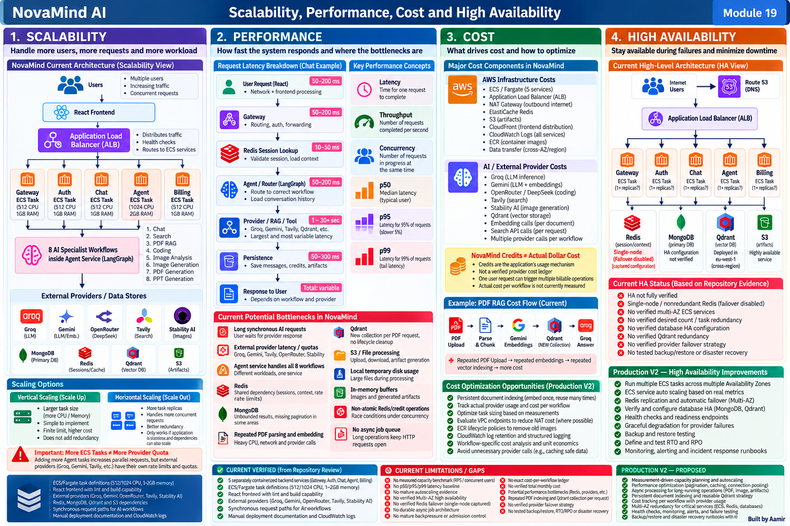

# Module 19 — Scalability, Performance, Cost and High Availability

> **Project:** NovaMind-AI-LangGraph-Multi-Agent-AWS-Platform  
> **Purpose:** Learn scalability, performance, capacity, cost, bottlenecks and high availability from zero, then apply every concept directly to the verified NovaMind implementation.  
> **Accuracy rule:** This guide separates **CURRENT VERIFIED**, **CURRENT GAP**, **GENERAL CONCEPT**, and **PRODUCTION V2 — PROPOSED**. Do not claim measured capacity, autoscaling, Multi-AZ high availability, Redis failover, exact cost-per-workflow, provider failover, or tested disaster recovery unless explicitly marked.

---

## Module 19 Visual Architecture



---

# 1. Why This Module Matters

A system can be functionally correct and still fail in real use because:

- too many users arrive at the same time
- one service becomes a bottleneck
- an external provider rate-limits requests
- latency becomes too high
- infrastructure cost grows faster than usage
- one dependency fails and the whole system becomes unavailable

For NovaMind, these concerns matter because one user request can depend on:

```text
Gateway
Redis
Agent
LangGraph
Groq / Gemini / OpenRouter / Tavily / Stability AI
MongoDB
Qdrant
S3
Chat
Auth
Billing
```

A production-oriented engineer must understand:

```text
How much load can the system handle?
Where will it bottleneck?
How fast is each workflow?
What does each request cost?
What fails if one dependency goes down?
How would I improve scalability without making incorrect assumptions?
```

---

# 2. Verified NovaMind Architecture for This Module

## CURRENT VERIFIED

There are five separately containerized backend services:

```text
Gateway
Auth
Chat
Agent
Billing
```

The eight AI specialist workflows are inside the **Agent service**.

They are **not eight separately scalable ECS services**.

The AI Agent service contains workflows for:

```text
Chat
Search
Coding
PDF RAG
PDF Generation
PPT Generation
Image Generation
Image Analysis
```

---

# 3. Verified ECS/Fargate Task Resource Configuration

Repository task definitions contain approximately:

| Service | CPU | Memory |
|---|---:|---:|
| Gateway | 512 | 1024 MiB |
| Auth | 512 | 1024 MiB |
| Chat | 512 | 1024 MiB |
| Billing | 512 | 1024 MiB |
| Agent | 1024 | 2048 MiB |

This tells us how each task is configured.

It does **not** tell us:

- maximum requests per second
- maximum concurrent users
- safe concurrency per task
- p95 latency
- p99 latency
- correct production task size
- whether Agent is under-sized
- whether other services are over-sized

Important:

```text
Configured CPU / Memory
≠
Measured Capacity
```

---

# 4. What Is Scalability?

## GENERAL CONCEPT

Scalability means the system can handle increasing workload without unacceptable degradation.

The workload could increase in:

- users
- requests
- files
- documents
- messages
- vector data
- generated artifacts
- provider calls

A scalable system does not simply mean:

```text
"It runs on AWS."
```

AWS provides scaling building blocks. The application still has to be designed correctly.

---

# 5. Scale Up vs Scale Out

## Vertical Scaling — Scale Up

Vertical scaling means giving one machine/task more resources.

Example:

```text
Agent
1 vCPU / 2 GiB
↓
larger Agent task
```

### Benefits

- simple
- no extra distributed coordination
- useful for CPU/memory-heavy work

### Limitations

- finite upper limit
- potentially more expensive
- does not automatically provide redundancy
- external provider limits remain unchanged

---

## Horizontal Scaling — Scale Out

Horizontal scaling means running more copies.

Example:

```text
Agent Task A
Agent Task B
Agent Task C
```

### Benefits

- more parallel request handling
- better redundancy
- can improve availability

### Limitations

- shared dependencies may bottleneck
- race conditions may remain
- provider quotas may still limit throughput
- state coordination becomes more important

---

# 6. Scale Down / Scale In

Scaling should also reduce capacity when traffic falls.

```text
High Load
→ more tasks

Low Load
→ fewer tasks
```

This is part of elasticity.

---

# 7. What Is Elasticity?

Elasticity is the ability to adjust capacity as demand changes.

Scalability asks:

> Can the system handle more load?

Elasticity asks:

> Can capacity automatically increase and decrease with load?

NovaMind's current repository does not provide enough evidence to claim mature ECS autoscaling.

---

# 8. Capacity

Capacity means the amount of workload a system can handle while still meeting acceptable performance and reliability.

Examples:

```text
requests per second
concurrent users
concurrent AI generations
documents per minute
```

Without load testing, capacity should not be guessed.

---

# 9. Throughput

Throughput is how much work completes per unit time.

Example:

```text
50 successful requests / second
```

Throughput differs from latency.

---

# 10. Concurrency

Concurrency means the number of operations in progress at the same time.

Example:

```text
100 users currently waiting for AI responses
```

An application can have low CPU but high concurrency if it is waiting on external APIs.

---

# 11. Requests Per Second

RPS measures how many requests arrive or complete each second.

But one RPS number can hide workflow differences.

For NovaMind:

```text
1 Chat request
≠
1 PDF RAG request
≠
1 Image Generation request
```

Each has different cost and latency.

---

# 12. Bottleneck

A bottleneck is the resource or dependency that limits the system's throughput/performance.

The bottleneck is not always the server CPU.

Potential NovaMind bottlenecks include:

- external provider latency
- external provider quota
- Agent service
- Redis
- MongoDB
- Qdrant
- repeated PDF indexing
- S3 artifact processing
- large memory/context
- synchronous workflow duration

---

# 13. Saturation

Saturation means a resource is close to or beyond its useful capacity.

Examples:

- CPU near maximum
- memory pressure
- connection pool exhausted
- provider quota exhausted
- too many concurrent requests
- queue growing faster than workers process

---

# 14. CPU Utilization

CPU measures computation usage.

High CPU may indicate:

- heavy parsing
- rendering
- serialization
- high traffic
- inefficient loops

But low CPU does **not** mean there is no bottleneck.

---

# 15. Low CPU ≠ Spare Capacity

NovaMind often waits on network providers.

Example:

```text
Agent sends request to Groq
↓
Agent waits
```

During the wait:

```text
CPU may be low
BUT
request remains open
```

Therefore:

```text
Low CPU
≠
Low Concurrency
```

and:

```text
Low CPU
≠
Low Latency
```

---

# 16. Memory Utilization

Memory pressure can come from:

- uploaded files
- PDF parsing
- image buffers
- generated artifacts
- large prompt/context history
- concurrent requests
- large JSON responses

Agent has more configured memory than other services, but that does not prove it is correctly sized.

---

# 17. Network as a Bottleneck

NovaMind depends heavily on external network calls.

Examples:

```text
Groq
Gemini
OpenRouter
Tavily
Stability AI
Qdrant
MongoDB
S3
```

Latency can come from:

- internet routing
- cross-region calls
- TLS setup
- provider processing
- data transfer

---

# 18. Disk / Temporary Storage

Some uploaded files are saved temporarily.

Large concurrent uploads can create:

- disk pressure
- cleanup risk
- local task dependence

Fargate local temporary storage is not the same as durable object storage.

---

# 19. Database Connections

Opening a new database connection for every request is inefficient.

A connection pool reuses connections.

Benefits:

- lower connection overhead
- fewer database connection storms
- better throughput

Do not invent NovaMind's current pool size.

---

# 20. Provider Quotas

External providers can impose limits such as:

- requests/minute
- tokens/minute
- concurrent requests
- account quota

Therefore:

```text
More Agent Tasks
≠
More Provider Quota
```

This is one of the most important scalability concepts for NovaMind.

---

# 21. Rate Limits vs Capacity

Rate limits intentionally restrict use.

Capacity is what the system can safely handle.

A rate limit can protect capacity.

Example:

```text
provider quota = 100 requests/min
```

Sending 1,000/min does not create capacity; it creates errors.

---

# 22. Stateless Service

A stateless service does not keep user-specific durable state only in its local process.

This makes horizontal scaling easier.

Example:

```text
Request 1 → Task A
Request 2 → Task B
```

if shared state is external.

---

# 23. NovaMind State and Scaling

NovaMind uses external stores:

```text
MongoDB
Redis
Qdrant
S3
```

This helps service replicas share data.

But do not call the application fully stateless because:

- LangGraph state exists during a request
- temporary files can exist locally
- in-memory buffers exist during processing
- current in-flight graph execution is not durable
- no LangGraph checkpointer is implemented

Important:

```text
External Persistence
≠
Durable Workflow Execution
```

---

# 24. ECS Desired Count

**GENERAL CONCEPT**

Desired count means the number of ECS tasks ECS tries to keep running.

Example:

```text
desiredCount = 3
```

means:

```text
ECS attempts to maintain 3 tasks
```

Do not claim NovaMind's current desired count unless live configuration is verified.

---

# 25. ECS Service Auto Scaling

Production V2 could scale ECS service replicas automatically.

Conceptually:

```text
Load increases
↓
Scaling metric crosses target
↓
Increase desired count
↓
More tasks
```

Potential signals:

- CPU
- memory
- ALB requests/target
- concurrent requests
- queue depth
- custom latency metric

Current mature autoscaling is not verified.

---

# 26. Target Tracking

Target tracking tries to keep a metric near a target.

Example concept:

```text
Average CPU target = X%
```

No numeric target should be invented without measurement.

---

# 27. Step Scaling

Step scaling changes capacity in steps based on alarm severity.

Example concept:

```text
moderate load → +1 task
high load → +3 tasks
```

Again, no claim this is currently configured.

---

# 28. Cooldown

Cooldown prevents scaling policies from rapidly oscillating.

Without cooldown:

```text
scale out
scale in
scale out
scale in
```

This is called thrashing/flapping.

---

# 29. Graceful Scale-In

When reducing tasks:

- stop accepting new work
- allow in-flight work to finish where possible
- then terminate

This matters for long-running AI/artifact requests.

Current mature graceful-drain behavior is not verified.

---

# 30. Hot Spot

A hot spot is one component receiving disproportionate load.

In NovaMind, Agent is a possible hot spot because all eight AI workflows live inside it.

---

# 31. Agent as a Scaling Concentration Point

The Agent service handles:

- Chat
- Search
- Coding
- PDF RAG
- PDF Generation
- PPT Generation
- Image Generation
- Image Analysis

These workloads have very different resource patterns.

Therefore one Agent scaling policy may not perfectly fit all workflows.

---

# 32. Do Not Split Every Specialist Automatically

A common mistake is:

> "Eight workflows means eight microservices."

No.

Splitting services creates:

- more deployment units
- more networking
- more monitoring
- more IAM/secrets
- more operational complexity

Split only when evidence justifies it:

- workload isolation
- independent scaling
- failure isolation
- team ownership
- deployment independence

---

# 33. Bulkhead / Workload Isolation

Bulkhead means isolating resources so one workload does not consume everything.

Future examples:

```text
Image generation concurrency limit
PDF generation worker pool
Chat reserved capacity
```

Not current.

---

# 34. Noisy Neighbor

One workload can hurt another if they share resources.

Example:

```text
50 large PDF generations
```

could consume memory/CPU/network in the same Agent service and affect Chat latency.

This is a possible architectural concern, not a measured current incident.

---

# 35. Synchronous Processing

Many NovaMind workflows keep the HTTP request open until completion.

Example:

```text
User
↓
Agent
↓
provider
↓
persistence
↓
response
```

Long provider waits reduce effective concurrency.

---

# 36. Asynchronous Processing

Future pattern:

```text
POST /job
↓
return jobId
↓
queue
↓
worker
↓
result stored
↓
client polls / receives event
```

Possible candidates:

- large document ingestion
- PDF/PPT generation
- image generation

Not current.

---

# 37. Queue

A queue buffers work.

Benefits:

- absorbs bursts
- decouples request acceptance from processing
- supports retries
- enables worker scaling

Trade-offs:

- eventual result
- more infrastructure
- job state
- duplicate handling
- observability

---

# 38. Worker

A worker consumes queued jobs and performs them.

A worker model can isolate expensive workflows from synchronous API traffic.

---

# 39. Backpressure

Backpressure occurs when the system controls incoming work because processing capacity is limited.

Without it:

```text
incoming requests > capacity
↓
open requests accumulate
↓
memory/connections rise
↓
latency rises
↓
timeouts rise
↓
cascade
```

---

# 40. Admission Control

Admission control decides whether new work should be accepted.

Possible responses:

- accept
- queue
- reject with 429
- reject with 503
- degrade feature

Current mature admission-control layer is not verified.

---

# 41. Load Shedding

Load shedding intentionally rejects lower-priority work to protect core availability.

Example concept:

```text
protect Chat
while temporarily limiting
expensive image/PDF generation
```

Not currently implemented.

---

# 42. Batch Processing

Batch processing groups work.

Potential example:

```text
embed many PDF chunks in batches
```

if provider/library supports it.

Batching can reduce overhead, but also changes latency and error handling.

---

# 43. Streaming Concept

Streaming can deliver partial output before the full response is complete.

NovaMind's current main AI flow is synchronous and not token streaming.

Streaming could improve perceived latency for chat-like interactions.

Do not claim it is current.

---

# 44. Performance

Performance asks:

> How efficiently and quickly does the system complete work?

Main dimensions:

- latency
- throughput
- concurrency
- resource usage
- tail latency

---

# 45. Latency

Latency is the time one request takes.

Example:

```text
user clicks send
↓
answer appears
```

---

# 46. Response Time

Response time often means end-to-end user-visible latency.

It can include:

- network
- app processing
- provider time
- persistence

---

# 47. Throughput vs Latency

High throughput does not always mean low latency.

A service can process many requests but individual requests may still be slow.

---

# 48. Queue Time vs Service Time

If requests wait before processing:

```text
Total latency
=
Queue time
+
Service time
```

This becomes important in async/worker designs.

---

# 49. Tail Latency

Tail latency means the slower end of request distribution.

Averages can hide bad experiences.

---

# 50. p50 / p95 / p99

Example:

```text
p50 = 2 sec
p95 = 8 sec
p99 = 18 sec
```

Meaning:

- 50% complete within ~2s
- 95% complete within ~8s
- 99% complete within ~18s

NovaMind has no verified current p50/p95/p99 baseline.

---

# 51. Why Average Is Not Enough

Suppose average = 3 seconds.

If 5% of users wait 20 seconds, average hides the tail.

Production monitoring should use percentiles.

---

# 52. End-to-End Chat Latency

Conceptually:

```text
Frontend
↓
Gateway
↓
Redis session lookup
↓
Agent
↓
Router
↓
History
↓
Groq
↓
Redis update
↓
Chat/MongoDB persistence
↓
Response
```

Total time is the sum of many stages.

---

# 53. Do Not Automatically Blame the LLM

If total request is slow, measure:

- Gateway
- Redis
- route classification
- history load
- provider
- persistence
- network

The LLM may be only one contributor.

---

# 54. Search Performance

Search has multiple stages:

```text
Router
↓
Tavily
↓
results
↓
Groq synthesis
↓
persistence
```

This naturally adds more network/provider operations than simple chat.

Therefore it may cost and take longer.

No measured comparison is verified.

---

# 55. PDF RAG Performance

Current PDF RAG:

```text
upload
↓
pdf-parse
↓
chunk
↓
Gemini embeddings
↓
Qdrant collection
↓
vector insertion
↓
query embedding
↓
top-5 retrieval
↓
Groq answer
```

This makes first-request document processing expensive.

---

# 56. Repeated PDF Indexing

Current design creates a new request-oriented collection and redoes indexing.

Repeated same-document use can repeat:

- parsing
- chunking
- embedding
- vector insertion

That increases latency and provider/vector work.

---

# 57. Persistent Document Indexing

Production V2:

```text
Upload once
↓
parse once
↓
embed once
↓
persistent Qdrant mapping
↓
reuse for later questions
```

Benefits:

- lower repeated latency
- lower embedding work
- reusable knowledge

Requires:

- ownership
- lifecycle
- document mapping
- cleanup
- authorization

---

# 58. Qdrant Performance

Qdrant performance depends on:

- vector count
- collection design
- metadata
- network latency
- filters
- index configuration

Do not invent current capacity.

---

# 59. Cross-Region Qdrant Consideration

Verified configuration indicates:

```text
ECS task definitions: us-east-1
Qdrant endpoint: eu-west-1
```

This suggests a potential cross-region dependency.

Possible effects:

- network round-trip latency
- transfer cost
- additional failure boundary

Actual measured impact is unverified.

---

# 60. S3 Performance

S3 itself scales strongly for object storage.

But application latency still includes:

- generating file
- buffering file
- uploading
- presigning
- user download

Therefore:

```text
S3 is scalable
≠
artifact workflow has no bottlenecks
```

---

# 61. MongoDB Scaling

Important concerns:

- query indexes
- pagination
- connection pools
- aggregation
- result-set size
- write contention
- hot documents

Current admin aggregation/missing pagination can become a scalability concern.

---

# 62. Pagination

Instead of:

```text
return all 100,000 records
```

use:

```text
page 1
page 2
...
```

Benefits:

- lower DB load
- lower memory
- lower network
- faster UI

---

# 63. Redis Scaling

Redis supports:

- sessions
- conversation context/cache
- rate counters

That makes it a shared critical dependency.

More application tasks can increase Redis concurrency.

---

# 64. Horizontal Scale Does Not Fix Redis Races

Current memory logic contains read-modify-write races.

Adding more Agent instances may create:

```text
more concurrent writers
```

so the race can become more likely.

Correctness must be fixed before assuming scale-out solves the problem.

---

# 65. Redis Hot Keys

A hot key receives disproportionate access.

Examples conceptually:

- popular session key
- shared rate-limit key
- heavily active conversation

Hot keys can create uneven load.

No measured NovaMind hot-key issue is verified.

---

# 66. Current Redis HA Risk

Captured repository/screenshot evidence showed a point-in-time setup with:

```text
single node / nonredundant
failover disabled
```

Treat this as captured configuration, not guaranteed live state today.

Potential implication:

```text
Redis becomes a single point of failure
```

for:

- sessions
- context
- rate limits

---

# 67. Provider Scaling

Providers include:

```text
Groq
Gemini
OpenRouter
Tavily
Stability AI
```

Scaling NovaMind callers increases calls to these providers.

Provider quota must be considered in capacity planning.

---

# 68. Provider Latency

Even with perfect internal infrastructure:

```text
slow provider
→ slow user response
```

This means external dependency SLOs become part of user experience.

---

# 69. Provider Rate Limits

429 or quota errors can appear when:

- traffic spikes
- many ECS tasks increase concurrency
- a provider plan has strict caps

Potential mitigations:

- backoff
- admission control
- concurrency limits
- quota planning
- controlled fallback

---

# 70. Connection Reuse

HTTP keep-alive and pooled DB connections can reduce connection setup overhead.

Do not invent current exact connection configuration.

---

# 71. Caching

A cache stores reusable results.

But AI response caching is difficult because:

- user context changes
- freshness changes
- output can be personalized
- prompts can contain sensitive data

Cache only what is safe and semantically reusable.

---

# 72. Conversation Context Cost

Long conversation history increases:

- Redis/Mongo reads
- prompt size
- provider tokens
- latency
- cost

Current memory has unbounded hydration concerns.

---

# 73. Token-Aware Memory

Production V2 can limit context by:

- recent-window strategy
- token budget
- summaries
- relevance

This can improve both performance and cost.

---

# 74. Performance Testing

Use:

```text
Load Test
Stress Test
Spike Test
Soak Test
```

No mature NovaMind benchmark exists currently.

---

# 75. Load Test

Test expected production workload.

Measure:

- requests/sec
- concurrency
- p50/p95/p99
- errors
- provider throttling

---

# 76. Stress Test

Push beyond expected load.

Goal:

```text
Find the failure point
```

---

# 77. Spike Test

Sudden traffic burst.

Useful for seeing:

- scaling lag
- connection spikes
- provider throttling

---

# 78. Soak Test

Sustained load over hours.

Can reveal:

- memory leaks
- connection leaks
- accumulation
- slow degradation

---

# 79. Capacity Planning

Capacity planning should use measurement.

Conceptual flow:

```text
Expected Traffic
↓
Measured Capacity per Service
↓
Dependency Limits
↓
Safety Margin
↓
Required Capacity
```

Never say:

> "One Agent task handles 1,000 users"

without benchmark data.

---

# 80. Capacity by Workflow

Better than one overall number:

```text
Chat capacity
Search capacity
PDF RAG capacity
Image capacity
Artifact-generation capacity
```

because each workflow has different resource profile.

---

# 81. Cost Fundamentals

Cost can be:

- baseline/fixed
- variable/request-driven
- storage
- network
- provider/API
- observability
- idle capacity

---

# 82. NovaMind Cost Drivers

Major architecture cost categories include:

```text
ECS/Fargate
ALB
NAT Gateway
Redis/ElastiCache
S3
CloudFront
CloudWatch Logs
MongoDB
Qdrant
Groq
Gemini
OpenRouter
Tavily
Stability AI
Embedding calls
Search calls
Image generation
Network transfer
```

No verified total monthly project cost exists.

---

# 83. Baseline Cost

Potential baseline costs include:

- always-running ECS tasks
- ALB
- NAT Gateway
- Redis

These can cost money even with low traffic.

---

# 84. Variable Cost

Variable usage costs can include:

- model calls
- embeddings
- Tavily queries
- Stability image calls
- S3 requests
- logging volume

---

# 85. Credits ≠ Actual Cost

Critical distinction:

```text
NovaMind Credits
≠
Actual Provider Dollar Cost
```

Credits are application business logic.

The project does not currently maintain a verified cost ledger mapping every credit to real provider/infrastructure cost.

---

# 86. Multi-Call Workflow Cost

Search can involve:

```text
Tavily
+
Groq
+
internal operations
```

PDF RAG can involve:

```text
Gemini embeddings
+
Qdrant
+
Groq
```

Coding can involve:

```text
classification
+
OpenRouter/DeepSeek
```

Therefore one user action can create several provider calls.

---

# 87. Routing Cost

Auto routing may require a model-classification call.

That adds:

- latency
- cost
- another failure point

Deterministic routing first helps avoid unnecessary classifier calls in some cases.

---

# 88. Coding Classification Cost

Coding can have an additional intent-classification step.

This means coding can involve multiple model operations.

---

# 89. Repeated PDF Cost

Re-uploading the same document can repeat embeddings.

That creates repeated:

- latency
- embedding usage
- vector storage

Persistent indexing could reduce this.

---

# 90. NAT Cost

NAT Gateway commonly includes:

- hourly baseline
- data-processing charges

Agent frequently accesses public provider APIs.

NAT can therefore become meaningful infrastructure cost.

No current cost figure should be invented.

---

# 91. CloudWatch Cost

Logging cost can grow from:

- ingestion
- retention
- queries

Excessive logging also increases noise and sensitive-data risk.

---

# 92. ECR Cost

Immutable release tags improve rollback but retain more images.

Use lifecycle policies to balance:

```text
rollback history
vs
storage cost
```

---

# 93. S3 Cost

S3 costs can include:

- storage
- requests
- data transfer

Generated artifacts need lifecycle/retention policy.

---

# 94. CloudFront Cost

CloudFront can incur:

- request
- data transfer
- invalidation-related usage

Do not hard-code provider prices.

---

# 95. Unit Economics

Unit economics means:

```text
What does one unit of product usage cost?
```

For NovaMind, possible units:

- one Chat request
- one Search request
- one PDF RAG question
- one image generation
- one PDF generation

---

# 96. Cost per Workflow

Production V2 could track:

```text
provider calls
tokens
embeddings
search calls
image calls
compute
storage
network
```

per workflow.

---

# 97. Cost Attribution

Attribute usage to:

- workflow
- provider
- user/account
- request
- environment

without exposing sensitive content.

---

# 98. Cost Optimization

Optimization must preserve quality and reliability.

Examples:

- persistent PDF indexing
- right-size tasks
- scale independently
- reduce unnecessary calls
- use lifecycle policies
- tune log retention
- evaluate NAT architecture
- compare model cost/quality

---

# 99. Performance vs Cost Trade-Off

Examples:

```text
more tasks
→ potentially lower contention
→ higher compute cost
```

```text
larger model
→ possibly better quality
→ potentially higher cost/latency
```

```text
more retrieved chunks
→ more evidence
→ larger prompts/noise/cost
```

There is no universal optimum.

---

# 100. High Availability

High availability means keeping a service usable despite component failures.

It requires redundancy and failure recovery.

---

# 101. Scalability ≠ High Availability

```text
Scalability
= handle more load

High Availability
= survive failures
```

They can overlap, but they are not the same.

---

# 102. Reliability ≠ High Availability

Reliability means correct behavior over time.

HA focuses specifically on minimizing downtime.

---

# 103. Redundancy

Redundancy means having more than one component capable of serving.

Example:

```text
Task A
Task B
```

If A fails, B may continue.

---

# 104. Single Point of Failure

A component is a SPOF if its failure makes the system unavailable and no redundant path exists.

---

# 105. Availability Zone

An AZ is an isolated location within an AWS Region.

Multi-AZ can improve resilience to an AZ-level failure.

---

# 106. Region

A Region contains multiple AZs.

Regional DR is a larger design problem than Multi-AZ.

---

# 107. Multi-AZ

Multi-AZ means distributing redundant resources across more than one AZ.

NovaMind does not have enough verified evidence to claim mature current Multi-AZ HA.

---

# 108. ALB and HA

ALB can route to multiple healthy targets.

But:

```text
ALB exists
≠
application is highly available
```

You still need:

- multiple healthy tasks
- good placement
- healthy stateful dependencies

---

# 109. ECS Redundancy

Conceptually:

```text
Desired Count = 2
Task A fails
↓
Task B still serves
ECS replaces A
```

Do not claim this exact desired count exists in NovaMind.

---

# 110. Current HA Evidence Boundary

Captured evidence included:

- one task/service visible in screenshot context
- Redis captured as single-node/nonredundant
- failover disabled

Therefore do not claim:

- current multi-AZ service deployment
- redundant task counts
- Redis failover
- zero downtime
- tested DR

---

# 111. Redis as an HA Risk

Redis supports:

- sessions
- context
- rate limits

If Redis is single-node:

```text
one failure
→ large application impact
```

---

# 112. Production Redis HA

Potential Production V2 options:

- replication
- Multi-AZ
- automatic failover
- backup strategy
- monitoring

Not current verified.

---

# 113. MongoDB HA

Managed MongoDB can support replica sets/failover.

But exact current topology is not live-verified.

Do not claim a particular replica count.

---

# 114. Qdrant HA

Qdrant HA depends on deployment configuration.

Current cluster replication/failover is unverified.

---

# 115. External Provider Availability

NovaMind depends on providers.

Examples:

```text
Groq down → Chat affected
Tavily down → Search affected
Stability down → Image Generation affected
```

AWS can be healthy while product features fail.

---

# 116. Multiple Providers ≠ Automatic Failover

NovaMind uses many providers, but there is no mature universal automatic provider failover.

---

# 117. Controlled Provider Fallback

Production V2 could evaluate fallback.

Trade-offs:

- prompts differ
- structured output differs
- model quality differs
- costs differ
- quota differs

Fallback must be tested.

---

# 118. Active-Active

Active-active means multiple instances/sites serve traffic simultaneously.

Do not claim current NovaMind active-active multi-region architecture.

---

# 119. Active-Passive

Active-passive means a standby waits to take over.

Not current verified for NovaMind.

---

# 120. Health Checks

Health checks help route traffic away from unhealthy targets.

A health check should reflect meaningful readiness, not just process existence.

---

# 121. Liveness vs Readiness

Liveness:

```text
Should process restart?
```

Readiness:

```text
Should traffic be sent?
```

---

# 122. Graceful Degradation

If one feature dependency fails:

```text
Image provider down
```

the application may still preserve:

```text
Chat
Search
other workflows
```

if failure boundaries are designed properly.

Current mature degradation is not fully implemented.

---

# 123. Backup ≠ HA

Backup helps recover data after corruption/loss.

HA helps remain available during component failures.

You often need both.

---

# 124. Restore Testing

A backup is not useful if it cannot be restored.

Current mature restore testing is not verified.

---

# 125. RTO

Recovery Time Objective:

```text
How quickly should service recover?
```

No tested current NovaMind RTO is verified.

---

# 126. RPO

Recovery Point Objective:

```text
How much data loss is acceptable?
```

No tested current NovaMind RPO is verified.

---

# 127. Disaster Recovery

DR addresses severe failure such as:

- major data loss
- infrastructure loss
- region-level disruption

Requires:

- backups
- infrastructure recreation
- data restore
- secret/config recovery
- runbooks
- testing

Current tested DR is not verified.

---

# 128. HA vs Cost

More redundancy increases cost.

Examples:

- more ECS replicas
- redundant Redis
- multiple NAT Gateways
- cross-AZ traffic
- backup retention

Architecture should be driven by business availability requirements.

---

# 129. HA vs Consistency

Distributed state can become inconsistent.

Example:

```text
payment = paid
credits = missing
```

Sometimes it is better to temporarily show:

```text
processing/reconciliation pending
```

than pretend success.

---

# 130. Scenario — Traffic Doubles

Do not immediately scale everything.

Check:

```text
Gateway latency
Agent concurrency
CPU
memory
Redis
MongoDB
Qdrant
provider quotas
error rate
p95/p99
```

Then find the bottleneck.

---

# 131. Scenario — CPU Low, Latency High

Possible causes:

- waiting on provider
- database/network latency
- Qdrant
- S3
- provider throttling
- connection pool

Low CPU alone is not a capacity signal.

---

# 132. Scenario — CPU High

Investigate:

- parsing
- rendering
- serialization
- inefficient code
- request volume

Then decide whether to optimize, scale, or both.

---

# 133. Scenario — Memory High

Investigate:

- image buffers
- file buffers
- history size
- concurrent generation
- leaks
- large request bodies

Do not only increase RAM.

---

# 134. Scenario — Search Slow

Measure:

```text
Tavily
Groq
credit operations
Chat persistence
```

Identify the slowest stage.

---

# 135. Scenario — PDF RAG Slow

Measure:

```text
file upload
pdf-parse
chunk count
embedding
Qdrant insertion
query embedding
retrieval
Groq
```

Repeated indexing may dominate repeated-use scenarios.

---

# 136. Scenario — More ECS Tasks, No Improvement

Likely shared bottleneck:

- provider quota
- Redis
- MongoDB
- Qdrant
- NAT/network
- shared rate limit

Important:

```text
Scaling Caller
≠
Scaling Dependency
```

---

# 137. Scenario — Provider 429

Actions:

- inspect quota
- observe retry-after guidance
- backoff
- reduce concurrency
- queue suitable work
- request quota increase if justified
- controlled fallback if designed

---

# 138. Scenario — Redis Failure

Impact:

- sessions
- context
- rate limiting

This is both reliability and HA concern.

---

# 139. Scenario — One AZ Fails

Ask:

- how many tasks?
- where placed?
- ALB targets across AZs?
- Redis topology?
- MongoDB topology?
- Qdrant?
- NAT?
- external provider dependencies?

Do not claim current NovaMind survives AZ loss.

---

# 140. Scenario — Cross-Region Qdrant Latency

Check:

- ECS region
- Qdrant region
- measured RTT
- retrieval latency
- data transfer

Do not move blindly; measure first.

---

# 141. Scenario — Cost Spike

Break cost into:

```text
Compute
Network
Storage
Logs
Provider APIs
Embeddings
Search
Images
Vector DB
```

Then attribute by workflow.

---

# 142. Scenario — Image Generation Spike

Possible issues:

- Stability quota
- Agent concurrency
- S3 upload bandwidth
- memory buffers
- cost surge

A per-workflow concurrency limit may help.

---

# 143. Scenario — Large PDF Spike

Possible issues:

- temporary storage
- parsing CPU
- embedding quota
- Qdrant inserts
- memory
- long HTTP duration

This is a strong candidate for async architecture if product requirements justify it.

---

# 144. Production V2 — Measure Before Scaling

Add telemetry for:

- per-workflow latency
- p50/p95/p99
- concurrency
- provider time
- database time
- Qdrant time
- S3 time
- error rate
- provider 429s

---

# 145. Production V2 — Right-Size Tasks

Use real CPU/memory data to adjust:

- Gateway
- Auth
- Chat
- Agent
- Billing

Do not size from intuition alone.

---

# 146. Production V2 — Autoscale After Measurement

Choose scaling signals based on workload.

For Agent, CPU alone may be insufficient.

Possible custom signals:

- requests per target
- active requests
- queue depth
- p95 latency

---

# 147. Production V2 — Persistent Document Lifecycle

Store:

```text
documentId
owner
collection/index mapping
metadata
retention
```

Then embed once and reuse.

---

# 148. Production V2 — Async Long Work

Candidates:

- large PDF ingestion
- PDF/PPT generation
- image generation

Use:

```text
API
→ job
→ queue
→ worker
→ result
```

---

# 149. Production V2 — Backpressure

Use:

- concurrency caps
- queue limits
- rate limits
- admission control
- load shedding

to prevent collapse.

---

# 150. Production V2 — Redis Correctness Before Scale

Fix:

- atomic list operations
- race conditions
- TTL handling
- memory bounds

before increasing concurrency.

---

# 151. Production V2 — Database Scaling

Add:

- indexes
- pagination
- query profiling
- bounded admin queries
- connection-pool tuning

---

# 152. Production V2 — Cost Telemetry

Track:

```text
requestId
workflow
provider
model
tokens where available
provider calls
estimated cost
```

---

# 153. Production V2 — Cost per Workflow

Calculate:

```text
total cost for workflow
/
number of successful workflow requests
```

to understand unit economics.

---

# 154. Production V2 — Evaluate Region Placement

Because Qdrant appears configured in a different region:

- measure latency
- measure transfer
- consider moving only if evidence justifies it

---

# 155. Production V2 — ECR Lifecycle

Immutable images improve rollback.

Lifecycle rules prevent unbounded registry storage.

---

# 156. Production V2 — CloudWatch Retention

Set retention intentionally.

Not all logs require indefinite retention.

---

# 157. Production V2 — HA Tasks

Where availability requires it:

```text
multiple ECS tasks
across multiple AZs
```

with verified health checks.

---

# 158. Production V2 — Redis HA

Evaluate:

- replication
- Multi-AZ
- automatic failover

because Redis affects several critical features.

---

# 159. Production V2 — Stateful Dependency HA

Verify and document:

- MongoDB resilience
- Qdrant resilience
- S3 durability assumptions
- backup/restore

---

# 160. Production V2 — Provider Degradation

Define product behavior when:

- Groq down
- Tavily down
- Stability down
- Gemini down
- OpenRouter down

Not every feature needs the same fallback.

---

# 161. Production V2 — Backup and Restore

Define:

- what is backed up
- frequency
- retention
- restore procedure
- test frequency

---

# 162. Production V2 — RTO/RPO

Set explicit business-driven targets.

Examples should not be invented for current NovaMind.

---

# 163. Production V2 — Failure Testing

Test:

- task loss
- AZ-like dependency loss
- Redis failure
- provider failure
- database failure
- Qdrant failure

Measure recovery behavior.

---

# 164. Strong Interview Explanation

> NovaMind has five separately containerized backend services on ECS/Fargate, while all eight AI specialist workflows live inside the Agent service. The current task definitions allocate more CPU and memory to Agent, but those settings are configuration, not proof of capacity.
>
> My scalability approach is measurement-driven. I would not say adding ECS tasks automatically makes NovaMind scalable because shared dependencies such as Redis, MongoDB, Qdrant and external provider quotas can still become bottlenecks. In AI systems CPU can also remain low while latency is high because tasks are waiting on Groq, Gemini, Tavily or other providers.
>
> Performance should be measured per workflow with p50, p95 and p99 latency, because Chat, Search, PDF RAG and Image Generation have very different dependency chains. PDF RAG is currently request-oriented and redoes parsing, embedding and vector indexing, so persistent document indexing would reduce repeated work.
>
> Cost should also be measured by workflow. NovaMind credits are an application usage mechanism, not a verified dollar-cost ledger. Actual cost includes ECS, ALB, NAT, Redis, S3, CloudWatch and external AI/search/vector providers.
>
> For high availability, I would not claim mature HA today. The repository does not verify multi-AZ redundant task counts, and a captured Redis configuration showed a single nonredundant node with failover disabled. Production V2 should add measurement-driven ECS autoscaling, workload isolation or async jobs where justified, persistent RAG indexes, unit-cost telemetry, multi-AZ service redundancy, Redis failover, verified database/vector resilience, backups, restore testing and defined RTO/RPO.

---

# Quick Revision — Module 19

## Scalability

```text
Vertical = bigger task
Horizontal = more tasks
Elasticity = adjust capacity with load
```

## Key Warning

```text
More ECS Tasks
≠
More Provider Quota
```

## Agent

```text
8 workflows
inside
1 Agent service
```

## Performance

```text
Latency
Throughput
Concurrency
p50
p95
p99
```

## Main Bottlenecks

```text
Synchronous AI requests
Provider latency/quota
Agent concentration
Redis
MongoDB
Qdrant
Repeated PDF indexing
File/S3 processing
```

## Cost

```text
AWS
+
Providers
+
Storage
+
Network
+
Logs
```

## Important Cost Distinction

```text
Credits
≠
Actual Dollar Cost
```

## HA

```text
Scalability
≠
High Availability
```

## Current HA Gaps

```text
no verified Multi-AZ HA
no verified redundant desired count
captured Redis single-node/no failover
no tested RTO/RPO
no tested DR
no universal provider fallback
```

## Production V2

```text
measurement-driven autoscaling
async long work
backpressure
persistent document indexing
cost telemetry
multi-AZ tasks
Redis failover
stateful HA validation
backups/restore
RTO/RPO
failure testing
```

**Module 19 Learning file complete.**
