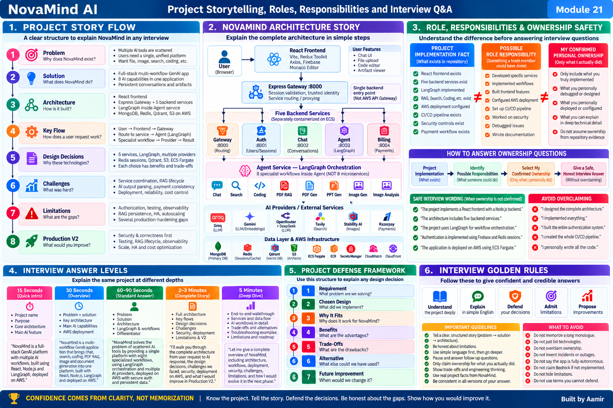

# Module 21 — Roles, Responsibilities, Project Storytelling and Interview Q&A

> **Project:** NovaMind-AI-LangGraph-Multi-Agent-AWS-Platform  
> **Purpose:** Convert the technical understanding from Modules 01–20 into clear, natural, defensible interview explanations.  
> **Critical rule:** Repository/project evidence is not the same as personal ownership. Never claim personal design, implementation, debugging, deployment, or incident ownership unless you can personally defend it.

---

## Module 21 Visual — Interview Storytelling Mental Model



---

# 1. Why Module 21 Is Different

Modules 01–20 taught **what NovaMind is and how it works**. Module 21 teaches how to **present that knowledge to an interviewer**.

A good interview answer is not a list of technologies. It is a clear story:

```text
Problem
→ Solution
→ Architecture
→ One end-to-end flow
→ Design decisions
→ Challenges / limitations
→ Production V2
→ Your confirmed contribution
```

Your goal is not to sound memorized. Your goal is to sound like an engineer who understands the system well enough to explain it at different depths.

---

# 2. The Three Ownership Levels

## PROJECT IMPLEMENTATION FACT

This is something repository evidence confirms exists.

Example:

```text
LangGraph is implemented inside the Agent service.
```

That does **not** automatically mean:

```text
I personally designed and implemented the LangGraph integration.
```

## POSSIBLE ROLE RESPONSIBILITY

This is work that someone on the project could reasonably have owned, such as:

- implementing router logic
- integrating Qdrant
- writing Dockerfiles
- configuring ECS
- creating GitHub Actions
- debugging Redis sessions

It still does not prove you personally performed it.

## MY CONFIRMED PERSONAL OWNERSHIP

Only use first-person ownership when you can truthfully defend:

- exact files/functions/configuration
- input/output behavior
- design reasoning
- debugging steps
- verification method
- limitations

Safe rule:

```text
Project Fact
≠
Possible Responsibility
≠
My Confirmed Ownership
```

---

# 3. Safe Wording Before Ownership Is Confirmed

Use:

> “The project implements LangGraph routing inside the Agent service.”

> “The architecture uses Redis for sessions and fast conversation context.”

> “The deployment workflow builds five images and redeploys ECS services.”

Only after ownership is confirmed should you change this to:

> “I implemented…”

> “I configured…”

> “I debugged…”

---

# 4. Ownership Worksheet

Fill this before final mock interviews:

```text
I personally implemented:
- ______________________________
- ______________________________

I personally configured:
- ______________________________
- ______________________________

I personally deployed:
- ______________________________

I personally debugged:
- ______________________________

I personally tested:
- ______________________________

I personally improved:
- ______________________________

Other contributors/tools handled:
- ______________________________
```

If you cannot fill an item honestly, do not claim it in an interview.

---

# 5. The Master Project Story Framework

Use this structure when an interviewer asks for a project explanation:

```text
1. Project name
2. Problem
3. Users
4. Solution
5. High-level architecture
6. AI orchestration
7. Main workflows
8. Data/state
9. AWS deployment
10. Security
11. CI/CD
12. Challenges
13. Limitations
14. Production V2
15. Confirmed personal responsibility
```

Do not always speak through all 15 points. Adjust depth to the interview.

---

# 6. Start With the Problem, Not the Tools

Weak:

> “I used React, Express, LangGraph, Groq, Gemini, Redis, MongoDB…”

Strong:

> “NovaMind is a multi-workflow Generative AI application designed to bring chat, search, coding, document and image capabilities into one product instead of making users switch between separate tools.”

Now the interviewer understands **why the architecture exists**.

---

# 7. What NovaMind Solves

NovaMind brings these workflows into one application:

- general chat
- real-time web search
- coding assistance
- PDF question answering through RAG
- PDF generation
- PPT generation
- image generation
- image analysis

The core value is not simply “many models.” The value is:

```text
One user interface
+
workflow routing
+
specialized implementations
+
persistent application state
+
cloud deployment
```

---

# 8. 15-Second Introduction

Use when the interviewer wants only a quick overview:

> **“NovaMind AI is a full-stack Generative AI platform that combines chat, search, coding, PDF RAG, document generation and image workflows. It uses a React frontend, Node/Express backend services, bounded LangGraph routing, and AWS container deployment.”**

Stop there.

---

# 9. 30-Second Introduction

> **“NovaMind AI is a full-stack multi-workflow Generative AI application. The React frontend communicates with five Express backend services: Gateway, Auth, Chat, Agent and Billing. The Agent service uses LangGraph to route requests to eight predefined specialist workflows, and the platform integrates Groq, Gemini, OpenRouter/DeepSeek, Tavily and Stability AI. The backend is containerized and has ECS/Fargate deployment configuration on AWS.”**

---

# 10. 60–90 Second ‘Tell Me About Your Project’ Answer

> **“NovaMind AI is a multi-workflow Generative AI application designed to give users several AI capabilities through one interface. The frontend is React, and the backend is separated into Gateway, Auth, Chat, Agent and Billing services. The Agent service is the AI orchestration layer and uses a bounded LangGraph router to select one of eight specialist workflows such as chat, web search, coding, PDF RAG, PDF/PPT generation, image generation and image analysis.**
>
> **Different workflows use different providers: Groq for text generation, Gemini for embeddings and image analysis, DeepSeek through OpenRouter for coding, Tavily for web search and Stability AI for image generation. MongoDB stores durable application data, Redis handles sessions and fast conversation context, Qdrant stores PDF vectors and S3 stores generated artifacts. The backend is containerized for ECS/Fargate and GitHub Actions automates image builds, ECR pushes and frontend deployment. The current version is production-oriented, but authorization, payment consistency, testing, observability, document lifecycle and HA still need hardening before I would call it fully production-ready.”**

---

# 11. 2–3 Minute Master Project Story

> **“The problem NovaMind addresses is that users often need different AI capabilities—general chat, live web search, coding help, document Q&A, document generation and image workflows—but those capabilities are usually split across different tools. NovaMind brings them into one application.**
>
> **The frontend is React with Redux for UI state. The backend has five separately containerized Express services: Gateway, Auth, Chat, Agent and Billing. Gateway is the backend entry point, Auth manages user and session-related behavior, Chat owns conversation/message persistence, Billing handles Razorpay payment flows, and Agent contains the AI orchestration.**
>
> **Inside Agent, LangGraph is genuinely implemented as a bounded graph. Explicit non-auto workflow selection has highest routing priority, Auto plus PDF routes to PDF RAG, Auto plus image routes to image analysis, and otherwise a model classifier chooses a predefined specialist. The eight specialist workflows all live inside Agent—they are not eight ECS services.**
>
> **The providers depend on the workflow. Groq handles much of the text generation, Gemini provides PDF embeddings and image analysis, DeepSeek through OpenRouter handles coding, Tavily provides web search, and Stability AI generates images. MongoDB provides durable persistence, Redis handles sessions and fast conversation context, Qdrant provides vector retrieval, and S3 stores generated artifacts.**
>
> **On AWS, the project contains Dockerfiles and ECS/Fargate task definitions for the five backend services, ECR publishing, Secrets Manager references and CloudWatch logging. The frontend uses S3 and CloudFront. GitHub Actions builds and pushes the backend images, forces ECS redeployments, builds the frontend, syncs it to S3 and invalidates CloudFront.**
>
> **I would describe the project as production-oriented rather than fully production-ready. The main hardening areas are authorization, payment/credit consistency, persistent RAG and artifact lifecycle, automated tests and AI evaluation, observability, release safety and verified high availability. Production V2 should fix security and correctness before scaling.”**

---

# 12. How to Give a 5-Minute Walkthrough

Do not memorize a five-minute paragraph. Use checkpoints:

```text
00:00–00:30  Problem + solution
00:30–01:15  High-level architecture
01:15–02:00  LangGraph + workflows
02:00–02:45  One request flow
02:45–03:30  State/data + AWS
03:30–04:15  Security/reliability
04:15–05:00  Limitations + V2
```

At a natural checkpoint say:

> “That is the high-level flow. I can go deeper into the LangGraph routing, RAG workflow, AWS deployment or security depending on where you want to focus.”

This gives the interviewer control and prevents a memorized monologue.

---

# 13. High-Level Architecture Story

Use these layers:

```text
Frontend Layer
↓
Gateway Layer
↓
Backend Services
↓
AI Orchestration Layer
↓
Providers / Tools
↓
Data / State
↓
AWS Runtime
```

---

# 14. Frontend Explanation

> **“The frontend is built in React. Redux keeps current UI state, Firebase handles the Google sign-in flow, users can upload files and images, generated artifacts are displayed through returned links, and coding results can be viewed in Monaco with a basic browser preview.”**

Do not spend most of the project explanation on UI unless asked.

---

# 15. Express Gateway Explanation

> **“The Express Gateway is the main backend entry point. On protected paths it reads the application session cookie, checks the Redis-backed session, derives the trusted user identity and proxies the request to the relevant downstream service.”**

Important:

```text
Express Gateway
≠
AWS API Gateway
```

If challenged:

> **“No, this project does not use AWS API Gateway for the main backend. The gateway is a Node.js/Express service; the documented AWS ingress component is an Application Load Balancer.”**

---

# 16. Explain the Five Services

```text
Gateway → entry / proxy
Auth → users / login / sessions / account
Chat → conversations / messages
Agent → AI orchestration
Billing → payments
```

Natural answer:

> **“There are five backend services. Gateway is the external entry point, Auth owns identity and account/session concerns, Chat owns conversation persistence, Agent owns the AI workflows, and Billing owns payment-related behavior.”**

---

# 17. Microservice-Style Architecture — Correct Framing

> **“The services are separately containerized, have separate ports and task definitions, so a microservice-style description is reasonable. But I would not claim perfect independence because there is synchronous coupling, Auth admin code reads other data domains, and the deployment workflow currently rebuilds/redeploys all five together.”**

A modular monolith would be a reasonable alternative if operational simplicity were more important than independent service boundaries.

---

# 18. Agent Service

> **“The Agent service is the central AI orchestration layer. It receives the prompt, optional file, user/conversation identifiers and selected workflow, builds LangGraph state, runs routing, invokes the selected specialist, coordinates provider/tool calls, updates response/artifact state, and integrates with persistence and credit operations.”**

---

# 19. Where LangGraph Is Used

> **“LangGraph is implemented inside the Agent service. It is not a separate AWS component, and the eight specialists are not eight independently deployed services.”**

---

# 20. LangGraph Mental Model

```text
START
↓
Router
↓
Conditional Edge
↓
One of 8 Specialist Workflows
↓
END
```

This is a **bounded** workflow.

---

# 21. Routing Priority

Verified logic:

```text
1. Explicit non-auto selection wins
2. Auto + uploaded PDF → PDF RAG
3. Auto + uploaded image → Image Analysis
4. Otherwise use model-based classifier
5. Unknown classifier label → Chat fallback
6. Classifier exception has no mature universal fallback
```

This is a good interview detail because it proves you understand actual behavior rather than only the architecture diagram.

---

# 22. Is NovaMind Agentic AI?

> **“It has agentic characteristics because it has stateful LangGraph orchestration, intent-based routing, specialized workflows and tool/provider integration. But I would not describe it as fully autonomous. The graph is bounded and does not have an autonomous planner, reflection loop, unrestricted repeated tool-selection loop or durable LangGraph checkpointing.”**

---

# 23. Is It Multi-Agent?

> **“I describe it as a LangGraph-orchestrated collection of specialist AI workflows inside one Agent service. Those specialists behave like task-specific agents, but they are not independent ECS services autonomously collaborating with each other.”**

This wording avoids an overclaim.

---

# 24. Normal Chat Request — Explain Naturally

> **“For a normal chat request, React sends the prompt through Gateway. Gateway resolves the Redis-backed session and forwards trusted user identity. Agent saves the user message through Chat, initializes LangGraph state, routes to the Chat specialist, loads relevant context, calls Groq, updates Redis conversation context, saves the assistant message through Chat and returns the response.”**

---

# 25. Search Workflow

> **“For Search, LangGraph routes to the Search specialist. Tavily retrieves up to five web results and images, and those results are passed into a Groq-backed generation step that synthesizes the answer. I describe this as web retrieval plus LLM synthesis rather than automatically calling it RAG.”**

Search has no mature verified citation-alignment/fact-checking layer.

---

# 26. PDF RAG — End-to-End Explanation

> **“In PDF RAG, the uploaded PDF is stored temporarily and parsed with `pdf-parse`. The extracted text is split into roughly 1000-character chunks with around 200-character overlap. Gemini `gemini-embedding-001` converts the chunks into vectors and the workflow creates a new Qdrant collection for that request. The question is embedded, Qdrant performs top-five similarity retrieval, and those retrieved chunks plus the question are sent to Groq for answer generation.”**

---

# 27. PDF RAG Limitations

Say them confidently:

- no OCR for scanned/image-only PDFs
- character-based chunking
- no mature page/source citations
- no reranking
- no mature retrieval threshold/no-answer policy
- request-oriented Qdrant collection
- no durable document-to-index mapping
- later text-only questions cannot reliably reopen the same document context
- no mature RAG evaluation suite

Then add:

> **“Production V2 should create a persistent document identity, ownership metadata, S3 source storage, durable Qdrant mapping, citations, evaluation and lifecycle cleanup.”**

---

# 28. Coding Workflow

> **“For coding, the workflow first classifies the coding intent, then uses DeepSeek through OpenRouter to generate structured files. The backend parses the files and the frontend displays them in Monaco with a basic browser preview. It does not currently install packages, compile arbitrary projects, execute server-side code or run an autonomous test-and-repair loop.”**

---

# 29. Image Generation vs Image Analysis

Image Generation:

```text
text prompt
→ prompt preparation
→ Stability AI
→ image bytes
→ S3
→ presigned URL
```

Image Analysis:

```text
uploaded image
→ Gemini multimodal
→ text analysis
```

Do not mix them.

---

# 30. PDF / PPT Generation

> **“The document-generation workflows first use Groq to produce structured content. The backend parses that content, uses PDFKit for PDF generation or PptxGenJS for PPT generation, uploads the generated file to S3 and returns a presigned URL.”**

Current presentation pattern:

```text
cover + 6 content slides + closing = 8 slides
```

---

# 31. State vs Memory vs Persistence

Strong distinction:

```text
LangGraph State
= current request execution

Redis
= application sessions + fast context + counters

MongoDB
= durable application persistence

Redux
= frontend in-memory UI state
```

Important:

```text
Redis application memory
≠
LangGraph checkpointing
```

---

# 32. Authentication Story

> **“Google sign-in returns a Firebase ID token. Auth verifies the token, finds or creates the MongoDB user, creates an opaque UUID application session in Redis with a seven-day TTL, and returns it through an HTTP-only cookie. Later, Gateway resolves that session from Redis.”**

Do not call the app session a JWT.

---

# 33. Authentication vs Authorization

> **“Authentication is implemented, but authorization is only partial. Being logged in proves who the user is; it does not automatically prove they can access a particular conversation, message, artifact or account mutation.”**

This is one of the strongest security interview answers in the project.

---

# 34. Payment Story

> **“Billing creates a Razorpay order and persists a payment record. After checkout, it verifies the Razorpay HMAC signature, marks the payment paid, and then calls Auth to grant credits. The current weakness is distributed consistency: the payment can be marked paid before the credit grant succeeds, and repeated callbacks are not protected by a mature idempotent credit ledger.”**

---

# 35. AWS Deployment Story

Frontend:

```text
Browser
→ CloudFront
→ S3 frontend
```

Backend — documented/intended:

```text
API Request
→ ALB
→ Gateway ECS/Fargate
→ Auth / Chat / Agent / Billing
```

Supporting pieces:

- ECR for images
- Secrets Manager references
- CloudWatch logs
- Cloud Map for service discovery
- Redis/ElastiCache endpoint
- S3 for artifacts

Do not claim live AWS health or complete Multi-AZ topology unless verified separately.

---

# 36. Docker / ECS / Fargate

> **“The five backend services are separately containerized. ECR stores the images, ECS manages the services/tasks, and Fargate provides the compute without managing EC2 hosts. Agent has a larger task allocation than the other services, but those configured CPU/memory values are not capacity benchmarks.”**

---

# 37. CI/CD Story

Current pipeline:

```text
Push to main
→ GitHub Actions
→ AWS authentication
→ ECR login
→ build/tag/push 5 images
→ force ECS redeployment
→ build frontend
→ S3 sync
→ CloudFront invalidation
```

Then add the honest limitation:

> **“This is automated deployment, but not a fully mature release-safety pipeline because the repository does not show substantive test gates, immutable Git-SHA image releases, explicit task-definition registration, stability/smoke gates or automated rollback.”**

---

# 38. Security Story

Current real controls include:

- Firebase verification
- Redis-backed opaque sessions
- HTTP-only cookie
- Secure/SameSite behavior in production
- Razorpay HMAC verification
- upload MIME/20 MiB checks
- presigned S3 URLs
- sandboxed browser preview
- Secrets Manager references

Current limitations include:

- resource ownership gaps
- sensitive account/credit mutation routes
- alternate admin boundary
- tracked credential exposure
- partial session revocation
- no mature explicit CSRF strategy
- prompt-injection risk

---

# 39. Testing Story

Do not claim a complete automated suite.

> **“The repository has frontend lint/build capability, dependency lockfiles, manual deployment evidence and CloudWatch container logs, but a substantive backend unit/integration/E2E suite and mature AI evaluation suite were not found. In Production V2 I would prioritize authorization and payment regression tests, router evaluation, RAG retrieval/generation evaluation, structured-output validation, failure tests and deployment smoke gates.”**

---

# 40. Scalability Story

> **“The containerized services can scale horizontally in principle, but I would not claim measured scalability because capacity and mature autoscaling are not verified. Adding Agent tasks also does not increase provider quotas or automatically fix Redis, MongoDB, Qdrant or concurrency bottlenecks. I would measure workflow-specific concurrency and p50/p95/p99 latency first, then scale the actual bottleneck.”**

---

# 41. High Availability Story

> **“AWS provides the building blocks for an HA design, but the current repository does not verify mature Multi-AZ high availability. A captured Redis configuration was single-node/nonredundant with failover disabled, so stateful HA is still a Production V2 concern.”**

---

# 42. Cost Story

> **“NovaMind has a credit mechanism for feature usage, but credits are not a verified dollar-cost ledger. Actual cost includes ECS/Fargate, ALB/NAT/Redis/S3/CloudWatch plus Groq, Gemini, OpenRouter, Tavily, Stability and Qdrant. Production V2 should track provider calls, tokens where available, infrastructure usage and estimated cost per workflow.”**

---

# 43. Project Strengths

Reasonable strengths:

- genuine full-stack implementation
- genuine LangGraph routing
- genuine PDF RAG
- multiple specialized AI/provider integrations
- authentication/session flow
- conversation persistence
- payments
- artifact generation
- container deployment configuration
- CI/CD automation

Strong phrasing:

> **“The project’s main strength is integration breadth: AI orchestration, RAG, backend services, state, payments, artifacts and AWS deployment are connected in one end-to-end application.”**

---

# 44. Project Limitations

Strong answer:

> **“The main limitations are incomplete authorization, payment/credit idempotency gaps, request-oriented RAG/document lifecycle, Redis memory consistency issues, limited automated testing and AI evaluation, basic observability, release-safety gaps and unverified mature HA.”**

Admitting a limitation is not weakness if you can explain:

```text
impact
→ root design reason
→ V2 fix
→ trade-off
```

---

# 45. Production V2 Story

Use risk order:

```text
P0 Security / credentials / authorization
P1 Payments / credits / sessions
P2 Testing / reliability
P3 Persistent RAG / artifact lifecycle
P4 Observability / release safety
P5 Scale / HA / cost
```

Golden rule:

```text
Security + correctness
before
scaling
```

---

# 46. 30-Second Production V2 Answer

> **“I would first harden authorization and rotate any exposed credentials, then make payment and credit updates idempotent and improve session revocation. Next I would add software tests and AI evaluations, persistent document/artifact lifecycle, stronger observability and immutable release gates. Only after correctness is stable would I add measurement-driven autoscaling, HA and cost optimization.”**

---

# 47. 2-Minute Production V2 Answer

> **“I would redesign NovaMind V2 in risk order. First, I would fix authorization so resource access and account mutations use trusted session identity and ownership/role checks, and I would rotate any exposed credentials. Second, I would redesign payments and credits around idempotency, an auditable ledger and reconciliation, and make session revocation complete.**
>
> **Third, I would add a layered test and AI-evaluation strategy: unit/API/authorization/payment regression tests, router evaluation, RAG retrieval and answer evaluation, structured-output validation and failure testing. Fourth, I would make PDF RAG persistent by storing the original document, document metadata, ownership and durable Qdrant mapping; I would also create proper artifact metadata and renewal.**
>
> **Fifth, I would strengthen operations with correlation IDs, metrics, traces, Git-SHA releases, explicit task-definition revisions, service-stability checks, smoke tests and rollback. Only after that would I add autoscaling, async workers for long workflows, Redis HA, Multi-AZ redundancy where justified, backup/restore and workflow-level cost telemetry.”**

---

# 48. Roles and Responsibilities — Deep Framework

A strong responsibility answer contains:

```text
Role
→ 3–5 confirmed areas
→ what you personally did
→ how you verified it
→ one real challenge
→ boundaries of your ownership
```

Avoid claiming every layer.

---

# 49. Responsibility Mapping

| Area | Project Fact | Possible Responsibility | My Confirmed Ownership |
|---|---|---|---|
| LangGraph | Implemented | Router/graph development | **Must confirm** |
| PDF RAG | Implemented | RAG integration | **Must confirm** |
| Backend | Five Express services | API/service integration | **Must confirm** |
| Auth | Firebase + Redis | Login/session integration | **Must confirm** |
| Docker | Five services | Containerization | **Must confirm** |
| AWS | ECS/Fargate configs | Deployment work | **Must confirm** |
| CI/CD | GitHub Actions | Pipeline development | **Must confirm** |
| Frontend | React/Vite | UI integration | **Must confirm** |
| Payments | Razorpay | Billing integration | **Must confirm** |
| Security | Controls + gaps | Hardening/testing | **Must confirm** |

---

# 50. Neutral Role Answer Until Ownership Is Confirmed

> **“The project spans AI orchestration, backend services, state management and AWS deployment. The main technical areas are LangGraph routing, RAG, service integration, Redis/MongoDB/Qdrant state, Docker/ECS deployment and CI/CD. For my personal responsibility answer, I separate what exists in the repository from the parts I can personally confirm I implemented or operated.”**

---

# 51. Final Role Answer Template

> **“My main responsibility was [CONFIRMED AREA 1], where I personally [ACTION]. I also worked on [CONFIRMED AREA 2], including [ACTION]. On the cloud/deployment side, I personally [CONFIRMED ACTION]. One issue I directly debugged was [REAL INCIDENT]; I diagnosed [ROOT CAUSE], implemented [FIX], and verified it using [EVIDENCE]. I understand the remaining architecture and integrations, but I do not claim direct ownership of components I did not personally work on.”**

---

# 52. STAR Method

Use STAR for behavioral/incident questions:

```text
Situation
Task
Action
Result
```

Do not use STAR for simple concept questions.

---

# 53. STAR Safety Rule

Never invent a production incident.

Template:

```text
PERSONAL INCIDENT MUST BE CONFIRMED BY ME

Situation:
____________________________

Task:
____________________________

Action:
____________________________

Result:
____________________________

Verification / Learning:
____________________________
```

---

# 54. Troubleshooting Story Framework

Use:

```text
Symptom
↓
Hypothesis
↓
Evidence
↓
Root Cause
↓
Fix
↓
Verification
↓
Prevention
```

This is much stronger than “I checked logs and fixed it.”

---

# 55. Design Decision Framework

For every “Why X?” question:

```text
Requirement
→ Design
→ Why It Fits
→ Benefit
→ Trade-Off
→ Alternative
→ When I Would Change It
```

Do not invent historical reasons. Say:

> “From an engineering perspective…”

when the original decision history is not known.

---

# 56. Why LangGraph?

> **“From an engineering perspective, LangGraph fits because it makes graph state, nodes and conditional routing explicit for multiple specialist workflows. The trade-off is framework overhead because the current graph is bounded; a simpler JavaScript switch/function router would also be valid if the workflow remained simple.”**

---

# 57. Why Redis?

> **“Redis fits session and fast-context requirements because it provides shared low-latency server-side state. The trade-off is that Redis becomes a critical dependency and TTL, atomicity and HA matter. A signed-token design could remove session lookup but makes revocation and stale claims more difficult.”**

---

# 58. Why MongoDB?

> **“MongoDB fits flexible user, conversation, message and payment documents and integrates naturally with the Node/Mongoose backend. The trade-off is that indexing, pagination, query shape and ownership checks must be designed carefully at scale.”**

---

# 59. Why Qdrant?

> **“Qdrant provides semantic vector storage and similarity retrieval for PDF RAG. It separates vector retrieval from answer generation. The trade-off is another service plus embedding cost, collection lifecycle, ownership and network considerations.”**

---

# 60. Why Multiple AI Providers?

> **“The architecture uses specialized providers for different tasks rather than forcing one model to do everything. The benefit is capability specialization; the trade-off is more credentials, quotas, output differences, reliability paths and cost accounting.”**

---

# 61. Why ECS Fargate?

> **“Fargate fits long-running containerized Express services while avoiding EC2 host management. The trade-off is baseline infrastructure cost and the need to manage networking, IAM, health, scaling and releases carefully.”**

---

# 62. Why S3?

> **“S3 fits generated PDF, PPT and image artifacts because large binary objects do not belong in MongoDB and presigned URLs provide temporary download access. The trade-off is ownership, lifecycle, retention and expired-link handling.”**

---

# 63. Why Five Services?

> **“The split gives clearer responsibility boundaries for request entry, identity/account, conversation persistence, AI orchestration and billing. The trade-off is distributed complexity and synchronous coupling. A modular monolith would be a valid simpler alternative for a smaller team or lower operational complexity.”**

---

# 64. Why Synchronous AI Calls?

> **“The synchronous model gives a simple request-response user experience. The downside is long-held HTTP connections and timeout/concurrency pressure for slow operations. For large document ingestion or artifact generation, I would consider async jobs in V2.”**

---

# 65. Technical Depth Control

## Recruiter / HR

Focus on:

```text
problem + solution + GenAI + AWS + your confirmed role
```

## Technical Interviewer

Focus on:

```text
architecture + request flow + LangGraph + RAG + state + deployment
```

## Senior / Architect

Focus on:

```text
trade-offs + security + reliability + testing + scalability + cost + limitations
```

---

# 66. Interviewer Interruption Training

If the interviewer interrupts, stop your prepared answer.

Say:

> “Sure, I’ll go deeper into that part.”

After answering:

> “Coming back to the overall architecture…”

A conversation is better than a speech.

---

# 67. Every Technology Is a Follow-Up Hook

If you mention Redis, expect:

```text
Why Redis?
Why not JWT?
What happens if Redis fails?
How do sessions expire?
How do you revoke sessions?
How would Redis become highly available?
```

Only mention technologies you can defend.

---

# 68. Tech Stack Defense Map

| Technology | Where Used | Why It Fits | Main Trade-Off | Alternative |
|---|---|---|---|---|
| React | Frontend | component UI | frontend complexity | another UI framework |
| Redux | UI state | shared client state | boilerplate | Context/query state |
| Express | Gateway/services | simple Node APIs | manual service concerns | Nest/Fastify |
| LangGraph | Agent | graph/state/routing | framework overhead | plain JS router |
| Groq | Text generation | fast inference | provider dependency | another LLM provider |
| Gemini | Embeddings/image analysis | multimodal + embeddings | provider dependency | other vision/embedding model |
| OpenRouter | Coding model access | model access layer | extra dependency | direct model provider |
| DeepSeek | Coding | code generation | validation required | another coding model |
| Tavily | Search | web retrieval | external dependency | another search API |
| Stability AI | Images | text-to-image | cost/quota | another image model |
| MongoDB | Durable app data | flexible documents | indexing/pagination | relational DB |
| Redis | Sessions/context | fast shared state | HA/races/TTL | JWT/session DB |
| Qdrant | RAG | vector search | lifecycle/service | pgvector/other vector DB |
| S3 | Frontend/artifacts | object storage | lifecycle/access | other object store |
| Docker | Backend | packaging | image hygiene | native runtime |
| ECR | Images | AWS registry | lifecycle | other registry |
| ECS/Fargate | Runtime | managed containers | baseline cost | EC2/Lambda |
| ALB | Backend ingress | traffic routing | cost/config | other ingress |
| CloudFront | Frontend | CDN | invalidation/cache | other CDN/direct S3 |
| Secrets Manager | Secrets refs | centralized secrets | cost/rotation work | manual/env store |
| CloudWatch | Logs | AWS-native logging | basic observability | external platform |
| Cloud Map | Discovery | internal DNS | not authentication | service mesh/static config |
| GitHub Actions | CI/CD | repo-integrated automation | current release gaps | CodePipeline/etc. |
| Firebase | Login identity | managed Google auth | external dependency | Cognito/custom IdP |
| Razorpay | Payments | order/checkout/signature | distributed consistency | other payment provider |

---

# 69. Common Interview Traps

## “Why AWS API Gateway?”

Correct:

> **“The project does not use AWS API Gateway for the main backend. It uses a custom Express Gateway service.”**

## “You have eight microservices?”

> **“No. There are five backend services. The eight specialists are workflows inside the Agent service.”**

## “You use Bedrock?”

> **“No active Bedrock inference is verified in this project.”**

## “Redis is your LangGraph checkpoint?”

> **“No. Redis stores application session/context data; there is no verified LangGraph checkpointer.”**

## “The app is fully autonomous?”

> **“No. The graph is bounded and routes to predefined workflows.”**

## “RAG prevents hallucination?”

> **“No. It grounds the prompt with retrieved evidence but does not guarantee correctness.”**

## “It is production-ready?”

> **“Production-oriented, not fully production-ready.”**

## “Credits are your provider cost?”

> **“No. Credits are application usage logic, not a verified dollar-cost ledger.”**

---

# 70. Whiteboard Architecture Script

Say:

> **“I’ll draw the architecture in layers so the request path is clear.”**

Draw:

```text
User
↓
React
↓
Gateway
↓
Auth | Chat | Agent | Billing
```

Say:

> “With Gateway, that is five backend services.”

Then:

```text
Agent
↓
LangGraph
↓
8 Specialist Workflows
```

Then providers:

```text
Groq | Gemini | OpenRouter/DeepSeek | Tavily | Stability
```

Then data:

```text
MongoDB | Redis | Qdrant | S3
```

Then AWS:

```text
CloudFront/S3
ALB
ECS/Fargate
ECR
Secrets Manager
CloudWatch
Cloud Map
```

Finish:

> **“Would you like me to trace a Chat request, PDF RAG, Search, Coding, or the deployment flow?”**

---

# 71. Draw-From-Memory Practice

### Level 1

```text
User → Frontend → Backend → AI → Data
```

### Level 2

```text
React → Gateway → Auth/Chat/Agent/Billing
```

### Level 3

```text
Agent → LangGraph → 8 specialists
```

### Level 4

```text
Providers + MongoDB/Redis/Qdrant/S3
```

### Level 5

```text
CloudFront/S3 + ALB/ECS/ECR + Secrets/CloudWatch/Cloud Map
```

Goal: draw Level 5 in 2–3 minutes without notes.

---

# 72. “How Is This Different From a Normal Chatbot?”

> **“A normal chatbot usually sends prompts to one model. NovaMind has request routing and specialist workflows. Depending on the request it can use web search, retrieve from an uploaded PDF, generate structured code files, create PDF/PPT artifacts, generate images or analyze uploaded images. It also has persistent conversations, sessions, payments and cloud deployment. The important qualification is that the routing is bounded rather than fully autonomous.”**

---

# 73. “What Are the Top Five Limitations?”

> **“First, authorization and ownership checks need stronger enforcement. Second, payment and credit handling needs idempotency and reconciliation. Third, RAG/document and artifact lifecycle are request-oriented rather than maturely persistent. Fourth, automated software testing and AI evaluation are limited. Fifth, observability, release safety and HA are not maturely verified.”**

---

# 74. “What Did You Personally Implement?”

Until ownership is finalized:

> **“I separate the project implementation from my personal ownership. The repository contains LangGraph routing, RAG, AWS deployment and CI/CD, but for personal ownership I would list only the components I can defend from implementation through troubleshooting. My confirmed areas are: [FILL], [FILL], and [FILL].”**

This is better than overclaiming.

---

# 75. “What Was the Biggest Challenge?”

Do not invent a challenge.

Use a real personal story only.

Project-level challenge categories include:

- distributed service coordination
- RAG lifecycle
- Redis memory consistency
- payment consistency
- LLM structured-output parsing
- provider reliability
- deployment safety

Then structure the real incident:

```text
Symptom
→ Evidence
→ Root Cause
→ Action
→ Verification
→ Prevention
```

---

# 76. Resume-Level Project Explanation

> **“NovaMind is one of my flagship Generative AI projects because it combines application engineering, agent orchestration, RAG, multi-provider integration, state management and AWS deployment in one system. In an interview I focus not only on the feature list but on the end-to-end request path, why the architecture boundaries exist, where the current design is weak, and how I would harden it for Production V2.”**

Do not use this to imply ownership beyond what you can confirm.

---

# 77. The One-Request Rule

If you feel overwhelmed in an interview, choose one request and trace it.

Best examples:

- Chat
- PDF RAG
- Search

A concrete request demonstrates more understanding than listing twenty services.

---

# 78. The Why–Where–How–Trade-Off Formula

For every technology ask yourself:

```text
What is it?
Where is it used?
How does it work here?
Why does it fit?
What is the trade-off?
What alternative exists?
```

If you can answer all six, you are ready for follow-ups.

---

# 79. Interview Self-Check Before Module 22

Without notes, you should be able to:

- explain NovaMind in 15 seconds
- explain NovaMind in 30 seconds
- explain NovaMind in 1 minute
- explain NovaMind in 2–3 minutes
- draw the architecture
- explain five backend services
- explain eight specialists inside Agent
- explain LangGraph routing
- trace Chat
- trace Search
- trace PDF RAG
- trace Coding
- trace image generation/analysis
- explain PDF/PPT generation
- explain state vs Redis vs MongoDB
- explain authentication
- explain payment consistency
- explain AWS deployment
- explain CI/CD
- explain security gaps
- explain testing/evaluation gaps
- explain scalability/cost/HA
- explain limitations
- explain Production V2
- state only confirmed personal ownership

---

# 80. Final Golden Rules

```text
Understand before memorizing.
Tell a story, not a technology list.
Use one request flow to prove depth.
Answer at the interviewer’s depth.
Pause when interrupted.
Explain trade-offs.
Admit limitations.
Propose improvements.
Never invent incidents.
Never invent ownership.
Never call bounded routing fully autonomous.
Never call deployment alone production readiness.
```

## Final Reminder

**Confidence comes from clarity, not memorization.**

**Module 21 Learning file complete.**
