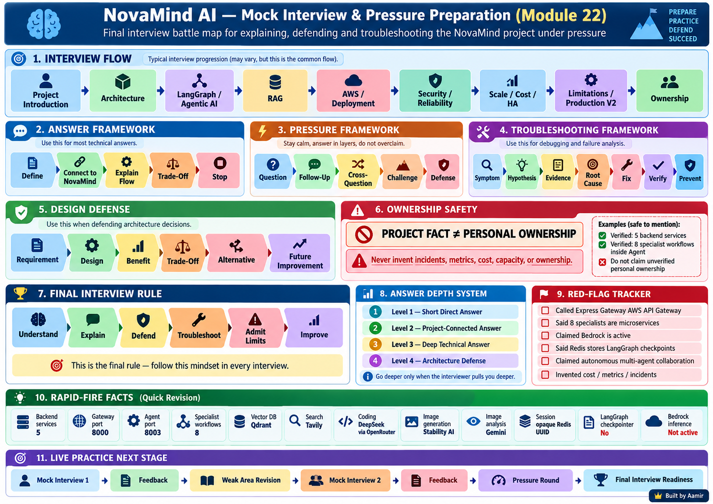

# Module 22 — Mock Interview and Pressure Preparation

> **FINAL NOVAMIND MODULE**  
> **Project:** NovaMind-AI-LangGraph-Multi-Agent-AWS-Platform  
> **Purpose:** Turn technical understanding into reliable interview performance under pressure.  
> **Important:** This module does **not** re-teach the full project. It trains you to answer, defend, troubleshoot, recover, and communicate accurately.

---

# Your question

> **“Complete Module 22 now. Create the very deep Learning file and exhaustive Interview file using the Module 22 image already generated and all verified NovaMind facts from Modules 01–21.”**

---

## Module 22 Interview Battle Map



---

# 1. The Purpose of the Final Module

Modules 01–20 built technical understanding.

Module 21 taught project storytelling, roles, responsibilities, and ownership-safe explanations.

Module 22 trains the final skill:

```text
Know the project
↓
Hear the question correctly
↓
Choose the right answer depth
↓
Answer naturally
↓
Survive follow-ups
↓
Defend trade-offs
↓
Troubleshoot scenarios
↓
Admit limits
↓
Recover if stuck
↓
Stay accurate under pressure
```

The goal is not to sound memorized.

The goal is to sound like an engineer who understands the system.

---

# 2. Non-Negotiable Accuracy Rules

Keep these facts stable in every answer.

## CURRENT VERIFIED

```text
5 backend services:
Gateway
Auth
Chat
Agent
Billing
```

```text
8 specialist workflows:
Chat
Search
Coding
PDF RAG
PDF Generation
PPT Generation
Image Generation
Image Analysis
```

All eight specialist workflows live **inside the Agent service**.

They are **not eight ECS microservices**.

LangGraph is genuinely implemented inside Agent.

The graph is bounded.

Verified routing logic:

```text
1. Explicit non-Auto selection wins
2. Auto + PDF → PDF RAG
3. Auto + image → Image Analysis
4. Otherwise model-based classifier
5. Unknown label → Chat fallback
```

Classifier exceptions do not have a mature universal fallback.

Verified state includes concepts such as:

```text
prompt
response
selected workflow/agent
conversation ID
user ID
file
search results
images
artifacts
```

There is **no LangGraph checkpointing**.

Redis application context is **not** LangGraph checkpointing.

There is no:

```text
autonomous planner
reflection loop
unrestricted repeated tool-selection loop
autonomous inter-agent collaboration
```

Verified provider/tool map:

```text
Groq
Google Gemini
OpenRouter + DeepSeek
Stability AI
Tavily
Qdrant
```

No active Bedrock inference is verified.

The backend uses a custom **Express Gateway**, not AWS API Gateway.

Application session:

```text
opaque UUID
stored in Redis
```

It is not a JWT.

The project is best described as:

```text
production-oriented
```

not fully production-ready.

---

# 3. Things You Must Never Invent

Do not invent:

```text
personal ownership
production incidents
capacity numbers
requests-per-second
p95/p99 latency
monthly cost
uptime
autoscaling behavior
HA behavior
exact live AWS topology
business revenue
customer usage
historical design decisions
```

If exact information is unknown, say so.

That is stronger than guessing.

---

# 4. Ownership Safety Under Pressure

Always separate:

```text
PROJECT IMPLEMENTATION FACT
≠
POSSIBLE RESPONSIBILITY
≠
MY CONFIRMED PERSONAL OWNERSHIP
```

Example:

### Project fact

> "The project implements PDF RAG using Gemini embeddings and Qdrant."

### Possible responsibility

> "RAG integration is a responsibility an engineer on the project could own."

### Personal ownership

> "I personally implemented the RAG pipeline."

Use the final sentence only if personally true.

---

# 5. What Interviewers Actually Test

A project interview is rarely testing whether you remember every library name.

Interviewers usually test:

```text
Can you explain the system?
Can you trace a request?
Can you justify a design?
Can you identify failure points?
Can you reason about trade-offs?
Can you admit limitations?
Can you distinguish current vs proposed?
Can you troubleshoot?
Can you explain what YOU actually did?
```

A technically correct answer can still be weak if it is unclear or overlong.

---

# 6. The Four Answer Depths

## Level 1 — Short Direct Answer

Use for:

> “What is Qdrant?”

Target: ~15–20 seconds.

Structure:

```text
Definition
+
one project connection
```

Example:

> "Qdrant is a vector database used for similarity search. In NovaMind, the PDF RAG workflow stores Gemini-generated chunk embeddings in Qdrant and retrieves the top five relevant chunks for a question."

Stop.

---

## Level 2 — Project-Connected Answer

Use for:

> “Why is Qdrant used in NovaMind?”

Structure:

```text
Definition
+
where used
+
why it fits
+
one trade-off
```

Example:

> "Qdrant provides semantic vector search for the PDF RAG workflow. The project embeds PDF chunks with Gemini, stores them in Qdrant, and retrieves relevant chunks before Groq generates the answer. The trade-off is another stateful dependency plus collection lifecycle and ownership concerns."

Stop unless interviewer asks more.

---

## Level 3 — Deep Technical Answer

Use for:

> “Explain your PDF RAG architecture.”

Structure:

```text
flow
+
implementation details
+
failure points
+
current limitations
```

---

## Level 4 — Senior Architecture Defense

Use for:

> “Would you deploy this RAG design in production?”

Structure:

```text
current design
+
benefits
+
risks
+
alternatives
+
Production V2
```

Do not answer Level 4 when the interviewer asked a Level 1 question.

---

# 7. The Default 5-Step Technical Answer

For most questions:

```text
1. Define
2. Connect to NovaMind
3. Explain the relevant flow
4. Mention one important trade-off / limitation
5. Stop
```

Example — Redis:

> "Redis is an in-memory data store. In NovaMind it is used for the opaque application session, fast conversation context and rate-limit counters. The Gateway depends on Redis to resolve protected sessions. The trade-off is that Redis becomes a critical shared dependency and its TTL, race conditions and HA have to be designed carefully."

Stop.

---

# 8. The 7-Step Design-Defense Framework

Use when asked:

> "Why did you use X?"

Do not immediately defend the technology emotionally.

Use:

```text
Requirement
↓
Current Design
↓
How It Works
↓
Benefit
↓
Trade-Off
↓
Alternative
↓
When I Would Change It
```

Example — LangGraph:

```text
Requirement:
route different AI workloads.

Current design:
bounded graph with router + specialists.

How:
state passes through router and conditional edges.

Benefit:
explicit graph and workflow organization.

Trade-off:
framework overhead for a bounded flow.

Alternative:
plain JavaScript switch/functions.

When change:
if graph stays simple, simpler routing may be enough;
if stateful/branching/cyclic workflows grow, LangGraph becomes more valuable.
```

---

# 9. The Troubleshooting Framework

When interviewer asks:

> “Search is slow. What do you do?”

Do not jump to a fix.

Use:

```text
1. Symptom
2. Scope
3. Hypotheses
4. Evidence
5. Root Cause
6. Fix
7. Verification
8. Prevention
```

### Example

```text
Symptom:
Search is slow.

Scope:
Only Search, or all AI requests?

Hypotheses:
Tavily latency
Groq latency
Redis/session latency
Chat persistence
provider throttling

Evidence:
request timing
provider duration
logs
error codes

Root cause:
identify slow stage

Fix:
specific to measured stage

Verify:
compare before/after latency

Prevent:
metrics / timeout / quota monitoring
```

Do not say:

> "I would restart the server."

without diagnosis.

---

# 10. Failure-Analysis Questions

Whenever a distributed workflow fails, ask:

```text
What failed?
Where did it fail?
What already succeeded?
What state already changed?
Can I retry?
Would retry duplicate a side effect?
What does the user currently see?
What does the log show?
How do I restore consistency?
```

This is especially important for:

- payment
- credits
- generated artifacts
- message persistence
- PDF RAG
- external provider calls

---

# 11. How to Answer Payment Failure Scenarios

Example:

```text
Razorpay verified
↓
Payment marked paid
↓
Auth credit update fails
```

Strong reasoning:

> "The first thing I ask is which state already changed. Here the payment record may already be paid while the credit balance is unchanged. A blind retry could duplicate credits if the first credit call actually succeeded but the response was lost. Production V2 should use an idempotent payment/event key, auditable credit ledger and reconciliation."

This is better than:

> "Retry the API."

---

# 12. How to Say “I Don’t Know”

Never fake knowledge to avoid saying "I don't know."

Professional patterns:

> **"I haven't implemented that specific mechanism in this project, so I don't want to overstate it. My understanding is..."**

> **"That isn't part of the current implementation. If I were adding it, I would..."**

> **"I understand the concept, but I don't know the exact live configuration here. I would verify it from the task definition or AWS console."**

> **"I don't remember the exact value, and I don't want to invent it. The architecture-level behavior is..."**

---

# 13. Three Different “I Don’t Know” Situations

## Situation A — You Do Not Know the Concept

Say:

> "I haven't worked deeply with that concept yet. My current understanding is..."

Do not pretend expertise.

---

## Situation B — You Know the Concept, But It Is Not Implemented

Example: LangGraph checkpointing.

Say:

> "I understand checkpointing conceptually, but it is not implemented in the current NovaMind graph."

This is a strong answer.

---

## Situation C — You Know the Architecture, But Not Exact Runtime State

Example: ECS desired count.

Say:

> "The repository contains ECS/Fargate deployment definitions, but I would not claim the current live desired count without verifying the running service."

---

# 14. Recovering When You Get Stuck

If your mind goes blank, do not panic and start listing random tools.

Use one of these recovery lines:

### Recovery 1

> "Let me structure that from the request flow."

Then:

```text
User
→ Gateway
→ Service
→ Provider / Store
→ Persistence
→ Response
```

### Recovery 2

> "I'll answer that in three parts: what it is, where it is used in NovaMind, and the main trade-off."

### Recovery 3

> "At a high level first, then I'll go one level deeper."

### Recovery 4

> "Let me separate the current implementation from how I would improve it."

These phrases buy thinking time while keeping the answer structured.

---

# 15. If You Give a Wrong Answer

Correct it immediately.

Example:

> "Let me correct that. I mixed up the Firebase ID token with the NovaMind application session. The Firebase token is used for login verification; the application session is actually an opaque UUID stored in Redis."

Correcting yourself is stronger than defending an error.

---

# 16. Handling Interviewer Interruption

When the interviewer interrupts:

1. stop talking
2. listen fully
3. answer the new question
4. return only if necessary

Good:

> "Sure, I'll go deeper into the RAG part."

Bad:

> continuing a memorized five-minute story while the interviewer is asking about Qdrant.

---

# 17. Handling Interviewer Disagreement

Do not become defensive.

Use:

> "That's a valid alternative. The trade-off in this architecture is..."

or:

> "I agree that for the current bounded graph, plain routing could be simpler. LangGraph becomes more valuable if the workflow grows in statefulness, branching or cycles."

Strong engineers can discuss alternatives without treating architecture as a competition.

---

# 18. Handling an Incomplete Question

If interviewer says:

> "How do you scale it?"

Clarify mentally:

```text
Which part?
Application?
Agent?
Database?
Provider?
RAG ingestion?
```

You can answer:

> "At application level, the containerized services can scale horizontally, but I'd first identify whether the bottleneck is Agent, Redis, MongoDB, Qdrant or an external provider quota."

---

# 19. Control the Length of Your Answer

Use this timing guide.

| Question | Target |
|---|---:|
| Definition | 15–30 sec |
| Why technology? | 30–60 sec |
| Request flow | 60–90 sec |
| Architecture | 2–3 min |
| Whiteboard deep dive | 3–5 min |
| Troubleshooting scenario | 2–4 min |
| Behavioral STAR | 2–3 min |

If interviewer asks:

> “What is Redis?”

Do not give a five-minute lecture on distributed caches.

---

# 20. Mock Round 1 — Project Introduction

Practice:

```text
Tell me about yourself briefly.
Tell me about NovaMind.
What problem does it solve?
How is it different from a chatbot?
What was your role?
What were your responsibilities?
```

Success criteria:

- concise
- no buzzword dump
- correct service count
- correct agentic wording
- ownership safe

---

# 21. Mock Round 2 — Architecture

Practice:

```text
Draw the architecture.
Why five backend services?
What does Gateway do?
What does Auth do?
What does Chat do?
What does Agent do?
What does Billing do?
How do services communicate?
Where is LangGraph?
What data stores exist?
```

Success criteria:

- draw from memory
- 5 services / 8 specialists distinction
- Express Gateway ≠ AWS API Gateway
- services not perfectly independent

---

# 22. Mock Round 3 — LangGraph / Agentic AI

Practice:

```text
What is an agent?
What is agentic AI?
Why is NovaMind agentic?
Is it autonomous?
Is it multi-agent?
What is state?
What are nodes?
What are edges?
What are conditional edges?
What is routing priority?
Why LangGraph?
Why not a switch?
Checkpointing?
```

Success criteria:

- bounded orchestration
- no planner/reflection
- no checkpointing
- no exaggerated collaboration claim

---

# 23. Mock Round 4 — RAG

Practice:

```text
What is RAG?
Explain your PDF RAG.
Why chunk?
Why embeddings?
Why Qdrant?
Why top 5?
What happens with scanned PDF?
How do later questions work?
How do you prevent hallucination?
How would you evaluate RAG?
How would you redesign V2?
```

Success criteria:

- exact current flow
- no OCR claim
- no persistent document reuse claim
- no "RAG eliminates hallucination"

---

# 24. Mock Round 5 — State / Memory

Practice:

```text
LangGraph state vs Redis?
Redis vs MongoDB?
What survives restart?
Where is conversation history?
What is in Redux?
What are memory limitations?
Is Redis graph checkpointing?
```

Success criteria:

- correct four-layer distinction
- current memory limitations
- no checkpointing overclaim

---

# 25. Mock Round 6 — Authentication / Security

Practice:

```text
Explain login.
Firebase token vs app session?
Why Redis sessions?
Why not JWT?
Authentication vs authorization?
How do you stop User A reading User B data?
What is CSRF?
What is CORS?
What security gaps exist?
Prompt injection?
File-upload security?
```

Success criteria:

- authn ≠ authz
- session = opaque Redis UUID
- CORS ≠ auth
- resource ownership gaps admitted

---

# 26. Mock Round 7 — Payments

Practice:

```text
Explain Razorpay flow.
What is HMAC?
What if callback repeats?
What is idempotency?
What if payment is paid but credits are missing?
How would you reconcile?
What are credits?
Are credits real provider cost?
```

Success criteria:

- signature ≠ idempotency
- payment/credit partial failure
- credits ≠ cost ledger

---

# 27. Mock Round 8 — AWS / Docker

Practice:

```text
What is a container?
Image vs container?
Why Docker?
Why ECR?
ECS vs Fargate?
Task vs service?
Task definition?
Execution role vs task role?
ALB?
Cloud Map?
Secrets Manager?
CloudWatch?
NAT?
```

Success criteria:

- concept + project connection
- do not claim exact live network state
- Cloud Map ≠ service auth

---

# 28. Mock Round 9 — CI/CD

Practice:

```text
Explain pipeline.
What happens on push to main?
Why ECR?
What image tag?
Why is latest weak?
What if task-def JSON changes?
How do you verify deployment?
How do you roll back?
Why Git SHA?
What is OIDC?
```

Success criteria:

- current vs proposed
- task-definition registration gap
- OIDC proposed, not current

---

# 29. Mock Round 10 — Reliability

Practice:

```text
What if Groq fails?
What if Redis fails?
What if Qdrant fails?
What if S3 fails?
What if Chat persistence fails?
What is partial failure?
What is retry?
When is retry unsafe?
Circuit breaker?
Graceful degradation?
```

Success criteria:

- analyze state already changed
- retry safety
- current patterns vs Production V2

---

# 30. Mock Round 11 — Testing / AI Evaluation

Practice:

```text
How did you test?
What currently exists?
What does not?
How would you test routing?
How would you evaluate RAG?
Recall@K?
Precision@K?
Groundedness?
How would you test payment replay?
How would you test authorization?
```

Success criteria:

- never invent test suite
- testing ≠ AI evaluation
- current maturity honestly stated

---

# 31. Mock Round 12 — Scale / Cost / HA

Practice:

```text
How many users?
Why can't you give a number?
How would you load test?
Horizontal vs vertical?
Does ECS automatically scale?
What about provider quotas?
Cost drivers?
Credits vs cost?
Is it HA?
What is Multi-AZ?
RTO / RPO?
```

Success criteria:

- no invented numbers
- scaling caller ≠ scaling dependency
- no mature HA claim

---

# 32. Mock Round 13 — Limitations

Practice:

```text
What is wrong with your own project?
What is the weakest part?
What technical debt exists?
Why isn't it production-ready?
What would fail first?
```

Strong mindset:

```text
Do not defend every weakness.
Recognize it.
Explain impact.
Explain priority.
Explain improvement.
```

---

# 33. Mock Round 14 — Production V2

Practice:

```text
What would you fix first?
Why security before scale?
How would you redesign RAG?
Payments?
Sessions?
Observability?
Deployment?
HA?
Cost?
```

Success criteria:

```text
P0 Security
P1 Money/Sessions
P2 Testing/Reliability
P3 RAG/Artifacts
P4 Observability/Release
P5 Scale/HA/Cost
```

---

# 34. Mock Round 15 — Ownership Pressure

Practice:

```text
Did you personally design this?
Which files did you write?
What exactly did you implement?
What did someone else do?
What did AI tools help with?
What did you debug personally?
What code should I ask you to explain?
```

Use:

```text
PERSONAL EXPERIENCE TEMPLATE — MUST BE FILLED BY ME
```

Do not create a fake answer.

---

# 35. Ownership Pressure Template

> "The project contains ________. My confirmed personal ownership is ________. I personally implemented/configured ________. I can defend the exact files/functions and troubleshooting for those pieces. I understand the surrounding architecture, but I don't claim ownership of components I did not directly work on."

---

# 36. Mock Round 16 — Senior Architecture Pressure

Practice:

```text
Why is this not over-engineered?
Why microservices?
Why LangGraph?
Why Qdrant, not pgvector?
Why Redis, not JWT?
Why MongoDB, not PostgreSQL?
Why Fargate, not Lambda?
Why multiple providers?
Why no queue?
Why no streaming?
Why no checkpointing?
Why no Kubernetes?
```

Use:

```text
Requirement
→ current design
→ benefit
→ trade-off
→ alternative
→ when to change
```

Never say:

> "X is always better."

---

# 37. Mock Round 17 — Interviewer Traps

Memorize **corrections**, not canned speeches.

### Trap

> "So you use AWS API Gateway?"

Correct:

> "No. The project uses a custom Express Gateway. The documented AWS backend entry is through an ALB."

### Trap

> "You deployed eight AI microservices?"

Correct:

> "No. There are five backend services. The eight AI specialist workflows are inside the Agent service."

### Trap

> "Bedrock handles your LLM inference?"

Correct:

> "No active Bedrock inference is verified in this project."

### Trap

> "Redis is your LangGraph checkpoint store?"

Correct:

> "No. Redis stores application sessions and fast conversation context. The graph has no LangGraph checkpointer."

### Trap

> "Your agents autonomously collaborate?"

Correct:

> "No. The graph performs bounded routing to predefined specialist workflows."

### Trap

> "RAG removes hallucination?"

Correct:

> "No. Retrieval can improve grounding, but it does not guarantee correctness."

---

# 38. Mock Round 18 — Rapid Fire

Rapid fire should be answered in one or two sentences.

Examples:

```text
Backend services? → 5.
Specialists? → 8 inside Agent.
Gateway port? → 8000.
Agent port? → 8003.
Embedding model? → gemini-embedding-001.
Vector DB? → Qdrant.
Search? → Tavily.
Coding? → DeepSeek through OpenRouter.
Image generation? → Stability AI.
Image analysis? → Gemini.
Application session? → opaque UUID in Redis.
Bedrock? → not active.
Checkpointing? → no.
Production ready? → production-oriented, not fully production-ready.
```

---

# 39. Pressure Chain — Project Architecture

```text
Tell me about NovaMind.
↓
Why five services?
↓
Why not monolith?
↓
How do services communicate?
↓
What if Chat is down?
↓
Why is Auth reading other DBs a problem?
```

The goal is not memorization.

The goal is to keep your mental model stable.

---

# 40. Pressure Chain — LangGraph

```text
Why LangGraph?
↓
What is graph state?
↓
What is a node?
↓
What is a conditional edge?
↓
Why not a switch?
↓
Is it autonomous?
↓
Why call it agentic?
↓
Where is checkpointing?
```

---

# 41. Pressure Chain — RAG

```text
Explain RAG.
↓
Why chunk?
↓
Why 1000?
↓
Why 200 overlap?
↓
Why embeddings?
↓
Why Qdrant?
↓
Why top 5?
↓
What if retrieval is wrong?
↓
How would you evaluate it?
```

Important:

Do not claim the chunk parameters came from benchmarking unless personally verified.

Say:

> "The current implementation uses roughly 1000-character chunks with 200 overlap. I would evaluate and tune that in Production V2."

---

# 42. Pressure Chain — Redis

```text
Why Redis?
↓
Why not JWT?
↓
What happens if Redis is down?
↓
Are sessions lost?
↓
Is Redis HA?
↓
How would you improve it?
↓
What memory race exists?
```

---

# 43. Pressure Chain — Payment

```text
Explain payment.
↓
How do you verify callback?
↓
What is HMAC?
↓
What about duplicate callback?
↓
What is idempotency?
↓
Paid but no credits?
↓
How would you reconcile?
```

---

# 44. Pressure Chain — AWS

```text
Why ECS?
↓
Why Fargate?
↓
Why not Lambda?
↓
How are images stored?
↓
ECR?
↓
How do services discover each other?
↓
Cloud Map?
↓
Does Cloud Map secure traffic?
```

---

# 45. Pressure Chain — CI/CD

```text
Explain pipeline.
↓
How are images tagged?
↓
Why is latest weak?
↓
How do you roll back?
↓
What if task-definition changes?
↓
How do you verify stability?
```

---

# 46. Pressure Chain — Security

```text
How does login work?
↓
What is the app session?
↓
Authentication vs authorization?
↓
User A accesses User B?
↓
What is IDOR?
↓
What is CSRF?
↓
Does CORS solve it?
↓
What would you fix first?
```

---

# 47. Pressure Chain — Scale

```text
How would you scale Agent?
↓
Add ECS tasks?
↓
What about provider quota?
↓
CPU low but latency high?
↓
What metric would you use?
↓
What is p95?
↓
What is current p95?
```

Final answer:

> "Current p95 has not been measured/verified, so I would not invent it."

---

# 48. Pressure Chain — Ownership

```text
What did you implement?
↓
Which file?
↓
Which function?
↓
What issue did you face?
↓
What did YOU change?
↓
How did you verify?
↓
What would you improve?
```

You should be able to answer this chain for every component you claim.

---

# 49. Answer Quality System

Classify your answer after practice.

## RED

```text
incorrect
overclaim
invented fact
confused architecture
```

## YELLOW

```text
mostly correct
generic
weak project connection
rambling
```

## GREEN

```text
accurate
clear
project-specific
proper depth
```

## BLUE

```text
accurate
clear
project-specific
trade-off aware
limitation aware
ownership safe
```

Aim for BLUE.

---

# 50. Scoring Rubric for Live Mock Interviews

Score 0–5 in each category.

| Category | What 5/5 Means |
|---|---|
| Technical Correctness | Fully accurate |
| Project Accuracy | Matches verified NovaMind |
| Clarity | Easy to follow |
| Structure | Logical answer |
| Depth | Correct level for question |
| Trade-Off Awareness | Benefit + limitation |
| Ownership Honesty | No invented ownership |
| Production Thinking | Current vs V2 separated |
| Communication | Natural and concise |

Score meanings:

```text
0 = no answer / incorrect
1 = major gaps
2 = partial
3 = acceptable
4 = strong
5 = interview-ready
```

Total possible:

```text
45
```

Suggested interpretation:

```text
0–20   → needs major revision
21–29  → developing
30–36  → interview-capable
37–41  → strong
42–45  → highly consistent
```

The score is for practice, not an absolute measure of employability.

---

# 51. Red-Flag Tracker

After every mock, mark:

```text
☐ Called Express Gateway AWS API Gateway
☐ Called eight specialists microservices
☐ Claimed Bedrock
☐ Called Redis LangGraph checkpointing
☐ Claimed autonomous planning
☐ Claimed RAG removes hallucination
☐ Claimed fully production-ready
☐ Invented ownership
☐ Invented incident
☐ Invented capacity
☐ Invented p95/p99
☐ Invented cost
☐ Claimed HA without evidence
☐ Forgot current limitation
☐ Mixed current and Production V2
☐ Answered much longer than needed
☐ Avoided actual question
☐ Gave only buzzwords
☐ Failed to explain request flow
```

---

# 52. Improving Weak Answers

## Weak

> "We use Redis because it is fast."

## Better

> "Redis provides shared low-latency state for NovaMind application sessions and fast conversation context. The trade-off is that it becomes a critical shared dependency, and the current implementation has TTL and concurrency issues that need hardening."

---

## Weak

> "We use microservices for scalability."

## Better

> "The five-service split creates clearer responsibilities across Gateway, Auth, Chat, Agent and Billing. It can support independent scaling in principle, but the current services are still synchronously coupled and redeployed together, so I would not claim perfect microservice independence."

---

## Weak

> "RAG prevents hallucination."

## Better

> "RAG retrieves relevant PDF chunks and adds them as context before generation. That can improve grounding, but it does not guarantee correctness, especially when retrieval is weak."

---

## Weak

> "ECS is scalable."

## Better

> "ECS/Fargate can run additional replicas, but real scalability depends on application state, Redis/Mongo/Qdrant capacity and external provider quotas. I would measure p95 latency and dependency saturation before selecting a scaling policy."

---

# 53. Communication Rules

During a real interview:

- use simple English first
- answer the question asked
- avoid buzzword chains
- use one concrete project example
- pause after the main point
- let interviewer choose depth
- separate current from V2
- correct yourself if needed
- never bluff

---

# 54. Seven-Day Final Revision Plan

## Day 1 — Project Story + Architecture

Revise:

- 15 sec
- 30 sec
- 1 min
- 3 min
- 5 min

Draw:

```text
React
→ Gateway
→ Auth/Chat/Agent/Billing
→ LangGraph
→ 8 specialists
→ providers/data
→ AWS
```

Speak aloud three times.

Record mistakes.

---

## Day 2 — LangGraph + Agentic AI

Revise:

- agent
- agentic AI
- multi-agent
- state
- nodes
- edges
- routing
- bounded orchestration
- no checkpointing

Practice LangGraph pressure chain.

---

## Day 3 — RAG + Model Providers

Revise:

- PDF flow
- embeddings
- Qdrant
- top-5
- limitations
- Search vs RAG
- provider map

Practice explaining RAG in:

```text
30 sec
60 sec
2 min
```

---

## Day 4 — State + Auth + Payments + Security

Revise:

- Redis/Mongo/LangGraph/Redux
- Firebase → Redis session
- authn vs authz
- Razorpay
- idempotency
- security gaps
- prompt injection

Practice two security scenarios.

---

## Day 5 — AWS + CI/CD + Reliability

Revise:

- Docker
- ECR
- ECS/Fargate
- ALB
- Cloud Map
- IAM
- Secrets
- CloudWatch
- deployment pipeline
- failure analysis

Practice one troubleshooting round.

---

## Day 6 — Testing + Scale + Cost + V2

Revise:

- tests vs evals
- RAG eval
- p95/p99
- provider quotas
- credits vs cost
- HA
- RTO/RPO
- Production V2 priorities

Practice senior architecture round.

---

## Day 7 — Full Mock Day

Do:

```text
Mock A
↓
review mistakes
↓
Mock C
↓
review
↓
Mock E
↓
ownership round
↓
60-minute final mock
```

Do not study new concepts on Day 7.

---

# 55. Final Readiness Checklist

You are ready to start live mocks when you can do all of the following without notes.

## Project Story

```text
☐ 15-second overview
☐ 30-second overview
☐ 1-minute overview
☐ 3-minute story
☐ 5-minute architecture
```

## Architecture

```text
☐ Draw complete architecture
☐ Explain 5 services
☐ Explain 8 specialists
☐ Explain Gateway
☐ Explain Agent
☐ Explain service coupling
```

## AI

```text
☐ LangGraph
☐ agentic AI
☐ bounded routing
☐ PDF RAG
☐ Search
☐ Coding
☐ Image workflows
☐ PDF/PPT generation
```

## State

```text
☐ LangGraph state
☐ Redis
☐ MongoDB
☐ Redux
☐ Qdrant
☐ S3
```

## Security / Money

```text
☐ authentication
☐ authorization
☐ session
☐ CSRF/CORS
☐ payment
☐ idempotency
☐ credit consistency
☐ prompt injection
```

## AWS / Operations

```text
☐ Docker
☐ ECR
☐ ECS/Fargate
☐ ALB
☐ Cloud Map
☐ IAM
☐ Secrets
☐ CloudWatch
☐ CI/CD
```

## Production Thinking

```text
☐ reliability
☐ testing/evaluation
☐ scalability
☐ cost
☐ HA
☐ limitations
☐ Production V2
```

## Ownership

```text
☐ state exactly what I personally owned
☐ identify files/functions for owned components
☐ describe one real debugging example
☐ explain what tools/others contributed
☐ avoid claiming the rest
```

---

# 56. Final Interview Mindset

Do not try to impress by making NovaMind sound perfect.

A strong engineer can say:

```text
This is what exists.
This is how it works.
This is the trade-off.
This is what can fail.
This is what is not mature.
This is what I would improve.
This is what I personally owned.
```

That is the goal.

---

# 57. Module 22 Completion Rule

After this module:

```text
NO Module 23
```

The learning curriculum is complete.

The next stage is:

```text
Live Mock 1
↓
Feedback
↓
Targeted Revision
↓
Live Mock 2
↓
Pressure Round
↓
Final Readiness
```

**Module 22 Learning Guide complete.**
